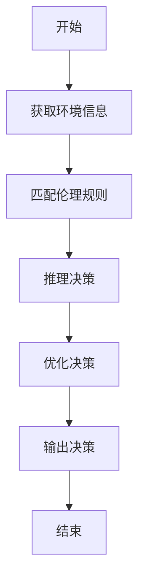
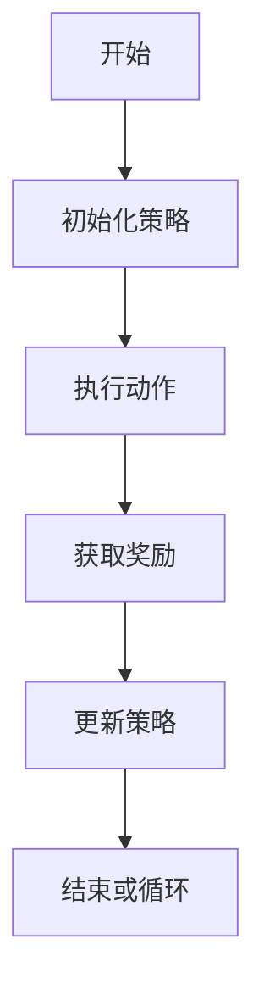
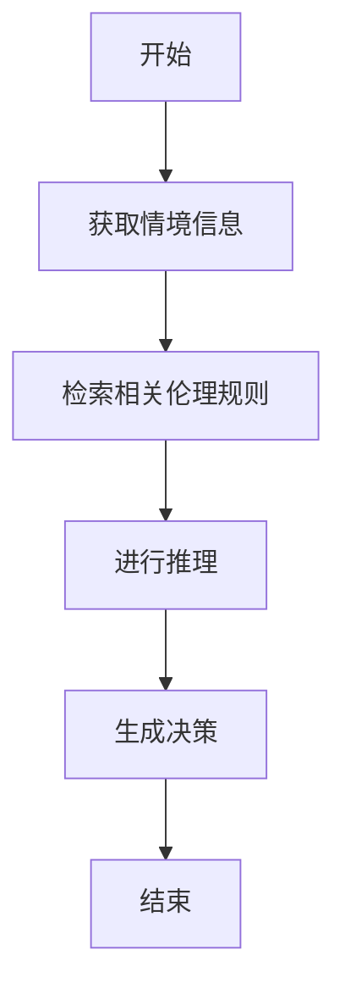
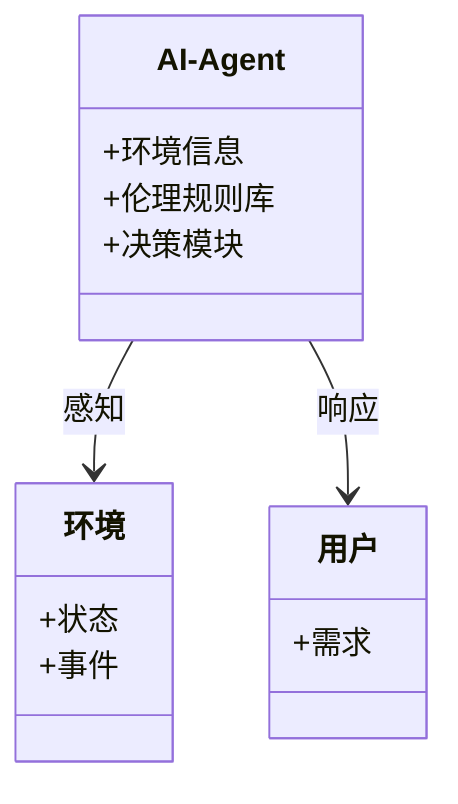
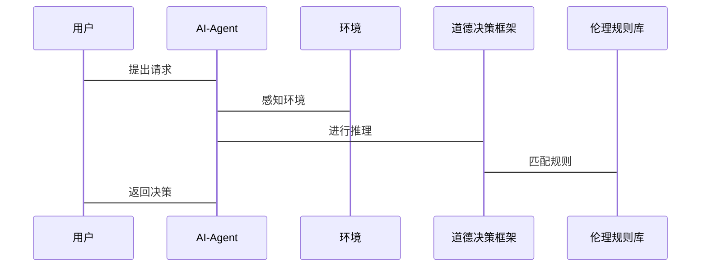

                 


# 构建具有道德决策框架的AI Agent系统

> 关键词：AI Agent, 道德决策, 强化学习, 系统架构, 伦理框架

> 摘要：本文旨在探讨如何构建一个具有道德决策能力的AI Agent系统。通过分析AI Agent的核心原理、道德决策框架的设计原则以及算法实现，结合实际案例，系统性地阐述了从理论到实践的全过程。本文不仅提供了理论支持，还给出了具体的实现方案和优化建议，为AI领域的研究和应用提供了新的视角。

---

# 第1章: 背景介绍

## 1.1 问题背景

### 1.1.1 AI Agent的基本概念
AI Agent（人工智能代理）是指能够在环境中感知并自主行动以实现目标的智能体。它具有主动性、反应性、社会性和目的性等特征。

### 1.1.2 道德决策在AI系统中的重要性
随着AI技术的快速发展，AI Agent的应用场景日益广泛，但其决策过程往往缺乏道德约束，导致潜在的伦理风险。

### 1.1.3 当前AI Agent在道德决策中的挑战
AI Agent的决策可能引发伦理争议，例如自动驾驶汽车在紧急情况下的生命优先选择问题。

## 1.2 问题描述

### 1.2.1 AI Agent决策的不确定性
AI Agent在复杂环境中的决策可能受到不确定性和不完整信息的影响。

### 1.2.2 道德决策框架的缺失问题
当前的AI系统缺乏统一的道德决策框架，导致决策过程可能违背伦理规范。

### 1.2.3 用户需求与伦理冲突
AI Agent的设计目标可能与用户的实际需求存在冲突，例如隐私保护与数据利用之间的矛盾。

## 1.3 问题解决

### 1.3.1 引入道德决策框架的必要性
通过引入道德决策框架，可以为AI Agent提供伦理约束，确保其行为符合社会规范。

### 1.3.2 框架设计的目标与原则
目标是实现AI Agent的道德决策能力，原则包括公平性、透明性、可解释性和可调节性。

### 1.3.3 解决方案的可行性分析
通过结合强化学习和伦理推理技术，构建一个动态适应的道德决策框架是可行的。

## 1.4 边界与外延

### 1.4.1 道德决策框架的适用范围
适用于需要伦理约束的AI系统，例如自动驾驶、医疗AI和智能助手。

### 1.4.2 与传统AI决策框架的区别
传统框架注重决策的效率和准确性，而道德框架更关注决策的伦理性和社会影响。

### 1.4.3 与其他伦理框架的对比
道德决策框架结合了伦理学、社会学和计算机科学的理论，具有跨学科的特点。

## 1.5 概念结构与核心要素

### 1.5.1 道德决策框架的核心要素
- 伦理规则库：包含社会公认的伦理规范。
- 道德推理引擎：负责根据当前情境进行推理。
- 决策优化模块：优化决策以符合伦理目标。

### 1.5.2 AI Agent的行为模型
AI Agent通过感知环境、推理可能的行动，并选择最优行动来实现目标。

### 1.5.3 框架的逻辑结构
从输入环境信息到输出决策，整个过程需要经过伦理规则匹配、推理和优化。

---

# 第2章: 核心概念与联系

## 2.1 AI Agent的核心原理

### 2.1.1 AI Agent的基本原理
AI Agent通过感知环境、推理和行动来实现目标。

### 2.1.2 人工智能与Agent的关系
人工智能是实现AI Agent的技术基础，而AI Agent是人工智能技术的具体应用形式。

### 2.1.3 多智能体系统中的协作与竞争
多智能体系统中，AI Agent需要与其他智能体协作或竞争以实现全局优化。

## 2.2 道德决策框架的原理

### 2.2.1 道德决策的基本概念
道德决策是指在遵守伦理规范的前提下做出的决策。

### 2.2.2 道德推理的逻辑框架
通过逻辑推理和规则匹配，AI Agent能够理解不同情境下的伦理要求。

### 2.2.3 道德判断的数学模型
基于伦理规则的数学模型可以量化决策的伦理性。

## 2.3 核心概念的联系

### 2.3.1 AI Agent与道德决策的关系
道德决策是AI Agent决策能力的重要组成部分。

### 2.3.2 道德框架对AI行为的约束
道德框架为AI Agent的行为提供了规范，确保其决策符合社会伦理。

### 2.3.3 道德决策对系统性能的影响
道德决策可能会增加系统的计算开销，但能显著提升系统的社会接受度。

## 2.4 概念属性特征对比

### 2.4.1 AI Agent的属性特征
- 目的性：具有明确的目标。
- 反应性：能够感知并响应环境变化。
- 主动性：能够自主采取行动。

### 2.4.2 道德决策框架的属性特征
- 约束性：对决策过程进行伦理约束。
- 可调节性：能够根据情境调整决策。
- 可解释性：决策过程和结果可以被人类理解。

### 2.4.3 两者属性对比分析
AI Agent的属性强调技术实现，而道德决策框架的属性更关注社会影响。

## 2.5 ER实体关系图

### 2.5.1 实体关系图的构建
通过ER图可以清晰地展示AI Agent、道德决策框架和环境之间的关系。

### 2.5.2 实体关系图的分析
AI Agent与道德决策框架之间存在依赖关系，环境信息是道德决策的重要输入。

---

# 第3章: 算法原理讲解

## 3.1 道德决策算法原理

### 3.1.1 道德推理算法
通过伦理规则和情境信息进行推理，生成符合伦理的决策。

### 3.1.2 道德判断算法
根据伦理标准对决策进行评估和优化。

### 3.1.3 道德优化算法
通过强化学习优化道德决策框架，提升决策的伦理性和效率。

## 3.2 强化学习算法

### 3.2.1 强化学习的基本原理
通过奖励机制优化决策策略。

### 3.2.2 道德强化学习的实现
结合伦理规则，调整强化学习的奖励函数。

### 3.2.3 道德决策的优化过程
通过不断试验和反馈，优化道德决策框架的参数。

## 3.3 道德推理算法

### 3.3.1 基于规则的道德推理
根据预定义的伦理规则进行推理。

### 3.3.2 基于案例的道德推理
通过相似案例的分析，推导出当前情境下的伦理决策。

### 3.3.3 基于模型的道德推理
利用伦理模型进行推理和优化。

## 3.4 算法流程图

### 3.4.1 道德决策算法流程图


### 3.4.2 强化学习算法流程图


### 3.4.3 道德推理算法流程图


---

# 第4章: 系统分析与架构设计方案

## 4.1 问题场景介绍

### 4.1.1 道德决策框架的应用场景
- 自动驾驶中的紧急决策
- 医疗AI中的治疗方案选择
- 智能助手中的隐私保护

### 4.1.2 AI Agent的典型应用案例
- 智能客服系统
- 自动驾驶汽车
- 智能推荐系统

### 4.1.3 系统的输入输出分析
- 输入：环境信息、用户需求、伦理规则
- 输出：符合伦理的决策

## 4.2 项目介绍

### 4.2.1 项目目标
构建一个具有道德决策能力的AI Agent系统。

### 4.2.2 项目范围
涵盖算法设计、系统架构和实际应用。

### 4.2.3 项目约束条件
- 系统必须具有可解释性
- 决策过程必须符合伦理规范
- 系统性能必须达到实时要求

## 4.3 系统功能设计

### 4.3.1 领域模型（Mermaid类图）


### 4.3.2 系统架构设计（Mermaid架构图）


### 4.3.3 系统接口设计
- 输入接口：接收环境信息和用户需求
- 输出接口：输出符合伦理的决策
- 内部接口：算法模块之间的通信

### 4.3.4 系统交互（Mermaid序列图）


---

# 第5章: 项目实战

## 5.1 环境安装

### 5.1.1 安装Python
```bash
python --version
pip install --upgrade pip
```

### 5.1.2 安装依赖库
```bash
pip install numpy matplotlib scikit-learn
```

## 5.2 系统核心实现源代码

### 5.2.1 道德决策框架实现
```python
class MoralDecisionFramework:
    def __init__(self, rules):
        self.rules = rules

    def make_decision(self, state):
        # 匹配伦理规则并进行推理
        for rule in self.rules:
            if rule['condition'](state):
                return rule['action'](state)
        return None
```

### 5.2.2 AI Agent实现
```python
class AIAGENT:
    def __init__(self, decision_framework):
        self.decision_framework = decision_framework

    def act(self, state):
        return self.decision_framework.make_decision(state)
```

## 5.3 代码应用解读与分析

### 5.3.1 道德决策框架的代码解读
- `MoralDecisionFramework`类负责管理伦理规则，并根据状态匹配规则。

### 5.3.2 AI Agent的代码解读
- `AIAGENT`类利用道德决策框架进行决策，并采取行动。

## 5.4 实际案例分析

### 5.4.1 案例描述
自动驾驶汽车在雨天遇到紧急情况，需要在乘客安全和行人安全之间做出选择。

### 5.4.2 代码实现
```python
# 定义伦理规则
rules = [
    {'condition': lambda state: state['passenger'] > 0 and state['pedestrian'] > 0,
     'action': lambda state: 'protect_passenger'},
    {'condition': lambda state: state['passenger'] == 0 and state['pedestrian'] > 0,
     'action': lambda state: 'protect_pedestrian'}
]

# 初始化框架和AI Agent
framework = MoralDecisionFramework(rules)
agent = AIAGENT(framework)

# 模拟决策
state = {'passenger': 2, 'pedestrian': 1, 'weather': 'rain'}
decision = agent.act(state)
print(decision)  # 输出：protect_passenger
```

## 5.5 项目小结

### 5.5.1 代码实现的总结
通过代码实现，我们可以看到道德决策框架如何与AI Agent结合，实现伦理约束的决策过程。

### 5.5.2 项目实现的关键点
- 伦理规则的定义与匹配
- 决策过程的可解释性
- 系统的实时性和稳定性

---

# 第6章: 总结与展望

## 6.1 最佳实践 tips
- 在设计AI Agent时，必须考虑伦理约束
- 道德决策框架的设计需要结合具体应用场景
- 系统的可解释性和透明性是关键

## 6.2 小结
本文系统性地探讨了构建具有道德决策框架的AI Agent系统的各个方面，从理论到实践，提供了完整的解决方案。

## 6.3 注意事项
- 道德决策框架的设计需要结合实际应用场景
- 系统的优化需要在性能和伦理之间找到平衡点
- 道德决策框架的可扩展性需要充分考虑

## 6.4 拓展阅读
- 《强化学习：算法与应用》
- 《伦理学与人工智能》
- 《分布式系统与多智能体协作》

---

作者：AI天才研究院/AI Genius Institute & 禅与计算机程序设计艺术/Zen And The Art of Computer Programming

