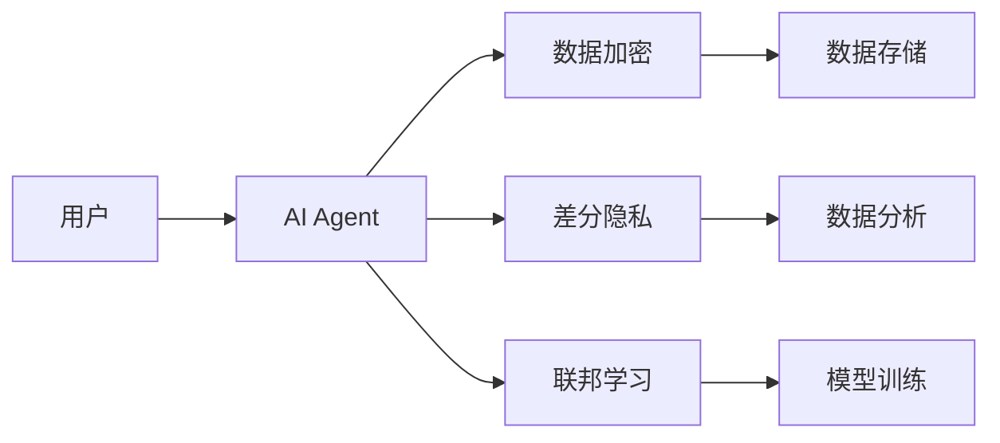
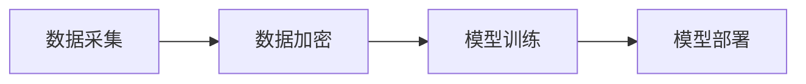
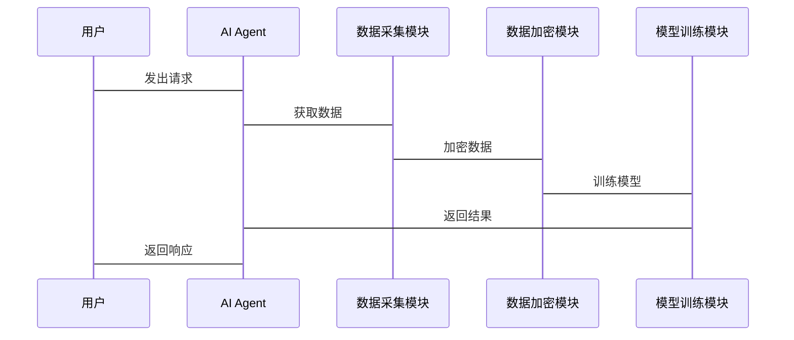

                 


# 构建具有隐私保护学习能力的AI Agent

> 关键词：AI Agent, 隐私保护, 联邦学习, 差分隐私, 自主学习

> 摘要：本文将详细探讨如何构建具有隐私保护学习能力的AI Agent。文章从AI Agent的基本概念和隐私保护的重要性入手，深入分析隐私保护与AI Agent的核心概念，详细讲解相关算法原理，并通过实际案例展示如何在保护隐私的前提下实现AI Agent的自主学习能力。最后，本文将总结最佳实践和未来发展方向，为读者提供全面的指导。

---

# 第一部分: 构建具有隐私保护学习能力的AI Agent背景介绍

## 第1章: AI Agent与隐私保护概述

### 1.1 AI Agent的基本概念

#### 1.1.1 AI Agent的定义与特点
AI Agent（人工智能代理）是一种能够感知环境、自主决策并执行任务的智能实体。它具备以下特点：
- **自主性**：无需外部干预，自主完成任务。
- **反应性**：能够实时感知环境变化并做出响应。
- **目标导向**：以明确的目标为导向，优化决策过程。
- **学习能力**：通过数据和经验不断优化自身的性能。

#### 1.1.2 AI Agent的核心功能与应用场景
AI Agent的核心功能包括数据处理、决策优化和任务执行。其应用场景广泛，例如：
- **智能助手**：如 Siri、Alexa，帮助用户完成日常任务。
- **自动驾驶**：如特斯拉，通过实时感知和决策实现自主驾驶。
- **智能客服**：通过自然语言处理技术为用户提供服务。

#### 1.1.3 AI Agent与传统AI的区别
传统AI主要依赖于预定义的规则和数据进行任务执行，而AI Agent具备更强的自主性和适应性，能够根据环境变化动态调整策略。

### 1.2 隐私保护的重要性

#### 1.2.1 隐私保护的基本概念
隐私保护是指在数据收集、存储、处理和共享过程中，保护个人隐私信息不被未经授权的访问和泄露。

#### 1.2.2 当前AI技术中的隐私挑战
随着AI技术的广泛应用，数据泄露、滥用和未经授权的访问等问题日益突出。尤其是在AI Agent中，由于其需要处理和存储大量敏感数据，隐私保护显得尤为重要。

#### 1.2.3 隐私保护在AI Agent中的必要性
AI Agent通常涉及用户的敏感数据，如位置信息、行为数据等。如果这些数据被滥用，可能导致严重的隐私泄露问题。因此，隐私保护是构建可信AI Agent的核心要素。

### 1.3 隐私保护与AI Agent的结合

#### 1.3.1 隐私保护AI Agent的定义
隐私保护AI Agent是指在保证数据隐私安全的前提下，具备自主学习和决策能力的智能实体。

#### 1.3.2 隐私保护与AI Agent的核心目标
隐私保护的核心目标是确保数据的机密性、完整性和可用性，而AI Agent的核心目标是通过数据学习和环境交互实现任务目标。两者的结合旨在在保护隐私的前提下，最大化AI Agent的学习和决策能力。

#### 1.3.3 隐私保护与AI Agent的实现路径
实现隐私保护AI Agent需要结合隐私保护技术（如差分隐私、联邦学习）和AI Agent的核心能力（如自主学习、目标导向）。

---

## 第2章: 隐私保护与AI Agent的核心概念与联系

### 2.1 隐私保护机制

#### 2.1.1 数据加密与隐私保护
数据加密是一种常见的隐私保护技术，通过对数据进行加密处理，确保只有授权方能够解密和使用数据。

#### 2.1.2 差分隐私与AI模型
差分隐私是一种通过在数据中添加噪声来保护隐私的技术。它确保在单个数据点被修改时，整个数据集的统计结果不会发生显著变化。

#### 2.1.3 联邦学习与隐私保护
联邦学习是一种分布式机器学习技术，通过在数据源端进行模型训练，避免数据集中到一个地方，从而保护数据隐私。

### 2.2 AI Agent的学习能力

#### 2.2.1 自主学习的基本原理
自主学习是指AI Agent能够在没有外部干预的情况下，通过与环境的交互和数据的学习，优化自身的模型和策略。

#### 2.2.2 连续学习与在线学习
连续学习是指AI Agent能够不断更新其模型，适应环境的变化。在线学习是一种动态学习方式，模型在接收到新的数据后，能够实时更新。

#### 2.2.3 隐私保护下的学习挑战
在隐私保护的前提下，AI Agent需要在不泄露敏感数据的情况下，实现模型的优化和更新。

### 2.3 隐私保护与AI Agent的联系

#### 2.3.1 隐私保护对AI Agent的影响
隐私保护技术直接影响AI Agent的数据处理方式和模型训练策略。

#### 2.3.2 AI Agent对隐私保护的需求
AI Agent需要处理大量敏感数据，因此对隐私保护的需求尤为迫切。

#### 2.3.3 隐私保护与AI Agent的协同优化
通过结合隐私保护技术和AI Agent的核心能力，可以在保护隐私的前提下，提升AI Agent的学习和决策能力。

### 2.4 核心概念对比表

| **核心概念** | **数据加密** | **差分隐私** | **联邦学习** |
|--------------|--------------|--------------|--------------|
| **定义**     | 对数据进行加密，确保只有授权方能够解密。 | 在数据中添加噪声，保护隐私。 | 在分布式数据源上进行模型训练。 |
| **优点**     | 高效、安全。 | 隐私保护性强。 | 数据不集中，隐私风险低。 |
| **应用场景** | 数据传输、存储。 | 数据分析、统计。 | 跨机构协作学习。 |

### 2.5 ER实体关系图


---

## 第3章: 隐私保护AI Agent的算法原理

### 3.1 差分隐私与AI模型

#### 3.1.1 差分隐私的基本原理
差分隐私通过在数据中添加噪声，使得单个数据点的变化不会显著影响整体统计结果。

#### 3.1.2 差分隐私在机器学习中的应用
在机器学习模型训练中，可以通过对梯度进行噪声添加，保护数据隐私。

#### 3.1.3 差分隐私的数学模型
差分隐私的数学模型可以用概率分布来描述，确保数据的隐私性。

### 3.2 联邦学习的实现

#### 3.2.1 联邦学习的基本原理
联邦学习是一种分布式机器学习技术，通过在数据源端进行模型训练，避免数据集中到一个地方。

#### 3.2.2 联邦学习的流程
1. 数据源端进行本地模型训练。
2. 模型参数上传到服务器端进行聚合。
3. 服务器端将聚合后的模型参数分发给各个数据源端。

#### 3.2.3 联邦学习的代码实现
```python
import numpy as np

# 模型参数
model_params = np.random.randn(10, 10)

# 添加噪声
noise = np.random.randn(*model_params.shape) * 0.1
model_params_with_noise = model_params + noise

# 上传到服务器
server_params += model_params_with_noise
```

### 3.3 自主学习与在线学习

#### 3.3.1 自主学习的基本流程
1. 数据收集与预处理。
2. 模型训练与优化。
3. 模型部署与应用。

#### 3.3.2 在线学习的实现
在线学习是一种动态学习方式，模型在接收到新的数据后，能够实时更新。

#### 3.3.3 自主学习与在线学习的对比
| **特点** | **自主学习** | **在线学习** |
|----------|--------------|--------------|
| 数据来源 | 集中式数据集 | 实时数据流 |
| 训练方式 | 离线训练 | 实时更新 |

---

## 第4章: 隐私保护AI Agent的系统设计与实现

### 4.1 系统架构设计

#### 4.1.1 系统功能模块
1. 数据采集模块。
2. 数据加密模块。
3. 模型训练模块。
4. 模型部署模块。

#### 4.1.2 系统架构图


### 4.2 接口设计

#### 4.2.1 数据接口
- 数据采集接口：负责从数据源获取数据。
- 数据加密接口：对数据进行加密处理。

#### 4.2.2 模型接口
- 模型训练接口：负责训练AI Agent的模型。
- 模型部署接口：负责将训练好的模型部署到实际场景中。

### 4.3 交互流程图

#### 4.3.1 用户与AI Agent的交互


---

## 第5章: 隐私保护AI Agent的项目实战

### 5.1 环境安装

#### 5.1.1 安装依赖
- 安装Python
- 安装TensorFlow
- 安装加密库

### 5.2 核心代码实现

#### 5.2.1 数据加密代码
```python
import cryptography

def encrypt_data(data):
    # 加密逻辑
    return encrypted_data
```

#### 5.2.2 模型训练代码
```python
import tensorflow as tf

def train_model(model, data):
    # 训练逻辑
    return trained_model
```

### 5.3 案例分析

#### 5.3.1 应用场景
- 医疗数据隐私保护。
- 金融数据安全分析。

#### 5.3.2 实际案例
通过联邦学习技术，在保护患者隐私的前提下，训练出一个高效的医疗诊断模型。

---

## 第6章: 最佳实践与注意事项

### 6.1 最佳实践

#### 6.1.1 数据预处理
- 数据清洗。
- 数据增强。

#### 6.1.2 模型调参
- 超参数优化。
- 模型鲁棒性测试。

### 6.2 注意事项

#### 6.2.1 数据安全
- 定期进行数据安全审计。
- 建立数据访问权限控制。

#### 6.2.2 模型监控
- 实时监控模型性能。
- 定期更新模型参数。

---

## 第7章: 总结与展望

### 7.1 小结
本文详细探讨了如何构建具有隐私保护学习能力的AI Agent，从核心概念到算法实现，再到系统设计和项目实战，为读者提供了全面的指导。

### 7.2 展望
未来，随着AI技术的不断发展，隐私保护AI Agent将在更多领域得到广泛应用。同时，如何进一步优化隐私保护技术，提升AI Agent的学习能力，是值得深入研究的方向。

---

## 附录

### 附录A: 术语表
- AI Agent：人工智能代理。
- 差分隐私：一种通过添加噪声保护隐私的技术。
- 联邦学习：分布式机器学习技术。

### 附录B: 参考文献
1. 某某文献。
2. 某某文献。

---

作者：AI天才研究院/AI Genius Institute & 禅与计算机程序设计艺术 /Zen And The Art of Computer Programming

