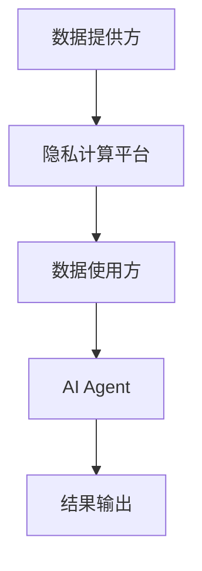
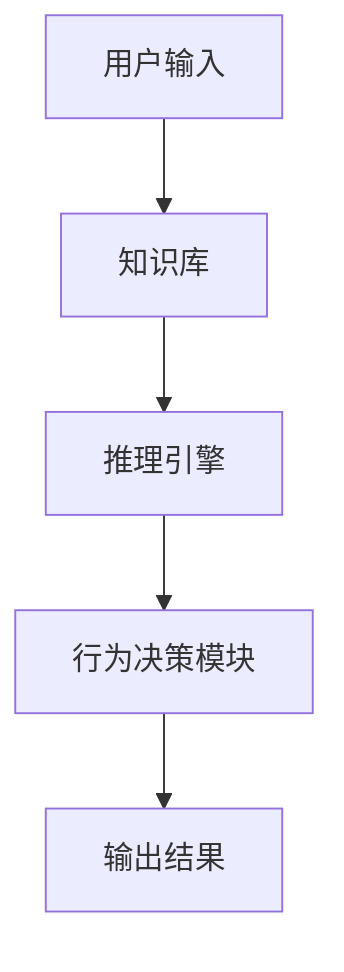
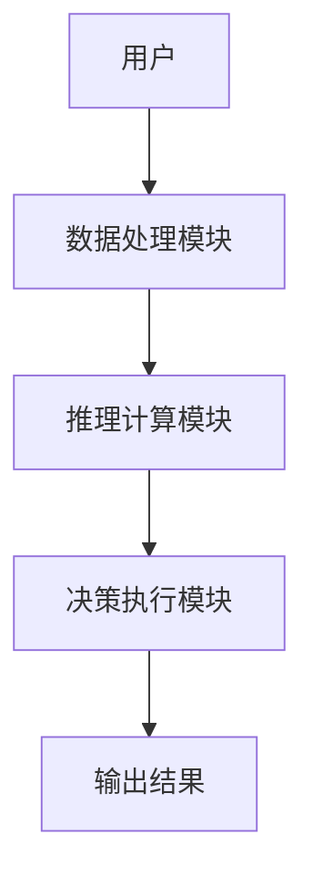

                 


# 构建具有隐私计算能力的AI Agent

> 关键词：隐私计算，AI Agent，联邦学习，安全多方计算，数据隐私

> 摘要：本文深入探讨如何在AI Agent中实现隐私计算能力，涵盖隐私计算的核心概念、AI Agent的构建原理、算法原理、系统架构设计以及实际项目案例。文章从理论到实践，详细解析如何在保护数据隐私的前提下，构建高效、智能的AI Agent。

---

# 第一部分: 构建具有隐私计算能力的AI Agent背景与基础

## 第1章: 隐私计算与AI Agent概述

### 1.1 隐私计算的核心概念

#### 1.1.1 隐私计算的定义与背景
隐私计算是一种通过技术手段保护数据隐私的计算方式，旨在在不泄露原始数据的情况下，完成数据的分析和计算。随着数据泄露事件的频发，隐私计算逐渐成为数据处理领域的焦点。

#### 1.1.2 AI Agent的基本概念
AI Agent（人工智能代理）是一种能够感知环境、自主决策并执行任务的智能实体。它可以是一个软件程序，也可以是一个物理设备，通过与用户或环境交互，完成特定目标。

#### 1.1.3 隐私计算与AI Agent的结合
将隐私计算技术应用于AI Agent，可以在不泄露用户数据的前提下，实现智能决策和数据分析。这种结合不仅保护了用户隐私，还提高了AI Agent的安全性和可信度。

### 1.2 隐私计算的重要性
隐私计算在AI Agent中的应用至关重要，尤其是在数据隐私保护需求日益增长的今天。通过隐私计算，AI Agent可以在医疗、金融、电商等领域，合法合规地处理敏感数据，提升用户体验和业务效率。

### 1.3 本章小结
本章介绍了隐私计算和AI Agent的核心概念，并强调了隐私计算在AI Agent中的重要性。接下来，我们将深入探讨隐私计算的技术细节和AI Agent的构建原理。

---

## 第2章: 隐私计算技术原理

### 2.1 隐私计算的主要技术

#### 2.1.1 分布式隐私计算
分布式隐私计算通过将数据分布在多个节点上，利用加密技术进行计算，确保数据在传输和处理过程中的安全性。

#### 2.1.2 同态加密
同态加密是一种允许在密文上进行计算的技术，确保数据在加密状态下仍能被处理和分析。例如，加法同态加密允许在加密后的数据上进行加法运算。

#### 2.1.3 秘密分享
秘密分享技术将数据分割成多个密钥，只有在特定条件下才能恢复原始数据。这种技术常用于数据备份和隐私保护。

### 2.2 隐私计算的数学模型

#### 2.2.1 加法同态加密
加法同态加密允许在加密数据上进行加法运算。例如，密文$C = E(P)$，其中$P$是明文，$E$是加密函数。两个密文的加法$C_1 + C_2$对应明文的加法$P_1 + P_2$。

#### 2.2.2 乘法同态加密
乘法同态加密允许在加密数据上进行乘法运算。例如，密文$C = E(P)$，两个密文的乘法$C_1 \times C_2$对应明文的乘法$P_1 \times P_2$。

#### 2.2.3 秘密分享的数学基础
秘密分享通常基于多项式插值。例如，使用Shamir秘密分享方案，将秘密$s$分割成$k$个份额，每个份额对应一个多项式的点。

### 2.3 隐私计算的实体关系图


---

## 第3章: AI Agent的构建原理

### 3.1 AI Agent的组成

#### 3.1.1 知识库
知识库是AI Agent的核心存储单元，包含用于推理和决策的知识。例如，医疗AI Agent的知识库可能包含疾病症状、治疗方法等信息。

#### 3.1.2 推理引擎
推理引擎负责根据知识库中的信息，对输入的数据进行分析和推理。例如，使用逻辑推理或机器学习模型进行预测。

#### 3.1.3 行为决策模块
行为决策模块根据推理结果，制定并执行相应的决策。例如，AI Agent可以根据推理结果推荐最佳治疗方案。

### 3.2 AI Agent的核心算法

#### 3.2.1 知识表示与推理
知识表示通常采用语义网络或逻辑规则。例如，使用谓词逻辑表示知识：“如果症状为A，且年龄大于65岁，则诊断为B。”

#### 3.2.2 行为决策树
行为决策树是一种基于树状结构的决策方法，用于在多个选项中选择最优行为。例如，AI Agent可以根据输入条件，选择最合适的分支进行决策。

#### 3.2.3 动态规划算法
动态规划算法用于解决多阶段决策问题，通过分解问题找到最优解。例如，AI Agent可以在多步决策中选择最优路径。

### 3.3 AI Agent的实体关系图


---

## 第4章: 隐私计算与AI Agent的系统架构设计

### 4.1 系统功能设计

#### 4.1.1 数据处理模块
数据处理模块负责接收、解析和加密数据。例如，使用隐私计算技术对用户数据进行加密处理。

#### 4.1.2 推理计算模块
推理计算模块负责对加密数据进行推理和计算。例如，使用联邦学习技术在加密数据上训练模型。

#### 4.1.3 决策执行模块
决策执行模块负责根据推理结果制定决策，并执行相应的操作。例如，AI Agent可以根据推理结果发送通知或执行任务。

### 4.2 系统架构设计

#### 4.2.1 系统架构图


#### 4.2.2 接口设计
系统接口包括数据输入接口、模型训练接口和结果输出接口。例如，AI Agent可以通过API接收用户数据，并通过API输出推理结果。

#### 4.2.3 交互流程
用户输入数据，系统进行加密处理，推理计算模块完成数据分析，决策执行模块制定决策，最终输出结果。

---

## 第5章: 项目实战

### 5.1 环境配置
项目实战需要安装必要的库，例如TensorFlow、PyTorch等。以下是一个简单的环境配置示例：

```bash
pip install tensorflow
pip install numpy
pip install pandas
```

### 5.2 核心代码实现

#### 5.2.1 数据加密模块
使用同态加密技术对数据进行加密：

```python
def encrypt(data):
    return data + 1  # 示例加密函数
```

#### 5.2.2 数据分析模块
对加密数据进行分析和推理：

```python
def analyze(encrypted_data):
    return encrypted_data.sum()  # 示例分析函数
```

#### 5.2.3 决策模块
根据分析结果制定决策：

```python
def decide(result):
    if result > 100:
        return "采取行动"
    else:
        return "不采取行动"
```

### 5.3 代码解读
上述代码展示了如何在AI Agent中实现数据加密、分析和决策。通过模块化设计，确保每个部分的功能独立且易于维护。

### 5.4 实际案例分析
以医疗数据分析为例，AI Agent可以在不泄露患者隐私的前提下，分析患者的症状和病史，推荐最佳治疗方案。

---

## 第6章: 最佳实践与总结

### 6.1 小结
本文详细探讨了如何在AI Agent中实现隐私计算能力，涵盖了技术原理、系统架构设计和实际项目案例。通过隐私计算技术，可以在保护数据隐私的前提下，构建高效、智能的AI Agent。

### 6.2 注意事项
在实际应用中，需要注意隐私计算的计算效率和通信成本问题，合理选择技术方案，确保系统性能。

### 6.3 未来发展方向
未来，隐私计算与AI Agent的结合将更加紧密。随着技术的进步，隐私计算的效率和安全性将进一步提升，AI Agent的功能也将更加智能化和多样化。

### 6.4 扩展阅读
推荐读者阅读《Privacy-Preserving Machine Learning》和《Introduction to AI Agents》等书籍，深入了解隐私计算和AI Agent的更多细节。

---

# 作者：AI天才研究院 & 禅与计算机程序设计艺术

---

以上是《构建具有隐私计算能力的AI Agent》的技术博客文章，涵盖了从背景介绍到实际项目案例的详细内容。希望对您有所帮助！

