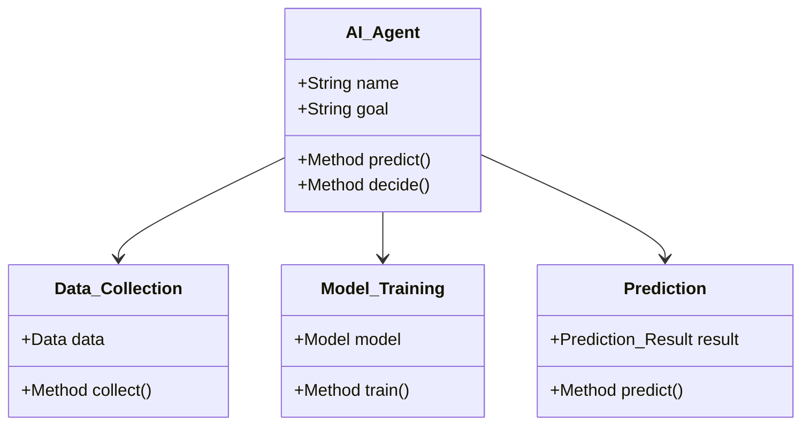
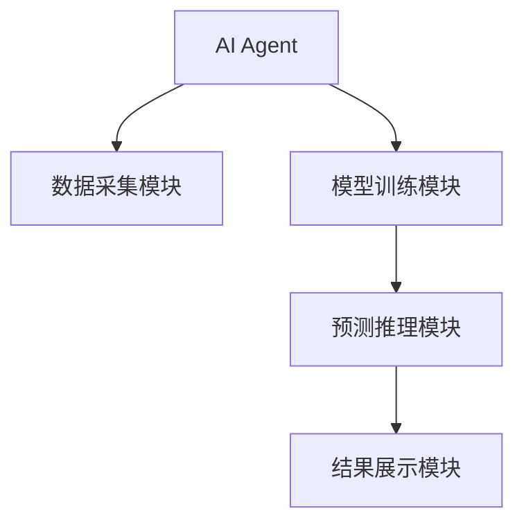

                 


# 构建具有预测分析能力的AI Agent

## 关键词：
AI Agent, 预测分析, 机器学习, 自然语言处理, 系统架构

## 摘要：
本文旨在深入探讨如何构建一个具有预测分析能力的AI Agent。从AI Agent的基本概念到预测分析的重要性，再到算法原理、系统架构设计以及实际项目实战，本文将全面解析构建这类AI Agent的关键步骤和技术细节。通过详细的技术分析和实际案例，本文将帮助读者掌握构建具备预测分析能力的AI Agent的完整方法。

---

# 第一部分: 构建具有预测分析能力的AI Agent基础

## 第1章: AI Agent与预测分析概述

### 1.1 AI Agent的基本概念

#### 1.1.1 AI Agent的定义
AI Agent（人工智能代理）是一种能够感知环境、自主决策并执行任务的智能实体。它通过与环境交互，利用传感器获取信息，并通过执行器采取行动，以实现特定目标。

#### 1.1.2 预测分析的基本概念
预测分析是一种利用历史数据和机器学习算法，对未来事件进行预测的技术。它通过对数据的建模和分析，帮助我们预测未来的趋势和结果。

#### 1.1.3 AI Agent与预测分析的关系
AI Agent通过集成预测分析技术，能够基于当前状态和历史数据，预测未来的状态和可能的结果，从而做出更智能的决策和行动。

### 1.2 预测分析的重要性

#### 1.2.1 预测分析在AI Agent中的作用
预测分析是AI Agent实现自主决策的核心技术之一。它帮助AI Agent在复杂环境中预测可能的结果，从而优化决策过程。

#### 1.2.2 预测分析的应用场景
预测分析在多个领域都有广泛应用，例如金融风险评估、医疗诊断、交通流量预测等。在AI Agent中，预测分析可以用于任务调度、资源分配、行为预测等多个方面。

#### 1.2.3 预测分析的挑战与机遇
预测分析面临的挑战包括数据质量、模型复杂性和计算资源需求等问题。然而，随着机器学习技术的不断进步，预测分析在AI Agent中的应用前景广阔。

### 1.3 AI Agent的核心技术基础

#### 1.3.1 机器学习基础
机器学习是AI Agent实现预测分析的核心技术。通过监督学习、无监督学习等方法，AI Agent可以学习数据中的模式和规律。

#### 1.3.2 自然语言处理基础
自然语言处理（NLP）技术帮助AI Agent理解和处理人类语言，从而实现与人类的自然交互。

#### 1.3.3 数据挖掘与分析基础
数据挖掘与分析技术帮助AI Agent从大量数据中提取有用的信息，为预测分析提供数据支持。

### 1.4 本章小结
本章介绍了AI Agent的基本概念、预测分析的重要性以及AI Agent的核心技术基础。通过这些内容，读者可以初步了解构建具有预测分析能力的AI Agent的基本框架和必要条件。

---

## 第2章: 预测分析与AI Agent的核心概念

### 2.1 预测分析的原理

#### 2.1.1 数据流与预测过程
预测分析的核心是数据流的处理和模型的训练。通过数据预处理、特征提取、模型训练等步骤，AI Agent可以生成预测结果。

#### 2.1.2 预测模型的训练与优化
训练模型是预测分析的核心步骤。通过选择合适的算法、调整模型参数以及优化训练数据，可以提高预测模型的准确性和稳定性。

#### 2.1.3 预测结果的解释与反馈
预测结果的解释与反馈是预测分析的重要环节。通过分析预测结果，AI Agent可以不断优化模型，提高预测的准确性。

### 2.2 AI Agent的核心要素

#### 2.2.1 数据采集与处理
数据采集与处理是AI Agent的第一步。通过传感器、API等途径获取数据，并进行清洗、转换和存储。

#### 2.2.2 模型构建与训练
模型构建与训练是AI Agent的核心步骤。通过选择合适的算法，训练出能够准确预测的模型。

#### 2.2.3 预测推理与决策
预测推理与决策是AI Agent的最终目标。通过模型推理，生成预测结果，并基于这些结果做出决策和行动。

### 2.3 预测分析与AI Agent的关系

#### 2.3.1 数据流的交互关系
数据流在AI Agent中起到了桥梁作用，连接数据采集、模型训练和结果输出的各个环节。

#### 2.3.2 模型训练的流程
模型训练的流程包括数据预处理、特征工程、模型选择、训练与评估等步骤。

#### 2.3.3 预测结果的应用场景
预测结果可以在任务调度、资源分配、行为预测等多个场景中应用，帮助AI Agent做出更智能的决策。

### 2.4 本章小结
本章详细介绍了预测分析的原理、AI Agent的核心要素以及预测分析与AI Agent的关系。通过这些内容，读者可以更深入地理解AI Agent如何通过预测分析实现智能决策。

---

## 第3章: 预测分析算法原理

### 3.1 预测分析的核心算法

#### 3.1.1 线性回归
线性回归是一种简单而强大的预测分析算法。它通过拟合一条直线，描述变量之间的线性关系。

#### 3.1.2 决策树
决策树是一种基于树状结构的预测分析算法。它通过特征分裂，逐步缩小数据范围，最终做出预测。

#### 3.1.3 随机森林
随机森林是一种基于决策树的集成算法。它通过构建多个决策树，并将它们的结果进行集成，提高预测的准确性和稳定性。

#### 3.1.4 神经网络
神经网络是一种模拟人脑结构和功能的预测分析算法。它通过多层神经元的连接，学习数据中的复杂模式。

### 3.2 算法原理的数学模型

#### 3.2.1 线性回归的数学公式
$$y = \beta_0 + \beta_1x + \epsilon$$

#### 3.2.2 决策树的分裂标准
决策树的分裂标准包括信息增益、信息增益率和基尼指数等。

#### 3.2.3 神经网络的层间关系
神经网络由输入层、隐藏层和输出层组成，层间通过权重和激活函数进行连接。

### 3.3 算法实现的Python代码示例

#### 3.3.1 线性回归实现
```python
import numpy as np
from sklearn.linear_model import LinearRegression

# 示例数据
X = np.array([[1], [2], [3], [4], [5]])
y = np.array([2, 4, 5, 4, 6])

# 训练模型
model = LinearRegression()
model.fit(X, y)

# 预测结果
print(model.predict([[6]]))
```

### 3.4 本章小结
本章详细介绍了预测分析的核心算法，包括线性回归、决策树、随机森林和神经网络。通过数学公式和Python代码示例，读者可以更好地理解这些算法的原理和实现方式。

---

## 第4章: AI Agent的系统架构设计

### 4.1 系统功能模块划分

#### 4.1.1 数据采集模块
数据采集模块负责从外部环境获取数据，例如传感器数据、用户输入等。

#### 4.1.2 模型训练模块
模型训练模块负责对数据进行预处理、特征提取和模型训练。

#### 4.1.3 预测推理模块
预测推理模块负责基于训练好的模型，对新的数据进行预测和推理。

#### 4.1.4 结果展示模块
结果展示模块负责将预测结果以直观的方式展示给用户，例如图表、文本等。

### 4.2 系统架构设计

#### 4.2.1 领域模型（类图）


#### 4.2.2 系统架构图


### 4.3 系统接口设计

#### 4.3.1 数据采集接口
```python
interface Data_Interface {
    def collect_data(): Data
}
```

#### 4.3.2 模型训练接口
```python
interface Model_Interface {
    def train_model(data: Data): Model
}
```

### 4.4 本章小结
本章详细介绍了AI Agent的系统架构设计，包括功能模块划分、系统架构图以及系统接口设计。通过这些内容，读者可以更好地理解AI Agent的整体结构和各个模块之间的关系。

---

## 第5章: 项目实战

### 5.1 环境安装与配置

#### 5.1.1 安装Python
```bash
python --version
pip install --upgrade pip
```

#### 5.1.2 安装依赖库
```bash
pip install numpy scikit-learn matplotlib
```

### 5.2 系统核心实现源代码

#### 5.2.1 数据采集模块
```python
class DataCollector:
    def __init__(self):
        self.data = []

    def collect_data(self):
        # 模拟数据采集
        new_data = [np.random.rand(1, 1) for _ in range(10)]
        self.data.extend(new_data)
        return self.data
```

#### 5.2.2 模型训练模块
```python
class ModelTrainer:
    def __init__(self):
        self.model = LinearRegression()

    def train(self, X, y):
        self.model.fit(X, y)
        return self.model
```

#### 5.2.3 预测推理模块
```python
class Predictor:
    def __init__(self, model):
        self.model = model

    def predict(self, X_new):
        return self.model.predict(X_new)
```

### 5.3 实际案例分析

#### 5.3.1 数据预处理
```python
import pandas as pd
data = pd.read_csv('data.csv')
data.dropna(inplace=True)
```

#### 5.3.2 模型训练
```python
X = data.drop('target', axis=1)
y = data['target']
model = ModelTrainer().train(X, y)
```

#### 5.3.3 模型评估
```python
from sklearn.metrics import mean_squared_error
y_pred = model.predict(X)
print(mean_squared_error(y, y_pred))
```

### 5.4 项目小结
本章通过实际项目实战，详细讲解了AI Agent的环境配置、代码实现和案例分析。通过这些内容，读者可以更好地掌握构建具有预测分析能力的AI Agent的实际操作步骤。

---

## 第6章: 最佳实践与总结

### 6.1 小结
本文详细介绍了构建具有预测分析能力的AI Agent的关键步骤和技术细节，包括基础概念、算法原理、系统架构设计和项目实战等内容。

### 6.2 注意事项
在实际应用中，需要注意数据质量、模型选择和计算资源等问题，以确保AI Agent的稳定性和准确性。

### 6.3 未来趋势
随着机器学习和人工智能技术的不断发展，预测分析在AI Agent中的应用前景将更加广阔。

### 6.4 拓展阅读
推荐读者进一步阅读《机器学习实战》、《深入理解神经网络》等相关书籍，以深入掌握预测分析和AI Agent的技术细节。

---

## 作者：
作者：AI天才研究院 & 禅与计算机程序设计艺术

---

感谢您的耐心阅读！希望本文对您构建具有预测分析能力的AI Agent有所帮助。

