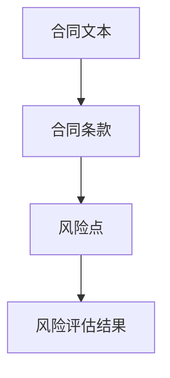
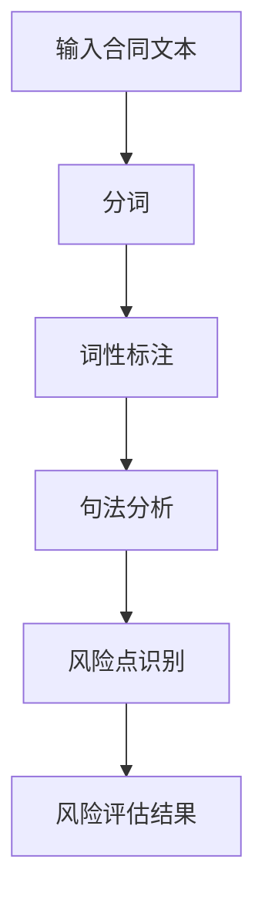
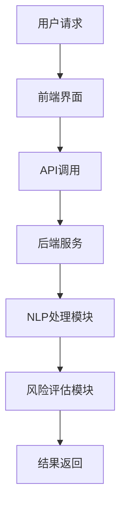
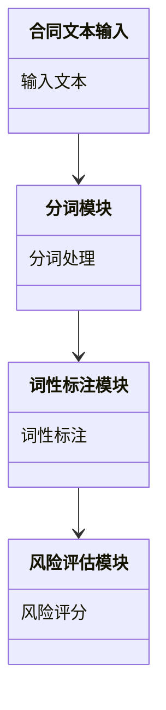

                 


# 构建基于NLP的金融合同风险评估系统

> 关键词：金融合同，NLP，风险评估，文本分析，自然语言处理，机器学习，深度学习

> 摘要：本文详细探讨了基于自然语言处理（NLP）技术构建金融合同风险评估系统的全过程，从问题背景、核心概念、算法原理到系统架构设计，再到项目实战。文章通过丰富的案例分析和详细的代码实现，深入剖析了NLP在金融合同风险评估中的应用，为相关领域的研究和实践提供了有价值的参考。

---

## 目录

1. [背景介绍与核心概念](#背景介绍与核心概念)
   - 1.1 问题背景与描述
     - 1.1.1 问题背景
     - 1.1.2 问题描述
   - 1.2 核心概念与联系
     - 1.2.1 核心概念原理
     - 1.2.2 核心概念属性对比
     - 1.2.3 ER实体关系图

2. [算法原理与数学模型](#算法原理与数学模型)
   - 2.1 算法流程
   - 2.2 数学模型与公式

3. [系统分析与架构设计](#系统分析与架构设计)
   - 3.1 问题场景介绍
   - 3.2 系统架构设计
   - 3.3 功能模块设计

4. [项目实战](#项目实战)
   - 4.1 环境安装
   - 4.2 系统核心实现
     - 4.2.1 分词模块
     - 4.2.2 词性标注模块
     - 4.2.3 风险点识别模块
   - 4.3 实际案例分析
   - 4.4 项目小结

5. [最佳实践与小结](#最佳实践与小结)
   - 5.1 最佳实践
   - 5.2 小结

---

## 背景介绍与核心概念

### 1.1 问题背景与描述

#### 1.1.1 问题背景
金融合同是金融交易的重要法律文件，其内容复杂且专业性强。传统的合同风险评估主要依赖人工审查，耗时长、效率低，且容易出现人为疏漏。随着自然语言处理（NLP）技术的快速发展，利用AI技术自动分析合同文本，识别潜在风险点，已成为提升金融风险控制效率的重要手段。

#### 1.1.2 问题描述
金融合同风险评估的关键在于准确识别合同中的风险点，如违约风险、法律风险等。传统方法难以高效处理大量合同文本，且难以捕捉文本中的隐含信息。基于NLP的系统能够通过文本分析技术，自动提取关键信息，帮助评估人员快速识别风险。

#### 1.1.3 系统目标
构建一个基于NLP的金融合同风险评估系统，旨在通过自动化的文本分析，提高合同审查效率，降低人为错误，帮助金融机构更好地控制风险。

### 1.2 核心概念与联系

#### 1.2.1 核心概念原理
- **自然语言处理（NLP）**：利用计算机技术对人类语言进行处理，包括分词、词性标注、句法分析等。
- **文本分析**：通过对文本数据的处理，提取有用信息，用于后续分析和决策。
- **风险评估**：基于提取的信息，评估合同中的潜在风险。

#### 1.2.2 核心概念属性对比
| 概念 | 描述 | 示例 |
|------|------|------|
| 分词 | 将连续文本分割成有意义的词汇或短语 | "合同金额" |
| 词性标注 | 标识每个词汇的词性 | 名词、动词、形容词 |
| 风险点 | 可能导致损失的关键信息 | 违约条款、担保责任 |

#### 1.2.3 ER实体关系图


---

## 算法原理与数学模型

### 2.1 算法流程


### 2.2 数学模型与公式

#### 2.2.1 文本表示模型
文本向量化是NLP的基础，常用词袋模型（Bag of Words）或TF-IDF（Term Frequency-Inverse Document Frequency）。

$$ \text{TF-IDF} = \frac{\text{词频}}{\text{文档频率}} $$

#### 2.2.2 风险评分公式
综合考虑各个风险点的权重和严重程度，计算最终风险评分：

$$ \text{风险评分} = \sum_{j=1}^{m} w_j \cdot r_j $$

其中，$w_j$ 为风险点的权重，$r_j$ 为风险点的严重程度。

---

## 系统分析与架构设计

### 3.1 问题场景介绍
金融合同风险评估系统需要处理大量的合同文本，快速识别潜在风险点。系统需要支持多种格式的文本输入，具备高效的文本分析能力和准确的风险评估能力。

### 3.2 系统架构设计


### 3.3 功能模块设计


---

## 项目实战

### 4.1 环境安装
- Python 3.8+
- NLP库：spaCy、NLTK
- 模型库：预训练词向量（如GloVe）
- 开发工具：Jupyter Notebook、PyCharm

### 4.2 系统核心实现

#### 4.2.1 分词模块
使用spaCy进行分词处理：

```python
import spacy

nlp = spacy.load("en_core_web_sm")
doc = nlp("This is a sample contract text.")
for token in doc:
    print(token.text)
```

#### 4.2.2 词性标注模块
基于分词结果进行词性标注：

```python
for token in doc:
    print(token.text, token.pos_)
```

#### 4.2.3 风险点识别模块
通过规则匹配或机器学习模型识别风险点：

```python
from sklearn.feature_extraction.text import TfidfVectorizer
from sklearn.svm import SVC

# 假设 training_data 是训练数据
vectorizer = TfidfVectorizer()
X = vectorizer.fit_transform([text for text, label in training_data])
model = SVC()
model.fit(X, [label for text, label in training_data])
```

### 4.3 实际案例分析
以一份典型金融合同为例，展示系统如何识别风险点：

1. **合同文本输入**：甲方向乙方提供贷款100万元，年利率5%。
2. **分词处理**：["甲方向", "乙方", "提供贷款", "100万元", "年利率5%"]
3. **风险点识别**：识别出“贷款金额”、“利率”等关键信息。
4. **风险评估**：根据预设规则，计算风险评分。

### 4.4 项目小结
通过实际案例分析，验证了系统的有效性。系统能够准确识别合同中的关键信息，并生成风险评估结果。

---

## 最佳实践与小结

### 5.1 最佳实践
- 数据质量是关键：确保训练数据的多样性和代表性。
- 模型调优：根据实际需求调整模型参数，提升准确率。
- 实时更新：定期更新模型和规则，适应新的合同格式和风险类型。

### 5.2 小结
本文详细介绍了构建基于NLP的金融合同风险评估系统的全过程，从背景介绍到系统实现，再到实际案例分析。通过本文的指导，读者可以快速掌握相关技术，并应用于实际项目中。

---

## 作者

**作者：AI天才研究院/AI Genius Institute & 禅与计算机程序设计艺术 /Zen And The Art of Computer Programming**

