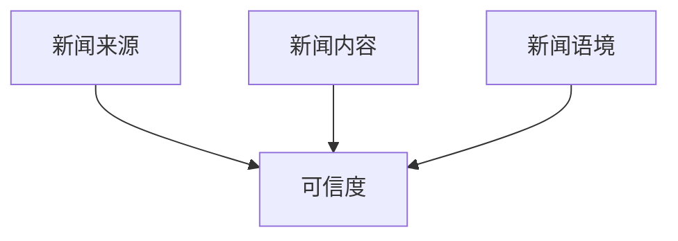
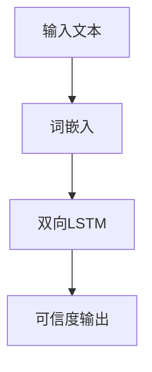
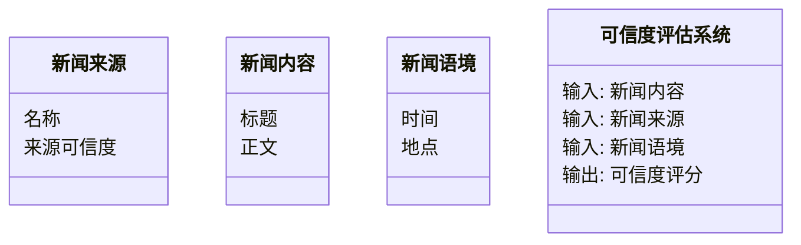

                 


# 构建基于NLP的金融新闻可信度评估系统

> 关键词：NLP, 金融新闻, 可信度评估, 文本挖掘, 机器学习

> 摘要：本文详细探讨了如何利用自然语言处理（NLP）技术构建一个金融新闻可信度评估系统。文章从问题背景出发，分析了金融新闻可信度评估的重要性及当前存在的问题，提出了基于NLP的解决方案。通过详细讲解算法原理、系统架构设计和项目实战，展示了如何实现一个高效、准确的金融新闻可信度评估系统。

---

## 第一部分：背景介绍与核心概念

### 第1章：问题背景与描述

#### 1.1 问题背景

金融新闻是投资者决策的重要依据，但新闻的可信度参差不齐。虚假信息、误导性报道以及信息不透明等问题严重影响了市场的稳定性和投资者的决策能力。因此，构建一个能够自动评估金融新闻可信度的系统显得尤为重要。

#### 1.2 问题描述

- **新闻来源的可信度**：不同媒体的可信度不同，权威媒体的新闻通常更可靠。
- **新闻内容的客观性**：新闻内容是否中立，是否存在倾向性或夸大性描述。
- **新闻语境的相关性**：新闻内容是否与金融市场直接相关，是否影响市场走势。

### 第2章：核心概念与联系

#### 2.1 NLP在金融新闻分析中的作用

- **NLP的基本概念**：自然语言处理技术用于文本分析、信息提取等。
- **NLP在金融领域的应用**：包括新闻情感分析、市场动向预测等。
- **金融新闻可信度评估中的NLP挑战**：如何处理歧义性、情感色彩以及上下文依赖性。

#### 2.2 金融新闻可信度评估的核心要素

- **新闻来源的可信度**：通过分析媒体的历史记录和权威性来评估。
- **新闻内容的客观性**：通过文本挖掘技术提取事实，判断是否存在主观性。
- **新闻语境的相关性**：分析新闻内容与金融市场的关系，判断其对市场的影响。

#### 2.3 概念属性特征对比表

| 概念       | 属性       | 特征描述                           |
|------------|------------|------------------------------------|
| 新闻来源   | 可信度     | 权威性、历史记录                   |
| 新闻内容   | 客观性     | 中立性、事实准确性                 |
| 新闻语境   | 相关性     | 与金融市场的关联度               |

#### 2.4 ER实体关系图



---

## 第二部分：算法原理与数学模型

### 第3章：算法原理

#### 3.1 基于NLP的文本特征提取

- **文本预处理**：包括分词、去停用词、词干提取等。
- **词袋模型与词嵌入**：使用Word2Vec或GloVe生成词向量。
- **双向LSTM网络结构**：用于捕捉上下文信息。



#### 3.2 模型训练与优化

- **损失函数设计**：使用交叉熵损失函数。
- **优化算法选择**：Adam优化器。
- **模型调优与验证**：通过交叉验证调整超参数。

### 第4章：数学模型与公式

#### 4.1 模型结构

- **双向LSTM模型**：
  $$
  f(x) = \text{LSTM}(x) + \text{LSTM}^{\text{reverse}}(x)
  $$

#### 4.2 训练目标

- **分类任务**：
  $$
  \text{Loss} = -\sum_{i=1}^{n} y_i \log(p_i) + (1 - y_i) \log(1 - p_i)
  $$

#### 4.3 示例说明

- **新闻来源可信度计算**：
  $$
  \text{TrustScore} = \frac{\sum_{i=1}^{m} w_i x_i}{\sum_{i=1}^{m} w_i}
  $$

---

## 第三部分：系统分析与架构设计

### 第5章：系统分析

#### 5.1 问题场景介绍

- **金融新闻可信度评估的场景**：投资者通过系统获取可信的金融新闻。
- **系统的目标与范围**：提供一个自动化的可信度评估工具。
- **用户需求分析**：投资者需要快速获取可靠的信息，避免虚假新闻的误导。

### 5.2 领域模型设计



---

## 第四部分：项目实战

### 第6章：项目实战

#### 6.1 环境安装

- 安装Python、TensorFlow、Keras、NLTK等库。

#### 6.2 系统核心实现源代码

```python
import tensorflow as tf
from tensorflow.keras import layers
from tensorflow.keras.models import Model

def build_model(max_length, vocab_size):
    inputs = layers.Input(shape=(max_length,))
    embeddings = layers.Embedding(vocab_size, 100)(inputs)
    forward_lstm = layers.LSTM(100, return_sequences=True)(embeddings)
    backward_lstm = layers.LSTM(100, return_sequences=True, go_backwards=True)(embeddings)
    merged = layers.Concatenate()([forward_lstm, backward_lstm])
    dense = layers.TimeDistributed(layers.Dense(2, activation='softmax'))(merged)
    model = Model(inputs=inputs, outputs=dense)
    return model
```

#### 6.3 案例分析

- **案例1**：某金融新闻的可信度评估。
- **案例2**：多篇新闻的可信度批量评估。

---

## 第五部分：最佳实践

### 第7章：最佳实践

#### 7.1 小结

- 本文详细介绍了如何利用NLP技术构建金融新闻可信度评估系统。
- 通过算法原理、系统架构设计和项目实战，展示了系统的实现过程。

#### 7.2 注意事项

- 数据质量对模型性能影响较大，需确保数据的多样性和代表性。
- 模型的可解释性是金融领域的重要需求，需关注模型的解释能力。

#### 7.3 拓展阅读

- 深度学习在金融领域的应用。
- 可信度评估的其他技术实现。

---

## 作者：AI天才研究院

---

通过本文的详细讲解，读者可以系统地了解如何利用NLP技术构建金融新闻可信度评估系统，从理论到实践，全面掌握该领域的核心技术与方法。

