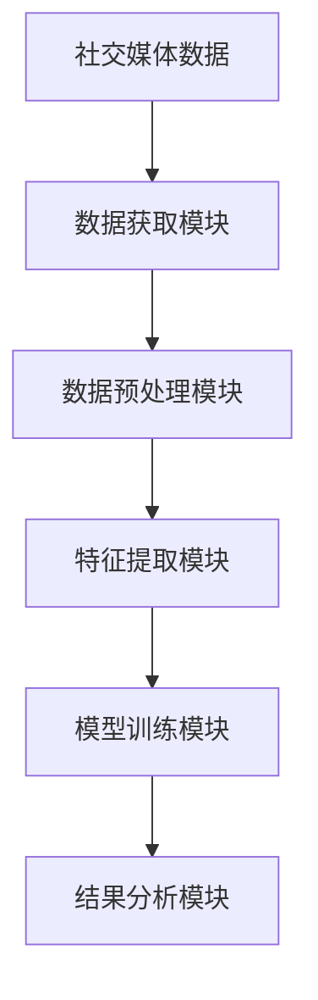
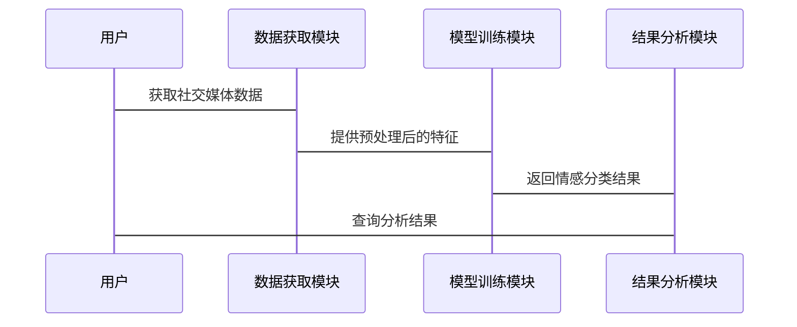

                 


```markdown
# 构建基于NLP的金融社交媒体情绪分析模型

> 关键词：金融情绪分析，自然语言处理，社交媒体数据，深度学习，情感分类

> 摘要：本文将详细介绍如何构建一个基于自然语言处理（NLP）的金融社交媒体情绪分析模型。从数据预处理到特征提取，从模型选择到算法实现，再到系统架构设计与项目实战，我们将全面解析该模型的构建过程。通过本文，读者将能够掌握如何利用NLP技术从社交媒体数据中提取情感信息，并将其应用于金融市场的分析与预测。

---

# 第一部分: 金融社交媒体情绪分析模型背景与核心概念

## 第1章: 情绪分析与NLP概述

### 1.1 情绪分析的基本概念

#### 1.1.1 情绪分析的定义与背景
情绪分析（Sentiment Analysis）是一种自然语言处理技术，用于识别和分类文本中的情感倾向。它在商业、社交媒体、金融等领域有广泛应用。金融领域的情绪分析主要用于通过社交媒体数据预测市场趋势和公司股价。

#### 1.1.2 情绪分析的分类与应用场景
情绪分析可以分为情感分类、情感强度分析、情感维度分析等。在金融领域，常见的应用场景包括股票价格预测、市场情绪监控、风险评估等。

#### 1.1.3 金融领域中的情绪分析
金融领域的社交媒体数据具有高频性、情感极化、信息复杂性等特点。情绪分析可以帮助投资者捕捉市场情绪变化，提供数据支持。

### 1.2 NLP在金融分析中的应用

#### 1.2.1 NLP技术的基本原理
NLP技术包括文本处理、语义分析、情感分类等多个环节。文本处理是基础，包括分词、去停用词、向量化等步骤。

#### 1.2.2 NLP在金融领域的典型应用
在金融领域，NLP主要应用于社交媒体情绪分析、新闻标题情感分析、财报文本分析等。

#### 1.2.3 社交媒体数据的特点与挑战
社交媒体数据具有非结构化、噪声多、信息量大等特点。挑战包括数据清洗、情感表达多样、实时性要求高等。

### 1.3 本章小结

#### 1.3.1 情绪分析的核心概念总结
情绪分析是通过NLP技术从文本中提取情感信息的过程，金融领域的应用具有独特性。

#### 1.3.2 NLP技术在金融分析中的重要性
NLP技术能够帮助投资者从海量社交媒体数据中提取有用信息，为决策提供支持。

---

## 第2章: 金融社交媒体情绪分析的核心概念

### 2.1 数据预处理与特征提取

#### 2.1.1 文本清洗与标准化
文本清洗包括去除标点符号、停用词、特殊字符等。标准化是将文本转换为统一格式的过程。

#### 2.1.2 分词与词干提取
分词是将文本分割成有意义的词语，词干提取是去除词语的派生形式，保留词干。

#### 2.1.3 词袋模型与词嵌入
词袋模型是一种文本表示方法，词嵌入（如Word2Vec）是将词语映射到向量空间的技术。

### 2.2 情感分类与模型选择

#### 2.2.1 二分类与多分类任务
情感分类通常分为正面、负面两类，但也可能扩展到更多类别。

#### 2.2.2 常见情感分类算法对比
传统算法包括SVM、Naive Bayes、随机森林，深度学习算法包括RNN、LSTM、Transformer。

#### 2.2.3 深度学习模型的选择与优化
选择模型时需要考虑任务特点、数据量大小、计算资源等因素。

### 2.3 情绪强度与情感维度分析

#### 2.3.1 情绪强度的定义与测量
情绪强度指情感的强烈程度，通常通过回归模型预测。

#### 2.3.2 情感维度分析
情感维度包括情感极性（正面/负面）、情感强度等。

#### 2.3.3 复杂情感表达的处理方法
复杂情感需要结合上下文分析，可能采用情感规则或混合模型。

### 2.4 本章小结

#### 2.4.1 核心概念的总结
数据预处理、特征提取、模型选择是构建情绪分析模型的关键步骤。

#### 2.4.2 情感分析在金融领域的独特性
金融领域的数据特点和应用场景决定了模型需要更高的准确性和实时性。

---

# 第二部分: 情绪分析模型的算法原理与实现

## 第3章: 文本预处理与特征提取

### 3.1 文本清洗与标准化

#### 3.1.1 去除停用词与标点符号
使用Python的`nltk`库去除停用词，`re`库去除标点符号。

#### 3.1.2 处理重复字符与拼写错误
使用正则表达式处理重复字符，`spellchecker`库校正拼写错误。

#### 3.1.3 转换为小写与统一格式
将文本统一转换为小写，去除多余空格。

### 3.2 分词与词干提取

#### 3.2.1 基于规则的分词方法
使用`jieba`库进行中文分词，` nltk`库进行英文分词。

#### 3.2.2 基于统计的分词方法
统计分词基于词频和上下文信息，如`jieba`的统计分词。

#### 3.2.3 深度学习模型在分词中的应用
如`BERT`模型可以用于更准确的分词。

### 3.3 词袋模型与词嵌入

#### 3.3.1 词袋模型的构建与优缺点
词袋模型忽略了词语顺序，优点是简单，缺点是无法处理语义信息。

#### 3.3.2 词嵌入的基本原理
词嵌入通过神经网络学习词语的向量表示，捕捉词语语义信息。

#### 3.3.3 常见词嵌入方法
包括Word2Vec、GloVe、FastText等。

## 第4章: 情感分类算法原理

### 4.1 基于传统机器学习的情感分类

#### 4.1.1 支持向量机（SVM）的原理与实现
SVM通过构建超平面将数据分为两类，适用于小规模数据。

#### 4.1.2 随机森林与决策树的应用
随机森林通过集成学习提高准确率，适用于高维数据。

#### 4.1.3 朴素贝叶斯分类器的优缺点
基于概率论的分类方法，适合文本分类，但对特征独立性假设敏感。

### 4.2 基于深度学习的情感分类

#### 4.2.1 RNN与LSTM的原理与应用
RNN适合处理序列数据，LSTM通过门控机制解决梯度消失问题。

#### 4.2.2 Transformer架构的最新进展
Transformer通过自注意力机制捕捉长距离依赖关系，性能优于RNN。

#### 4.2.3 BERT模型在情感分类中的应用
BERT模型通过预训练和微调，适合处理复杂的上下文信息。

### 4.3 情感分类算法的对比与选择

#### 4.3.1 不同算法的性能对比
在小规模数据上，SVM和随机森林表现较好；大规模数据上，深度学习模型更优。

#### 4.3.2 金融场景下的算法选择策略
根据数据规模、计算资源和任务需求选择合适的算法。

#### 4.3.3 

---

# 第三部分: 系统架构设计与项目实战

## 第5章: 系统架构设计

### 5.1 系统功能设计

#### 5.1.1 数据获取模块
从社交媒体API获取数据，清洗并存储。

#### 5.1.2 特征提取模块
进行分词、向量化处理，生成模型输入。

#### 5.1.3 模型训练模块
选择合适算法，训练情感分类模型。

#### 5.1.4 结果分析模块
对模型输出结果进行分析，生成可视化报告。

### 5.2 系统架构设计

#### 5.2.1 系统架构图


#### 5.2.2 系统接口设计
API接口包括数据获取、模型调用、结果查询等功能。

#### 5.2.3 系统交互序列图


## 第6章: 项目实战

### 6.1 环境配置

#### 6.1.1 安装必要的Python库
安装`nltk`、`tensorflow`、`pandas`等库。

#### 6.1.2 数据集准备
使用Twitter API获取社交媒体数据，清洗后存储为CSV格式。

### 6.2 核心实现

#### 6.2.1 数据预处理代码
```python
import pandas as pd
import re
from nltk.corpus import stopwords

def preprocess(text):
    # 转换为小写
    text = text.lower()
    # 去除标点符号和数字
    text = re.sub(r'\W+', ' ', text)
    # 去除多余空格
    text = re.sub(r'\s+', ' ', text).strip()
    return text

# 应用到数据集
df['processed_text'] = df['text'].apply(preprocess)
```

#### 6.2.2 模型实现代码
```python
import tensorflow as tf
from tensorflow.keras import layers

model = tf.keras.Sequential([
    layers.Embedding(vocab_size, 16),
    layers.Dropout(0.5),
    layers.Conv1D(64, 5, activation='relu'),
    layers.MaxPooling1D(4),
    layers.Flatten(),
    layers.Dense(64, activation='relu'),
    layers.Dense(2, activation='sigmoid')
])
```

#### 6.2.3 模型训练与评估
```python
model.compile(loss='binary_crossentropy', optimizer='adam', metrics=['accuracy'])
model.fit(X_train, y_train, epochs=10, batch_size=32, validation_data=(X_val, y_val))
```

### 6.3 实际案例分析

#### 6.3.1 案例背景
以某次市场波动为例，分析社交媒体数据中的情绪变化。

#### 6.3.2 数据分析与结果展示
使用可视化工具展示模型预测结果，分析其与实际市场走势的关联性。

### 6.4 项目小结

#### 6.4.1 核心实现总结
数据预处理、特征提取、模型训练是项目的核心步骤。

#### 6.4.2 案例分析总结
通过实际案例验证模型的有效性，总结经验教训。

---

# 第四部分: 总结与展望

## 第7章: 总结与展望

### 7.1 总结

#### 7.1.1 核心内容回顾
本文详细介绍了构建金融社交媒体情绪分析模型的全过程，包括数据预处理、特征提取、模型选择与实现。

#### 7.1.2 模型优缺点分析
模型的优点包括准确率高、实时性强；缺点包括计算资源需求大、模型更新频率高等。

### 7.2 未来展望

#### 7.2.1 模型优化方向
探索更先进的深度学习模型，如Transformer架构；结合领域知识优化特征提取。

#### 7.2.2 实际应用中的挑战
数据质量和实时性要求是未来需要解决的主要挑战。

#### 7.2.3 情感分析技术的发展趋势
随着NLP技术的进步，情感分析将更加智能化、个性化和实时化。

---

# 第五部分: 最佳实践与注意事项

## 第8章: 最佳实践

### 8.1 技术实现上的注意事项

#### 8.1.1 数据预处理阶段
确保数据清洗的彻底性，避免噪声干扰模型训练。

#### 8.1.2 模型选择阶段
根据实际任务需求选择合适的模型，避免盲目追求复杂模型。

#### 8.1.3 模型评估阶段
采用多种评估指标，如准确率、F1分数等，全面评估模型性能。

### 8.2 项目管理上的注意事项

#### 8.2.1 团队协作
明确团队角色分工，确保各环节高效协作。

#### 8.2.2 项目迭代
采用敏捷开发模式，分阶段实现功能，逐步优化。

#### 8.2.3 代码规范
遵循代码规范，确保代码的可读性和可维护性。

### 8.3 拓展阅读

#### 8.3.1 推荐的书籍与论文
推荐阅读《自然语言处理入门》、《Attention Is All You Need》等。

#### 8.3.2 相关技术博客与资源
推荐关注知名技术博客和开源项目，获取最新技术动态。

---

# 作者信息

作者：AI天才研究院/AI Genius Institute & 禅与计算机程序设计艺术 /Zen And The Art of Computer Programming
```

