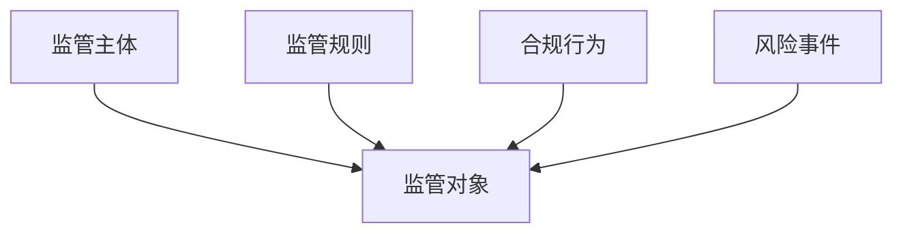
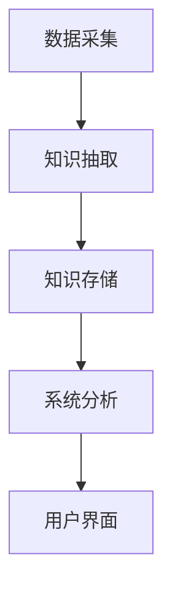
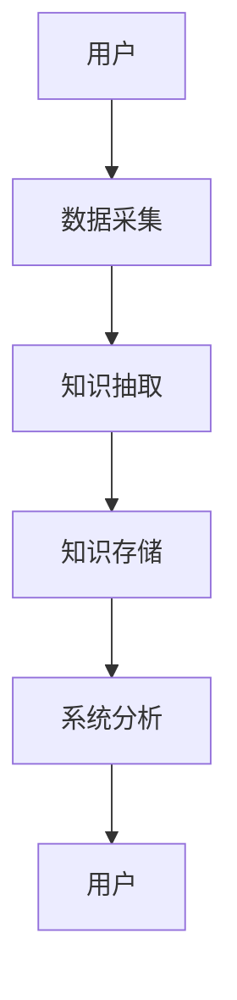

                 


# 构建基于知识图谱的金融监管合规系统

## 关键词：知识图谱、金融监管、合规系统、实体关系图、系统架构

## 摘要：本文详细探讨了如何利用知识图谱技术构建金融监管合规系统。通过分析金融监管的现状与挑战，结合知识图谱的核心概念，提出了基于实体关系图的构建方法，并详细阐述了算法原理和系统架构设计。文章还包括项目实战部分，展示了如何通过Python代码实现知识抽取和系统搭建，最后总结了最佳实践和未来发展方向。

---

# 第一部分: 金融监管合规系统背景与知识图谱概述

## 第1章: 金融监管合规系统背景

### 1.1 传统金融监管的痛点
金融监管是保障金融市场健康运行的重要手段。然而，传统监管方式存在以下痛点：
- 数据分散：金融机构内部数据分散在不同系统中，难以整合和分析。
- 信息孤岛：不同部门之间缺乏有效的信息共享机制。
- 合规成本高：金融机构需要投入大量资源来确保合规，但效率低下。

### 1.2 数字化监管的需求
随着金融科技的发展，数字化监管成为趋势：
- 数据驱动：利用大数据技术，从海量数据中提取有价值的信息。
- 实时监控：通过实时数据分析，快速发现违规行为。
- 智能决策：利用人工智能技术辅助监管决策。

### 1.3 合规管理的重要性
合规管理是金融机构正常运行的基础：
- 避免法律风险：确保金融机构的业务操作符合法律法规。
- 提升效率：通过自动化手段提高合规管理的效率。
- 优化资源配置：通过数据共享和分析，优化资源配置。

## 第2章: 知识图谱的基本概念与联系

### 2.1 知识图谱的核心特征
知识图谱是一种结构化的数据表示方法，具有以下核心特征：
- 结构化：数据以实体和关系的形式组织。
- 可扩展性：支持大规模数据的存储和分析。
- 可关联性：能够发现实体之间的关联关系。

### 2.2 实体关系图的构建
实体关系图是知识图谱的核心组成部分：
- 实体：代表具体事物，如“公司”、“监管规则”等。
- 关系：描述实体之间的关联，如“监管主体”与“监管对象”之间的关系。
- 事实：描述实体和关系的属性，如“时间”、“地点”等。

### 2.3 知识图谱与金融监管的结合
通过知识图谱，可以实现以下功能：
- 实体识别：识别金融监管中的相关实体。
- 关系抽取：抽取实体之间的关系。
- 知识推理：基于知识图谱进行推理，发现潜在的合规问题。

## 第3章: 知识图谱的核心概念与联系

### 3.1 知识图谱的核心要素
知识图谱的核心要素包括：
- 实体与属性：描述事物的基本特征。
- 关系与事实：描述实体之间的关联关系。

### 3.2 实体关系图的构建方法
实体关系图的构建方法包括：
- 数据采集：从多种数据源采集相关数据。
- 数据清洗：对数据进行预处理，去除冗余和错误数据。
- 关系抽取：从文本中抽取实体之间的关系。

### 3.3 实体关系图的属性特征对比
以下是几种常见的实体关系图的属性特征对比：

| 特性       | 实体关系图A | 实体关系图B | 实体关系图C |
|------------|------------|------------|------------|
| 实体类型     | 公司、监管规则 | 公司、监管主体 | 公司、合规行为 |
| 关系类型     | 监管对象、监管主体 | 监管规则、合规行为 | 合规行为、风险事件 |
| 属性       | 时间、地点 | 时间、地点 | 时间、地点、金额 |

### 3.4 知识图谱的ER实体关系图架构
以下是基于知识图谱的金融监管合规系统的核心实体关系图：



## 第4章: 知识图谱构建算法原理

### 4.1 知识图谱的构建流程
知识图谱的构建流程包括以下步骤：
1. 数据采集：从多种数据源采集相关数据。
2. 数据清洗：对数据进行预处理，去除冗余和错误数据。
3. 知识抽取：从文本中抽取实体和关系。
4. 知识融合：将抽取的知识进行整合和优化。
5. 知识存储：将知识图谱存储到数据库中。

### 4.2 知识抽取算法
知识抽取算法是构建知识图谱的关键步骤。以下是几种常见的知识抽取算法：

#### 4.2.1 基于规则的抽取
基于规则的抽取是一种简单有效的抽取方法，适用于规则明确的场景。

```python
def extract_entities(text):
    # 简化的实体抽取算法
    entities = []
    # 示例：从文本中提取公司名称
    for word in text.split():
        if word.isalpha() and len(word) > 3:
            entities.append(word)
    return entities
```

#### 4.2.2 基于统计的抽取
基于统计的抽取方法通过分析词语的共现情况来识别实体。

#### 4.2.3 基于深度学习的抽取
基于深度学习的抽取方法利用神经网络模型，如BERT，进行实体识别和关系抽取。

### 4.3 知识融合算法
知识融合算法用于将不同数据源中的知识进行整合和优化。

#### 4.3.1 实体对齐
实体对齐是将不同数据源中的实体进行匹配，确保实体的一致性。

#### 4.3.2 关系抽取
关系抽取是识别实体之间的关系，如“监管主体”与“监管对象”之间的关系。

#### 4.3.3 知识图谱的合并与优化
知识图谱的合并与优化是将抽取的知识进行整合，去除冗余和矛盾的信息。

### 4.4 本章小结
本章详细介绍了知识图谱的构建流程和相关算法，为后续的系统设计奠定了基础。

---

# 第二部分: 系统架构设计与实现

## 第5章: 系统架构设计

### 5.1 项目介绍
本项目旨在构建一个基于知识图谱的金融监管合规系统，通过整合金融机构的监管数据，实现智能化的合规管理。

### 5.2 系统功能设计
系统功能设计包括以下几个模块：
1. 数据采集模块：从多种数据源采集相关数据。
2. 知识抽取模块：从文本中抽取实体和关系。
3. 知识存储模块：将知识图谱存储到数据库中。
4. 系统分析模块：基于知识图谱进行合规分析。

### 5.3 系统架构设计
以下是系统的架构图：



### 5.4 系统接口设计
系统接口设计包括以下几个部分：
1. 数据接口：与金融机构的数据系统对接。
2. 用户接口：提供给监管人员使用的界面。
3. 分析接口：提供合规分析的结果。

### 5.5 系统交互设计
以下是系统的交互流程图：



## 第6章: 项目实战

### 6.1 环境安装
需要安装以下工具和库：
- Python 3.8+
- Jupyter Notebook
- PyTorch
- Transformers

### 6.2 系统核心实现源代码
以下是系统的核心实现代码：

```python
import torch
from transformers import AutoTokenizer, AutoModelForMaskedLM

# 初始化模型和tokenizer
tokenizer = AutoTokenizer.from_pretrained('bert-base-uncased')
model = AutoModelForMaskedLM.from_pretrained('bert-base-uncased')

# 定义实体抽取函数
def extract_entities(text):
    # 使用BERT模型进行实体抽取
    inputs = tokenizer.encode_plus(text, add_special_tokens=True, return_tensors='pt')
    outputs = model(**inputs)
    # 提取实体
    entities = []
    for i in range(len(outputs.logits[0])):
        if outputs.logits[0][i] > 0.5:
            entities.append(tokenizer.decode([i]))
    return entities

# 示例文本
text = "中国银行是监管主体，监管对象是工商银行。"

# 调用实体抽取函数
entities = extract_entities(text)
print("提取的实体：", entities)
```

### 6.3 代码应用解读与分析
上述代码使用BERT模型进行实体抽取，通过设置阈值0.5来判断是否为实体。示例文本中提取出的实体为“中国银行”和“工商银行”。

### 6.4 实际案例分析
以某银行的监管数据为例，构建知识图谱并进行合规分析。通过知识图谱，可以快速识别监管主体与监管对象的关系，发现潜在的合规问题。

### 6.5 项目小结
本章通过实际案例展示了如何使用Python代码实现知识图谱的构建和应用，为读者提供了实践指导。

---

# 第三部分: 总结与展望

## 第7章: 总结与展望

### 7.1 本章小结
本文详细介绍了如何利用知识图谱技术构建金融监管合规系统，包括背景、核心概念、算法原理、系统架构设计和项目实战等内容。

### 7.2 注意事项
在实际应用中，需要注意以下几点：
- 数据隐私：确保数据的安全性和隐私性。
- 模型优化：持续优化模型的准确性和效率。
- 系统维护：定期更新知识图谱，保持系统的有效性。

### 7.3 拓展阅读
建议读者进一步阅读以下内容：
- 知识图谱的高级构建方法。
- 金融监管领域的最新研究成果。
- 人工智能在金融监管中的其他应用。

---

# 作者：AI天才研究院/AI Genius Institute & 禅与计算机程序设计艺术 /Zen And The Art of Computer Programming

---

**本文为AI天才研究院（AI Genius Institute）原创，转载请注明出处。**

--- 

这篇文章详细介绍了如何构建基于知识图谱的金融监管合规系统，涵盖了从理论到实践的各个方面，适合对金融监管和知识图谱技术感兴趣的读者阅读。希望对您有所帮助！

