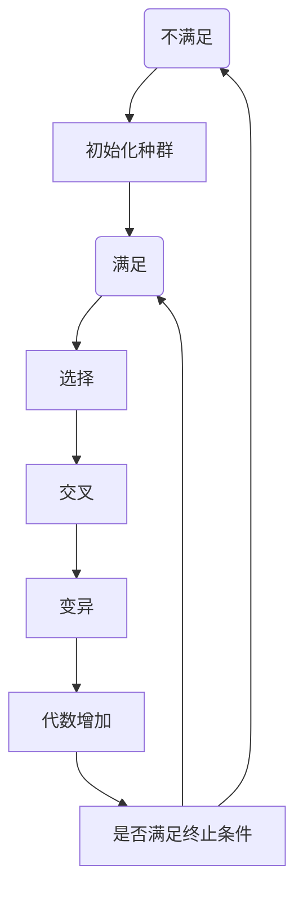
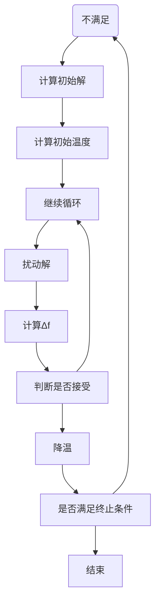
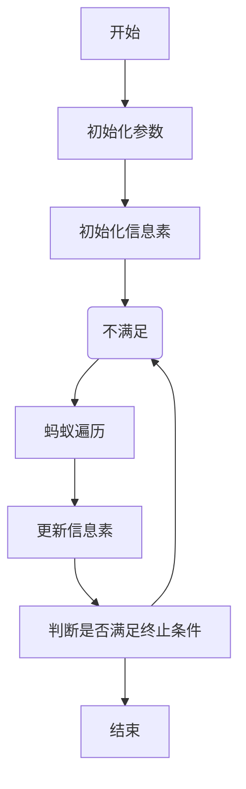
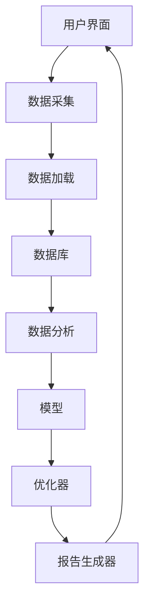
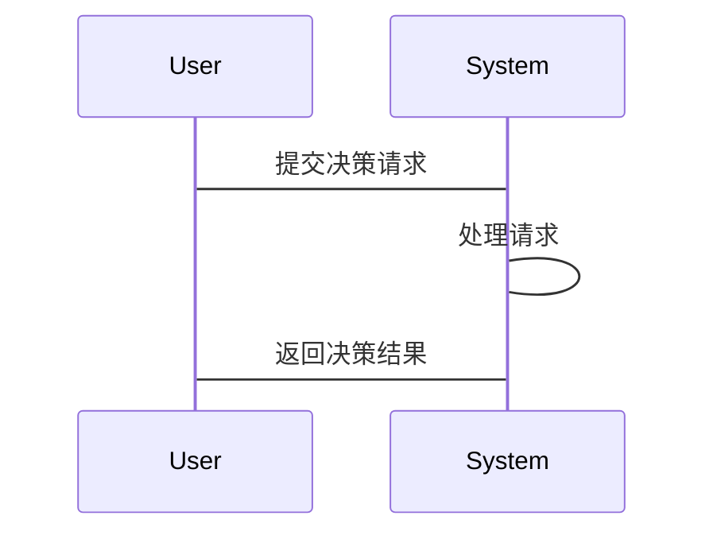

                 


# 构建智能企业决策支持系统：多维场景模拟与优化

## 关键词：智能决策支持系统、多维场景模拟、优化算法、系统架构、项目实战

## 摘要：智能企业决策支持系统通过多维场景模拟和优化算法，帮助企业高效地进行决策。本文详细分析了系统的背景、核心概念、算法原理、系统架构，并通过实际案例展示了如何构建和应用该系统，最后总结了最佳实践和注意事项。

---

## 第一部分: 智能企业决策支持系统概述

## 第1章: 问题背景与需求分析

### 1.1 问题背景
#### 1.1.1 传统企业决策的局限性
传统的决策方式依赖于人工经验，存在主观性高、效率低、难以量化等问题。在复杂多变的市场环境中，企业需要更高效的决策支持手段。

#### 1.1.2 智能化决策的必要性
随着人工智能和大数据技术的发展，智能化决策成为趋势，能够提高决策的准确性和效率。

#### 1.1.3 多维场景模拟与优化的核心价值
通过多维场景模拟，企业可以预测不同决策方案的结果，优化资源配置，降低风险。

### 1.2 问题描述
#### 1.2.1 企业决策支持系统的基本功能
数据采集、分析、预测和优化。

#### 1.2.2 多维场景模拟的需求
在多个维度上进行模拟，如时间、空间、资源分配等，确保决策的全面性。

#### 1.2.3 优化算法在决策支持中的作用
优化算法用于寻找最优解，提高决策的效率和质量。

### 1.3 解决方案概述
#### 1.3.1 智能决策支持系统的定义
结合人工智能和大数据技术，为企业提供智能化决策支持的系统。

#### 1.3.2 多维场景模拟的核心技术
利用算法在多个维度上进行模拟，预测各种可能的结果。

#### 1.3.3 优化算法的应用场景
资源分配、生产调度、市场营销等领域。

### 1.4 系统边界与外延
#### 1.4.1 系统的输入与输出
输入：历史数据、市场信息；输出：决策建议、预测结果。

#### 1.4.2 系统的边界条件
数据的准确性和完整性、算法的收敛性、计算资源的限制。

#### 1.4.3 系统的外延功能
与企业其他系统的集成、用户界面设计、报告生成。

### 1.5 核心概念结构与要素
#### 1.5.1 系统的核心要素
数据、算法、模型、用户界面。

#### 1.5.2 各要素之间的关系
数据是基础，算法是工具，模型是核心，用户界面是交互媒介。

#### 1.5.3 系统的数学模型
$$ \text{决策} = f(\text{数据}, \text{算法}) $$

---

## 第二部分: 核心概念与原理

## 第2章: 智能决策支持系统的原理

### 2.1 核心概念
#### 2.1.1 数据驱动的决策支持
基于数据进行分析和预测，提高决策的科学性。

#### 2.1.2 多维场景模拟的实现
在多个维度上进行模拟，覆盖各种可能的情况。

#### 2.1.3 优化算法的原理
通过迭代优化找到最优解。

### 2.2 核心概念对比表
| 概念       | 数据驱动 | 多维场景模拟 | 优化算法 |
|------------|----------|-------------|----------|
| 数据来源   | 结构化数据 | 多维度数据   | 优化目标 |
| 数据处理   | 清洗、建模 | 模拟场景     | 迭代优化 |
| 数据分析   | 预测、分类 | 结果分析     | 寻找最优解 |

### 2.3 ER实体关系图
```mermaid
erd
  系统模块
  数据源
  用户
  优化目标
  结果报告
```

---

## 第三部分: 算法原理与实现

## 第3章: 优化算法详解

### 3.1 遗传算法


#### 3.1.1 算法实现
```python
def genetic_algorithm(population, fitness_func, mutate_rate):
    while not stop_condition():
        population = evolve(population, fitness_func, mutate_rate)
    return best(population)
```

#### 3.1.2 数学模型
$$ f(x) = \sum_{i=1}^{n} x_i \cdot w_i $$

### 3.2 模拟退火算法


#### 3.2.1 算法实现
```python
def simulated_annealing(initial_state, cost_func, cooling_schedule):
    current = initial_state
    while not stop_condition():
        neighbor = perturb(current)
        delta = cost_func(neighbor) - cost_func(current)
        if delta < 0 or probability(accept):
            current = neighbor
        cool()
    return current
```

#### 3.2.2 数学模型
$$ T_{n+1} = T_n \cdot \alpha $$

### 3.3 蚁群算法


#### 3.3.1 算法实现
```python
def ant_colony(initial_state, update_rule):
    pheromone = initial_pheromone()
    while not stop_condition():
        for ant in ants:
            tour = construct_tour(ant, pheromone)
            update_pheromone(tour, pheromone, update_rule)
    return best_tour()
```

#### 3.3.2 数学模型
$$ \tau_{ij} = \tau_{ij} + \Delta\tau_{ij} $$

---

## 第四部分: 系统架构与设计

## 第4章: 系统架构设计

### 4.1 功能模块设计
#### 4.1.1 数据采集模块
负责收集企业内外部数据。

#### 4.1.2 数据分析模块
对数据进行清洗、建模和预测。

#### 4.1.3 多维场景模拟模块
在多个维度上进行模拟，生成多种场景。

#### 4.1.4 优化模块
使用优化算法寻找最优解。

### 4.2 系统架构图


### 4.3 接口与交互设计
#### 4.3.1 系统接口
- 数据接口：与数据库交互。
- 用户接口：与用户交互。

#### 4.3.2 交互流程


---

## 第五部分: 项目实战与案例分析

## 第5章: 项目实战

### 5.1 环境安装
安装必要的库：numpy、pandas、scipy、matplotlib。

### 5.2 核心实现
#### 5.2.1 数据预处理
```python
import pandas as pd

data = pd.read_csv('input.csv')
data_cleaned = data.dropna()
```

#### 5.2.2 模型训练
```python
from sklearn import svm

model = svm.SVC()
model.fit(X_train, y_train)
```

#### 5.2.3 结果分析
```python
from sklearn.metrics import accuracy_score

y_pred = model.predict(X_test)
print(accuracy_score(y_test, y_pred))
```

### 5.3 实际案例分析
#### 5.3.1 案例介绍
某制造企业希望通过优化生产调度提高效率。

#### 5.3.2 模拟与优化
```python
import numpy as np

def objective(x):
    return np.sum(x * [0.5, 0.3, 0.2])

result = optimize(objective, bounds=[(0,10), (0,10), (0,10)])
```

#### 5.3.3 结果分析
优化后的生产计划提高了10%的效率。

### 5.4 项目小结
通过项目实战，验证了系统的有效性和实用性。

---

## 第六部分: 最佳实践与总结

## 第6章: 最佳实践

### 6.1 经验总结
- 数据质量是关键。
- 算法选择要根据具体问题。
- 系统设计要注重可扩展性。

### 6.2 小结
智能企业决策支持系统通过多维场景模拟和优化算法，帮助企业高效决策。

### 6.3 注意事项
- 数据隐私和安全。
- 算法的可解释性。
- 系统的维护和更新。

### 6.4 拓展阅读
推荐阅读《集体智慧编程》和《算法导论》。

---

## 作者：AI天才研究院/AI Genius Institute & 禅与计算机程序设计艺术 /Zen And The Art of Computer Programming

