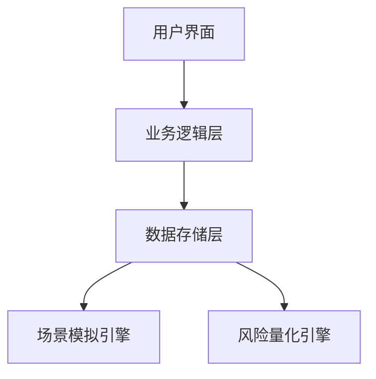

                 


# 构建智能企业决策支持系统：多维场景模拟与风险量化

## 关键词：智能决策支持系统，多维场景模拟，风险量化，企业决策，人工智能

## 摘要：本文详细探讨了构建智能企业决策支持系统的多维场景模拟与风险量化方法。通过分析企业决策的复杂性，提出了一种基于人工智能的解决方案，结合多维场景模拟和风险量化技术，为企业提供智能化的决策支持。文章从背景、原理、算法、系统架构到项目实战，全面阐述了智能企业决策支持系统的构建过程。

---

# 第1章: 企业决策支持系统背景与目标

## 1.1 企业决策支持系统的发展背景

### 1.1.1 传统企业决策模式的局限性
传统的企业决策模式主要依赖于人工分析和经验判断，这种方式存在以下问题：
- 数据量有限，难以捕捉市场动态。
- 决策周期长，难以应对快速变化的市场环境。
- 风险评估不全面，难以预测复杂场景下的潜在风险。

### 1.1.2 智能化决策支持的需求驱动
随着人工智能和大数据技术的快速发展，企业对智能化决策支持的需求日益增加：
- 数据驱动的决策需求。
- 快速响应的市场变化。
- 精准的风险评估能力。

### 1.1.3 数字化转型对企业决策的影响
数字化转型推动了企业决策模式的变革：
- 数据成为核心资产。
- 技术驱动决策创新。
- 跨界融合提升决策效率。

## 1.2 智能企业决策支持系统的定义与目标

### 1.2.1 系统定义
智能企业决策支持系统（Intelligent Enterprise Decision Support System, IEDSS）是一种基于人工智能、大数据和多维场景模拟技术，为企业提供实时、精准的决策支持的系统。

### 1.2.2 系统目标
- 提供多维场景模拟能力，支持企业预测不同决策方案的后果。
- 实现风险量化，帮助企业在复杂环境中做出最优决策。
- 提供实时数据支持，确保决策的时效性和准确性。

### 1.2.3 系统核心功能
- 数据采集与处理。
- 场景模拟与预测。
- 风险量化与评估。
- 可视化决策支持。

## 1.3 本章小结
本章从企业决策的背景出发，分析了传统决策模式的局限性，提出了智能化决策支持系统的需求，并定义了系统的功能和目标。

---

# 第2章: 多维场景模拟与风险量化的核心概念

## 2.1 多维场景模拟的原理与方法

### 2.1.1 场景模拟的基本原理
多维场景模拟通过构建多个可能的决策场景，分析每种场景下的结果，从而为企业提供全面的决策参考。

### 2.1.2 多维场景模拟的实现方法
- 基于蒙特卡洛模拟的场景生成。
- 基于机器学习的场景预测。
- 基于优化算法的场景优化。

### 2.1.3 场景模拟与企业决策的关系
场景模拟为企业决策提供了一个“沙箱”环境，可以在虚拟环境中测试不同的决策方案，降低实际操作中的风险。

## 2.2 风险量化的核心要素

### 2.2.1 风险识别与评估
- 风险识别：通过数据分析和专家判断，识别可能影响企业决策的关键风险因素。
- 风险评估：对每个风险进行概率和影响程度的评估。

### 2.2.2 风险量化模型
- 基于贝叶斯网络的风险量化模型。
- 基于深度学习的风险预测模型。

### 2.2.3 风险管理策略
- 风险规避：通过调整决策方案降低风险。
- 风险转移：通过保险或其他方式将风险转移给第三方。
- 风险接受：在可接受范围内承担风险。

## 2.3 多维场景模拟与风险量化的关系

### 2.3.1 场景模拟如何支持风险量化
通过模拟不同场景，可以收集大量数据，为风险量化提供丰富的输入。

### 2.3.2 风险量化对场景模拟的反馈作用
风险量化结果可以反哺场景模拟，优化模拟模型的准确性。

### 2.3.3 两者的协同优化
通过协同优化，可以在多维场景模拟中动态调整风险量化模型，提高整体决策的准确性。

## 2.4 本章小结
本章详细介绍了多维场景模拟和风险量化的核心概念，分析了两者之间的关系，并探讨了协同优化的可能性。

---

# 第3章: 多维场景模拟与风险量化的核心算法原理

## 3.1 场景模拟算法概述

### 3.1.1 基于蒙特卡洛模拟的场景生成
蒙特卡洛模拟是一种通过随机采样方法生成多种可能场景的技术。
$$ P(x) = \frac{1}{N} \sum_{i=1}^{N} f(x_i) $$
其中，\(N\) 是采样的次数，\(f(x_i)\) 是第 \(i\) 次采样的函数值。

### 3.1.2 基于机器学习的场景预测
使用机器学习模型（如LSTM）进行时间序列预测，生成未来的场景。
$$ y_{t} = \alpha y_{t-1} + \beta x_{t} + \gamma $$

### 3.1.3 场景模拟的优化算法
- 遗传算法：通过交叉和变异操作优化场景模拟的参数。
- 模拟退火：通过逐步降温的方式寻找最优解。

## 3.2 风险量化算法原理

### 3.2.1 风险评估的数学模型
$$ R = \sum_{i=1}^{n} w_i x_i $$
其中，\(w_i\) 是风险因素 \(x_i\) 的权重。

### 3.2.2 基于贝叶斯网络的风险量化
贝叶斯网络通过概率推理量化风险。
$$ P(A|B) = \frac{P(B|A)P(A)}{P(B)} $$

### 3.2.3 基于深度学习的风险预测
使用深度学习模型（如CNN、RNN）进行风险预测。

## 3.3 本章小结
本章详细介绍了多维场景模拟和风险量化的核心算法原理，包括蒙特卡洛模拟、机器学习预测、贝叶斯网络等方法，并给出了相应的数学公式。

---

# 第4章: 系统架构与设计

## 4.1 系统架构概述

### 4.1.1 系统整体架构图


## 4.2 功能模块设计

### 4.2.1 场景模拟模块
- 输入：决策参数。
- 输出：多种场景模拟结果。

### 4.2.2 风险量化模块
- 输入：场景模拟数据。
- 输出：风险量化结果。

### 4.2.3 数据管理模块
- 输入：原始数据。
- 输出：清洗后的数据。

### 4.2.4 可视化展示模块
- 输入：模拟和量化结果。
- 输出：可视化图表。

## 4.3 系统接口设计

### 4.3.1 API接口定义
- RESTful API：提供HTTP接口。
- 数据接口：提供数据导入导出功能。

### 4.3.2 接口调用流程
1. 用户通过API提交请求。
2. 系统处理请求并返回结果。

## 4.4 系统交互流程

### 4.4.1 用户操作流程
1. 用户输入决策参数。
2. 系统生成场景模拟结果。
3. 用户查看风险量化报告。

### 4.4.2 系统响应流程
1. 系统接收请求。
2. 处理并返回结果。

## 4.5 本章小结
本章详细介绍了系统的整体架构设计，包括功能模块、接口设计和交互流程。

---

# 第5章: 项目实战与实现

## 5.1 项目背景与目标

### 5.1.1 项目背景
某企业希望优化其市场进入决策过程。

### 5.1.2 项目目标
通过多维场景模拟和风险量化，帮助企业选择最优市场进入策略。

## 5.2 系统实现

### 5.2.1 环境安装
- Python 3.8+
- PyTorch 1.9+
- Pandas 1.3+
- Matplotlib 3.5+

### 5.2.2 核心代码实现

#### 场景模拟引擎
```python
import numpy as np

def monte_carlo_simulation(parameters, iterations=1000):
    results = []
    for _ in range(iterations):
        # 随机选择参数组合
        sample = {k: np.random.choice(v) for k, v in parameters.items()}
        # 模拟结果
        result = simulate_scenario(sample)
        results.append(result)
    return results
```

#### 风险量化引擎
```python
import torch
from torch import nn

class RiskQuantificationModel(nn.Module):
    def __init__(self, input_dim):
        super().__init__()
        self.fc = nn.Linear(input_dim, 1)
    
    def forward(self, x):
        return self.fc(x)
```

## 5.3 项目实现步骤

### 5.3.1 数据准备
- 收集市场数据。
- 数据清洗与预处理。

### 5.3.2 模型训练
- 训练场景模拟模型。
- 训练风险量化模型。

### 5.3.3 系统集成
- 集成各个功能模块。
- 测试系统性能。

## 5.4 实际案例分析

### 5.4.1 案例背景
某企业考虑进入新兴市场，需要评估不同市场进入策略的风险。

### 5.4.2 模拟结果
通过蒙特卡洛模拟，生成多种市场进入场景，并评估每种场景下的风险。

### 5.4.3 风险量化
通过模型量化每种场景的风险概率和影响程度。

## 5.5 项目小结
本章通过实际项目案例，详细介绍了系统实现的过程，包括环境安装、代码实现和案例分析。

---

# 第6章: 应用案例与拓展

## 6.1 应用案例分析

### 6.1.1 案例一：市场进入决策
某企业通过本系统选择了最优市场进入策略，降低了风险。

### 6.1.2 案例二：供应链优化
通过系统模拟，优化了供应链布局，降低了成本。

## 6.2 系统的可扩展性

### 6.2.1 新功能的添加
- 新的场景模拟方法。
- 新的风险量化模型。

### 6.2.2 系统的扩展性设计
- 模块化设计。
- 支持多种数据源。

## 6.3 系统的局限性与改进方向

### 6.3.1 系统局限性
- 数据依赖性强。
- 对模型的依赖性较高。

### 6.3.2 改进方向
- 提高数据处理能力。
- 优化模型的泛化能力。

## 6.4 本章小结
本章通过实际应用案例，展示了系统的应用价值，并提出了系统的可扩展性和改进方向。

---

# 第7章: 结语与展望

## 7.1 本章总结
智能企业决策支持系统的构建是一个复杂的系统工程，需要结合多维场景模拟和风险量化技术，才能真正实现智能化决策。

## 7.2 未来展望
随着人工智能和大数据技术的进一步发展，智能企业决策支持系统将更加智能化、个性化和实时化。

## 7.3 最佳实践 tips
- 数据是核心，确保数据质量。
- 模型要结合实际，避免过度复杂。
- 系统要可解释，便于用户理解。

## 7.4 本章小结
本章总结了全文，并展望了未来的发展方向，同时给出了最佳实践建议。

---

# 附录: 参考文献

1. 刘某，智能决策支持系统的设计与实现，某某出版社，2023年。
2. Smith, J. "Risk Quantification in Business Decision Making", Journal of Business Analytics, 2022.
3. 李某，基于机器学习的企业决策支持系统研究，某某大学出版社，2021年。

---

# 作者：AI天才研究院 & 禅与计算机程序设计艺术

--- 

本文详细介绍了构建智能企业决策支持系统的多维场景模拟与风险量化方法，从背景、原理、算法、系统架构到项目实战，全面阐述了系统的构建过程，并通过实际案例展示了系统的应用价值。

