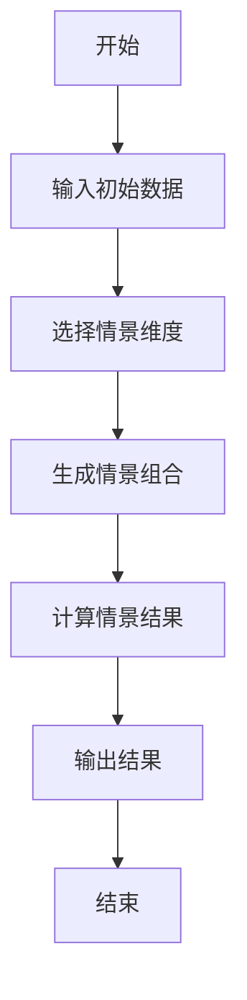
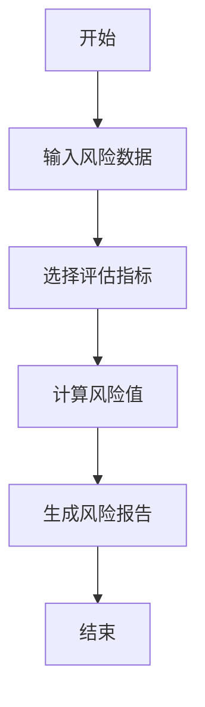
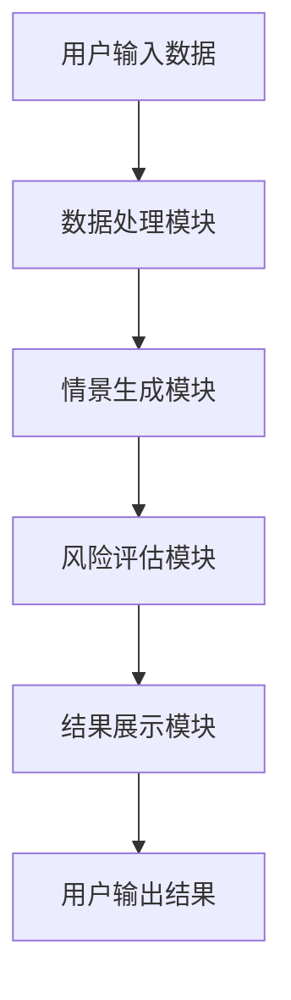

                 


# 构建智能企业决策模拟系统：多维度情景分析与风险评估

## 关键词：智能决策模拟，情景分析，风险评估，系统架构，数学模型

## 摘要：  
本文详细探讨了构建智能企业决策模拟系统的各个方面，包括问题背景、核心概念、算法原理、系统架构设计以及项目实战。通过多维度情景分析和风险评估的结合，本文旨在为企业提供一种高效、智能的决策支持工具。文章从理论到实践，结合丰富的实例和详细的数学模型，为企业决策者和技术实现者提供了全面的指导。

---

# 第1章: 问题背景与系统目标

## 1.1 问题背景

### 1.1.1 企业决策面临的挑战
企业在决策过程中常常面临复杂多变的市场环境和不确定性因素。传统决策方法依赖于人工经验，难以应对海量数据和复杂场景的分析需求。

### 1.1.2 传统决策方法的局限性
- 数据量大，分析效率低。
- 情景分析单一，缺乏多维度考虑。
- 风险评估不全面，难以量化。

### 1.1.3 智能决策模拟的必要性
随着人工智能和大数据技术的发展，智能决策模拟系统能够通过数据驱动的方式，提供更精准、更全面的决策支持。

## 1.2 问题描述

### 1.2.1 多维度情景分析的需求
企业在决策时需要考虑市场、技术、政策等多个维度的变化，传统的单维度分析难以满足需求。

### 1.2.2 风险评估的核心问题
风险评估需要量化各种不确定性对决策结果的影响，同时需要考虑不同风险因素之间的相互作用。

### 1.2.3 系统构建的目标与边界
系统的目标是通过智能算法和数学模型，实现多维度情景分析和风险评估，为企业提供决策支持。系统的边界包括数据输入、模型构建和结果输出。

## 1.3 问题解决思路

### 1.3.1 智能决策模拟的总体框架
构建一个基于多维度情景分析和风险评估的智能决策模拟系统，需要结合数据采集、模型构建和结果展示三个主要环节。

### 1.3.2 多维度情景分析的实现路径
通过数据预处理、情景生成和情景评估三个步骤，实现对多种可能情景的全面分析。

### 1.3.3 风险评估的核心方法
采用概率论和统计学方法，量化各种风险因素的影响，并结合专家意见进行综合评估。

## 1.4 系统核心要素

### 1.4.1 系统功能模块
- 数据采集与处理模块
- 情景生成模块
- 风险评估模块
- 结果展示模块

### 1.4.2 数据来源与处理
数据来源包括市场数据、历史数据、专家意见等，需要进行清洗、转换和特征提取。

### 1.4.3 模型构建与优化
通过机器学习和优化算法，构建高效的数学模型，并进行参数调优。

## 1.5 本章小结
本章从企业决策面临的挑战出发，详细描述了问题背景、系统目标和核心要素，为后续的系统设计奠定了基础。

---

# 第2章: 智能决策模拟系统架构

## 2.1 核心概念原理

### 2.1.1 多维度情景分析的定义
多维度情景分析是指在多个维度上生成可能的情景，并评估这些情景对企业决策的影响。

### 2.1.2 风险评估的基本原理
风险评估是通过分析各种风险因素，量化其对决策结果的影响，并制定相应的风险管理策略。

### 2.1.3 智能决策模拟的数学模型
数学模型是智能决策模拟的核心，包括概率模型、优化模型和仿真模型。

## 2.2 核心概念对比表

| 比较维度 | 情景分析 | 风险评估 |
|----------|----------|----------|
| 目标     | 分析可能的情景 | 量化风险因素的影响 |
| 方法     | 情景生成、情景评估 | 概率分析、统计分析 |
| 输出     | 情景结果 | 风险概率、风险影响 |

### 2.2.2 不同决策方法的优劣势分析

| 方法       | 优点                         | 缺点                         |
|------------|------------------------------|------------------------------|
| 传统决策   | 简单易懂                     | 依赖经验，缺乏数据支持       |
| 情景分析   | 全面考虑多维度因素           | 情景生成复杂，计算量大       |
| 风险评估   | 量化风险，提供决策依据       | 需要大量数据和模型支持       |

## 2.3 系统实体关系图

### 2.3.1 ER实体关系图
```mermaid
erd
    组件(组件ID, 名称, 功能描述)
    数据(数据ID, 数据来源, 数据类型)
    模块(模块ID, 模块名称, 模块功能)
    组件 --> 数据: 使用
    组件 --> 模块: 包含
```

### 2.3.2 系统功能模块图


## 2.4 本章小结
本章详细讲解了智能决策模拟系统的核心概念和系统架构，通过对比分析和实体关系图，明确了系统的组成和功能模块。

---

# 第3章: 多维度情景分析算法

## 3.1 算法原理

### 3.1.1 情景分析的基本流程
1. 数据预处理：清洗、转换、特征提取。
2. 情景生成：基于概率模型生成多种情景。
3. 情景评估：计算每种情景对企业决策的影响。

### 3.1.2 多维度分析的实现方法
- 使用蒙特卡洛模拟生成多种情景。
- 通过主成分分析减少维度，提高计算效率。

### 3.1.3 算法优化策略
- 使用并行计算加速情景生成。
- 采用分层抽样方法提高样本效率。

## 3.2 算法流程图


## 3.3 数学模型

### 3.3.1 基础模型
$$y = f(x)$$

### 3.3.2 优化模型
$$\min_{x} f(x)$$

### 3.3.3 案例分析
$$x_1 + x_2 = 1$$

## 3.4 本章小结
本章详细介绍了多维度情景分析算法的原理和实现方法，通过流程图和数学模型，明确了算法的实现步骤。

---

# 第4章: 风险评估算法

## 4.1 算法原理

### 4.1.1 风险评估的基本方法
- 风险概率计算：基于历史数据和专家意见，计算各风险因素的概率。
- 风险影响评估：量化风险对决策目标的影响。

### 4.1.2 风险矩阵的构建
通过概率和影响程度构建风险矩阵，分为低、中、高三个等级。

### 4.1.3 算法实现步骤
1. 数据预处理：清洗、转换、特征提取。
2. 风险因素识别：基于领域知识和数据分析结果。
3. 风险概率计算：使用贝叶斯网络或蒙特卡洛模拟。
4. 风险影响评估：基于权重和影响程度计算总风险值。

## 4.2 算法流程图


## 4.3 数学模型

### 4.3.1 风险概率计算
$$P(A|B) = \frac{P(B|A)P(A)}{P(B)}$$

### 4.3.2 风险影响评估
$$I = \prod_{j=1}^{m} i_j$$

### 4.3.3 案例分析
$$P(A|B) = \frac{P(B|A)P(A)}{P(B)}$$

## 4.4 本章小结
本章详细介绍了风险评估算法的原理和实现方法，通过流程图和数学模型，明确了算法的实现步骤。

---

# 第5章: 系统架构设计

## 5.1 系统功能模块设计

### 5.1.1 数据采集模块
负责从多种数据源采集数据，包括市场数据、历史数据、专家意见等。

### 5.1.2 数据处理模块
对采集的数据进行清洗、转换和特征提取，为后续分析提供干净的数据。

### 5.1.3 情景生成模块
基于概率模型生成多种情景，包括市场变化、技术发展、政策变化等。

### 5.1.4 风险评估模块
对生成的情景进行风险评估，计算每种情景的风险概率和影响程度。

### 5.1.5 结果展示模块
将评估结果以可视化的方式展示，帮助决策者理解和分析。

## 5.2 系统架构图


## 5.3 系统接口设计

### 5.3.1 数据接口
- 数据输入接口：接收外部数据。
- 数据输出接口：输出处理后的数据。

### 5.3.2 模块接口
- 情景生成接口：调用概率模型生成情景。
- 风险评估接口：调用风险模型评估风险。

## 5.4 系统交互流程图


## 5.5 本章小结
本章详细设计了系统的功能模块和架构，通过架构图和接口设计，明确了系统的组成和交互流程。

---

# 第6章: 项目实战

## 6.1 环境安装

### 6.1.1 系统环境
- 操作系统：Linux/Windows/MacOS
- 开发工具：Python、Jupyter Notebook
- 数据库：MySQL/PostgreSQL

### 6.1.2 安装依赖
```bash
pip install numpy pandas scikit-learn matplotlib
```

## 6.2 核心代码实现

### 6.2.1 数据预处理
```python
import pandas as pd
import numpy as np

# 数据加载
data = pd.read_csv('input.csv')

# 数据清洗
data.dropna(inplace=True)

# 特征提取
X = data[['feature1', 'feature2']]
```

### 6.2.2 情景生成
```python
from sklearn.decomposition import PCA

# PCA降维
pca = PCA(n_components=2)
principal_components = pca.fit_transform(X)
```

### 6.2.3 风险评估
```python
from sklearn.naive_bayes import GaussianNB

# 模型训练
model = GaussianNB()
model.fit(principal_components, labels)
```

### 6.2.4 结果展示
```python
import matplotlib.pyplot as plt

# 绘制结果图
plt.scatter(principal_components[:, 0], principal_components[:, 1], c=labels)
plt.show()
```

## 6.3 案例分析

### 6.3.1 数据来源
假设我们有一个企业决策问题，涉及市场、技术和政策三个维度。

### 6.3.2 数据分析
通过数据分析，我们发现市场变化对企业利润的影响最大，其次是政策变化。

### 6.3.3 情景生成
生成多种市场、技术和政策组合的情景，评估每种情景对企业利润的影响。

### 6.3.4 风险评估
通过概率模型，计算每种情景的风险概率和影响程度，制定相应的风险管理策略。

## 6.4 项目总结
通过项目实战，我们验证了系统的可行性和有效性，为企业决策提供了有力支持。

---

# 第7章: 最佳实践与总结

## 7.1 最佳实践

### 7.1.1 数据质量
确保数据的准确性和完整性，避免因数据问题导致分析误差。

### 7.1.2 模型选择
根据实际问题选择合适的模型，避免盲目追求复杂性。

### 7.1.3 可视化展示
通过可视化工具，帮助决策者更好地理解和分析结果。

## 7.2 小结
智能企业决策模拟系统通过多维度情景分析和风险评估，为企业提供了高效、智能的决策支持工具。

## 7.3 注意事项

### 7.3.1 数据隐私
在处理企业数据时，需注意数据隐私和安全问题。

### 7.3.2 模型解释性
复杂的模型可能难以解释，需选择合适的方法提高模型的解释性。

## 7.4 拓展阅读

### 7.4.1 推荐书籍
- 《数据分析实战》
- 《机器学习实战》

### 7.4.2 推荐博客
- Medium上的数据分析专栏
- Towards Data Science

## 7.5 本章小结
通过总结和注意事项，本文为企业构建智能决策模拟系统提供了宝贵的实践经验。

---

# 作者：AI天才研究院/AI Genius Institute & 禅与计算机程序设计艺术 /Zen And The Art of Computer Programming

