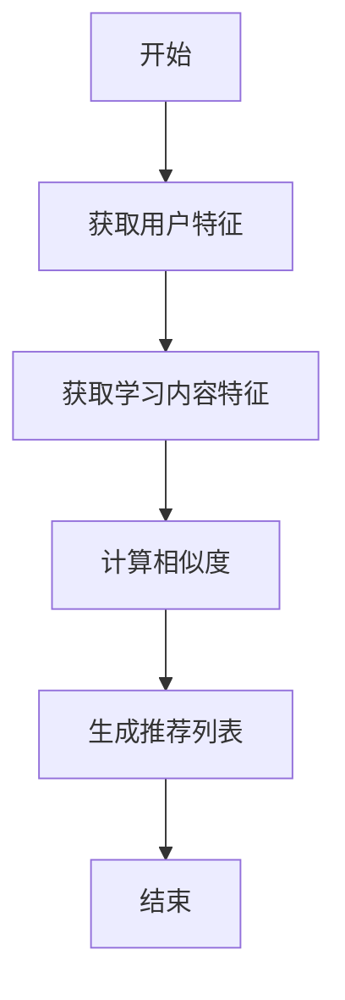

                 


# 构建智能企业合规培训系统：个性化学习内容与评估

## 关键词：
智能企业合规培训系统、个性化学习、评估体系、机器学习、协同过滤算法、动态反馈机制

## 摘要：
本文将详细探讨如何构建一个基于人工智能的智能企业合规培训系统，重点介绍个性化学习内容推荐和评估体系的设计与实现。通过分析合规培训的核心需求，结合机器学习算法，提出一种智能化的解决方案，以提高员工学习效率和合规效果。

---

# 第1章 企业合规培训系统背景与核心概念

## 1.1 企业合规培训的重要性
### 1.1.1 合规培训的定义与作用
合规培训是指企业为确保员工了解并遵守相关法律法规、行业标准和公司内部规章制度而开展的培训活动。其作用在于降低企业的法律风险，提升员工的专业能力和合规意识。

### 1.1.2 企业合规培训的现状与挑战
传统合规培训通常采用统一的课程和评估方式，难以满足不同员工的学习需求。此外，培训效果难以量化，导致资源浪费和效率低下。

### 1.1.3 智能化合规培训的必要性
随着人工智能技术的发展，智能化合规培训可以通过个性化学习和动态评估，显著提升培训效果和效率。

## 1.2 个性化学习与评估的核心概念
### 1.2.1 个性化学习的定义与特点
个性化学习是指根据员工的特征（如职位、技能水平、学习风格）定制专属的学习路径和内容。

### 1.2.2 个性化评估的定义与特点
个性化评估是通过动态反馈和数据分析，针对不同员工的特点设计评估方式和标准。

### 1.2.3 智能企业合规培训系统的边界与外延
智能企业合规培训系统不仅包括学习内容推荐，还涵盖学习效果评估、反馈优化等环节。

---

# 第2章 核心概念与联系

## 2.1 合规培训系统的核心原理
### 2.1.1 用户行为分析与学习路径规划
通过分析员工的学习行为和反馈，系统可以实时调整学习内容和评估策略。

### 2.1.2 内容推荐算法原理
推荐算法是个性化学习的核心，常用算法包括协同过滤和基于内容的推荐。

### 2.1.3 个性化评估模型构建
评估模型需要结合员工的学习行为和结果，动态调整评估标准和反馈机制。

## 2.2 核心概念对比与ER实体关系图

### 2.2.1 核心概念对比表格
| 概念 | 定义 | 属性 | 示例 |
|------|------|------|------|
| 用户画像 | 用户特征描述 | 年龄、职业、学习需求 | 初级员工、中层管理者 |
| 学习内容 | 培训材料 | 类型、难度、主题 | 法律法规、操作规范 |

### 2.2.2 ER实体关系图
```mermaid
erd
  title 合规培训系统实体关系图
  User {
    id: int
    name: string
    role: string
  }
  LearningContent {
    id: int
    title: string
    difficulty: int
  }
  Assessment {
    id: int
    score: int
    feedback: string
  }
  User --> LearningContent: 通过内容推荐
  User --> Assessment: 参与评估
```

---

# 第3章 算法原理与数学模型

## 3.1 协同过滤推荐算法
### 3.1.1 基于用户的协同过滤
通过分析用户的行为和偏好，找到相似用户的推荐内容。

### 3.1.2 基于内容的协同过滤
根据学习内容的特征（如主题、难度）推荐相关内容。

### 3.1.3 混合推荐算法
结合用户协同和内容协同的优势，提升推荐准确率。

## 3.2 算法流程图


## 3.3 数学模型与公式
### 3.3.1 相似度计算公式
$$ sim(u, v) = \frac{\sum_{i} (u_i \times v_i)}{\sqrt{\sum_{i} u_i^2} \times \sqrt{\sum_{i} v_i^2}} $$

### 3.3.2 推荐分数计算公式
$$ score = \sum_{i} sim(u, v_i) \times rating(v_i) $$

---

# 第4章 系统架构设计与实现

## 4.1 系统功能模块
### 4.1.1 用户管理模块
负责用户注册、登录和信息维护。

### 4.1.2 学习内容管理模块
管理合规培训的各类学习内容，包括法律法规、操作规范等。

### 4.1.3 评估模块
负责学习效果评估和反馈优化。

## 4.2 系统架构图
```mermaid
graph TD
    User --> API Gateway
    API Gateway --> LearningContent
    LearningContent --> RecommendationEngine
    RecommendationEngine --> User
    User --> Assessment
    Assessment --> Feedback
```

---

# 第5章 项目实战：智能合规培训系统开发

## 5.1 环境搭建
### 5.1.1 安装Python和相关库
使用Anaconda或虚拟环境安装必要的库，如Flask、Scikit-learn等。

### 5.1.2 数据采集与预处理
收集用户信息、学习内容和历史评估数据，并进行清洗和标注。

## 5.2 核心功能实现
### 5.2.1 用户画像构建
通过数据分析生成用户画像，并存储在数据库中。

### 5.2.2 内容推荐模块
实现协同过滤算法，并根据用户画像生成推荐列表。

### 5.2.3 动态评估模块
根据用户反馈动态调整评估标准，并提供个性化反馈。

## 5.3 系统测试与优化
通过用户测试收集反馈，优化推荐算法和评估模型。

---

# 第6章 总结与展望

## 6.1 最佳实践
- 定期更新学习内容，保持系统的 актуality。
- 通过A/B测试优化推荐算法。

## 6.2 未来展望
- 引入区块链技术确保数据安全。
- 结合虚拟现实技术提升学习体验。

---

作者：AI天才研究院/AI Genius Institute & 禅与计算机程序设计艺术 /Zen And The Art of Computer Programming

