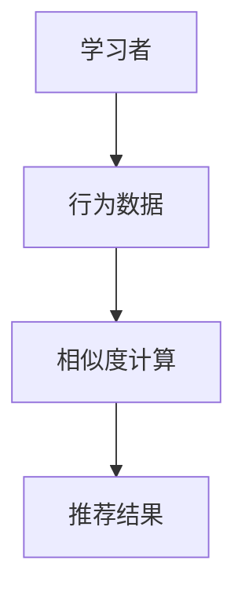
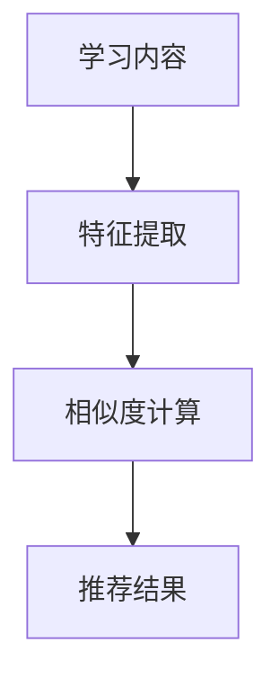
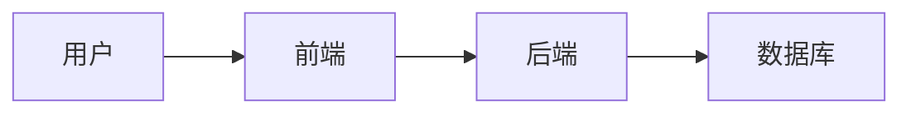

                 


# 《构建智能企业合规培训系统：个性化学习内容与评估的自动化》

## 关键词：企业合规培训、个性化学习、自动化评估、推荐算法、系统架构

## 摘要：本文详细探讨了构建智能企业合规培训系统的方法，重点介绍了如何通过个性化学习内容和自动化评估来提升培训效果。文章从系统背景、核心概念、算法原理、架构设计到项目实战，全面分析了构建该系统的各个方面，为读者提供了从理论到实践的完整指南。

---

# 第一部分: 智能企业合规培训系统概述

## 第1章: 企业合规培训系统背景与需求

### 1.1 企业合规培训的重要性

#### 1.1.1 合规培训的定义与作用
合规培训是指企业为确保员工遵守相关法律法规、行业标准和企业内部政策而进行的培训。其作用在于减少法律风险、提升员工专业能力、增强企业合规文化。

#### 1.1.2 企业合规培训的核心目标
- 提高员工对法律法规的理解和遵守能力。
- 培养员工的合规意识和职业道德。
- 确保企业在经营活动中符合相关法规和行业标准。

#### 1.1.3 个性化学习与自动化评估的需求
传统合规培训存在内容统一、缺乏针对性、评估方式单一等问题。个性化学习和自动化评估可以解决这些问题，满足不同员工的学习需求，提高培训效果。

### 1.2 当前企业合规培训的痛点

#### 1.2.1 传统合规培训的局限性
- 内容固定，无法根据员工的具体需求进行调整。
- 培训效果难以量化，评估方式单一，无法全面反映员工的学习成果。
- 员工参与度低，缺乏学习动力。

#### 1.2.2 个性化学习的缺失
- 员工的学习需求多样化，传统培训无法满足。
- 缺乏个性化的学习路径和内容推荐，导致学习效率低下。

#### 1.2.3 自动化评估的挑战
- 评估标准不统一，难以实现自动化。
- 缺乏有效的评估工具和技术支持。

### 1.3 智能化合规培训系统的解决方案

#### 1.3.1 个性化学习内容的设计
- 根据员工的岗位、技能水平和学习目标，定制个性化的学习内容。
- 使用推荐算法，为员工推荐适合的学习资源。

#### 1.3.2 自动化评估的实现
- 利用技术手段，自动收集和分析员工的学习数据，生成评估结果。
- 通过自动化评估，提供实时反馈，帮助员工改进学习策略。

#### 1.3.3 系统的核心价值与优势
- 提高培训效率和效果，降低企业合规风险。
- 个性化学习和自动化评估相结合，提升员工的学习体验和效果。

### 1.4 本章小结
本章介绍了企业合规培训的重要性和当前存在的痛点，提出了智能化合规培训系统的解决方案，强调了个性化学习和自动化评估的重要性。

---

## 第2章: 个性化学习与自动化评估的核心概念

### 2.1 个性化学习的定义与特点

#### 2.1.1 个性化学习的定义
个性化学习是指根据学习者的具体情况（如学习目标、兴趣、能力水平等），提供定制化的学习内容和路径。

#### 2.1.2 个性化学习的特点
- 针对性强：根据学习者的需求和特点，提供个性化的学习内容。
- 灵活性高：学习者可以根据自己的时间和进度进行学习。
- 数据驱动：利用数据分析技术，优化学习内容和路径。

### 2.2 自动化评估的定义与特点

#### 2.2.1 自动化评估的定义
自动化评估是指通过技术手段，自动收集、分析和评估学习者的学习数据，生成评估结果。

#### 2.2.2 自动化评估的特点
- 高效性：自动化评估可以快速处理大量数据，提高评估效率。
- 客观性：基于数据的评估结果更加客观公正。
- 实时性：自动化评估可以实时反馈学习者的学习情况。

### 2.3 个性化学习与自动化评估的关联

#### 2.3.1 个性化学习如何支持自动化评估
个性化学习通过分析学习者的行为数据和学习目标，为自动化评估提供数据支持和评估依据。

#### 2.3.2 自动化评估如何反馈个性化学习
自动化评估的结果可以为个性化学习提供反馈，帮助学习者调整学习策略和内容。

#### 2.3.3 两者的协同作用
个性化学习和自动化评估相互促进，共同提升学习效果和效率。

### 2.4 核心概念对比分析

#### 2.4.1 个性化学习与自动化评估的属性对比（表格）

| 属性         | 个性化学习                 | 自动化评估                 |
|--------------|---------------------------|---------------------------|
| 定义         | 根据学习者需求定制学习内容 | 通过技术手段自动评估学习结果 |
| 目标         | 提高学习效果               | 提供客观评估结果           |
| 方法         | 推荐算法、学习路径定制     | 数据分析、自动化工具       |

#### 2.4.2 核心概念的ER实体关系图（Mermaid）

```mermaid
er
actor: 学习者
actor: 学习内容
actor: 评估结果
```

### 2.5 本章小结
本章详细介绍了个性化学习和自动化评估的核心概念，分析了两者的特点和相互关系，为后续的系统构建奠定了理论基础。

---

## 第3章: 个性化学习推荐算法原理

### 3.1 推荐算法的分类与选择

#### 3.1.1 基于协同过滤的推荐算法
协同过滤是一种基于用户行为数据的推荐算法，通过分析用户的行为（如点击、购买）来预测用户的兴趣。

##### 3.1.1.1 基于用户的协同过滤（UserCF）
- 基于用户相似性推荐，适用于用户数量较少的情况。

##### 3.1.1.2 基于物品的协同过滤（ItemCF）
- 基于物品相似性推荐，适用于物品数量较多的情况。

#### 3.1.2 基于内容推荐的算法
内容推荐算法通过分析学习内容的特征，推荐与学习者兴趣相符的内容。

##### 3.1.2.1 基于关键词的内容推荐
- 通过分析学习内容的关键词，推荐相关的内容。

##### 3.1.2.2 基于主题模型的内容推荐
- 使用主题模型（如LDA）分析内容主题，推荐相关的内容。

#### 3.1.3 混合推荐算法
混合推荐算法结合协同过滤和内容推荐的优点，通过集成两种算法来提高推荐效果。

### 3.2 基于协同过滤的推荐算法实现

#### 3.2.1 算法原理（Mermaid流程图）



#### 3.2.2 Python代码实现
以下是一个简单的协同过滤算法实现：

```python
def collaborative_filtering(user_id, user_similarity):
    # 找出与目标用户相似度最高的k个用户
    similar_users = user_similarity[user_id].argsort()[::-1][:5]
    # 计算目标用户的推荐得分
    recommendations = {}
    for user in similar_users:
        for item in train_data[user]:
            recommendations[item] += user_similarity[user_id][item]
    # 返回推荐结果
    return recommendations
```

### 3.3 基于内容推荐的算法实现

#### 3.3.1 算法原理（Mermaid流程图）



#### 3.3.2 Python代码实现
以下是一个简单的内容推荐算法实现：

```python
from sklearn.feature_extraction.text import TfidfVectorizer
from sklearn.metrics.pairwise import cosine_similarity

# 初始化向量器
vectorizer = TfidfVectorizer()
# 训练向量空间模型
tfidf_matrix = vectorizer.fit_transform(contents)
# 计算余弦相似度
similarity_matrix = cosine_similarity(tfidf_matrix)
```

---

## 第4章: 自动化评估算法原理

### 4.1 基于规则的评估算法

#### 4.1.1 算法原理
基于规则的评估算法通过预定义的规则对学习者的行为进行评估。

#### 4.1.2 实现步骤
1. 定义评估规则。
2. 收集学习者的行为数据。
3. 根据规则对行为数据进行评估。

### 4.2 基于机器学习的评估算法

#### 4.2.1 算法原理
基于机器学习的评估算法通过训练模型来预测学习者的评估结果。

#### 4.2.2 实现步骤
1. 收集和预处理评估数据。
2. 选择合适的机器学习模型（如随机森林、神经网络）。
3. 训练模型并进行评估。

### 4.3 混合评估算法

#### 4.3.1 算法原理
混合评估算法结合基于规则和基于机器学习的优点，通过集成两种方法来提高评估效果。

---

## 第5章: 系统架构设计与实现

### 5.1 系统功能模块设计

#### 5.1.1 学习者模块
- 用户注册与登录。
- 个性化学习内容推荐。
- 学习进度跟踪。

#### 5.1.2 管理员模块
- 系统管理与配置。
- 学习内容管理。
- 评估结果分析。

### 5.2 系统架构设计（Mermaid架构图）



### 5.3 系统接口设计
- API接口设计：RESTful API。
- 接口文档：详细描述每个接口的功能和使用方法。

---

## 第6章: 项目实战与案例分析

### 6.1 环境安装与配置
- 安装Python、Jupyter Notebook、TensorFlow、Flask等工具。

### 6.2 核心代码实现
- 推荐算法实现：协同过滤、内容推荐。
- 评估算法实现：基于规则和机器学习的评估。

### 6.3 代码解读与分析
- 详细解释代码的功能和实现逻辑。

### 6.4 案例分析
- 实际案例：构建一个简单的合规培训系统。
- 案例分析：系统在实际应用中的表现和效果。

---

## 第7章: 最佳实践与未来展望

### 7.1 本章小结
总结本文的主要内容，强调个性化学习和自动化评估的重要性。

### 7.2 实用建议
- 定期更新学习内容和评估规则。
- 采用多种推荐算法结合使用，提高推荐效果。

### 7.3 未来展望
- 结合人工智能技术，进一步优化推荐和评估算法。
- 探索新的学习模式，如虚拟现实、增强现实等。

### 7.4 拓展阅读
推荐相关书籍和论文，供读者进一步学习和研究。

---

## 作者：AI天才研究院 & 禅与计算机程序设计艺术

---

以上是构建智能企业合规培训系统的完整目录和内容概要，涵盖了从理论到实践的各个方面，为读者提供了构建个性化学习和自动化评估系统的详细指导。

