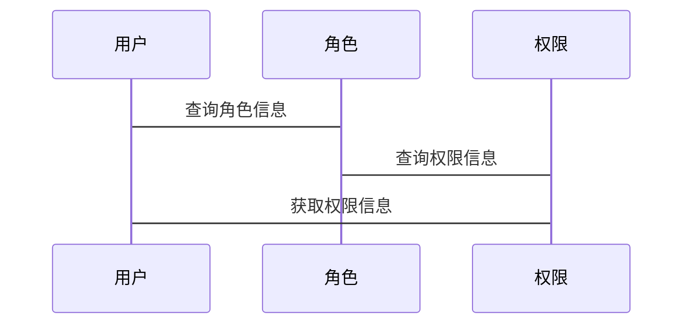

                 


# 《构建智能企业合规培训系统：基于角色的个性化学习与评估》

## 关键词：智能合规培训系统, 个性化学习, 基于角色的访问控制, 人工智能, 企业培训

## 摘要：本文章详细探讨了如何利用人工智能技术构建智能企业合规培训系统，重点分析了基于角色的个性化学习与评估方法。文章从背景、核心概念、算法原理、系统架构到项目实现进行了全面解析，旨在为企业提供一套高效的合规培训解决方案，助力企业提升培训效果和管理效率。

---

## 第4章: 系统实现与算法原理

### 4.1 基于角色的访问控制（RBAC）模型

#### 4.1.1 RBAC模型的定义与特点

基于角色的访问控制（RBAC，Role-Based Access Control）是一种广泛应用于系统安全和权限管理的模型。其核心思想是通过角色来定义用户对系统资源的访问权限。与基于用户的访问控制（UBAC）不同，RBAC通过将权限赋予角色，而不是直接赋予用户，使得权限管理更加灵活和高效。

RBAC模型的主要特点包括：
1. **角色抽象**：通过角色将具有相同权限的用户进行分组，减少了权限管理的复杂性。
2. **细粒度控制**：可以根据角色的不同，灵活定义用户对资源的访问权限。
3. **易于扩展**：新增角色或用户时，只需定义角色权限，无需逐个为用户分配权限。

#### 4.1.2 RBAC模型的实体关系图

RBAC模型涉及的主要实体包括：
- 用户（User）
- 角色（Role）
- 权限（Permission）
- 用户与角色的关联关系（User-Role）
- 角色与权限的关联关系（Role-Permission）

下图展示了RBAC模型的实体关系：

```mermaid
er
    actor 用户 {
        role 用户名
    }
    actor 角色 {
        permission 权限名
    }
    用户 --> 用户-角色: 用户属于角色
    角色 --> 权限: 角色拥有权限
```

#### 4.1.3 RBAC模型的实现流程

RBAC模型的实现流程可以分为以下几个步骤：

1. **定义角色**：根据企业的组织结构和业务需求，定义不同的角色（例如：员工、 manager、admin）。
2. **分配权限**：为每个角色分配相应的权限（例如：查看、编辑、删除）。
3. **用户与角色关联**：将用户分配到相应的角色中。
4. **权限检查**：在用户进行操作时，系统检查该用户所属的角色是否拥有相应的权限。

RBAC模型的实现流程可以用以下序列图表示：



### 4.2 个性化学习推荐算法

#### 4.2.1 基于协同过滤的推荐

协同过滤是一种常用的推荐算法，其基本思想是通过分析用户的行为数据，找到与当前用户行为相似的其他用户，并推荐这些用户喜欢的内容。

基于协同过滤的推荐算法可以分为以下两种类型：
1. **基于用户的协同过滤（UserCF）**：通过计算用户之间的相似性，推荐相似用户喜欢的内容。
2. **基于物品的协同过滤（ItemCF）**：通过计算物品之间的相似性，推荐与当前用户喜欢的物品相似的其他物品。

#### 4.2.2 基于内容的推荐

基于内容的推荐算法是通过分析内容本身的特征，推荐与当前用户兴趣相符的内容。例如，在企业合规培训系统中，可以根据课程的内容特征，推荐相关的课程给用户。

基于内容的推荐算法通常包括以下步骤：
1. **提取内容特征**：对课程内容进行特征提取，例如提取关键词、主题等。
2. **计算相似度**：根据内容特征计算课程之间的相似度。
3. **推荐内容**：根据相似度，推荐相关的内容给用户。

### 4.3 基于角色的个性化学习模型

#### 4.3.1 模型的输入与输出

- **输入**：
  - 用户信息（例如：职位、部门、角色）
  - 课程信息（例如：课程主题、课程难度）
  - 用户的历史学习行为（例如：学习过的课程、评分）

- **输出**：
  - 推荐的课程列表
  - 个性化评估报告

#### 4.3.2 模型的核心算法与实现

基于角色的个性化学习模型可以采用以下算法：
1. **角色匹配算法**：根据用户的角色和课程的角色要求，匹配合适的课程。
2. **协同过滤算法**：结合用户的历史学习行为，推荐相关的课程。
3. **基于内容的推荐算法**：根据课程内容和用户兴趣，推荐相关课程。

### 4.4 系统的实现

系统实现部分包括以下几个方面：
1. **数据库设计**：设计用户表、角色表、权限表、课程表等数据库表。
2. **权限管理**：实现基于角色的访问控制，确保用户只能访问其角色允许的资源。
3. **个性化推荐**：实现基于角色和用户行为的个性化课程推荐算法。
4. **评估与反馈**：根据用户的反馈和学习效果，调整推荐算法，优化推荐结果。

---

## 第5章: 项目实战

### 5.1 环境安装

#### 5.1.1 系统需求

- 操作系统：Windows、Linux 或 macOS
- 开发工具：IntelliJ IDEA、PyCharm、VS Code
- 数据库：MySQL、PostgreSQL 或 MongoDB
- 人工智能框架：TensorFlow、PyTorch 或 Scikit-learn

#### 5.1.2 安装步骤

1. 安装Python和pip：
   ```bash
   # 下载并安装Python
   # 安装pip
   ```

2. 安装必要的库：
   ```bash
   pip install numpy pandas scikit-learn
   ```

3. 安装数据库驱动：
   ```bash
   pip install mysql-connector-python
   ```

### 5.2 系统核心实现源代码

#### 5.2.1 数据库连接代码

```python
import mysql.connector

# 连接数据库
cnx = mysql.connector.connect(
    host='localhost',
    user='root',
    password='password',
    database='compliance_training'
)

# 查询用户角色
cursor = cnx.cursor()
query = "SELECT user.role FROM user WHERE user.id = %s"
cursor.execute(query, ('user1',))
role = cursor.fetchone()[0]

print(role)

cursor.close()
cnx.close()
```

#### 5.2.2 个性化推荐算法代码

```python
from sklearn.metrics.pairwise import cosine_similarity

# 计算用户相似度
user_similarity = cosine_similarity(user_matrix)

# 找出最相似的用户
similar_user_indices = user_similarity.argsort()[:, ::-1]

# 推荐用户喜欢的内容
recommended_items = []
for idx in similar_user_indices:
    recommended_items.extend(item_matrix[idx])
```

### 5.3 代码应用解读与分析

#### 5.3.1 数据库连接代码解读

上述代码展示了如何连接MySQL数据库，并查询用户的角色信息。首先，使用`mysql.connector`库连接到数据库，然后通过游标执行SQL查询，获取用户的角色信息。最后，关闭数据库连接。

#### 5.3.2 个性化推荐算法代码解读

上述代码使用了Scikit-learn库中的`cosine_similarity`函数，计算用户之间的相似度。然后，找出与当前用户最相似的其他用户，并推荐这些用户喜欢的内容。这种方法属于基于用户的协同过滤推荐算法。

---

## 第6章: 最佳实践与小结

### 6.1 最佳实践

1. **数据质量管理**：确保输入数据的准确性和完整性，避免因数据问题影响推荐效果。
2. **模型调优**：根据实际效果不断优化推荐算法，提高推荐的准确率和召回率。
3. **用户隐私保护**：在处理用户数据时，必须遵守相关法律法规，保护用户隐私。

### 6.2 小结

本文详细探讨了构建智能企业合规培训系统的方法，重点分析了基于角色的个性化学习与评估的实现。通过RBAC模型和个性化推荐算法的结合，系统能够为不同角色的用户提供定制化的学习内容和评估方案，从而提高培训效果和效率。

---

## 参考文献

1. Bishop, C. M. (2006). Pattern Recognition and Machine Learning.
2. Han, J., & Kamber, M. (2012). Data Mining: Concepts and Techniques.
3. Li, Z., & Han, J. (2010). Data Clustering Based on Similarity Constraints.

---

**作者：AI天才研究院/AI Genius Institute & 禅与计算机程序设计艺术 /Zen And The Art of Computer Programming**

