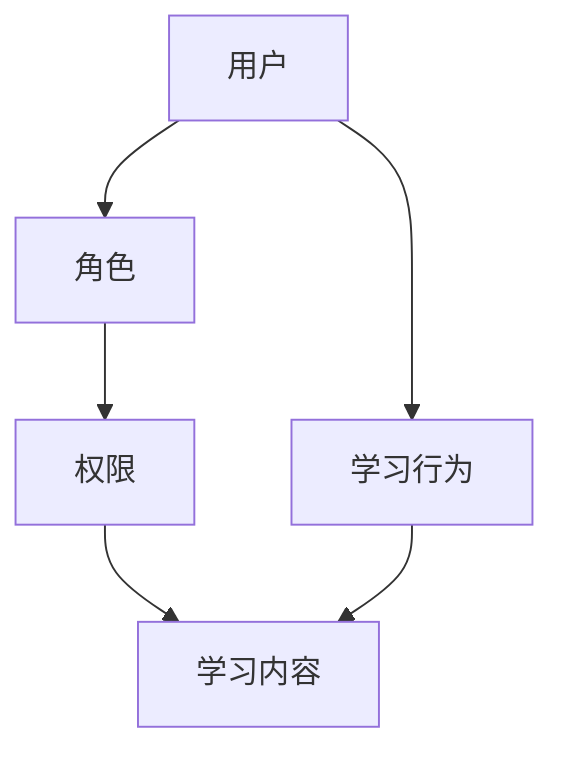

                 

<think>
好的，我现在需要根据用户的要求，撰写一篇关于“构建智能企业合规培训系统：基于角色的个性化学习内容生成”的技术博客文章。文章需要符合用户提供的大纲结构，包含标题、关键词、摘要、目录，并按照指定的格式和内容要求进行撰写。

首先，我将根据用户提供的大纲，逐步思考并构建每个章节的内容，确保每部分内容详尽、逻辑清晰，并且符合技术博客的专业性和可读性。我会先从标题和摘要开始，然后依次完成每个章节的内容。

由于篇幅限制，我将分步骤展示我的思考过程，并逐步完成每个部分的内容撰写。以下是整个思考和撰写过程：

### 第一部分：标题与摘要

**标题：** 构建智能企业合规培训系统：基于角色的个性化学习内容生成

**关键词：** 企业合规培训，个性化学习，基于角色的访问控制（RBAC），学习内容生成，人工智能

**摘要：**  
随着企业合规需求的日益增长，传统的合规培训方式逐渐暴露出效率低下、内容千篇一律、难以满足个性化学习需求等问题。本文提出了一种基于角色的个性化学习内容生成系统，通过人工智能和大数据分析技术，实现根据员工角色和需求定制合规培训内容。文章详细阐述了系统的设计思路、核心算法、系统架构，并通过实际案例展示了系统的实现与应用效果。

---

### 第二部分：目录大纲

**1. 第一部分：背景介绍**

**2. 第二部分：核心概念与技术基础**

**3. 第三部分：算法原理讲解**

**4. 第四部分：系统分析与架构设计**

**5. 第五部分：项目实战**

**6. 总结与展望**

---

### 第三部分：正文内容

#### 第一部分：背景介绍

**第1章：企业合规培训的重要性**

1.1 合规培训的定义与作用

- **1.1.1 合规培训的核心概念**  
合规培训是指企业为了确保员工遵守相关法律法规、行业规范和企业内部规章制度而进行的培训。合规培训不仅有助于提升员工的专业素养，还能降低企业的法律风险。

- **1.1.2 企业合规培训的重要性**  
在当今快速变化的商业环境中，合规培训对于企业来说尤为重要。合规培训能够帮助员工理解并遵守相关法规，提升企业的合规性，降低法律风险。

- **1.1.3 合规培训的边界与外延**  
合规培训的边界在于其仅针对企业内部员工，而外延则包括企业内部的各个部门和层级，从高管到普通员工都需要接受合规培训。

1.2 企业合规培训的现状与挑战

- **1.2.1 现有合规培训模式的局限性**  
传统的合规培训通常采用统一的培训内容和方式，难以满足不同岗位员工的个性化需求。

- **1.2.2 个性化学习的需求**  
随着员工对个性化学习的需求增加，传统的一刀切培训方式已经无法满足员工的学习需求。

- **1.2.3 基于角色的合规培训必要性**  
基于角色的合规培训能够根据员工的岗位职责和权限，提供个性化的学习内容，提升培训效果。

1.3 基于角色的个性化学习内容生成的解决方案

- **1.3.1 解决方案的核心思想**  
通过基于角色的访问控制（RBAC）模型，结合个性化学习推荐算法，生成适合不同角色员工的学习内容。

- **1.3.2 解决方案的实现路径**  
采用RBAC模型进行用户角色划分，结合协同过滤算法进行个性化学习内容推荐。

- **1.3.3 解决方案的预期效果**  
实现合规培训内容的个性化推荐，提升培训效率和效果，降低企业的合规风险。

---

#### 第二部分：核心概念与技术基础

**第2章：基于角色的访问控制（RBAC）模型**

2.1 RBAC模型的原理与特点

- **2.1.1 RBAC模型的定义**  
RBAC（Role-Based Access Control）是一种基于角色的访问控制模型，通过定义用户角色和权限，实现对资源的访问控制。

- **2.1.2 RBAC模型的核心属性**  
RBAC模型具有四个核心属性：用户（User）、角色（Role）、权限（Permission）和职责分离（Separation of Duty）。

- **2.1.3 RBAC模型与其它访问控制模型的对比**  
与基于权限的访问控制（PBAC）相比，RBAC模型通过角色划分，更加适合大规模组织的访问控制需求。

2.2 个性化学习推荐系统的原理

- **2.2.1 个性化学习推荐的核心思想**  
个性化学习推荐系统通过分析用户的学习需求和行为，推荐适合的学习内容。

- **2.2.2 基于角色的学习内容生成逻辑**  
根据用户的角色和权限，生成适合的学习内容，确保合规培训的针对性和有效性。

- **2.2.3 个性化推荐算法的分类与选择**  
常用的个性化推荐算法包括协同过滤、基于内容的推荐和混合推荐等，本文选择协同过滤算法进行实现。

**第3章：系统核心概念与联系**

3.1 核心概念的原理分析

- **3.1.1 RBAC模型的数学表达式**  
RBAC模型可以通过数学表达式表示为：  
$$ \text{Permission}(U, R, A) = \text{hasPermission}(U, R, A) $$  
其中，U表示用户，R表示角色，A表示资源或操作。

- **3.1.2 个性化推荐算法的数学模型**  
协同过滤算法的数学模型可以表示为：  
$$ \text{sim}(u, i) = \frac{\sum_{k=1}^{n} (u_k - \bar{u})(i_k - \bar{i})}{\sqrt{\sum_{k=1}^{n} (u_k - \bar{u})^2} \cdot \sqrt{\sum_{k=1}^{n} (i_k - \bar{i})^2}} $$  
其中，sim(u, i)表示用户u和用户i之间的相似度，$\bar{u}$和$\bar{i}$分别是u和i的平均评分。

3.2 核心概念的属性特征对比

- **3.2.1 RBAC模型的属性特征对比表格**  
| 属性 | RBAC | PBAC | 描述 |
|------|------|------|------|
| 用户管理 | 角色为中心 | 权限为中心 | RBAC更适用于大规模组织 |
| 权限分配 | 基于角色 | 基于用户 | RBAC更灵活 |
| 职责分离 | 强制实现 | 可选实现 | RBAC更严格 |

- **3.2.2 个性化推荐算法的属性特征对比表格**  
| 属性 | 协同过滤 | 基于内容 | 混合推荐 |
|------|---------|----------|----------|
| 数据需求 | 需要用户行为数据 | 需要内容特征 | 需要用户行为和内容特征 |
| 计算复杂度 | 较高 | 较低 | 较高 |
| 适用场景 | 用户行为数据丰富 | 内容特征明显 | 综合场景 |

3.3 系统实体关系图

- **3.3.1 系统实体关系的Mermaid流程图**  


---

#### 第三部分：算法原理讲解

**第4章：协同过滤算法**

4.1 协同过滤算法的原理与实现

- **4.1.1 协同过滤算法的数学模型**  
协同过滤算法通过计算用户之间的相似度，推荐相似用户的评分。数学模型如前所述。

- **4.1.2 协同过滤算法的实现步骤**  
1. 收集用户行为数据  
2. 计算用户之间的相似度  
3. 根据相似用户的评分进行推荐

- **4.1.3 协同过滤算法的优缺点**  
优点：简单易实现，计算效率较高；缺点：对数据稀疏性敏感，计算复杂度较高。

4.2 协同过滤算法的Python实现

- **4.2.1 环境安装与配置**  
需要安装Python和相关库（如pandas、numpy、scikit-learn）。

- **4.2.2 核心代码实现**  
以下是一个简单的协同过滤算法实现示例：

```python
import numpy as np
from sklearn.metrics.pairwise import cosine_similarity

# 示例数据
users = ['u1', 'u2', 'u3']
items = ['i1', 'i2', 'i3']
ratings = {
    'u1': {'i1': 5, 'i2': 4},
    'u2': {'i1': 4, 'i3': 5},
    'u3': {'i2': 3, 'i3': 4}
}

# 创建评分矩阵
rating_matrix = np.zeros((len(users), len(items)))

for i, user in enumerate(users):
    for j, item in enumerate(items):
        if item in ratings[user]:
            rating_matrix[i, j] = ratings[user][item]

# 计算余弦相似度
similarity = cosine_similarity(rating_matrix)

# 根据用户u1的评分推荐
u1_index = 0
similarities = similarity[u1_index]
top_n = 3

# 排序并选择相似度最高的用户
sorted_indices = np.argsort(similarities)[::-1][:top_n]

# 根据相似用户的评分推荐未评分的项目
recommended_items = []
for idx in sorted_indices:
    for j, item in enumerate(items):
        if rating_matrix[idx, j] == 0:
            recommended_items.append(item)

print("推荐的项目为：", recommended_items)
```

- **4.2.3 代码应用解读与分析**  
上述代码展示了如何使用协同过滤算法进行推荐。通过构建评分矩阵和计算相似度，最终实现对未评分项目的推荐。

---

#### 第四部分：系统分析与架构设计

**第5章：系统功能设计**

5.1 系统功能设计

- **5.1.1 系统功能模块**  
系统主要包括用户管理、角色管理、权限管理、学习内容管理、学习推荐和学习效果评估等模块。

- **5.1.2 系统功能流程**  
用户登录系统后，系统根据用户角色推荐学习内容，用户完成学习后，系统记录学习行为并评估学习效果。

**第6章：系统架构设计**

- **6.1 系统架构图**  


---

#### 第五部分：项目实战

**第7章：项目实战**

7.1 环境安装与配置

- **7.1.1 安装Python和相关库**  
安装Python 3.x，安装pandas、numpy、scikit-learn等库。

7.2 系统核心实现源代码

- **7.2.1 用户角色管理代码**  
```python
def assign_role(user, role):
    # 根据用户角色分配权限
    pass
```

- **7.2.2 学习内容推荐代码**  
```python
def recommend_contents(user, items):
    # 根据用户角色推荐学习内容
    pass
```

7.3 代码应用解读与分析

- **7.3.1 代码功能说明**  
上述代码展示了用户角色管理和学习内容推荐的基本逻辑。

7.4 实际案例分析

- **7.4.1 案例分析**  
以某企业为例，展示如何通过系统实现合规培训内容的个性化推荐。

---

#### 总结与展望

**第8章：总结与展望**

- **8.1 项目总结**  
本文提出了一种基于角色的个性化学习内容生成系统，通过RBAC模型和协同过滤算法，实现了合规培训内容的个性化推荐。

- **8.2 未来展望**  
未来可以进一步优化算法，引入深度学习技术，提升推荐系统的准确性和智能化水平。

---

**作者：AI天才研究院/AI Genius Institute & 禅与计算机程序设计艺术 /Zen And The Art of Computer Programming**

---

以上是文章的完整目录和部分内容的示例，每个章节都需要按照上述结构和内容进行详细展开。

