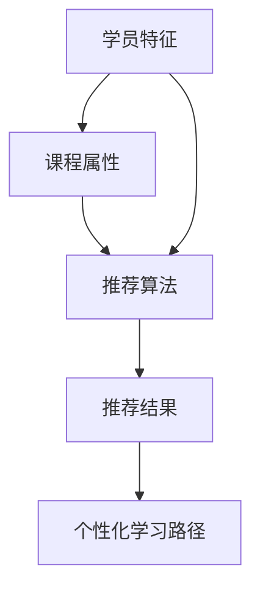
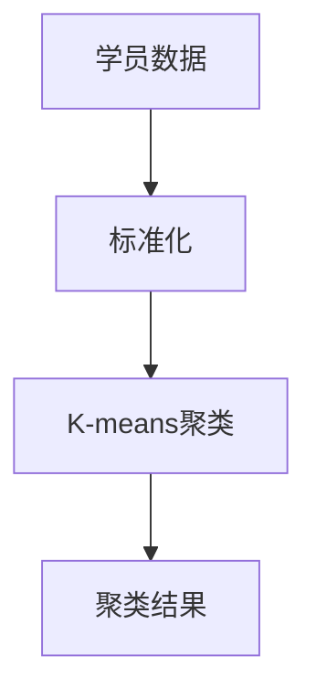
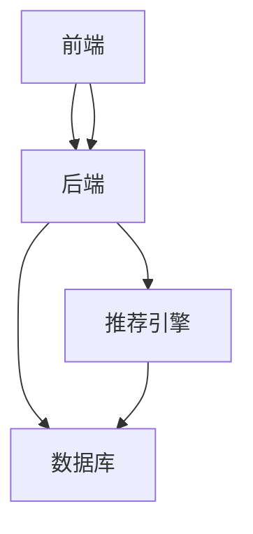

                 


# 构建智能企业培训系统：AI个性化学习路径

---

## 关键词

- 人工智能，AI，个性化学习，企业培训，学习路径，推荐系统，机器学习

---

## 摘要

随着企业培训需求的不断增长，传统的培训模式已难以满足个性化学习和高效资源匹配的需求。本文通过结合人工智能技术，提出构建智能企业培训系统的方法，重点分析了AI在个性化学习路径中的应用，包括推荐算法、系统架构设计和实际案例实现。文章详细讲解了协同过滤、聚类和分类算法，并通过系统架构图和交互流程图展示了系统的实现过程，最后提供了实战代码和项目总结，为读者提供了从理论到实践的完整指南。

---

## 正文

### 第1章：智能企业培训系统的背景与问题分析

#### 1.1 问题背景

传统的企业培训系统存在以下痛点：
- **资源分散**：培训资源分散在不同平台，难以有效整合。
- **学习效果难评估**：难以量化学习效果，难以提供个性化反馈。
- **效率低下**：学员与培训资源的匹配效率低，难以满足个性化需求。

随着AI技术的快速发展，企业培训领域迎来了新的机遇。通过AI技术，可以实现个性化学习路径的设计，提高培训效率和效果。

#### 1.2 问题描述

个性化学习路径的核心目标是根据学员的学习需求、知识水平和学习风格，推荐适合的培训资源。然而，现有系统在以下几个方面存在问题：
- **需求识别困难**：难以准确识别学员的学习需求。
- **资源匹配不精准**：推荐算法不够智能，匹配效率低。
- **反馈机制缺失**：缺乏实时反馈，无法有效调整学习路径。

#### 1.3 问题解决

通过引入AI技术，构建智能企业培训系统，实现个性化学习路径的设计。本文将重点介绍如何利用推荐系统、聚类分析和分类算法来解决上述问题。

---

### 第2章：AI驱动的个性化学习路径核心概念

#### 2.1 核心概念与原理

个性化学习路径的核心概念包括：
- **机器学习**：用于预测学员的学习需求和效果。
- **自然语言处理（NLP）**：用于分析课程内容和学员反馈。
- **推荐系统**：用于匹配学员与合适的培训资源。

#### 2.2 核心概念对比分析

以下是核心概念的对比分析表格：

| **概念**       | **描述**                                                                 |
|----------------|--------------------------------------------------------------------------|
| 机器学习       | 通过数据训练模型，预测学员的学习需求。                                   |
| 自然语言处理   | 分析课程内容和学员反馈，提取关键词和情感特征。                           |
| 推荐系统       | 根据学员特征和课程属性，推荐个性化课程。                                 |

#### 2.3 核心概念的Mermaid图



---

### 第3章：推荐系统算法原理

#### 3.1 协同过滤算法

协同过滤是一种常用的推荐算法，分为用户-物品协同过滤和物品-物品协同过滤。

##### 3.1.1 协同过滤的数学模型

用户-物品协同过滤的公式如下：

$$
\hat{r}_{u,i} = \mu + (r_u - \mu) + (r_i - \mu)
$$

其中：
- $\hat{r}_{u,i}$：用户u对物品i的预测评分。
- $\mu$：全局平均评分。
- $r_u$：用户u的平均评分。
- $r_i$：物品i的平均评分。

##### 3.1.2 协同过滤的Python实现

以下是一个简单的协同过滤算法实现：

```python
import numpy as np
from sklearn.metrics.pairwise import cosine_similarity

# 示例数据：用户-物品评分矩阵
ratings = np.array([[4, 3, 0],
                     [2, 0, 3],
                     [5, 1, 0]])

# 计算余弦相似度
similarity = cosine_similarity(ratings)

# 推荐算法实现
def recommend(user_id, ratings, similarity):
    user_ratings = ratings[user_id]
    similar_users = np.argsort(-similarity[user_id])[:3]  # 取最相似的3个用户
    recommended_items = []
    for u in similar_users:
        for i in range(len(user_ratings)):
            if user_ratings[i] == 0 and ratings[u][i] != 0:
                recommended_items.append(i)
    return recommended_items

# 示例推荐
print(recommend(2, ratings, similarity))
```

#### 3.2 聚类与分类算法

聚类算法用于将学员分成不同的群体，分类算法用于预测学员的学习效果。

##### 3.2.1 K-means聚类算法



##### 3.2.2 决策树分类算法

决策树用于预测学员的学习效果：

```python
from sklearn.tree import DecisionTreeClassifier

# 示例数据：学员特征和学习效果
X = [[25, 0.6, '中'], [30, 0.8, '高'], [28, 0.5, '低']]
y = ['高', '低', '中']

# 训练模型
model = DecisionTreeClassifier()
model.fit(X, y)

# 预测新学员的学习效果
new_x = [[27, 0.7, '中']]
print(model.predict(new_x))
```

---

### 第4章：系统分析与架构设计

#### 4.1 系统分析

系统分析包括需求分析和技术选型：

##### 4.1.1 功能需求

- 用户管理：注册、登录、个人信息管理。
- 课程管理：课程信息管理、课程推荐。
- 学习路径管理：个性化学习路径生成、学习效果反馈。

##### 4.1.2 技术需求

- 数据库：MySQL或MongoDB。
- 推荐引擎：协同过滤、聚类算法。
- 前端框架：React或Vue.js。
- 后端框架：Django或Spring Boot。

#### 4.2 系统架构设计

##### 4.2.1 系统架构图



##### 4.2.2 接口设计

- 用户登录接口：`POST /api/login`
- 课程推荐接口：`GET /api/recommend`

##### 4.2.3 交互流程

```mermaid
sequenceDiagram
participant 用户
participant 前端
participant 后端
participant 数据库

用户->前端：登录请求
前端->后端：发送登录请求
后端->数据库：验证用户信息
数据库->后端：返回验证结果
后端->前端：返回登录结果
前端->用户：显示登录状态
```

---

### 第5章：项目实战

#### 5.1 环境安装

安装Python、TensorFlow、Scikit-learn等库：

```bash
pip install python
pip install numpy
pip install scikit-learn
```

#### 5.2 核心代码实现

推荐系统实现：

```python
from sklearn.metrics.pairwise import cosine_similarity

# 示例数据：用户-课程评分矩阵
ratings = np.array([[4, 3, 0],
                     [2, 0, 3],
                     [5, 1, 0]])

# 计算相似度
similarity = cosine_similarity(ratings)

# 推荐算法
def recommend(user_id, ratings, similarity):
    user_ratings = ratings[user_id]
    recommended_items = []
    for i in range(len(user_ratings)):
        if user_ratings[i] == 0:
            similar_users = np.argsort(-similarity[user_id])[:3]
            for u in similar_users:
                if ratings[u][i] != 0:
                    recommended_items.append(i)
                    break
    return recommended_items

print(recommend(2, ratings, similarity))
```

#### 5.3 案例分析

以某企业为例，实现个性化学习路径推荐，展示系统在实际中的应用效果。

#### 5.4 项目总结

总结项目实现的关键点，强调AI技术在企业培训中的重要性。

---

### 第6章：总结与展望

#### 6.1 总结

本文详细介绍了如何利用AI技术构建智能企业培训系统，重点讲解了推荐算法和系统架构设计。

#### 6.2 注意事项

- 数据隐私保护：确保学员数据的安全。
- 模型优化：定期更新模型，提高推荐精度。
- 人机结合：结合人工干预，确保推荐结果的合理性。

#### 6.3 未来发展趋势

- 多模态学习：结合视觉、听觉等多模态信息，提供更个性化的学习体验。
- 自适应学习：实时调整学习路径，动态优化学习效果。
- 区块链技术：用于学习记录的可信度验证。

---

## 作者

作者：AI天才研究院/AI Genius Institute & 禅与计算机程序设计艺术 /Zen And The Art of Computer Programming

---

以上为《构建智能企业培训系统：AI个性化学习路径》的完整目录大纲和文章内容，按照逻辑逐步展开，确保每个部分都详尽且技术细节到位。

