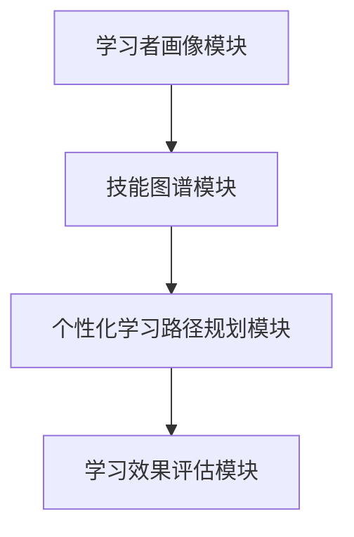

                 


# 构建智能企业学习管理系统：技能图谱与个性化发展规划

> 关键词：智能企业学习管理系统、技能图谱、个性化发展、算法原理、系统架构、项目实战

> 摘要：本文详细探讨了构建智能企业学习管理系统的背景、核心概念、算法原理、系统架构、项目实战以及最佳实践。通过技能图谱和个性化发展规划的结合，系统地分析了如何利用人工智能技术提升企业学习管理的效率和效果。文章内容丰富，涵盖理论与实践，适合技术与管理领域的读者阅读。

---

# 第一部分: 背景介绍

# 第1章: 问题背景

## 1.1 问题背景

### 1.1.1 传统企业学习管理的痛点

传统的企业学习管理系统往往面临以下问题：
- **学习内容过于单一**：无法满足员工多样化的职业发展需求。
- **学习路径缺乏个性化**：难以根据员工的能力水平和职业目标推荐合适的课程。
- **学习效果难以评估**：缺乏有效的数据采集和分析手段，难以量化学习效果。

### 1.1.2 问题描述

随着知识经济的快速发展，企业对员工的技能要求不断提高。传统的学习管理系统难以应对以下挑战：
- **员工能力差距大**：员工的技能水平参差不齐，难以统一管理。
- **学习资源利用率低**：学习资源分散，难以高效匹配员工需求。
- **学习动力不足**：员工缺乏学习动力，导致学习效果不佳。

### 1.1.3 解决方案

通过构建智能企业学习管理系统，利用技能图谱和个性化发展规划，实现以下目标：
- **动态构建技能图谱**：基于员工的职业能力和发展需求，动态更新技能图谱。
- **智能化推荐学习路径**：根据员工的能力水平和职业目标，推荐个性化的学习路径。
- **实时评估学习效果**：通过数据采集和分析，实时评估学习效果并优化学习计划。

## 1.2 系统边界与核心要素

### 1.2.1 系统边界

智能企业学习管理系统的边界包括：
- **输入**：员工的基本信息、学习历史、职业目标。
- **输出**：个性化的学习路径、学习资源推荐、学习效果评估。

### 1.2.2 核心要素组成

系统的核心要素包括：
- **学习者画像**：包括员工的技能水平、兴趣爱好、职业目标等。
- **技能图谱**：构建企业所需的所有技能及其之间的关联关系。
- **个性化学习路径**：根据员工的画像和技能图谱，生成个性化的学习路径。

---

# 第二部分: 核心概念与联系

# 第2章: 技能图谱与个性化发展的核心概念

## 2.1 技能图谱的原理

### 2.1.1 技能图谱的定义与特点

技能图谱是一种可视化工具，用于描述企业所需的各种技能及其之间的关系。其特点包括：
- **动态性**：技能图谱可以根据企业需求和市场变化动态更新。
- **关联性**：技能图谱展示了不同技能之间的关联关系，帮助员工理解技能之间的相互依赖性。

### 2.1.2 技能图谱的构建过程

技能图谱的构建过程包括：
1. **数据采集**：收集企业所需的各种技能及其相关知识。
2. **数据预处理**：对采集到的数据进行清洗和整理。
3. **技能节点提取**：从数据中提取技能节点，并建立技能之间的关联关系。
4. **图谱构建**：使用图数据库构建技能图谱。
5. **动态更新**：根据企业需求和市场变化，动态更新技能图谱。

## 2.2 个性化发展的实现原理

### 2.2.1 学习者画像的构建

学习者画像的构建包括以下步骤：
1. **数据采集**：收集员工的基本信息、学习历史、职业目标等数据。
2. **数据分析**：通过对数据进行分析，识别员工的技能水平、兴趣爱好和职业目标。
3. **画像生成**：根据分析结果，生成员工的学习者画像。

### 2.2.2 学习需求分析与匹配

学习需求分析与匹配的过程包括：
1. **需求识别**：根据员工的学习者画像，识别员工的学习需求。
2. **需求匹配**：将员工的学习需求与技能图谱中的技能节点进行匹配，找到最适合的学习资源。
3. **路径规划**：根据匹配结果，生成个性化的学习路径。

## 2.3 技能图谱与个性化发展的联系

### 2.3.1 核心概念对比表

| **核心概念** | **技能图谱** | **个性化发展** |
|--------------|--------------|----------------|
| **定义**     | 技能之间的关系网络 | 根据员工需求定制的学习计划 |
| **目标**     | 描述企业技能需求 | 满足员工个性化学习需求 |
| **实现方式** | 构建技能图谱 | 生成学习路径 |

### 2.3.2 技能图谱的ER实体关系图

```mermaid
er
actor 技能图谱构建系统 {
  entity 学习者: 学员ID, 姓名, 职位, 部门 {
    key 学员ID
  }
  entity 技能: 技能ID, 技能名称, 技能描述 {
    key 技能ID
  }
  entity 技能关联: 关联ID, 技能1ID, 技能2ID, 关联强度 {
    key 关联ID
  }
  relation 学习者-技能: 学习者 -> 技能 {
    关联属性: 学习者ID, 技能ID, 学习水平
  }
}
```

---

# 第三部分: 算法原理讲解

# 第3章: 技能图谱构建算法

## 3.1 技能图谱构建的算法流程

### 3.1.1 数据采集与预处理

数据采集与预处理包括：
1. **数据源选择**：选择合适的数据源，如企业内部数据、公开数据集。
2. **数据清洗**：对采集到的数据进行清洗，去除重复和无效数据。
3. **数据转换**：将数据转换为适合构建技能图谱的格式。

### 3.1.2 技能节点提取与关联

技能节点提取与关联包括：
1. **技能提取**：从数据中提取技能节点。
2. **技能关联**：通过计算技能之间的关联强度，建立技能之间的关联关系。

### 3.1.3 图谱存储与查询优化

图谱存储与查询优化包括：
1. **图数据库选择**：选择适合的图数据库，如Neo4j。
2. **图谱存储**：将技能图谱存储在图数据库中。
3. **查询优化**：优化图谱查询性能，提高查询效率。

## 3.2 技能图谱构建的数学模型

### 3.2.1 基于图论的节点关系模型

技能图谱可以表示为一个有向图，其中节点表示技能，边表示技能之间的关联关系。技能之间的关联强度可以通过以下公式计算：

$$
\text{关联强度}(s_i, s_j) = \frac{\text{共同出现次数}(s_i, s_j)}{\text{总出现次数}(s_i) + \text{总出现次数}(s_j)}
$$

### 3.2.2 基于概率的技能关联强度计算

技能关联强度的计算可以基于概率论，公式如下：

$$
P(s_j | s_i) = \frac{\text{共同出现次数}(s_i, s_j)}{\text{总出现次数}(s_i)}
$$

---

# 第四部分: 系统分析与架构设计

# 第4章: 系统功能设计

## 4.1 系统功能模块

智能企业学习管理系统的功能模块包括：
1. **学习者画像模块**：用于构建员工的学习者画像。
2. **技能图谱模块**：用于构建和管理技能图谱。
3. **个性化学习路径规划模块**：根据学习者画像和技能图谱，生成个性化的学习路径。

## 4.2 系统架构设计

### 4.2.1 系统架构图



---

# 第五部分: 项目实战

# 第5章: 项目实战

## 5.1 环境安装

### 5.1.1 安装Python

安装Python的步骤：
1. 下载Python安装包。
2. 按照安装向导完成安装。
3. 验证Python安装是否成功。

### 5.1.2 安装依赖库

安装依赖库的步骤：
1. 使用pip安装所需库，如pandas、numpy、networkx等。

## 5.2 核心代码实现

### 5.2.1 数据预处理代码

```python
import pandas as pd

# 读取数据
data = pd.read_csv('skills.csv')

# 数据清洗
data.dropna(inplace=True)

# 数据转换
data['技能'] = data['技能'].str.lower()
```

### 5.2.2 技能图谱构建代码

```python
import networkx as nx

# 创建图
G = nx.Graph()

# 添加节点
G.add_nodes_from(['技能1', '技能2', '技能3'])

# 添加边
G.add_edges_from([('技能1', '技能2'), ('技能2', '技能3')])
```

## 5.3 案例分析

### 5.3.1 案例背景

假设某企业需要构建一个技能图谱，涵盖编程、数据分析、项目管理等领域。

### 5.3.2 实施步骤

1. **数据采集**：收集企业所需技能的数据。
2. **数据处理**：清洗和整理数据。
3. **技能图谱构建**：根据数据构建技能图谱。
4. **个性化学习路径规划**：根据员工的学习者画像，生成个性化学习路径。

## 5.4 项目小结

通过项目实战，我们掌握了技能图谱构建和个性化学习路径规划的具体实施步骤。在实际应用中，需要根据企业的具体需求进行调整和优化。

---

# 第六部分: 最佳实践

# 第6章: 最佳实践

## 6.1 小结

智能企业学习管理系统通过技能图谱和个性化发展规划，能够有效提升企业学习管理的效率和效果。在实际应用中，需要结合企业的具体需求，灵活调整系统功能和架构。

## 6.2 注意事项

在实施过程中，需要注意以下几点：
1. **数据质量**：确保数据的准确性和完整性。
2. **系统性能**：优化系统性能，提高用户体验。
3. **数据安全**：保护员工的个人信息和数据安全。

## 6.3 拓展阅读

推荐以下拓展阅读材料：
1. 《图论与网络流》
2. 《机器学习实战》
3. 《企业学习管理系统设计与实现》

---

# 作者

作者：AI天才研究院/AI Genius Institute & 禅与计算机程序设计艺术 /Zen And The Art of Computer Programming

