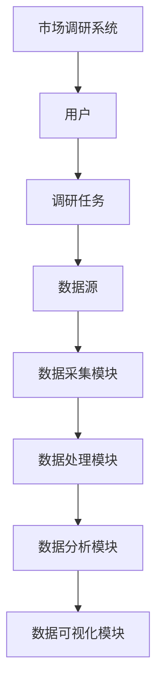
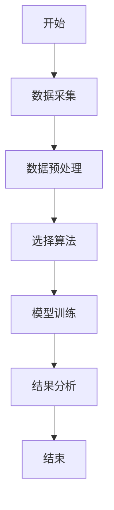
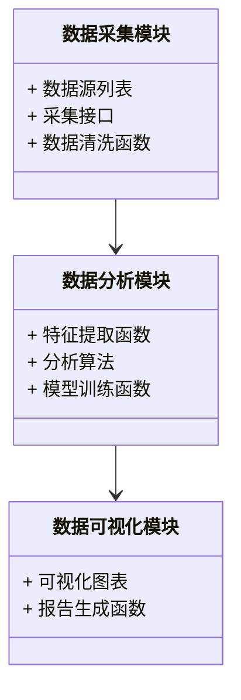
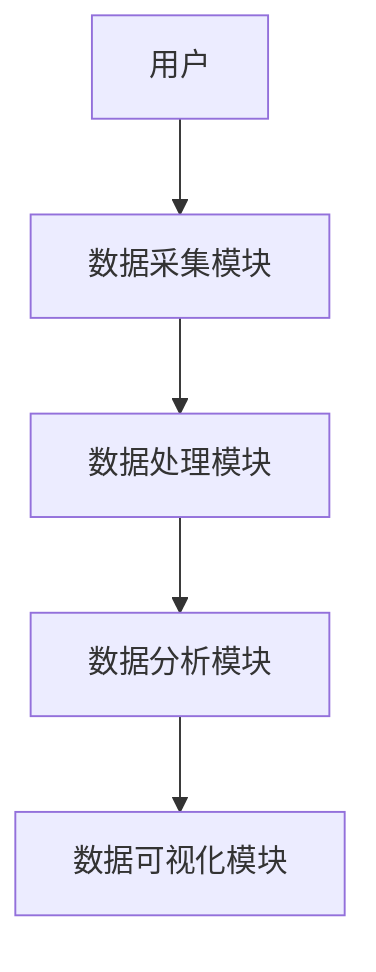

                 


# 构建智能企业市场调研系统：AI辅助数据分析

## 关键词
智能企业、市场调研、AI辅助、数据分析、机器学习、自然语言处理、系统架构

## 摘要
在当今数据驱动的商业环境中，企业面临着海量市场数据的挑战。传统的市场调研方法效率低下，难以满足企业快速决策的需求。本文将介绍如何利用人工智能技术构建智能企业市场调研系统，实现数据的自动化采集、清洗、分析和可视化。通过结合机器学习和自然语言处理技术，该系统能够高效地处理复杂数据，并提供深度洞察，帮助企业在竞争激烈的市场中占据优势。

---

# 第一部分：智能企业市场调研系统背景与核心概念

## 第1章：智能企业市场调研系统概述

### 1.1 问题背景与目标
#### 1.1.1 问题背景
传统的市场调研依赖人工数据采集和分析，效率低、成本高且容易出错。企业需要快速响应市场变化，但传统方法难以满足时效性要求。

#### 1.1.2 系统目标
构建一个基于AI的市场调研系统，实现数据的自动化采集、清洗、分析和可视化，帮助企业在复杂市场环境中快速获取洞察。

#### 1.1.3 解决方案
通过整合机器学习、自然语言处理和大数据分析技术，构建一个智能化的市场调研系统，提升数据处理效率和准确性。

### 1.2 问题描述与解决路径
#### 1.2.1 数据采集与处理的挑战
数据来源多样、格式复杂，传统方法难以高效处理。

#### 1.2.2 数据分析的复杂性
市场数据包含大量非结构化数据，人工分析耗时且容易出错。

#### 1.2.3 AI技术的应用优势
利用AI技术实现自动化数据处理和深度分析，提高效率和准确性。

### 1.3 系统边界与外延
#### 1.3.1 系统功能边界
系统仅负责数据采集、清洗、分析和可视化，不涉及业务决策。

#### 1.3.2 系统与外部系统的交互
与企业内部的CRM、ERP等系统集成，获取更多数据源。

#### 1.3.3 系统的可扩展性
支持多种数据源接入，算法模型可动态更新。

### 1.4 核心概念与组成要素
#### 1.4.1 核心概念
- 数据采集：从多种来源获取市场数据。
- 数据清洗：去除噪声数据，提高数据质量。
- 数据分析：利用AI技术进行深度分析。
- 数据可视化：以直观的方式展示分析结果。

#### 1.4.2 组成要素
- 数据采集模块：负责从多种数据源获取数据。
- 数据处理模块：对数据进行清洗和预处理。
- 数据分析模块：利用机器学习和NLP技术进行分析。
- 数据可视化模块：将分析结果以图表形式展示。

## 第2章：核心概念与联系

### 2.1 核心概念原理
#### 2.1.1 数据采集与预处理
数据采集是市场调研的第一步，需要从问卷调查、社交媒体、行业报告等多种来源获取数据。预处理阶段包括数据清洗、格式转换和特征提取。

#### 2.1.2 机器学习与NLP
机器学习用于模式识别和预测，NLP用于分析文本数据，提取关键词和情感倾向。

#### 2.1.3 数据分析与可视化
数据分析模块利用统计方法和机器学习算法对数据进行建模，数据可视化模块将分析结果以图表形式展示。

### 2.2 核心概念对比分析
#### 2.2.1 数据采集方式对比
- 手动采集：效率低，成本高。
- 自动化采集：速度快，成本低，适合大规模数据。

#### 2.2.2 数据分析方法对比
- 传统统计分析：适用于简单数据分析。
- 机器学习：适用于复杂模式识别。

#### 2.2.3 不同AI模型的性能对比
- 线性回归：适合线性关系，但无法处理复杂数据。
- 随机森林：适合非线性关系，准确率高。
- LSTM：适合文本序列分析。

### 2.3 ER实体关系图


---

# 第二部分：算法原理与数学模型

## 第3章：算法原理与流程

### 3.1 算法原理
#### 3.1.1 机器学习算法在市场调研中的应用
- 线性回归：预测市场趋势。
- 随机森林：分类市场客户。
- LSTM：分析时间序列数据。

#### 3.1.2 自然语言处理技术的实现流程
- 分词：将文本分割成词语或短语。
- 词干提取：提取词语的根形式。
- 情感分析：判断文本情感倾向。

#### 3.1.3 数据分析算法的选择与优化
- 算法选择：根据数据类型和任务选择合适的算法。
- 超参数优化：通过网格搜索或随机搜索优化模型性能。

### 3.2 算法流程图


### 3.3 算法实现代码
```python
import pandas as pd
from sklearn.ensemble import RandomForestClassifier
from sklearn.metrics import accuracy_score

# 数据加载
data = pd.read_csv('market_data.csv')

# 特征提取
X = data.drop('label', axis=1)
y = data['label']

# 模型训练
model = RandomForestClassifier()
model.fit(X, y)

# 模型预测
y_pred = model.predict(X)

# 结果评估
print(accuracy_score(y, y_pred))
```

---

## 第4章：系统分析与架构设计

### 4.1 问题场景介绍
系统需要支持多种数据源接入，能够处理结构化和非结构化数据，提供实时分析和可视化功能。

### 4.2 系统功能设计
#### 4.2.1 领域模型


### 4.3 系统架构设计
#### 4.3.1 分层架构


### 4.4 接口设计
- 数据采集接口：接收外部数据源传入的数据。
- 数据分析接口：提供API供其他系统调用分析结果。
- 数据可视化接口：生成图表并返回可视化结果。

---

## 第5章：项目实战

### 5.1 环境安装
- Python 3.8+
- Jupyter Notebook
- Scikit-learn、NLTK、Matplotlib

### 5.2 核心代码实现
```python
import matplotlib.pyplot as plt
from sklearn.metrics import confusion_matrix
import seaborn as sns

# 混淆矩阵可视化
def visualize_confusion_matrix(y_true, y_pred):
    cm = confusion_matrix(y_true, y_pred)
    sns.heatmap(cm, annot=True, fmt='d')
    plt.xlabel('预测值')
    plt.ylabel('真实值')
    plt.show()

# 示例数据
y_true = [0, 1, 0, 1, 0, 1]
y_pred = [0, 1, 1, 1, 0, 1]

# 可视化
visualize_confusion_matrix(y_true, y_pred)
```

### 5.3 案例分析
通过实际案例分析，展示系统在市场趋势预测、客户分群等方面的应用。

### 5.4 项目小结
总结项目实现过程中的经验教训，提出改进建议。

---

## 第6章：最佳实践与注意事项

### 6.1 小结
- 系统架构设计要灵活，支持扩展。
- 数据清洗和预处理是关键步骤，直接影响分析结果。
- 选择合适的算法和模型，优化超参数。

### 6.2 注意事项
- 数据隐私保护：确保数据安全。
- 系统性能优化：提升数据处理速度。
- 模型可解释性：确保分析结果易于理解。

### 6.3 拓展阅读
- 《Python机器学习实战》
- 《自然语言处理入门》
- 《系统架构设计方法论》

---

# 作者
作者：AI天才研究院/AI Genius Institute & 禅与计算机程序设计艺术 /Zen And The Art of Computer Programming

---

以上是文章的完整目录大纲和部分内容，涵盖了从背景介绍到系统实现的全过程，确保读者能够系统地理解如何构建智能企业市场调研系统。

