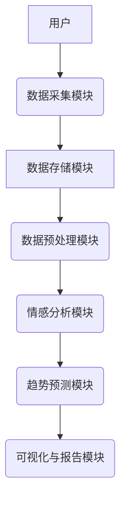

                 


# 构建智能企业市场调研系统：社交媒体情感分析与趋势预测

> 关键词：智能市场调研系统、社交媒体情感分析、趋势预测、深度学习、自然语言处理、数据挖掘

> 摘要：随着社交媒体的普及，企业可以通过分析用户在社交媒体上的评论和反馈，实时掌握市场动态和消费者情感。本文将详细介绍如何构建一个基于社交媒体情感分析的企业市场调研系统，包括情感分析的核心算法、系统架构设计、项目实战案例以及最佳实践。通过本文，读者将能够掌握如何利用情感分析技术预测市场趋势，为企业决策提供数据支持。

---

## 第1章：企业市场调研的背景与挑战

### 1.1 问题背景

在现代商业环境中，企业面临着越来越复杂的市场动态。消费者的行为和偏好不断变化，传统的市场调研方法（如问卷调查、焦点小组等）往往存在耗时长、成本高且难以捕捉实时动态的问题。社交媒体的兴起为企业提供了一个全新的数据来源，用户在社交媒体上的评论、点赞、分享等行为蕴含着丰富的市场信息。然而，如何高效地从海量社交媒体数据中提取有价值的信息，成为一个亟待解决的挑战。

### 1.2 问题描述

社交媒体数据具有以下特点：
- 数据量大：每天产生的社交媒体数据以PB级计。
- 数据多样性：包括文本、图片、视频等多种形式。
- 数据实时性：社交媒体数据更新速度快，需要实时处理。
- 数据噪音多：数据中包含大量无关信息和情感噪音。

如何从这些数据中提取情感信息，并利用这些信息预测市场趋势，是构建智能市场调研系统的核心问题。

### 1.3 问题解决

通过构建一个基于社交媒体情感分析的市场调研系统，企业可以实时监控市场动态，了解消费者情感变化，预测市场趋势。该系统可以通过以下步骤实现：
1. 数据采集：从社交媒体平台（如微博、Twitter、Facebook等）获取相关数据。
2. 数据预处理：清洗数据，提取有用的信息。
3. 情感分析：对文本数据进行情感分类（如正面、负面、中性）。
4. 趋势预测：基于情感数据和历史数据，预测未来市场趋势。
5. 可视化与报告：将分析结果以可视化形式呈现，生成报告。

---

## 第2章：情感分析的核心概念与算法原理

### 2.1 情感分析的定义与目标

情感分析（Sentiment Analysis），也称为意见挖掘，是指对文本数据进行分析，判断其中的情感倾向（如正面、负面、中性）。其目标是帮助企业了解消费者对产品、品牌或服务的情感态度，从而为市场决策提供支持。

### 2.2 情感分析的核心算法

情感分析的实现依赖于多种算法，以下是几种常用的算法及其原理：

#### 2.2.1 朴素贝叶斯（Naive Bayes）

- **原理**：基于概率论，计算每个情感类别下各个词的条件概率，最终根据最大后验概率原则进行分类。
- **优点**：简单高效，适合小规模数据。
- **缺点**：假设特征之间相互独立，实际场景中可能不成立。

#### 2.2.2 支持向量机（SVM）

- **原理**：将数据映射到高维空间，找到一个超平面将不同类别的数据分开。
- **优点**：适合高维数据，分类能力强。
- **缺点**：需要参数调优，计算复杂度较高。

#### 2.2.3 深度学习模型（如LSTM、BERT）

- **原理**：利用神经网络模型（如循环神经网络LSTM或预训练语言模型BERT）对文本进行建模，捕捉上下文关系。
- **优点**：能够处理长文本，捕捉复杂的情感信息。
- **缺点**：计算资源消耗大，需要大量数据训练。

### 2.3 情感分析的实现流程

以下是情感分析的典型流程：

1. **数据预处理**：
   - 文本清洗：去除特殊字符、停用词等。
   - 分词：将文本分割成词语或短语。
   - 词向量化：将文本转化为数值形式（如词袋模型、TF-IDF、词嵌入）。

2. **模型训练**：
   - 选择合适的算法，构建分类模型。
   - 使用训练数据对模型进行训练，调整参数。

3. **模型评估**：
   - 使用测试数据对模型进行验证。
   - 计算准确率、召回率、F1值等指标。

4. **结果分析**：
   - 对情感分类结果进行分析，提取关键情感信息。

---

## 第3章：趋势预测的实现与应用

### 3.1 趋势预测的定义与目标

趋势预测是指基于历史数据和当前数据，预测未来市场趋势。在智能市场调研系统中，趋势预测的目标是利用情感分析结果和其他市场数据，预测消费者行为、产品热度、市场走向等。

### 3.2 趋势预测的核心算法

趋势预测的实现依赖于时间序列分析和机器学习算法。以下是几种常用的算法：

#### 3.2.1 时间序列分析（ARIMA）

- **原理**：基于历史数据的自相关性，预测未来值。
- **优点**：适合处理平稳时间序列数据。
- **缺点**：对非平稳数据处理能力有限。

#### 3.2.2 长短期记忆网络（LSTM）

- **原理**：利用长短期记忆单元捕捉时间序列中的长期依赖关系。
- **优点**：适合处理非平稳数据，捕捉复杂的时间依赖关系。
- **缺点**：模型复杂，计算资源消耗较大。

#### 3.2.3 线性回归

- **原理**：基于最小二乘法，建立线性回归模型。
- **优点**：简单易懂，计算高效。
- **缺点**：只能处理线性关系，对非线性趋势预测能力有限。

### 3.3 趋势预测的实现流程

1. **数据预处理**：
   - 收集历史市场数据和情感分析数据。
   - 对数据进行清洗、归一化处理。

2. **特征提取**：
   - 提取情感分析结果中的特征（如情感强度、情感类别）。
   - 提取其他相关特征（如时间特征、用户特征）。

3. **模型训练**：
   - 选择合适的算法，构建预测模型。
   - 使用训练数据对模型进行训练，调整参数。

4. **模型评估**：
   - 使用测试数据对模型进行验证。
   - 计算预测误差，评估模型性能。

5. **结果分析**：
   - 对预测结果进行分析，提取趋势信息。
   - 生成可视化报告，辅助企业决策。

---

## 第4章：系统架构设计与实现

### 4.1 系统功能设计

智能市场调研系统的功能模块包括：
- 数据采集模块：从社交媒体平台获取数据。
- 数据预处理模块：清洗和转换数据。
- 情感分析模块：对文本数据进行情感分类。
- 趋势预测模块：基于情感数据预测市场趋势。
- 可视化与报告模块：生成可视化报告和分析结果。

### 4.2 系统架构设计

以下是系统的总体架构图：



### 4.3 接口设计与交互流程

以下是系统的接口设计：

1. **数据采集接口**：
   - 输入：目标品牌或产品关键词。
   - 输出：社交媒体数据（如评论、点赞、分享）。

2. **情感分析接口**：
   - 输入：文本数据。
   - 输出：情感分类结果（如正面、负面、中性）。

3. **趋势预测接口**：
   - 输入：情感数据和历史数据。
   - 输出：市场趋势预测结果。

---

## 第5章：项目实战与代码实现

### 5.1 环境安装与配置

#### 5.1.1 安装Python环境

```bash
python --version
pip install numpy
pip install pandas
pip install scikit-learn
pip install transformers
pip install matplotlib
```

### 5.2 数据采集与预处理

#### 5.2.1 数据采集代码

```python
import tweepy
from tweepy import OAuthHandler

# 初始化API
auth = OAuthHandler('consumer_key', 'consumer_secret')
api = tweepy.API(auth)

# 采集数据
tweets = api.search('product_keyword', count=100)
```

#### 5.2.2 数据清洗代码

```python
import re
import pandas as pd

def clean_text(text):
    text = re.sub(r'\W+', ' ', text)  # 去除特殊字符
    text = re.sub(r'\s+', ' ', text).strip()  # 去除多余空格
    return text

df['clean_text'] = df['text'].apply(clean_text)
```

### 5.3 情感分析实现

#### 5.3.1 使用预训练模型进行情感分析

```python
from transformers import pipeline

sentiment_analyzer = pipeline("sentiment-analysis")

result = sentiment_analyzer(df['clean_text'])
```

#### 5.3.2 自定义模型训练

```python
from sklearn.feature_extraction.text import TfidfVectorizer
from sklearn.svm import SVC

vectorizer = TfidfVectorizer()
X = vectorizer.fit_transform(df['clean_text'])
y = df['label']

model = SVC()
model.fit(X, y)
```

### 5.4 趋势预测实现

#### 5.4.1 时间序列预测代码

```python
from statsmodels.tsa.arima.model import ARIMA

model = ARIMA(train_data, order=(5,1,0))
model_fit = model.fit()
forecast = model_fit.forecast(steps=10)
```

---

## 第6章：最佳实践与系统优化

### 6.1 数据质量与特征工程

- 数据清洗：去除无效数据，确保数据质量。
- 特征提取：提取有用的特征，提高模型性能。

### 6.2 模型优化与调优

- 超参数调优：使用网格搜索等方法优化模型参数。
- 模型集成：结合多种算法，提高预测准确率。

### 6.3 系统部署与维护

- 系统部署：将系统部署到云平台，提供API服务。
- 系统维护：定期更新模型，优化系统性能。

---

## 结语

通过构建智能企业市场调研系统，企业可以实时掌握市场动态，了解消费者情感变化，预测市场趋势。本文详细介绍了情感分析的核心算法、系统架构设计、项目实战案例以及最佳实践。未来，随着人工智能技术的不断发展，智能市场调研系统将为企业决策提供更加精准的支持。

---

## 作者：AI天才研究院/AI Genius Institute & 禅与计算机程序设计艺术 /Zen And The Art of Computer Programming

