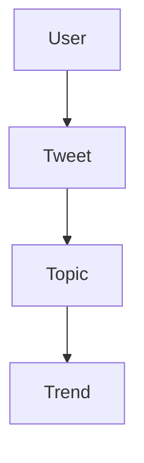
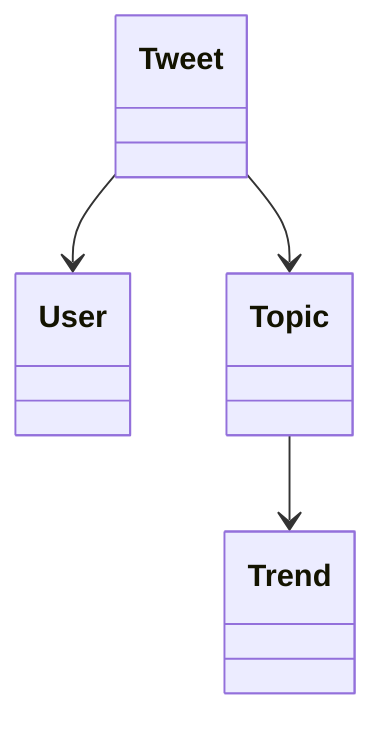
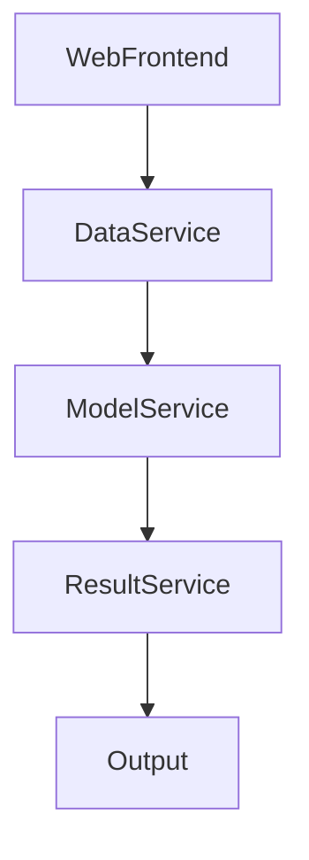

                 


# 构建智能企业市场调研系统：社交媒体聆听与趋势预测的AI驱动

> 关键词：社交媒体聆听、趋势预测、AI驱动、市场调研、数据挖掘、自然语言处理、机器学习

> 摘要：本文详细探讨了如何利用AI技术构建智能企业市场调研系统，通过社交媒体聆听和趋势预测，帮助企业更好地洞察市场动态。文章从背景、核心概念、算法原理、系统架构设计到项目实战，全面解析了构建该系统的全过程。

---

# 第一部分：智能企业市场调研系统概述

## 第1章：智能企业市场调研系统背景与概念

### 1.1 问题背景

#### 1.1.1 传统市场调研的局限性
传统市场调研依赖于问卷调查、访谈和数据分析，存在数据采集成本高、效率低、覆盖范围有限等问题。随着社交媒体的兴起，海量用户生成内容（UGC）为企业提供了新的数据来源，但如何高效处理和分析这些数据成为新的挑战。

#### 1.1.2 社交媒体数据的价值与潜力
社交媒体平台每天产生海量数据，包括文本、图片、视频和互动行为数据。这些数据反映了用户的真实需求、情感倾向和市场趋势，为企业提供了宝贵的洞察。然而，数据的多样性和复杂性也带来了分析的难度。

#### 1.1.3 AI在市场调研中的作用
AI技术，特别是自然语言处理（NLP）和机器学习，能够从社交媒体数据中提取有价值的信息，帮助企业快速识别市场趋势、竞争对手动态和用户反馈。AI驱动的市场调研系统能够实时监控市场动态，提供数据支持的决策依据。

### 1.2 问题描述

#### 1.2.1 市场调研的核心目标
市场调研的核心目标是帮助企业了解市场动态、竞争对手策略、用户需求和趋势变化，从而制定科学的市场策略。

#### 1.2.2 社交媒体数据的复杂性
社交媒体数据具有多样性、实时性和情感倾向性等特点，数据清洗和特征提取的难度较高。此外，数据的隐私性和合规性问题也需要考虑。

#### 1.2.3 趋势预测的挑战与需求
趋势预测需要结合历史数据和实时数据，构建有效的预测模型。然而，市场趋势的变化往往受到多种因素的影响，预测模型需要具备灵活性和鲁棒性。

### 1.3 问题解决与边界

#### 1.3.1 AI在市场调研中的应用范围
AI技术在市场调研中的应用包括社交媒体聆听、情感分析、主题建模、趋势预测和竞争对手分析。

#### 1.3.2 系统边界与功能外延
智能企业市场调研系统的核心功能包括数据采集、数据处理、趋势预测和结果可视化。系统边界包括数据来源、数据类型和数据量的限制。

#### 1.3.3 核心要素与组成结构
智能企业市场调研系统的组成结构包括数据采集模块、数据处理模块、预测模型模块和可视化模块。各模块协同工作，实现从数据到洞察的完整流程。

## 1.4 本章小结
本章从背景、问题和系统组成三个维度介绍了智能企业市场调研系统的核心概念，为后续章节的深入分析奠定了基础。

---

# 第二部分：核心概念与原理

## 第2章：社交媒体聆听与数据挖掘

### 2.1 核心概念原理

#### 2.1.1 数据采集与处理
社交媒体数据的采集需要考虑数据来源的多样性和数据格式的多样性。数据处理包括清洗、去重和标准化，确保数据质量。

#### 2.1.2 数据清洗与特征提取
数据清洗包括去除噪声数据、处理缺失值和异常值。特征提取通过NLP技术（如TF-IDF、Word2Vec）从文本数据中提取关键词和主题。

#### 2.1.3 情感分析与主题识别
情感分析通过机器学习模型（如LSTM、BERT）对文本数据进行情感分类。主题识别通过主题模型（如LDA）提取数据中的主要主题。

### 2.2 核心概念属性对比

| 属性         | 描述 |
|--------------|------|
| 数据来源     | 社交媒体平台 |
| 数据类型     | 文本、图片、视频 |
| 数据量       | 大规模 |
| 数据特征     | 时间戳、用户ID、内容 |

### 2.3 实体关系图



---

## 第3章：趋势预测与AI模型

### 3.1 算法原理

#### 3.1.1 LSTM模型
LSTM（长短期记忆网络）是一种用于时间序列预测的深度学习模型。它通过记忆单元（Cell）和门控机制（Gate）捕捉数据的时间依赖性。

#### 3.1.2 算法流程
1. 数据预处理：将原始数据转化为适合模型输入的格式。
2. 模型训练：使用历史数据训练LSTM模型。
3. 趋势预测：利用训练好的模型预测未来的趋势。

### 3.2 算法实现

#### 3.2.1 LSTM模型代码

```python
import numpy as np
from tensorflow.keras import layers

class LSTMModel:
    def __init__(self, input_size, hidden_size):
        self.hidden_size = hidden_size
        self.W = np.random.randn(input_size, hidden_size)
        self.U = np.random.randn(hidden_size, hidden_size)
        self.b = np.zeros(hidden_size)
        
    def forward(self, x):
        h = np.zeros((x.shape[0], self.hidden_size))
        for i in range(x.shape[0]):
            h[i] = np.tanh(np.dot(x[i], self.W) + np.dot(h[i-1], self.U) + self.b)
        return h
    
    def predict(self, x):
        h = self.forward(x)
        return h[-1]
```

#### 3.2.2 数学模型
LSTM模型的数学表达式如下：

$$
f_t = \tanh(gate\_input)
$$

其中，$gate\_input$ 是 LSTM 的输入门控机制：

$$
gate\_input = W_{in} \cdot x_t + U_{in} \cdot h_{t-1}
$$

---

# 第三部分：系统设计与实现

## 第4章：系统架构设计

### 4.1 系统功能设计

#### 4.1.1 领域模型类图



#### 4.1.2 系统架构图



---

## 第5章：系统实现与案例分析

### 5.1 项目实战

#### 5.1.1 环境安装

```bash
pip install numpy
pip install tensorflow
pip install matplotlib
```

#### 5.1.2 核心实现代码

```python
import numpy as np
import tensorflow as tf
from tensorflow.keras import layers

# 数据生成
def generate_data(length):
    return np.random.randn(length, 1)

# LSTM模型
class LSTMModel(tf.keras.Model):
    def __init__(self, input_shape):
        super(LSTMModel, self).__init__()
        self.lstm_layer = layers.LSTM(50, input_shape=input_shape)
        self.dense_layer = layers.Dense(1)
        
    def call(self, x):
        x = self.lstm_layer(x)
        x = self.dense_layer(x)
        return x

# 训练模型
def train_model(x_train, y_train, epochs=100):
    model = LSTMModel(input_shape=(1, 1))
    model.compile(optimizer='adam', loss='mse')
    model.fit(x_train, y_train, epochs=epochs)
    return model

# 预测趋势
def predict_trend(model, x_test):
    return model.predict(x_test)
```

#### 5.1.3 案例分析
以某社交媒体平台上某一产品的评论数据为例，利用上述模型进行情感分析和趋势预测，展示系统在实际应用中的效果。

---

# 第四部分：总结与展望

## 第6章：总结与展望

### 6.1 最佳实践 Tips

#### 6.1.1 数据质量
确保数据的完整性和准确性，避免噪声数据的影响。

#### 6.1.2 模型优化
通过超参数调优和模型融合提升预测精度。

#### 6.1.3 可视化展示
直观的可视化结果能够更好地帮助用户理解和决策。

### 6.2 本章小结
本文详细介绍了智能企业市场调研系统的核心概念、算法原理和系统设计，展示了如何利用AI技术实现社交媒体聆听和趋势预测。

### 6.3 注意事项
在实际应用中，需要注意数据隐私和合规性问题，确保系统的合法性和安全性。

### 6.4 拓展阅读
进一步了解自然语言处理和时间序列预测的相关技术，探索更多AI在市场调研中的应用场景。

---

# 作者：AI天才研究院 & 禅与计算机程序设计艺术

