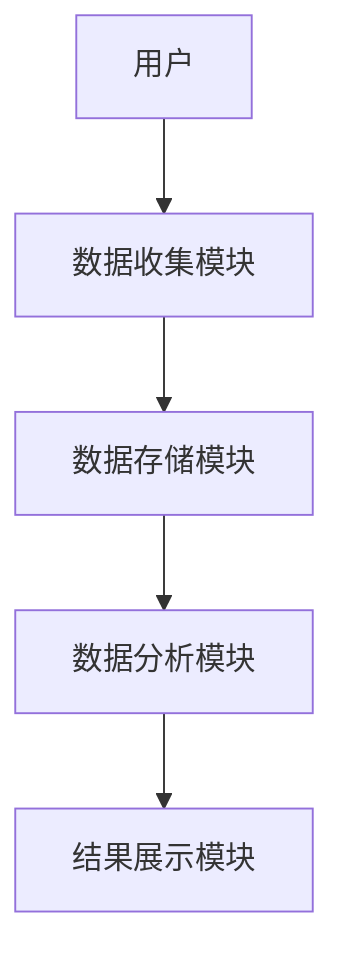
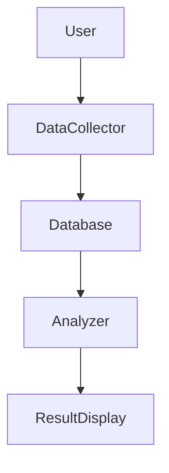
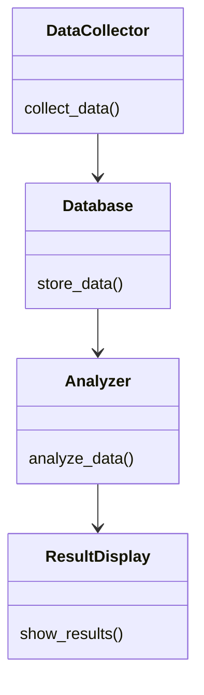
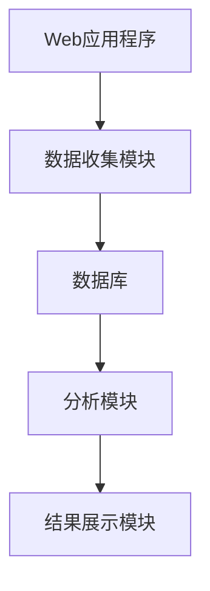
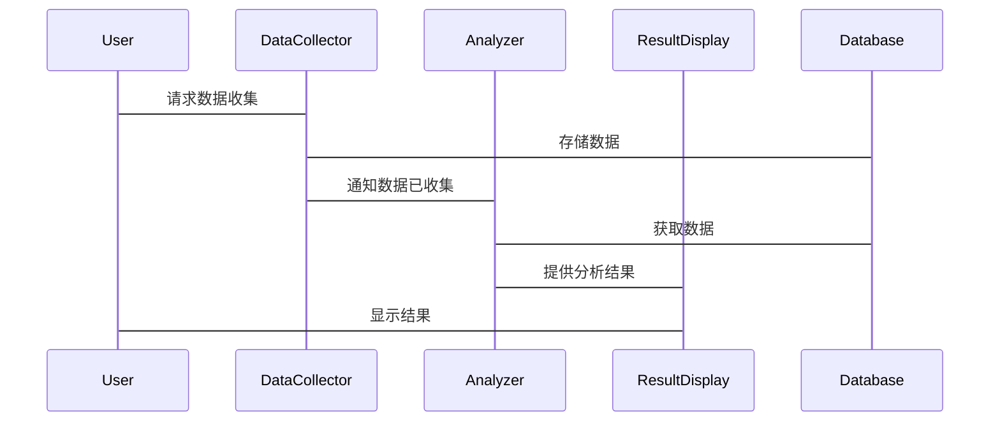

                 


# 构建智能企业市场调研系统：自动化数据收集与分析

> 关键词：市场调研系统，自动化数据收集，智能分析，系统架构，数据挖掘

> 摘要：本文详细介绍了如何构建一个智能企业市场调研系统，涵盖从背景分析到系统设计、算法实现再到项目实战的全过程。通过自动化数据收集和智能分析，帮助企业高效、准确地进行市场调研。

---

## 第一部分: 智能企业市场调研系统概述

### 第1章: 市场调研系统背景与问题背景

#### 1.1 市场调研的基本概念

##### 1.1.1 市场调研的定义与作用

市场调研是通过收集、整理和分析市场信息，为企业制定科学决策提供依据的过程。它帮助企业了解市场趋势、竞争对手情况、消费者需求等关键信息，从而优化产品策略、提升市场竞争力。

##### 1.1.2 传统市场调研的流程与方法

传统市场调研通常包括以下步骤：
1. 确定调研目标：明确需要解决的问题。
2. 设计调研方案：包括问卷设计、数据收集方式等。
3. 数据收集：通过问卷、访谈等方式获取数据。
4. 数据整理与分析：将数据进行分类、汇总和统计分析。
5. 提出结论与建议：基于分析结果，形成报告并提出建议。

##### 1.1.3 企业市场调研的核心目标

- 了解市场动态。
- 分析竞争对手。
- 洞察消费者需求。
- 评估市场潜力。

#### 1.2 传统市场调研的痛点与挑战

##### 1.2.1 数据收集效率低下

传统市场调研依赖人工收集数据，效率低且成本高，尤其是在数据量大、分布广的情况下，效率问题更加突出。

##### 1.2.2 数据分析的复杂性

数据分析需要专业的知识和技能，人工分析容易出错且耗时较长，难以满足企业对快速决策的需求。

##### 1.2.3 人工调研的成本与时间问题

高昂的人力成本和较长的调研周期使得企业难以频繁进行市场调研，错失市场机会。

#### 1.3 智能化市场调研的必要性

##### 1.3.1 自动化数据收集的优势

- 提高数据收集效率。
- 减少人工错误。
- 支持大规模数据处理。

##### 1.3.2 智能分析的价值

- 快速生成分析结果。
- 提供深度洞察。
- 发现潜在趋势。

##### 1.3.3 企业竞争力的提升

通过智能化市场调研，企业能够更快、更准确地获取市场信息，从而做出更明智的决策，提升竞争力。

### 第2章: 问题背景与问题描述

#### 2.1 企业市场调研的核心问题

##### 2.1.1 数据来源的多样性

市场数据来源广泛，包括社交媒体、新闻网站、行业报告等，数据格式和结构差异大，增加了数据处理的难度。

##### 2.1.2 数据质量的保障

数据可能存在噪声、缺失或不一致，如何保证数据质量是关键问题。

##### 2.1.3 数据分析的深度与广度

需要对数据进行多维度分析，挖掘深层信息，同时覆盖广泛的市场领域。

#### 2.2 问题解决的思路

##### 2.2.1 自动化数据收集的实现

通过爬虫技术、API接口等方式自动采集数据，建立数据管道。

##### 2.2.2 智能分析算法的设计

利用机器学习、自然语言处理等技术对数据进行深度分析。

##### 2.2.3 系统的可扩展性与可维护性

设计模块化架构，方便功能扩展和维护。

#### 2.3 问题的边界与外延

##### 2.3.1 系统功能的边界

系统主要关注市场调研，不涉及企业内部数据管理。

##### 2.3.2 数据范围的界定

数据来源包括公开的网络资源和企业内部数据，但不包括敏感信息。

##### 2.3.3 系统的适用场景

适用于中大型企业，尤其适合需要频繁进行市场调研的行业。

### 第3章: 核心概念与系统架构

#### 3.1 核心概念的定义与属性

##### 3.1.1 数据收集模块

负责从各种来源自动采集数据，包括网络爬取、API接口调用等。

##### 3.1.2 数据分析模块

对收集到的数据进行清洗、建模和分析，生成有价值的洞察。

##### 3.1.3 结果展示模块

以可视化的方式呈现分析结果，方便用户理解和决策。

#### 3.2 核心概念的联系与对比

##### 3.2.1 数据流图



##### 3.2.2 实体关系图



### 第4章: 算法原理与数学模型

#### 4.1 数据预处理算法

##### 4.1.1 数据清洗流程

1. 去除重复数据。
2. 处理缺失值。
3. 标准化数据格式。

##### 4.1.2 数据清洗的数学模型

使用简单的数据清洗规则，例如：

$$
\text{新数据} = \text{旧数据} \setminus \{\text{重复数据}\}
$$

##### 4.1.3 示例代码

```python
import pandas as pd

# 假设df是原始数据集
# 删除重复数据
df.drop_duplicates(inplace=True)

# 处理缺失值，使用均值填充
df['column'].fillna(df['column'].mean(), inplace=True)
```

---

## 第二部分: 系统分析与架构设计

### 第5章: 系统分析与架构设计

#### 5.1 项目背景

本项目旨在开发一个智能企业市场调研系统，利用自动化技术提高数据收集和分析效率，帮助企业快速获取市场洞察。

#### 5.2 功能设计

##### 5.2.1 领域模型



#### 5.3 系统架构设计

##### 5.3.1 架构图



#### 5.4 接口设计

##### 5.4.1 数据接口

- 数据收集模块提供API接口，供其他模块调用。

##### 5.4.2 分析接口

- 分析模块提供分析结果的API，供结果展示模块调用。

#### 5.5 交互设计

##### 5.5.1 交互流程



---

## 第三部分: 项目实战

### 第6章: 项目实战

#### 6.1 环境安装

安装必要的库，例如：

```bash
pip install requests pandas numpy scikit-learn matplotlib
```

#### 6.2 核心实现

##### 6.2.1 数据收集模块

```python
import requests

def collect_data(url):
    response = requests.get(url)
    return response.text
```

##### 6.2.2 数据分析模块

```python
from sklearn import preprocessing

# 假设data是数据集
# 标准化数据
scaled_data = preprocessing.StandardScaler().fit_transform(data)
```

##### 6.2.3 结果展示模块

```python
import matplotlib.pyplot as plt

# 绘制柱状图
plt.bar(x, height)
plt.show()
```

#### 6.3 案例分析

以分析某行业市场为例，展示如何通过系统收集数据并生成报告。

#### 6.4 项目总结

通过本项目，我们成功构建了一个智能市场调研系统，实现了自动化数据收集和智能分析，帮助企业高效获取市场洞察。

---

## 第四部分: 最佳实践与总结

### 第7章: 最佳实践与总结

#### 7.1 最佳实践

- 定期更新数据源，确保数据的及时性。
- 使用容错机制，提高系统的健壮性。
- 优化算法模型，提升分析准确性。

#### 7.2 小结

通过本文的详细讲解，读者可以掌握构建智能企业市场调研系统的核心方法和技术，为企业的市场调研工作提供有力支持。

#### 7.3 注意事项

- 确保数据来源的合法性，遵守相关法律法规。
- 定期维护系统，更新技术和数据源。

#### 7.4 拓展阅读

推荐阅读《数据挖掘导论》和《机器学习实战》等书籍，深入学习相关技术。

---

## 作者

作者：AI天才研究院 & 禅与计算机程序设计艺术

---

**摘要**：本文详细介绍了构建智能企业市场调研系统的全过程，涵盖背景分析、核心概念、系统设计、算法实现和项目实战。通过自动化数据收集和智能分析，帮助企业高效、准确地进行市场调研，提升竞争力。

