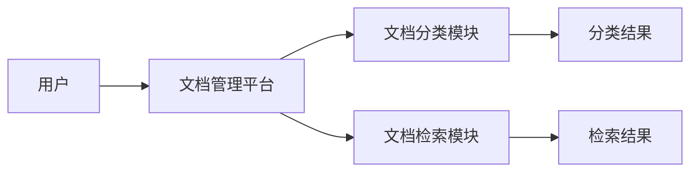

                 

# 《构建智能企业文档管理系统：AI辅助分类与检索》

## 关键词：智能文档管理，AI分类，文本检索，自然语言处理，企业文档系统，机器学习

## 摘要：本文详细探讨了如何利用人工智能技术构建智能企业文档管理系统，重点介绍了AI辅助文档分类与检索的核心原理、算法实现、系统架构设计及项目实战。通过理论与实践相结合的方式，分析了自然语言处理技术在企业文档管理中的应用，提供了从需求分析到系统实现的完整解决方案。

---

# 第一部分：背景与概述

## 第1章：智能企业文档管理系统的背景与需求

### 1.1 问题背景

#### 1.1.1 传统文档管理系统的局限性
传统的文档管理系统依赖人工分类和检索，存在以下问题：
- 分类效率低，人工成本高。
- 检索准确率低，依赖关键词匹配，无法理解语义。
- 缺乏智能化，难以处理非结构化数据。

#### 1.1.2 AI技术对企业文档管理的推动作用
人工智能技术（如自然语言处理、机器学习）的应用，显著提升了文档管理的智能化水平，实现了自动分类、语义检索等功能。

#### 1.1.3 智能文档管理系统的定义与目标
智能文档管理系统是一种利用AI技术对文档进行自动化分类、高效检索和智能管理的系统。其目标是提高文档管理效率，降低人工成本，提升用户体验。

### 1.2 问题描述

#### 1.2.1 文档分类与检索的核心问题
- 文档分类：如何准确地将文档按照预设的类别进行分类。
- 文档检索：如何快速找到与用户需求匹配的文档。

#### 1.2.2 企业文档管理中的常见挑战
- 数据量大，难以高效管理。
- 文档类型多样，分类复杂。
- 用户需求多样，检索精确度要求高。

#### 1.2.3 AI辅助文档管理的必要性
AI技术能够处理非结构化数据，理解语义，显著提升文档管理的效率和准确性。

### 1.3 问题解决与边界

#### 1.3.1 AI在文档管理中的应用范围
- 文档分类：自动将文档分为多个类别。
- 文档检索：基于语义进行智能检索。
- 文档理解：提取文档中的关键信息。

#### 1.3.2 系统边界与功能外延
- 系统边界：仅处理文档分类与检索，不涉及文档生成或其他功能。
- 功能外延：AI辅助分类与检索可与其他系统（如ERP）集成。

#### 1.3.3 核心概念与技术选型
- 核心概念：文本分类、语义检索、自然语言处理。
- 技术选型：基于机器学习的文本分类算法，如TF-IDF、BM25、Word2Vec、BERT。

### 1.4 核心概念与联系

#### 1.4.1 核心概念原理
- 文本分类：基于特征提取和机器学习模型，将文本映射到特定类别。
- 文档检索：基于相似度计算，找到最相关的文档。

#### 1.4.2 核心概念属性特征对比表格
| 特性      | 文本分类          | 文档检索          |
|-----------|-------------------|-------------------|
| 输入       | 文本+标签         | 文本+查询         |
| 输出       | 文本所属类别      | 相关文档列表      |
| 方法       | 监督学习          | 基于向量的检索    |

#### 1.4.3 ER实体关系图架构（Mermaid流程图）

---

## 第2章：AI辅助文档分类与检索的核心原理

### 2.1 文档分类与检索的基本原理

#### 2.1.1 文档分类的数学模型
文本分类通常采用特征提取和机器学习模型。特征提取将文本转化为数值表示，常用TF-IDF或Word2Vec。

#### 2.1.2 文档检索的实现机制
检索基于相似度计算，常用BM25算法，通过计算查询与文档的相似度排序。

#### 2.1.3 分类与检索的关联性
分类用于结构化文档管理，检索用于快速定位文档，两者结合实现高效的文档管理。

---

## 第3章：AI模型在文档管理中的应用

### 3.1 文本预处理与特征提取

#### 3.1.1 文本预处理流程
1. 分词：将文本分割为单词或短语。
2. 去停用词：去除常见无意义词汇（如“的”、“是”）。
3. 词干提取：将词汇标准化为词干。

#### 3.1.2 特征提取方法
- TF-IDF：计算单词在文档中的重要性。
- Word2Vec：将单词映射为向量表示。

### 3.2 AI模型选择与优化

#### 3.2.1 常见AI模型简介
- TF-IDF：简单高效，适合文本检索。
- BM25：改进的文本检索算法，效果优于TF-IDF。
- Word2Vec：生成词向量，适合文本分类。
- BERT：深度预训练模型，效果最佳，但计算资源需求高。

#### 3.2.2 模型选择策略
- 数据量小：选择TF-IDF或BM25。
- 数据量大：选择BERT。

### 3.3 模型训练与调优

#### 3.3.1 模型训练流程
1. 数据准备：收集和标注训练数据。
2. 特征提取：选择合适的特征表示方法。
3. 模型训练：使用训练数据训练分类器或检索器。
4. 模型调优：优化超参数，提升性能。

---

## 第4章：算法原理与数学模型

### 4.1 文本预处理与特征提取

#### 4.1.1 TF-IDF计算公式
$$ TF-IDF(t, d) = TF(t, d) \times ID

