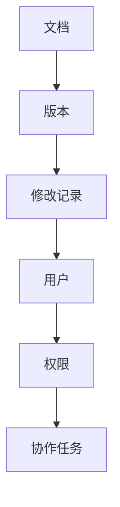

                 

# 《构建智能企业文档管理系统：版本控制与协作优化》

> 关键词：智能文档管理、版本控制、协作优化、文本相似度、AI算法、企业协作效率

> 摘要：本文详细探讨了构建智能企业文档管理系统的各个方面，包括背景分析、核心概念、算法原理、系统架构设计、项目实战和最佳实践。通过结合文本相似度算法、版本控制技术和协作优化策略，提出了一种高效的文档管理解决方案。

---

# 第一部分: 智能企业文档管理系统的背景与核心概念

## 第1章: 企业文档管理的挑战与需求

### 1.1 问题背景

#### 1.1.1 传统文档管理的痛点
- **文档分散**：企业文档通常分散在不同的存储位置，难以统一管理和检索。
- **版本混乱**：多人协作时，文档的多个版本容易混淆，导致使用错误的版本。
- **协作低效**：传统协作工具缺乏智能化，难以自动跟踪和协调修改记录。

#### 1.1.2 数字化转型对企业文档管理的新要求
- **实时协作**：支持多人实时编辑和协作，减少沟通成本。
- **智能检索**：通过自然语言处理技术实现智能文档检索。
- **安全合规**：确保文档的安全性和合规性，防止数据泄露。

#### 1.1.3 智能化文档管理的必要性
- **自动化版本控制**：通过AI算法自动识别文档变更，减少人工干预。
- **智能协作优化**：利用AI分析协作过程，提出优化建议。
- **高效知识管理**：通过智能分类和标签化，提升知识 reuse效率。

### 1.2 问题描述

#### 1.2.1 文档版本混乱的现状
- **手动标记**：人工标记文档版本容易出错。
- **历史记录丢失**：缺乏系统化的版本记录，难以追溯修改历史。
- **版本冲突**：多人协作时，版本冲突难以处理。

#### 1.2.2 协作效率低下的原因
- **沟通不畅**：协作工具缺乏智能化，难以自动分配任务。
- **重复劳动**：人工检查文档相似度和版本差异，效率低下。
- **缺乏反馈**：协作过程中缺乏实时反馈，容易出现误解。

#### 1.2.3 文档安全与合规的挑战
- **权限管理复杂**：不同文档需要不同的访问权限，管理难度大。
- **数据泄露风险**：文档分散存储，难以全面保护。
- **合规性要求**：企业需要符合行业和法规的文档管理标准。

### 1.3 问题解决

#### 1.3.1 引入智能化技术的解决方案
- **AI驱动的版本控制**：利用文本相似度算法自动识别文档变更。
- **智能协作优化**：通过分析协作数据，优化任务分配和流程。
- **自动化记录**：系统自动记录文档修改历史，便于追溯和管理。

#### 1.3.2 基于AI的文档协作优化思路
- **智能分派任务**：AI分析文档内容，自动分配协作任务。
- **实时反馈**：协作过程中提供实时反馈，减少误解。
- **自动化提醒**：系统自动提醒用户完成任务，避免遗漏。

#### 1.3.3 版本控制的自动化实现
- **自动标记版本**：AI分析文档内容变化，自动标记新版本。
- **智能回滚**：基于相似度算法，快速找到历史版本进行回滚。
- **版本对比**：系统自动对比不同版本，生成差异报告。

## 第2章: 核心概念与联系

### 2.1 核心概念原理

#### 2.1.1 文本相似度计算
- **定义**：文本相似度是衡量两段文本内容相似程度的指标。
- **方法**：常用的算法包括BM25、余弦相似度和TF-IDF。
- **应用**：用于自动识别文档的变更和相似版本。

#### 2.1.2 自动化版本控制
- **定义**：自动化版本控制是指系统自动记录和管理文档的变更历史。
- **实现**：基于文本相似度算法，系统自动判断是否需要创建新版本。
- **优势**：减少人工干预，提高版本管理的效率和准确性。

#### 2.1.3 智能协作算法
- **定义**：智能协作算法是通过分析协作数据，优化协作流程的技术。
- **实现**：基于机器学习算法，分析用户行为和文档内容，提出优化建议。
- **优势**：提升协作效率，减少冲突和错误。

### 2.2 核心概念对比分析

#### 2.2.1 文本相似度算法对比
| 算法名称 | 原理 | 优点 | 缺点 |
|----------|------|------|------|
| BM25     | 基于词频和位置的加权计算 | 高精度 | 对停用词处理不够好 |
| 余弦相似度 | 基于向量空间模型 | 计算简单 | 易受维度影响 |
| TF-IDF    | 基于词频和反频的加权计算 | 能处理长文本 | 需要预处理 |

#### 2.2.2 版本控制方式对比
| 方式名称 | 特点 | 适用场景 | 优缺点 |
|----------|------|----------|--------|
| 手动版本控制 | 人工记录版本 | 小型项目 | 易出错，效率低 |
| 自动化版本控制 | 系统自动记录 | 大型项目 | 准确，高效 |
| 分布式版本控制 | 分布式存储 | 多人协作 | 灵活，但复杂 |

#### 2.2.3 协作效率提升方法对比
| 方法名称 | 特点 | 适用场景 | 优缺点 |
|----------|------|----------|--------|
| 传统协作 | 依赖人工分配 | 低要求 | 效率低，易出错 |
| 智能协作 | AI优化分配 | 大型团队 | 高效，减少冲突 |
| 半自动化协作 | 系统辅助分配 | 中型团队 | 效率适中，易用 |

### 2.3 ER实体关系图

---

接下来将按照上述目录结构展开详细写作，具体内容将涵盖算法原理、系统架构设计、项目实战、最佳实践等部分，确保文章结构完整、内容详实、逻辑清晰。

