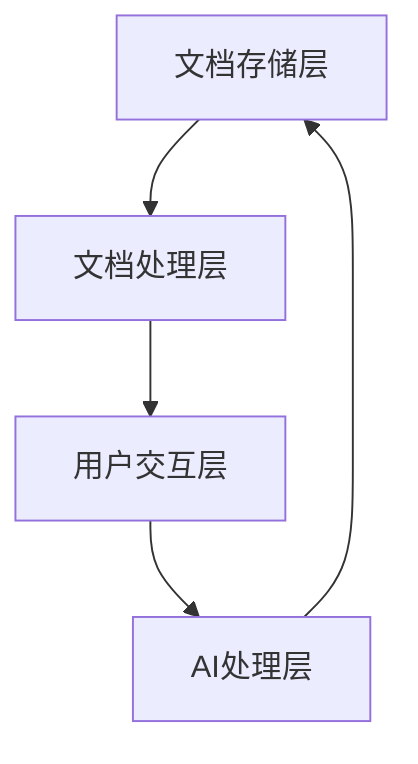
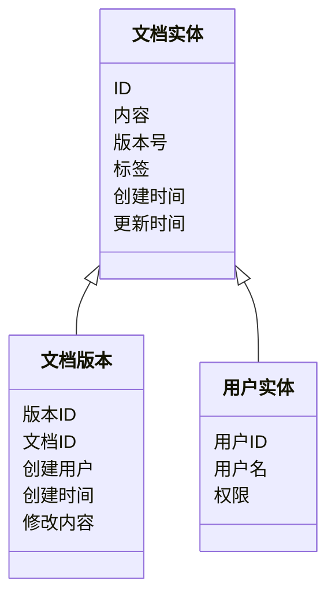
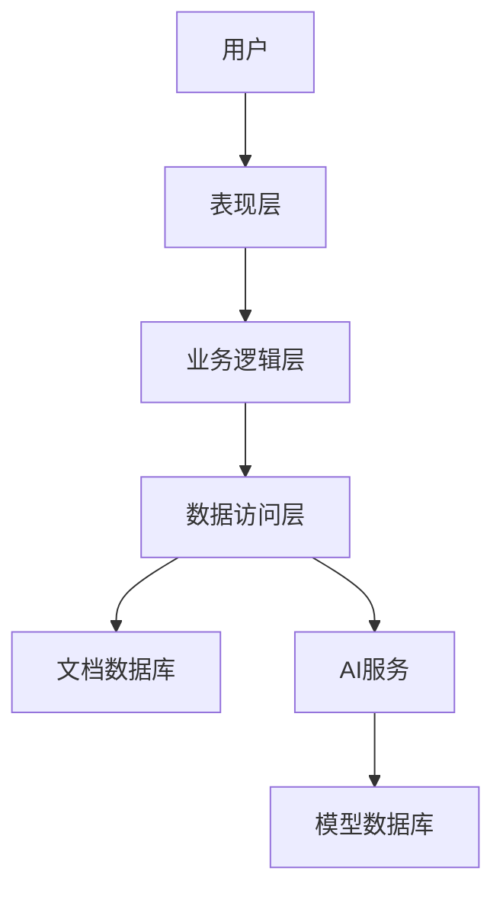
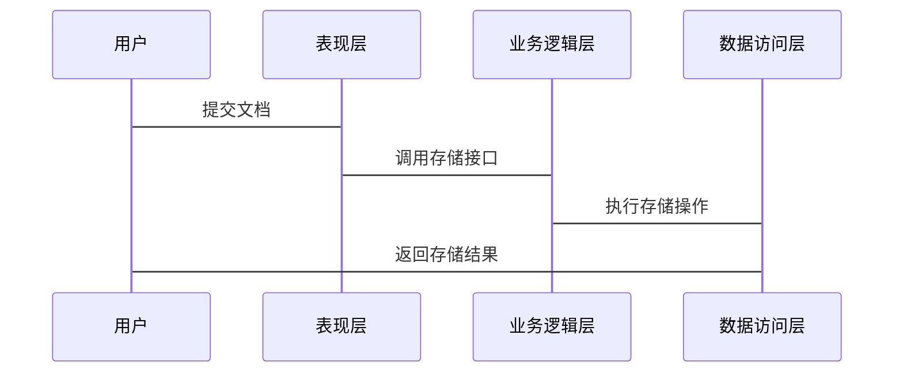

                 


# 构建智能企业文档管理系统：版本控制与协作优化的AI增强

---

## 关键词：智能文档管理，版本控制，AI增强，协作优化，企业文档系统

---

## 摘要：本文详细探讨了如何利用人工智能技术构建智能企业文档管理系统，重点分析了版本控制与协作优化的实现。通过结合AI技术，系统能够实现智能分类、自动标注和高效协作，显著提升了文档管理效率。文章从背景、概念、技术实现到项目实战，全面解析了构建这一系统的全过程。

---

# 目录

## 第一章：智能企业文档管理系统的背景与核心概念

### 1.1 问题背景

#### 1.1.1 传统文档管理系统的局限性

- **内容分散**：文档分散在不同设备和系统中，难以统一管理。
- **版本控制复杂**：手动管理多个版本，容易出错且效率低下。
- **协作效率低下**：多人协作时，文档更新和同步困难，容易产生冲突。

#### 1.1.2 企业文档管理中的主要问题

- **数据冗余**：重复存储相同内容，浪费存储空间。
- **权限管理不足**：文档访问权限设置复杂，容易出现安全漏洞。
- **搜索效率低**：传统搜索功能无法理解文档内容，难以快速找到所需信息。

### 1.2 问题描述

#### 1.2.1 文档管理的核心目标

- **高效存储**：优化存储空间，确保文档安全。
- **权限控制**：细粒度的访问控制，确保文档安全。
- **智能搜索**：基于内容的智能搜索，提升查找效率。

#### 1.2.2 AI增强文档管理的必要性

- **智能分类**：自动分类文档，减少人工操作。
- **自动标注**：自动生成文档标签，提高搜索效率。
- **协作优化**：智能提醒和冲突解决，提升协作效率。

### 1.3 问题解决与边界

#### 1.3.1 解决方案概述

- **引入AI技术**：利用机器学习和自然语言处理技术，实现智能分类和标注。
- **优化协作流程**：通过AI驱动的协作工具，提升团队协作效率。
- **提高搜索效率**：基于AI的智能搜索功能，快速定位所需文档。

#### 1.3.2 系统边界与外延

- **核心功能模块**：文档存储、分类、搜索、版本控制和协作功能。
- **边界条件**：仅处理文档管理相关任务，不涉及其他业务系统。
- **外延功能**：未来可能扩展的功能，如文档生成和自动化流程。

## 第二章：智能企业文档管理系统的概念与核心要素

### 2.1 核心概念

#### 2.1.1 智能文档管理系统定义

- **自动分类**：系统根据文档内容自动分类。
- **智能搜索**：基于内容理解和上下文进行智能搜索。
- **协作优化**：通过AI驱动工具，提升协作效率。

#### 2.1.2 与传统文档管理系统的区别

- **功能对比表格**

| 功能模块         | 传统文档管理           | 智能文档管理           |
|------------------|------------------------|------------------------|
| 文档分类         | 手动分类               | 自动分类               |
| 版本控制         | 手动管理               | AI辅助管理             |
| 协作效率         | 低效率                 | 高效率                 |

#### 2.1.3 系统架构组件

- **Mermaid系统架构图**



## 第三章：AI驱动的文档分类与标注

### 3.1 文档分类

#### 3.1.1 分类算法

- **朴素贝叶斯**：基于概率论的简单分类器，适合文本分类任务。
- **支持向量机（SVM）**：适用于小规模数据集，分类效果好。
- **神经网络**：深度学习模型，适合大规模数据和复杂任务。

#### 3.1.2 分类流程

- **数据预处理**：去除停用词、分词等。
- **特征提取**：使用TF-IDF或Word2Vec生成特征向量。
- **模型训练**：利用训练数据训练分类器。

### 3.2 文档标注

#### 3.2.1 自动标注技术

- **基于关键词**：根据关键词自动生成标签。
- **基于上下文**：分析文档内容生成上下文相关的标签。
- **基于模型生成**：利用预训练模型生成标签。

#### 3.2.2 标注流程

- **数据准备**：收集和整理标注数据。
- **模型训练**：训练自动标注模型。
- **结果评估**：评估模型准确率，优化模型。

## 第四章：AI驱动的文档版本控制与协作优化

### 4.1 文档版本控制

#### 4.1.1 版本控制算法

- **树状结构**：利用哈希值构建版本树，记录每个版本的变更。
- **哈希值比较**：通过哈希值快速比较文档差异。
- **时间戳对比**：根据修改时间判断版本优先级。

#### 4.1.2 版本对比技术

- **差异检测**：识别文档修改的部分，生成差异报告。
- **冲突解决**：自动检测冲突，提供合并建议。
- **合并策略**：基于优先级或上下文决定最终版本。

### 4.2 协作优化

#### 4.2.1 智能提醒

- **基于用户行为**：分析用户行为，预测需求，主动提醒。
- **基于文档内容**：根据文档内容和语境，智能推荐相关文档。
- **基于时间安排**：根据截止日期和任务优先级，提醒相关人员。

#### 4.2.2 冲突解决

- **自动建议**：系统自动提供冲突解决方案。
- **人工干预**：用户可以选择部分修改或完全替换。
- **组合策略**：结合自动建议和人工干预，灵活处理冲突。

## 第五章：系统设计与实现

### 5.1 系统架构设计

#### 5.1.1 分层架构

- **表现层**：用户界面，展示文档信息和操作结果。
- **业务逻辑层**：处理用户请求，执行业务逻辑。
- **数据访问层**：与数据库交互，存储和检索数据。

#### 5.1.2 微服务架构

- **文档服务**：负责文档的存储、版本控制和协作功能。
- **AI服务**：提供文档分类和自动标注功能。

### 5.2 功能模块设计

#### 5.2.1 领域模型



### 5.3 系统架构图



### 5.4 系统接口设计

- **API接口**：提供RESTful API，方便其他系统调用。

#### 5.4.1 文档存储接口

```http
POST /api/document
Content-Type: multipart/form-data
{
    "content": "文档内容",
    "tags": ["标签1", "标签2"],
    "version": 1
}
```

#### 5.4.2 文档搜索接口

```http
GET /api/search?q=关键词
```

### 5.5 系统交互图



## 第六章：项目实战

### 6.1 环境搭建

#### 6.1.1 安装Python环境

```bash
python --version
pip install --upgrade pip
```

#### 6.1.2 安装依赖库

```bash
pip install flask
pip install transformers
```

### 6.2 核心实现

#### 6.2.1 文档分类实现

```python
from transformers import pipeline

classifier = pipeline("text-classification", model="bert-base-uncased")
result = classifier("文档内容")
print(result)
```

#### 6.2.2 版本控制实现

```python
def save_document(content, version):
    # 实现文档存储和版本控制
    pass
```

### 6.3 项目小结

- **实现成果**：成功构建了一个基于AI的文档管理系统，实现了智能分类、版本控制和协作优化功能。
- **系统优化**：通过分层架构和微服务设计，提高了系统的扩展性和维护性。
- **未来方向**：进一步优化AI算法，增加更多智能功能，如文档生成和自动化流程。

## 第七章：总结与展望

### 7.1 项目小结

- **系统优势**：提高了文档管理效率，优化了协作流程，提升了用户体验。
- **系统优化建议**：优化AI模型性能，提升系统稳定性和安全性。
- **未来研究方向**：探索更多AI技术在文档管理中的应用，如自动生成文档摘要和智能推荐。

### 7.2 注意事项

- **数据安全**：确保文档存储和传输的安全性，防止数据泄露。
- **系统性能**：优化系统架构，提升处理效率和响应速度。

### 7.3 学习资源推荐

- **书籍推荐**：《深度学习入门：基于Python的特征提取、模型训练和实际应用》。
- **在线课程**：Coursera上的“机器学习”课程。

## 作者

作者：AI天才研究院/AI Genius Institute & 禅与计算机程序设计艺术 /Zen And The Art of Computer Programming

---

**注**：由于篇幅限制，上述目录仅为概要，实际文章将包含更多详细内容和技术实现细节。

