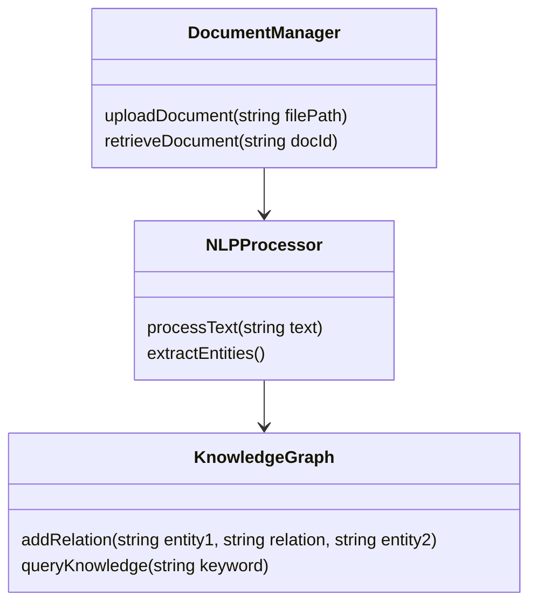
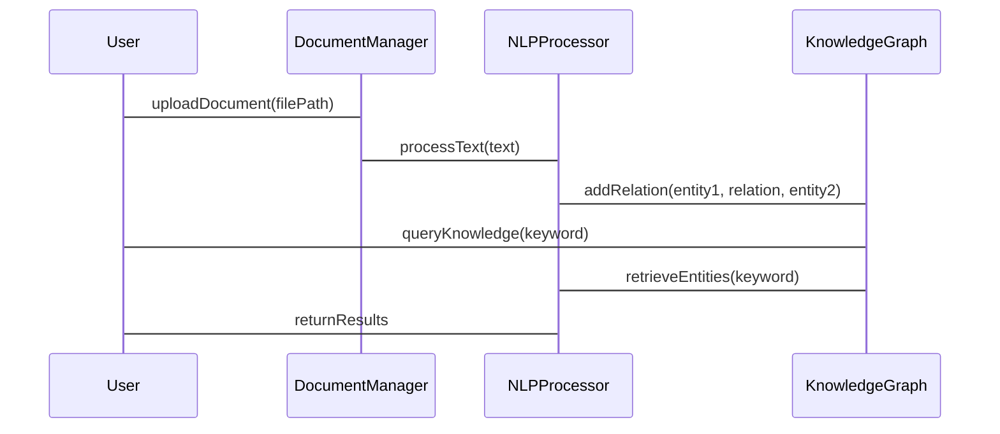

                 


# 构建智能企业文档管理系统：语义理解与知识链接

## 关键词：智能文档管理系统、语义理解、知识图谱、自然语言处理、知识链接、企业文档管理

## 摘要：本文详细探讨了构建智能企业文档管理系统的关键技术和实现方法，重点分析了语义理解和知识链接的核心原理与应用场景。通过系统的背景分析、核心概念解析、算法实现、系统架构设计以及项目实战，深入阐述了如何利用自然语言处理技术和知识图谱构建智能文档管理系统，为企业文档管理的智能化转型提供理论和实践指导。

---

# 第一部分：智能企业文档管理系统的背景与核心概念

## 第1章：企业文档管理系统的背景与问题分析

### 1.1 企业文档管理系统的现状与挑战

#### 1.1.1 传统文档管理系统的局限性
传统的文档管理系统主要依赖关键字匹配和简单的分类管理，难以理解文档的语义内容，导致检索效率低下，且无法实现跨文档的知识关联。

#### 1.1.2 智能化文档管理的需求
随着企业文档数量的爆炸式增长，对文档的智能化管理和知识挖掘需求日益迫切。语义理解与知识链接成为提升文档管理系统智能化水平的关键技术。

#### 1.1.3 语义理解与知识链接的重要性
语义理解能够提取文档中的深层含义，而知识链接则能够建立文档之间的关联关系，从而实现知识的共享与复用。

### 1.2 问题背景与目标

#### 1.2.1 文档管理中的语义理解问题
传统文档管理系统无法准确理解文档内容，导致检索和应用效率低下。

#### 1.2.2 知识链接的必要性
通过知识链接，可以将分散在不同文档中的信息进行关联，形成知识网络，提升知识利用效率。

#### 1.2.3 问题解决的目标与边界
目标是构建一个基于语义理解的智能文档管理系统，实现文档的智能检索、知识关联与知识图谱构建。边界包括文档预处理、语义理解、知识图谱构建与应用。

### 1.3 核心概念与系统架构

#### 1.3.1 语义理解的定义与特点
语义理解是通过自然语言处理技术，理解文本的深层含义，实现对文档内容的智能化处理。

#### 1.3.2 知识图谱的定义与特点
知识图谱是一种结构化的知识表示形式，通过实体和关系的建模，描述现实世界中的知识。

#### 1.3.3 系统架构的初步设计
初步设计包括文档预处理、语义理解、知识图谱构建与应用三个主要模块。

### 1.4 本章小结
本章介绍了智能企业文档管理系统的背景，分析了传统系统存在的问题，提出了语义理解与知识链接的重要性，并对系统架构进行了初步设计。

---

# 第二部分：语义理解与知识图谱的核心原理

## 第2章：语义理解的核心原理

### 2.1 语义理解的基本原理

#### 2.1.1 自然语言处理（NLP）的基础
自然语言处理是实现语义理解的核心技术，包括分词、句法分析和语义分析等步骤。

#### 2.1.2 语义分析的流程
语义分析包括文本预处理、特征提取、语义表示和语义推理四个主要步骤。

#### 2.1.3 语义理解的关键技术
关键技术包括词嵌入、预训练语言模型（如BERT）和文本相似度计算等。

### 2.2 知识图谱的构建与应用

#### 2.2.1 知识图谱的定义与特点
知识图谱是一种图结构数据，由实体和关系构成，能够表示知识的语义网络。

#### 2.2.2 知识图谱的构建流程
构建流程包括数据采集、实体识别、关系抽取和知识融合等步骤。

#### 2.2.3 知识图谱的存储与查询
知识图谱可以存储在图数据库中，查询方式包括基于关键字的查询和基于语义的查询。

### 2.3 语义理解与知识图谱的联系

#### 2.3.1 语义理解在知识图谱中的应用
语义理解技术可以用于知识图谱的构建和优化，提升知识关联的准确性。

#### 2.3.2 知识图谱对语义理解的支撑
知识图谱提供了语义理解的上下文信息，帮助模型更好地理解文本含义。

#### 2.3.3 语义理解与知识图谱的结合案例
案例包括智能问答系统、知识推荐系统等。

### 2.4 本章小结
本章详细介绍了语义理解的核心原理，分析了知识图谱的构建与应用，并探讨了两者结合的实现方式。

---

# 第三部分：智能文档管理系统的核心算法与实现

## 第3章：语义理解算法的实现

### 3.1 文档预处理与特征提取

#### 3.1.1 文本清洗与标准化
文本清洗包括去除停用词、标点符号和空格等，标准化包括分词和词干提取。

#### 3.1.2 词袋模型与词嵌入
词袋模型将文本表示为词的集合，词嵌入（如Word2Vec）将词表示为低维向量。

#### 3.1.3 文档表示的向量化
文档向量化包括TF-IDF和主题模型（如LDA）等方法。

### 3.2 语义理解的算法实现

#### 3.2.1 基于深度学习的语义理解模型
深度学习模型（如BERT）通过预训练和微调实现语义理解任务。

#### 3.2.2 预训练语言模型（如BERT）的应用
BERT模型通过上下文信息理解文本语义，并应用于智能文档管理系统。

#### 3.2.3 文档相似度计算与语义匹配
通过余弦相似度和编辑距离等方法计算文档相似度，实现语义匹配。

### 3.3 知识图谱构建的算法实现

#### 3.3.1 实体识别与抽取
实体识别算法包括基于规则的和基于机器学习的方法，用于从文本中提取实体。

#### 3.3.2 关系抽取与链接
关系抽取算法包括模式匹配和基于深度学习的方法，用于建立实体之间的关系。

#### 3.3.3 知识融合与优化
知识融合算法解决知识图谱中的冗余和冲突问题，提升知识图谱的质量。

### 3.4 本章小结
本章详细介绍了语义理解算法的实现，包括文档预处理、特征提取、模型训练和知识图谱构建等关键技术。

---

# 第四部分：系统架构设计与实现

## 第4章：系统架构设计与实现

### 4.1 系统功能设计

#### 4.1.1 领域模型设计
领域模型包括文档管理模块、语义理解模块和知识图谱模块。

#### 4.1.2 功能模块划分
功能模块包括文档上传、语义分析、知识链接和知识图谱查询等。

#### 4.1.3 领域模型的Mermaid类图


### 4.2 系统架构设计

#### 4.2.1 总体架构设计
总体架构包括前端、后端和数据库三个部分。

#### 4.2.2 系统架构的Mermaid架构图
```mermaid
container Frontend {
    Web界面
    用户交互
}
container Backend {
    DocumentManager
    NLPProcessor
    KnowledgeGraph
}
container Database {
    DocumentStorage
    KnowledgeBase
}
Frontend --> Backend
Backend --> Database
```

#### 4.2.3 关键接口设计
关键接口包括文档上传接口、语义分析接口和知识图谱查询接口。

### 4.3 系统交互设计

#### 4.3.1 用户与系统的交互流程
用户上传文档，系统进行语义分析并构建知识图谱，用户可以通过查询接口获取相关知识。

#### 4.3.2 系统交互的Mermaid序列图


### 4.4 本章小结
本章详细设计了智能文档管理系统的架构，包括功能模块、系统架构、接口设计和系统交互流程。

---

# 第五部分：项目实战与案例分析

## 第5章：智能文档管理系统开发实战

### 5.1 项目开发环境搭建

#### 5.1.1 开发工具安装
安装Python、Jupyter Notebook和相关库（如TensorFlow、spaCy、NetworkX）。

#### 5.1.2 环境配置
配置虚拟环境，安装依赖库。

### 5.2 核心代码实现

#### 5.2.1 文档预处理代码
```python
import spacy

nlp = spacy.load("en_core_web_sm")
doc = nlp("This is a sample document.")

for token in doc:
    print(token.text, token.pos_, token.lemma_)
```

#### 5.2.2 语义理解代码
```python
from sentence_transformers import SentenceTransformer

model = SentenceTransformer('bert-base-nli-stsb')
embedding = model.encode("This is a sample sentence.")
print(embedding)
```

#### 5.2.3 知识图谱构建代码
```python
import networkx as nx

G = nx.Graph()
G.add_edge("Entity1", "Entity2", relation="RelatedTo")
nx.draw(G, node_size=500, font_size=14, node_color="red")
plt.show()
```

### 5.3 项目实战分析

#### 5.3.1 项目案例分析
以企业合同管理系统为例，详细分析系统开发过程。

#### 5.3.2 代码实现与分析
通过具体代码实现，展示语义理解与知识图谱构建的实现过程。

#### 5.3.3 系统功能展示
展示系统的功能界面和核心功能的实现效果。

### 5.4 本章小结
本章通过项目实战，详细展示了智能文档管理系统的开发过程，包括环境搭建、核心代码实现和系统功能展示。

---

# 第六部分：系统优化与扩展

## 第6章：系统优化与扩展

### 6.1 系统优化方案

#### 6.1.1 系统性能优化
通过缓存优化和分布式架构提升系统性能。

#### 6.1.2 知识图谱优化
优化知识图谱的存储方式和查询效率。

#### 6.1.3 系统可扩展性设计
设计模块化架构，方便功能扩展和升级。

### 6.2 系统扩展与前沿技术应用

#### 6.2.1 前沿技术的应用
引入大语言模型（如GPT-4）提升语义理解能力。

#### 6.2.2 新功能开发
开发智能问答、知识推荐等新功能。

#### 6.2.3 系统部署方案
制定云部署方案，提升系统的可用性和扩展性。

### 6.3 本章小结
本章探讨了系统的优化方案和扩展方向，分析了前沿技术的应用和系统部署策略。

---

# 第七部分：总结与展望

## 第7章：总结与展望

### 7.1 项目总结

#### 7.1.1 核心成果
总结智能文档管理系统的开发成果，包括技术实现和系统功能。

#### 7.1.2 经验与教训
总结开发过程中的经验和教训，为后续开发提供参考。

### 7.2 未来展望

#### 7.2.1 技术发展方向
分析语义理解和知识图谱的未来发展方向。

#### 7.2.2 应用领域的拓展
探讨智能文档管理系统在其他领域的应用潜力。

#### 7.2.3 研究热点与趋势
总结当前研究热点和未来发展趋势。

### 7.3 本章小结
本章对智能文档管理系统的开发进行了总结，并对未来的技术发展和应用进行了展望。

---

# 作者：AI天才研究院/AI Genius Institute & 禅与计算机程序设计艺术 /Zen And The Art of Computer Programming

---

# 致谢
感谢读者的支持与关注，感谢所有参与开发和测试的团队成员！

