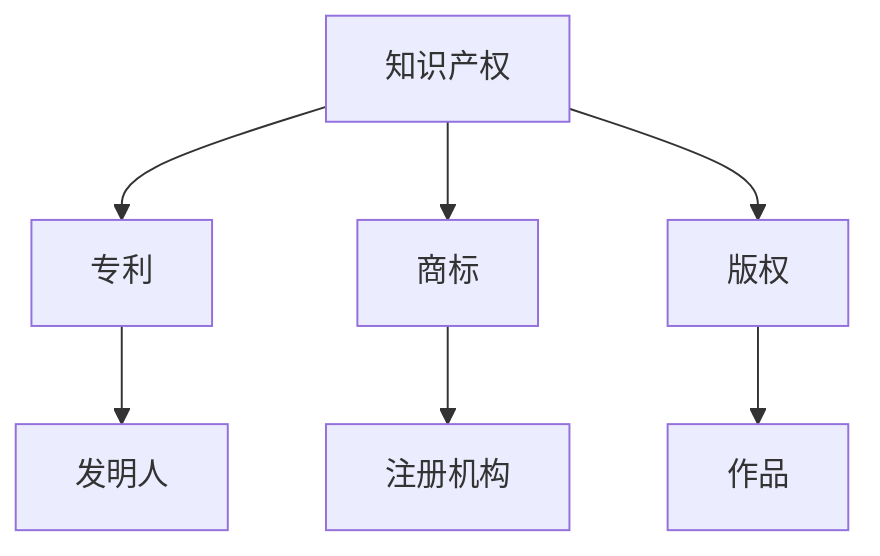
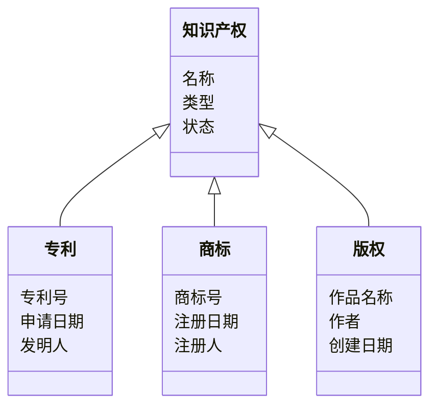
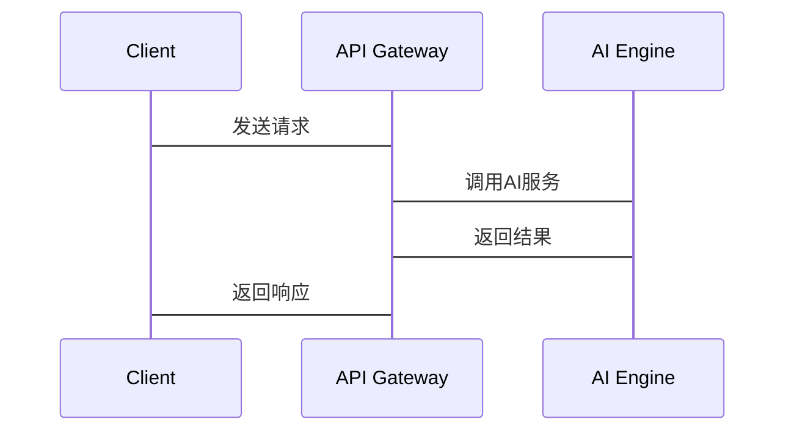

                 


# 构建智能企业知识产权运营平台：AI辅助决策

> 关键词：智能企业，知识产权，AI辅助决策，知识图谱，机器学习，自然语言处理

> 摘要：本文将详细探讨如何利用人工智能技术构建智能企业知识产权运营平台。通过分析知识产权管理的核心概念、AI辅助决策的原理，以及系统架构设计，本文将展示如何通过智能化手段提升企业知识产权管理的效率与价值。文章内容涵盖背景介绍、核心概念与联系、算法原理、系统分析与架构设计、项目实战以及最佳实践等多个方面，旨在为企业提供一套完整的解决方案。

---

## 第1章: 知识产权与企业运营

### 1.1 知识产权的定义与重要性

#### 1.1.1 知识产权的基本概念
知识产权是法律保护的创造性成果，包括专利、商标、版权等。它不仅是企业竞争力的体现，也是其核心资产之一。

#### 1.1.2 知识产权在企业中的作用
- **保护创新**：防止他人未经授权使用企业的创新成果。
- **提升价值**：知识产权是企业市场价值的重要组成部分。
- **获取收益**：通过许可、转让等方式实现知识产权的商业价值。

#### 1.1.3 知识产权的保护与管理
- **法律保护**：通过专利申请、商标注册等方式保护知识产权。
- **管理策略**：制定知识产权管理策略，确保其有效利用。

---

### 1.2 企业知识产权管理的挑战

#### 1.2.1 知识产权管理的复杂性
- 知识产权类型多样，涉及专利、商标、版权等多个领域。
- 知识产权的生命周期长，管理复杂。

#### 1.2.2 传统管理方式的局限性
- 人工管理效率低，容易出错。
- 数据分散，难以进行全局分析。

#### 1.2.3 数字化与智能化管理的需求
- 随着数据量的增加，传统的管理方式已无法满足需求。
- 智能化管理可以提高效率，降低成本。

---

### 1.3 AI辅助决策在知识产权管理中的应用

#### 1.3.1 AI在知识产权分析中的潜力
- **专利检索**：通过自然语言处理技术快速检索相关专利。
- **竞争分析**：利用机器学习分析竞争对手的专利布局。

#### 1.3.2 AI辅助决策的核心优势
- **高效性**：AI可以快速处理大量数据，提高决策效率。
- **准确性**：通过算法分析，提供更精准的决策支持。

#### 1.3.3 智能化知识产权管理的未来趋势
- **智能化工具的普及**：AI辅助决策将成为知识产权管理的主流。
- **数据驱动的决策**：通过数据分析优化知识产权战略。

---

## 第2章: 智能企业知识产权运营平台的背景与目标

### 2.1 智能企业知识产权运营平台的定义

#### 2.1.1 平台的基本概念
智能企业知识产权运营平台是以AI技术为基础，为企业提供知识产权管理、分析和决策支持的综合性平台。

#### 2.1.2 平台的功能定位
- 提供知识产权的申请、管理、分析等一站式服务。
- 利用AI技术优化知识产权管理流程，提高效率。

#### 2.1.3 平台的目标用户
- 企业法务部门、研发部门、知识产权管理团队。
- 企业高管、知识产权律师。

---

### 2.2 平台建设的必要性

#### 2.2.1 企业知识产权管理的痛点
- 数据分散，难以进行统一管理。
- 知识产权分析需要大量人工劳动，效率低。
- 缺乏智能化工具支持，难以进行精准决策。

#### 2.2.2 AI技术在知识产权管理中的应用价值
- **自动化处理**：AI可以自动处理专利申请、检索等流程。
- **智能化分析**：通过机器学习分析专利布局，识别潜在风险。

#### 2.2.3 智能化平台对企业竞争力的提升
- 提高知识产权管理效率，降低成本。
- 通过数据分析优化知识产权战略，提升企业竞争力。

---

### 2.3 平台建设的目标与核心价值

#### 2.3.1 平台建设的主要目标
- 提供高效的知识产权管理工具。
- 利用AI技术优化知识产权分析流程。

#### 2.3.2 平台的核心价值主张
- 提供智能化的知识产权管理解决方案。
- 帮助企业提升知识产权管理和决策效率。

#### 2.3.3 平台的长期发展愿景
- 成为全球领先的知识产权管理平台。
- 推动AI技术在知识产权管理领域的广泛应用。

---

## 第3章: 知识产权管理的核心概念与联系

### 3.1 知识产权管理的核心概念

#### 3.1.1 知识产权的主要类型
- **专利**：保护发明的独占权。
- **商标**：保护品牌标识。
- **版权**：保护文学、艺术作品等。

#### 3.1.2 知识产权的生命周期
- **申请阶段**：从发明到专利申请。
- **维护阶段**：专利的维护和续展。
- **运用阶段**：专利的实施和商业化。

#### 3.1.3 知识产权的评估与价值分析
- **评估指标**：包括技术先进性、市场前景等。
- **价值分析**：通过市场估值、法律风险等因素评估知识产权的价值。

---

### 3.2 AI辅助决策的核心原理

#### 3.2.1 机器学习在知识产权分析中的应用
- **监督学习**：用于分类任务，如专利分类。
- **无监督学习**：用于聚类分析，发现潜在的技术趋势。

#### 3.2.2 自然语言处理在专利文本挖掘中的作用
- **文本摘要**：自动提取专利摘要。
- **实体识别**：识别专利中的技术关键词和发明人。

#### 3.2.3 知识图谱在知识产权关系中的构建
- **知识图谱构建**：将专利、发明人、技术领域等信息构建为知识图谱。
- **图谱分析**：通过图谱分析发现技术关联和潜在风险。

---

### 3.3 知识产权管理与AI辅助决策的关系

#### 3.3.1 知识产权管理的流程与AI辅助决策的结合
- **数据收集**：AI从专利数据库中提取相关信息。
- **分析与决策**：AI基于分析结果提供决策支持。
- **反馈与优化**：根据反馈优化AI算法。

#### 3.3.2 AI技术如何优化知识产权管理
- **自动化处理**：AI可以自动完成专利申请、检索等流程。
- **智能化分析**：通过机器学习分析专利布局，识别潜在风险。

#### 3.3.3 智能化管理对企业发展的影响
- 提高知识产权管理效率，降低成本。
- 通过数据分析优化知识产权战略，提升企业竞争力。

---

## 第4章: 知识产权管理的核心要素与系统架构

### 4.1 知识产权管理的核心要素

#### 4.1.1 知识产权的获取与登记
- **专利申请**：向专利局提交专利申请。
- **商标注册**：向商标局提交商标注册申请。

#### 4.1.2 知识产权的保护与维护
- **法律保护**：通过法律手段保护知识产权。
- **侵权监测**：监测市场上的侵权行为。

#### 4.1.3 知识产权的运用与转化
- **技术转化**：将专利技术转化为产品。
- **商业运用**：通过许可、转让等方式实现知识产权的商业价值。

---

### 4.2 知识产权管理的系统架构

#### 4.2.1 系统架构的分层设计
- **数据层**：存储知识产权相关的数据。
- **业务逻辑层**：处理知识产权管理的业务逻辑。
- **用户界面层**：提供用户与系统的交互界面。

#### 4.2.2 数据流与信息处理流程
- **数据采集**：从专利数据库中采集数据。
- **数据处理**：清洗、转换数据。
- **数据分析**：利用机器学习算法分析数据。

#### 4.2.3 系统功能模块的划分
- **知识产权申请模块**：支持专利申请、商标注册等功能。
- **知识产权分析模块**：提供专利检索、竞争分析等功能。
- **知识产权管理模块**：支持专利维护、侵权监测等功能。

---

### 4.3 知识产权管理的实体关系图



---

## 第5章: 知识产权管理的系统分析与架构设计

### 5.1 系统分析

#### 5.1.1 问题场景介绍
- 企业需要管理大量的专利、商标等知识产权。
- 需要对知识产权进行分析，支持决策。

#### 5.1.2 项目介绍
- 项目目标：构建智能企业知识产权运营平台。
- 项目范围：涵盖知识产权的申请、管理、分析等环节。

---

### 5.2 系统功能设计

#### 5.2.1 领域模型（Mermaid 类图）


---

### 5.3 系统架构设计

#### 5.3.1 系统架构图（Mermaid 架构图）


---

### 5.4 系统接口设计

#### 5.4.1 接口描述
- **API Gateway**：负责接收客户端请求，路由到相应的服务。
- **Knowledge Graph**：存储知识产权相关的知识图谱。
- **AI Engine**：负责机器学习和自然语言处理任务。

---

### 5.5 系统交互设计

#### 5.5.1 交互流程（Mermaid 序列图）


---

## 第6章: 项目实战

### 6.1 环境安装

#### 6.1.1 安装Python
```bash
python --version
pip install --upgrade pip
```

#### 6.1.2 安装必要的库
```bash
pip install numpy pandas scikit-learn spacy
python -m spacy download en_core_web_sm
```

---

### 6.2 核心实现

#### 6.2.1 知识图谱构建
```python
from spacy.lang.en import English
import networkx as nx

nlp = English()
doc = nlp("This is a test sentence.")
entities = [token.text for token in doc if token.is_entity]
graph = nx.Graph()
for entity in entities:
    graph.add_node(entity)
    graph.add_edge(entity, "test_sentence")
```

#### 6.2.2 机器学习模型训练
```python
from sklearn.feature_extraction.text import TfidfVectorizer
from sklearn.svm import SVC

vectorizer = TfidfVectorizer()
model = SVC()
model.fit(vectorizer.fit_transform(X), y)
```

---

### 6.3 实际案例分析

#### 6.3.1 案例背景
某科技公司申请了一项专利，需要分析其技术领域和竞争对手的情况。

#### 6.3.2 数据分析
- 通过TF-IDF提取关键词。
- 利用机器学习模型分析竞争对手的专利布局。

#### 6.3.3 结果解读
- 识别出该技术领域的关键专利。
- 发现潜在的侵权风险。

---

## 第7章: 总结与展望

### 7.1 最佳实践

#### 7.1.1 关键tips
- 数据质量是AI分析的基础，确保数据的准确性和完整性。
- 定期更新模型，保持AI分析的准确性。

#### 7.1.2 小结
通过构建智能企业知识产权运营平台，企业可以显著提升知识产权管理的效率和决策的准确性。

#### 7.1.3 注意事项
- 数据隐私和安全问题需要高度重视。
- 确保AI模型的透明性和可解释性。

---

### 7.2 拓展阅读

#### 7.2.1 推荐书籍
- 《人工智能：一种现代的方法》
- 《专利分析与管理》

#### 7.2.2 相关技术
- 自然语言处理（NLP）
- 机器学习
- 知识图谱

---

## 作者

作者：AI天才研究院/AI Genius Institute & 禅与计算机程序设计艺术 /Zen And The Art of Computer Programming

