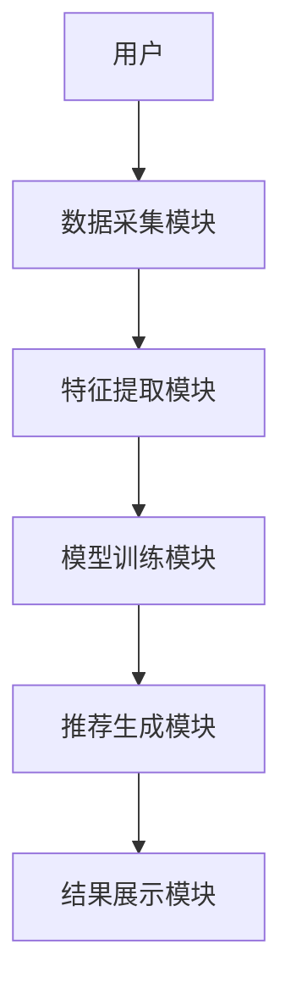

                 


# 《构建智能企业知识推荐系统：个性化学习与技能提升》

---

## 关键词：
- 智能推荐系统  
- 个性化学习  
- 技能提升  
- 人工智能  
- 企业知识管理  

---

## 摘要：
本文旨在探讨如何通过构建智能企业知识推荐系统，实现个性化学习与技能提升。文章从背景介绍、核心概念、算法原理、系统架构设计到项目实战，全面解析如何利用人工智能技术，为企业员工提供精准的知识推荐，助力技能提升和企业知识管理。通过本文的学习，读者将能够理解推荐系统的原理，并掌握实际应用中的关键技术和实施方法。

---

## 正文：

### 第一部分：背景与核心概念

#### 第一章：问题背景
##### 1.1 问题背景
现代企业面临着知识分散、员工学习资源不足的挑战。员工需要快速获取与工作相关的知识，但由于信息量大且分散，难以高效学习。此外，员工的学习需求因人而异，传统的一刀切推荐方式难以满足个性化需求。

##### 1.2 问题描述
- 知识分散：企业内部知识分布在不同的系统和文档中，员工难以快速找到所需内容。
- 学习资源不足：员工需要根据自身需求选择学习资源，但推荐系统无法提供个性化建议。
- 个性化需求：员工的学习目标和节奏不同，需要个性化的推荐策略。

##### 1.3 解决方法
通过构建智能推荐系统，利用机器学习和自然语言处理技术，分析员工的学习需求和行为，推荐个性化知识资源。

##### 1.4 边界与外延
- 系统边界：仅关注知识推荐，不涉及知识生成或内容创作。
- 外延：推荐系统可以扩展到其他领域，如产品推荐或资源分配。

##### 1.5 核心要素
- 用户特征：员工的学习目标、兴趣和行为。
- 知识内容：企业内部的知识库和资源。
- 行为数据：员工的学习记录和交互行为。

---

#### 第二章：推荐系统核心概念
##### 2.1 推荐系统定义
推荐系统是一种利用技术手段，根据用户需求和行为，推荐相关内容或资源的系统。

##### 2.2 推荐系统类型
- 协同过滤：基于用户行为相似性推荐。
- 基于内容的推荐：基于内容特征推荐。
- 混合推荐：结合协同过滤和基于内容的推荐。

##### 2.3 推荐系统优势
- 提高学习效率：通过个性化推荐，用户快速找到所需内容。
- 增强用户体验：推荐符合用户需求的内容，提升满意度。
- 降低信息过载：通过推荐减少用户筛选信息的时间。

##### 2.4 推荐系统挑战
- 数据稀疏性：用户行为数据不足，影响推荐准确性。
- 计算复杂性：处理大规模数据需要高效算法和计算资源。
- 用户隐私：保护用户数据隐私，避免滥用。

---

### 第二部分：算法原理

#### 第三章：协同过滤推荐
##### 3.1 协同过滤原理
协同过滤基于用户行为相似性推荐内容。例如，如果用户A和用户B的行为相似，推荐用户A喜欢的内容给用户B。

##### 3.2 基于用户的协同过滤
- 计算用户相似度：使用余弦相似度或皮尔逊相关系数。
- 推荐目标用户喜欢的内容。

##### 3.3 基于物品的协同过滤
- 计算物品相似度：基于用户对物品的评分或点击数据。
- 推荐与目标物品相似的内容。

##### 3.4 协同过滤优缺点
- 优点：简单易实现，适用于数据稀疏性较低的情况。
- 缺点：计算复杂度高，难以处理大规模数据。

---

#### 第四章：基于内容的推荐
##### 4.1 基于内容的推荐原理
基于内容的推荐系统通过分析内容特征，推荐与用户需求匹配的内容。

##### 4.2 文本处理
- 分词：将文本分割成单词或短语。
- 去停用词：移除无意义的词汇，如“的”、“是”。
- 词向量化：使用词袋模型或词嵌模型将文本转化为向量。

##### 4.3 特征提取
- TF-IDF：计算关键词的重要性。
- Word2Vec：生成词向量表示。

##### 4.4 相似度计算
- 使用余弦相似度计算内容相似度。

##### 4.5 基于内容的推荐优缺点
- 优点：能够处理数据稀疏性问题，推荐结果更准确。
- 缺点：需要高质量的内容特征提取，计算复杂度较高。

---

#### 第五章：深度学习推荐
##### 5.1 深度学习推荐原理
深度学习推荐系统通过神经网络模型，学习用户和内容的特征，进行推荐。

##### 5.2 神经网络结构
- 输入层：接收用户和内容特征。
- 隐藏层：通过非线性变换提取特征。
- 输出层：生成推荐结果。

##### 5.3 注意力机制
- 使用注意力机制，关注重要的特征信息。

##### 5.4 序列模型
- 使用LSTM或GRU处理序列数据，捕捉时序特征。

##### 5.5 深度学习推荐优缺点
- 优点：能够处理复杂特征，推荐结果更精准。
- 缺点：计算资源需求高，模型训练复杂。

---

### 第三部分：系统架构设计

#### 第六章：系统设计原则
##### 6.1 模块化设计
将系统划分为数据采集、特征提取、模型训练、推荐生成和结果展示等模块。

##### 6.2 扩展性设计
确保系统能够扩展，支持新增功能和数据源。

##### 6.3 高效性设计
优化数据处理和模型训练流程，提升系统性能。

##### 6.4 安全性设计
保护用户数据隐私，确保系统安全。

---

#### 第七章：系统功能模块
##### 7.1 数据采集模块
- 采集用户行为数据和知识内容数据。

##### 7.2 特征提取模块
- 对知识内容进行特征提取，生成内容向量。

##### 7.3 模型训练模块
- 训练推荐模型，生成推荐结果。

##### 7.4 推荐生成模块
- 根据用户特征和内容特征，生成推荐列表。

##### 7.5 结果展示模块
- 将推荐结果展示给用户，提供反馈机制。

---

#### 第八章：系统架构图
##### 8.1 系统架构图


---

### 第四部分：项目实战

#### 第九章：环境搭建与数据准备
##### 9.1 环境搭建
- 安装Python、Jupyter Notebook、TensorFlow和Keras。

##### 9.2 数据准备
- 下载公开的知识库数据集，如维基百科或企业内部文档。

##### 9.3 数据预处理
- 数据清洗：处理缺失值和异常值。
- 数据转换：将数据转换为模型训练所需格式。

---

#### 第十章：系统实现
##### 10.1 数据预处理
```python
import pandas as pd

# 读取数据
data = pd.read_csv('knowledge_base.csv')

# 数据清洗
data.dropna(inplace=True)
```

##### 10.2 模型训练
```python
from sklearn.model_selection import train_test_split
from sklearn.metrics.pairwise import cosine_similarity

# 划分训练集和测试集
X_train, X_test = train_test_split(data, test_size=0.2)

# 训练协同过滤模型
similarity = cosine_similarity(X_train)
```

##### 10.3 接口开发
```python
from flask import Flask, jsonify

app = Flask(__name__)

@app.route('/recommend', methods=['POST'])
def recommend():
    user_id = request.json['user_id']
    # 调用推荐算法
    recommendations = get_recommendations(user_id)
    return jsonify({'recommendations': recommendations})
```

##### 10.4 前端展示
```html
<!DOCTYPE html>
<html>
<head>
    <title>知识推荐系统</title>
</head>
<body>
    <h1>推荐知识</h1>
    <ul id="recommendations"></ul>
    <script src="recommend.js"></script>
</body>
</html>
```

---

#### 第十一章：实际案例分析
##### 11.1 案例背景
某企业希望通过推荐系统，帮助员工快速找到所需的知识资源。

##### 11.2 实施步骤
1. 数据采集：收集员工的学习记录和知识库数据。
2. 数据处理：清洗和转换数据。
3. 模型训练：训练协同过滤和基于内容的推荐模型。
4. 接口开发：开发RESTful API。
5. 前端展示：实现推荐结果展示。

##### 11.3 实施结果
- 提高了员工学习效率，减少了知识获取时间。
- 用户满意度提升，员工反馈推荐结果精准。

---

### 第五部分：总结与展望

#### 第十二章：系统总结
##### 12.1 系统总结
通过构建智能企业知识推荐系统，利用协同过滤、基于内容的推荐和深度学习推荐算法，实现了个性化知识推荐，提升了员工学习效率和企业知识管理水平。

##### 12.2 经验与教训
- 数据质量对推荐效果影响较大，需加强数据清洗和特征提取。
- 深度学习模型计算资源需求高，需优化模型结构和训练流程。

---

#### 第十三章：未来展望
##### 13.1 技术发展趋势
- 更加个性化推荐：结合用户实时行为和上下文信息。
- 多模态推荐：结合文本、图像和视频等多种内容形式。
- 智能化推荐：利用强化学习优化推荐策略。

##### 13.2 应用场景拓展
- 应用于教育领域，为学生提供个性化学习资源。
- 应用于电子商务，为用户提供个性化产品推荐。

##### 13.3 挑战与机遇
- 挑战：数据隐私保护、模型计算效率。
- 机遇：技术进步推动推荐系统创新。

---

## 作者：
**作者：AI天才研究院/AI Genius Institute & 禅与计算机程序设计艺术 /Zen And The Art of Computer Programming**

