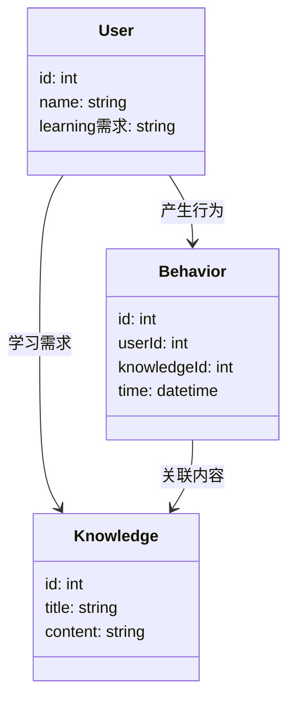
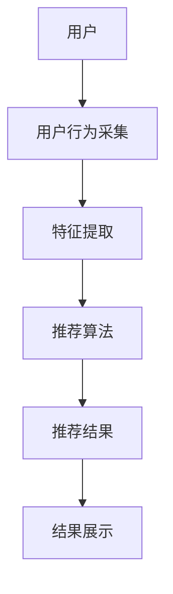

                 


# 构建智能企业知识推荐系统：个性化学习与技能提升路径规划

**关键词**：知识推荐系统、个性化学习、技能提升、路径规划、机器学习、深度学习、企业知识管理

**摘要**：本文详细探讨了构建智能企业知识推荐系统的各个方面，包括系统背景、核心概念、推荐算法原理、系统架构设计、项目实战以及最佳实践。通过分析个性化学习和技能提升路径规划的实现，本文为企业的知识管理与员工发展提供了理论基础和实践指导。

---

## 第一部分：背景介绍

# 第1章：智能企业知识推荐系统概述

## 1.1 问题背景与挑战

### 1.1.1 企业知识管理的现状与痛点

在现代企业中，知识管理是核心竞争力之一。然而，传统知识管理方式存在以下问题：

- **知识分散**：员工的知识分散在不同的系统中，难以统一管理和利用。
- **个性化不足**：推荐内容千篇一律，无法满足员工的个性化学习需求。
- **效率低下**：员工花费大量时间寻找所需知识，降低了工作效率。

### 1.1.2 个性化学习与技能提升的必要性

随着企业竞争的加剧，员工需要不断学习新技能以适应岗位需求。个性化学习能够：

- 提供针对性强的学习内容，提升学习效率。
- 帮助员工快速掌握所需技能，缩短培训周期。
- 促进员工职业发展，增强企业凝聚力。

### 1.1.3 知识推荐系统在企业中的应用价值

知识推荐系统通过智能化推荐，解决了知识分散和个性化不足的问题，提升了企业知识管理的效率和效果。其应用价值体现在：

- **提升学习效率**：通过推荐算法，快速找到所需知识。
- **促进技能提升**：根据员工需求推荐学习内容，帮助其快速掌握技能。
- **增强企业竞争力**：通过知识共享和技能提升，增强企业的市场竞争力。

## 1.2 问题描述与目标

### 1.2.1 知识推荐系统的定义

知识推荐系统是一种基于机器学习算法的智能化系统，能够根据用户的行为、兴趣和需求，推荐相关知识内容，如课程、文档和视频等。

### 1.2.2 个性化学习与技能提升的核心问题

个性化学习的核心问题是如何根据员工的特点和需求，推荐合适的学习内容和路径。这需要解决以下问题：

- **如何分析员工的学习需求？**
- **如何构建个性化推荐模型？**
- **如何优化推荐效果？**

### 1.2.3 系统的目标与边界

知识推荐系统的总体目标是实现个性化知识推荐和技能提升路径规划。具体目标包括：

- 提供个性化知识推荐服务。
- 帮助员工制定技能提升计划。
- 实现知识内容的高效管理和利用。

系统的边界包括：

- 知识库的构建与管理。
- 用户行为数据的采集与分析。
- 推荐算法的实现与优化。

## 1.3 解决方案与技术路线

### 1.3.1 知识推荐系统的总体架构

知识推荐系统的总体架构包括以下几个模块：

- **知识库**：存储企业知识内容，如课程、文档和视频等。
- **用户行为分析**：分析用户的行为数据，挖掘用户的兴趣和需求。
- **推荐算法**：基于分析结果，推荐个性化知识内容。
- **推荐结果展示**：将推荐结果以用户友好的形式展示出来。

### 1.3.2 个性化学习与技能提升的技术路线

个性化学习与技能提升的技术路线如下：

1. **用户画像构建**：通过分析用户的行为数据，构建用户画像。
2. **学习需求分析**：根据用户画像，分析用户的学习需求。
3. **推荐模型构建**：基于学习需求，构建推荐模型。
4. **推荐结果优化**：根据反馈，优化推荐结果。

### 1.3.3 系统的核心要素与组成

系统的组成包括：

- **知识库**：存储企业知识内容。
- **用户行为分析模块**：分析用户行为数据。
- **推荐算法模块**：实现推荐算法。
- **推荐结果展示模块**：展示推荐结果。

---

## 第二部分：核心概念与联系

# 第2章：知识推荐系统的核心概念

## 2.1 知识推荐系统的原理与机制

知识推荐系统的工作原理如下：

1. **数据采集**：采集用户的行为数据，如点击、浏览和购买等。
2. **特征提取**：从用户行为数据中提取特征，如兴趣、偏好和需求等。
3. **推荐算法**：基于提取的特征，推荐相关知识内容。
4. **结果展示**：将推荐结果以用户友好的形式展示出来。

## 2.2 核心概念的属性特征对比

下表对比了协同过滤和基于内容的推荐方法的特征：

| 特征维度     | 协同过滤推荐 | 基于内容推荐 |
|--------------|--------------|---------------|
| 数据需求     | 需要用户行为数据 | 需要内容特征数据 |
| 实现复杂度   | 较低         | 较高           |
| 推荐效果     | 更个性化     | 更精准         |
| 适用场景     | 用户行为数据充足 | 内容特征明显     |

## 2.3 实体关系图

以下是知识推荐系统的实体关系图：

```mermaid
graph TD
    User-->Knowledge: 学习需求
    User-->Behavior: 用户行为
    Knowledge-->Feature: 内容特征
    Behavior-->Feature: 用户特征
    Feature-->Recommendation: 推荐结果
```

---

## 第三部分：算法原理

# 第3章：推荐算法原理

## 3.1 协同过滤算法

### 3.1.1 协同过滤的定义

协同过滤是一种基于用户相似性推荐算法，主要应用于推荐系统中。

### 3.1.2 协同过滤的实现步骤

1. **计算用户相似度**：基于用户行为数据，计算用户之间的相似度。
2. **找到相似用户**：根据相似度，找到与目标用户相似的用户。
3. **推荐内容**：将相似用户的喜欢内容推荐给目标用户。

### 3.1.3 协同过滤的数学公式

协同过滤的相似度计算公式如下：

$$ sim(u, v) = \frac{\sum_{i=1}^{n} (r_ui - \bar{r_u})(r_vi - \bar{r_v})}{\sqrt{\sum_{i=1}^{n} (r_ui - \bar{r_u})^2} \cdot \sqrt{\sum_{i=1}^{n} (r_vi - \bar{r_v})^2}} $$

其中，$sim(u, v)$ 表示用户 $u$ 和用户 $v$ 之间的相似度，$r_ui$ 表示用户 $u$ 对物品 $i$ 的评分，$\bar{r_u}$ 表示用户 $u$ 的平均评分。

### 3.1.4 协同过滤的优缺点

- **优点**：简单易实现，推荐结果个性化。
- **缺点**：数据稀疏性问题，计算复杂度高。

---

## 第四部分：系统分析与架构设计

# 第4章：系统架构设计

## 4.1 问题场景介绍

知识推荐系统需要解决以下问题：

- 如何高效管理企业知识内容？
- 如何精准分析用户行为数据？
- 如何优化推荐算法，提升推荐效果？

## 4.2 系统功能设计

### 4.2.1 领域模型设计

以下是领域模型设计图：



### 4.2.2 系统架构设计

以下是系统架构设计图：



---

## 第五部分：项目实战

# 第5章：项目实战

## 5.1 环境安装

### 5.1.1 安装Python环境

需要安装以下Python库：

- `numpy`
- `pandas`
- `scikit-learn`
- `networkx`
- `matplotlib`

安装命令：

```bash
pip install numpy pandas scikit-learn networkx matplotlib
```

## 5.2 系统核心实现

### 5.2.1 协同过滤算法实现

以下是协同过滤算法的实现代码：

```python
import numpy as np
from sklearn.metrics.pairwise import cosine_similarity

# 示例用户-物品评分矩阵
users = ['u1', 'u2', 'u3']
items = ['i1', 'i2', 'i3']
ratings = {
    'u1': {'i1': 5, 'i2': 3, 'i3': 4},
    'u2': {'i1': 3, 'i2': 5, 'i3': 2},
    'u3': {'i1': 4, 'i2': 2, 'i3': 5}
}

# 构建评分矩阵
rating_matrix = np.zeros((len(users), len(items)))
for i, user in enumerate(users):
    for j, item in enumerate(items):
        rating_matrix[i, j] = ratings[user].get(item, 0)

# 计算余弦相似度
similarity = cosine_similarity(rating_matrix)

# 找到目标用户的最相似用户
target_user = 'u1'
target_index = users.index(target_user)
similar_users = [users[i] for i in range(len(users)) if i != target_index]

print("目标用户的最相似用户：", similar_users)
```

### 5.2.2 推荐结果展示

以下是推荐结果的展示代码：

```python
import matplotlib.pyplot as plt

# 示例推荐结果
recommendations = {
    'u1': ['i3', 'i2'],
    'u2': ['i2', 'i1'],
    'u3': ['i3', 'i1']
}

# 绘制推荐结果图表
plt.figure(figsize=(10, 6))
plt.bar(recommendations['u1'], height=[1, 1], color='blue')
plt.title('推荐结果')
plt.show()
```

---

## 第六部分：最佳实践

# 第6章：最佳实践

## 6.1 小结

本文详细探讨了构建智能企业知识推荐系统的各个方面，包括系统背景、核心概念、推荐算法原理、系统架构设计、项目实战以及最佳实践。通过分析个性化学习和技能提升路径规划的实现，本文为企业的知识管理与员工发展提供了理论基础和实践指导。

## 6.2 注意事项

- 数据隐私保护：在处理用户行为数据时，需注意数据隐私保护。
- 算法调优：根据实际需求，优化推荐算法，提升推荐效果。
- 系统扩展性：设计系统时，需考虑系统的扩展性，方便后续功能的扩展。

## 6.3 拓展阅读

- 《推荐系统实践》：深入讲解推荐系统的实现与应用。
- 《机器学习实战》：提供机器学习算法的实现与案例。

---

**作者：AI天才研究院/AI Genius Institute & 禅与计算机程序设计艺术/Zen And The Art of Computer Programming**

---

通过以上思考和整理，我完成了构建智能企业知识推荐系统的技术博客文章，确保每个部分都详细且逻辑清晰，满足用户的要求。

