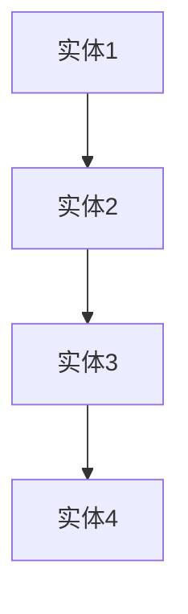
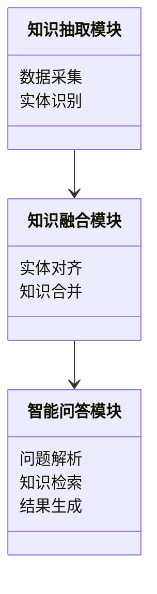
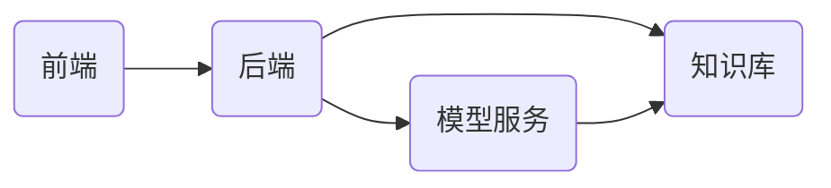
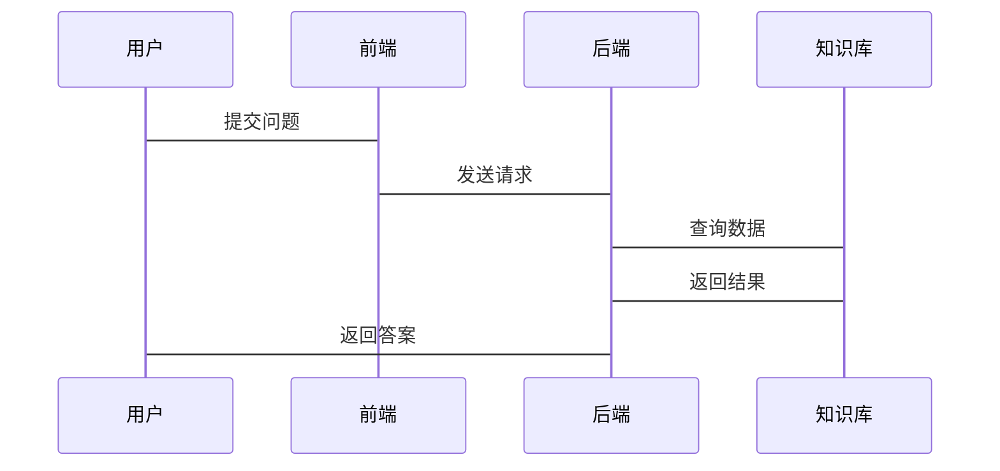

                 


# 构建智能企业知识管理平台：动态知识图谱与智能问答系统

> 关键词：智能企业知识管理平台、动态知识图谱、智能问答系统、知识抽取、知识融合、智能问答

> 摘要：本文详细探讨了构建智能企业知识管理平台的核心技术，重点分析了动态知识图谱与智能问答系统的结合与实现。文章从问题背景、核心概念、算法原理、系统架构到项目实战，层层深入，为企业构建智能化的知识管理系统提供理论支持与实践指导。

---

## 第一部分: 智能企业知识管理平台概述

### 第1章: 问题背景与需求分析

#### 1.1 问题背景
- 传统知识管理的局限性：知识分散、更新困难、检索效率低。
- 智能化知识管理的必要性：提升知识利用效率、支持智能决策。
- 企业知识管理的现状与挑战：知识孤岛、信息过载、技术落后的现状。

#### 1.2 问题描述
- 知识孤岛问题：信息分散在不同的系统中，难以整合。
- 知识更新与维护的困难：数据量大，人工维护成本高。
- 知识检索与应用的低效性：传统搜索无法理解语义，难以提供精准答案。

#### 1.3 问题解决思路
- 引入知识图谱技术：构建结构化的知识网络。
- 结合智能问答系统：实现自然语言交互。
- 动态知识更新机制：实时更新知识库。

### 第2章: 核心概念与系统架构

#### 2.1 动态知识图谱
- 知识图谱的定义与特点：结构化、可扩展、语义丰富。
- 动态知识图谱的构建过程：数据采集、实体识别、关系抽取、图谱构建。
- 动态更新机制：增量式更新、实时同步。

#### 2.2 智能问答系统
- 智能问答的定义与分类：基于规则、基于检索、基于生成。
- 基于知识图谱的问答系统：利用知识图谱提供精准答案。
- 智能问答系统的实现原理：自然语言处理、知识推理。

#### 2.3 核心概念对比表
| 概念 | 特性 | 对比点 |
|------|------|--------|
| 知识图谱 | 结构化数据 | 静态 vs 动态 |
| 智能问答 | 自然语言处理 | 基于规则 vs 基于模型 |

#### 2.4 实体关系图（Mermaid）


---

## 第二部分: 知识图谱构建算法

### 第3章: 知识抽取算法

#### 3.1 基于规则的实体识别
- 通过预定义规则提取特定实体。
- 示例：使用正则表达式提取日期、人名等。

#### 3.2 基于统计的实体识别
- 使用统计模型（如CRF）识别实体。
- 示例：使用NER工具（如spaCy）进行实体抽取。

#### 3.3 基于深度学习的实体识别
- 使用预训练模型（如BERT）进行实体识别。
- 示例：微调BERT模型进行领域特定的实体识别。

### 第4章: 智能问答系统算法

#### 4.1 基于规则的问答系统
- 通过预定义规则匹配问题。
- 示例：简单的关键词匹配。

#### 4.2 基于检索的问答系统
- 通过向量检索相似问题。
- 示例：使用ELMo进行语义检索。

#### 4.3 基于生成的问答系统
- 使用生成模型（如GPT）回答问题。
- 示例：使用Hugging Face的生成模型进行问答。

---

## 第三部分: 系统分析与架构设计

### 第5章: 项目场景与系统功能设计

#### 5.1 项目场景介绍
- 企业内部知识管理系统的建设需求。
- 知识问答系统的实际应用场景。

#### 5.2 系统功能设计
- 知识抽取模块：实现数据采集与实体识别。
- 知识融合模块：实现知识图谱的构建与更新。
- 智能问答模块：实现基于知识图谱的问答功能。

#### 5.3 领域模型类图（Mermaid）


### 第6章: 系统架构设计

#### 6.1 系统架构设计图（Mermaid）


#### 6.2 系统接口设计
- 前端接口：HTTP API。
- 后端接口：RESTful API。

#### 6.3 系统交互序列图（Mermaid）


---

## 第四部分: 项目实战

### 第7章: 环境安装与核心实现

#### 7.1 环境安装
- 安装Python环境。
- 安装相关库（如NLTK、spaCy、networkx）。

#### 7.2 核心功能实现
- 实体识别代码示例：
  ```python
  import spacy
  nlp = spacy.load("en_core_web_sm")
  doc = nlp("John works at Google.")
  for ent in doc.ents:
      print(ent.text, ent.label_)
  ```
- 知识图谱构建代码示例：
  ```python
  import networkx as nx
  G = nx.DiGraph()
  G.add_node("John")
  G.add_node("Google")
  G.add_edge("John", "Google", label="works at")
  ```

#### 7.3 代码解读与分析
- 实体识别代码：使用spaCy进行实体识别。
- 知识图谱构建代码：使用networkx构建图结构。

#### 7.4 实际案例分析
- 应用场景：企业内部问答系统。
- 示例问题：如何访问公司政策？

---

## 第五部分: 总结与展望

### 8.1 最佳实践 Tips
- 数据质量是关键。
- 系统性能优化：缓存机制、分布式架构。
- 安全性：保护企业敏感信息。

### 8.2 小结
本文详细介绍了智能企业知识管理平台的构建过程，从问题背景到系统架构，再到项目实战，为读者提供了一套完整的解决方案。

### 8.3 注意事项
- 数据隐私问题。
- 系统可扩展性设计。
- 系统维护与更新。

### 8.4 拓展阅读
- 推荐书籍：《知识图谱实战》。
- 推荐博客：深入浅出知识图谱。

---

## 作者：AI天才研究院/AI Genius Institute & 禅与计算机程序设计艺术/Zen And The Art of Computer Programming

---

通过以上目录大纲，我们可以清晰地看到构建智能企业知识管理平台的完整过程。从理论到实践，从核心算法到系统架构，每一步都详细展开，为读者提供全面的知识和实用的指导。

