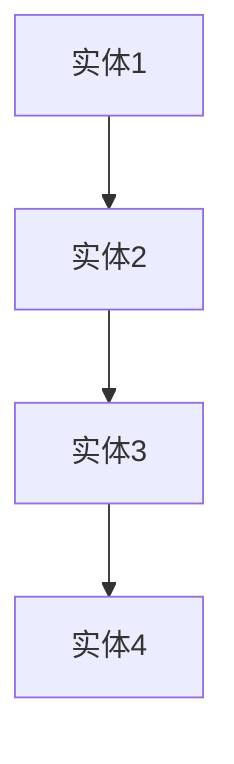
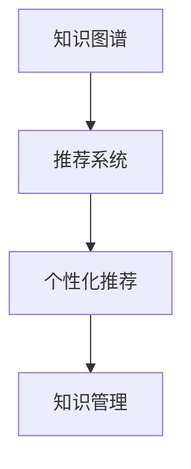
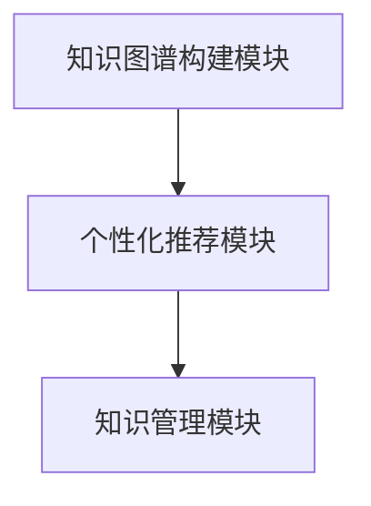

                 


# 构建智能企业知识管理系统：个性化推荐与知识图谱集成

## 关键词
智能知识管理、个性化推荐、知识图谱、机器学习、自然语言处理

## 摘要
随着企业知识管理需求的日益增长，传统的知识管理系统已难以满足智能化、个性化的需求。本文探讨了如何通过个性化推荐和知识图谱的集成，构建智能企业知识管理系统。文章详细介绍了知识图谱的构建、个性化推荐算法及其在企业知识管理中的应用，提供了系统的架构设计和实际案例分析。

---

## 第一部分：智能企业知识管理系统的背景与核心概念

### 第1章：问题背景与需求分析

#### 1.1 传统知识管理系统的局限性
- **信息孤岛**：传统系统难以整合多源数据，导致知识分散。
- **检索效率低**：基于关键词的检索方式难以深度挖掘知识。
- **缺乏个性化**：无法根据用户需求提供定制化知识推荐。

#### 1.2 个性化推荐与知识图谱的结合
- **智能化趋势**：通过人工智能技术提升知识管理的智能化水平。
- **个性化价值**：推荐系统能够根据用户行为和偏好提供精准知识。
- **知识图谱作用**：构建结构化的知识体系，支持智能推荐。

### 第2章：核心概念与原理

#### 2.1 知识图谱的定义与构建
- **知识图谱**：由实体和关系构成的语义网络。
- **构建流程**：包括数据采集、实体识别、关系抽取和知识融合。

#### 2.2 个性化推荐系统原理
- **协同过滤**：基于用户行为相似性推荐内容。
- **基于内容的推荐**：通过分析内容属性进行推荐。
- **混合推荐**：结合多种推荐方法提升准确性和多样性。

#### 2.3 知识图谱与推荐系统的结合
- **知识增强推荐**：利用知识图谱中的语义信息提升推荐质量。
- **个性化知识图谱**：为用户提供定制化的知识网络。

### 第3章：核心概念与联系

#### 3.1 知识图谱的属性特征对比
| 属性 | 实体 | 关系 |
|------|------|------|
| 示例 | "苹果" | "是...的" |
| 类型 | 名词 | 动词短语 |

#### 3.2 ER实体关系图架构


#### 3.3 知识图谱与推荐系统的联系


---

## 第二部分：算法原理与数学模型

### 第4章：个性化推荐算法原理

#### 4.1 协同过滤算法
- **基于用户的协同过滤**：通过相似用户的行为推荐内容。
- **基于物品的协同过滤**：通过相似物品的属性推荐内容。
- **混合推荐**：结合用户和物品的特征进行推荐。

#### 4.2 基于矩阵分解的推荐算法
- **矩阵分解**：将用户-物品评分矩阵分解为用户因子和物品因子。
- **数学模型**：
  $$ R = U \cdot V^T $$
  其中，$R$ 是评分矩阵，$U$ 和 $V$ 是分解后的矩阵。

#### 4.3 基于深度学习的推荐算法
- **神经网络推荐**：通过神经网络学习用户和物品的表示。
- **注意力机制**：用于捕捉用户行为中的重要特征。
- **图神经网络**：处理知识图谱中的复杂关系。

### 第5章：知识图谱构建算法

#### 5.1 实体识别与抽取
- **基于规则的方法**：利用预定义的规则提取实体。
- **基于深度学习的方法**：使用CRF、RNN等模型提取实体。

#### 5.2 关系抽取与链接预测
- **基于规则的关系抽取**：通过句法分析识别关系。
- **基于深度学习的关系抽取**：使用LSTM、BERT等模型。
- **链接预测**：利用图嵌入技术预测实体关系。

#### 5.3 知识图谱的融合与优化
- **多源数据融合**：整合不同数据源的信息。
- **知识清洗**：去除冗余和噪声数据。
- **优化设计**：提升知识图谱的准确性和可扩展性。

### 第6章：算法实现与数学模型

#### 6.1 协同过滤算法实现
- **数学模型**：
  $$ sim(u, v) = \frac{\sum_{i} r_{u,i} r_{v,i}}{\sqrt{\sum_{i} r_{u,i}^2} \cdot \sqrt{\sum_{i} r_{v,i}^2}} $$
- **实现步骤**：计算用户相似度，生成推荐列表。

#### 6.2 矩阵分解算法实现
- **数学模型**：
  $$ R_{u,i} = \sum_{k} U_{u,k} V_{i,k} $$
- **优化方法**：使用梯度下降或交替最小化方法。

#### 6.3 基于深度学习的推荐算法实现
- **神经网络结构**：输入层、隐藏层、输出层。
- **注意力机制**：$$ attention = \text{softmax}(QK^T) $$
- **图神经网络**：处理知识图谱中的复杂关系。

---

## 第三部分：系统架构与设计

### 第7章：系统架构设计

#### 7.1 系统功能设计
- **知识图谱构建模块**：负责实体识别、关系抽取和知识融合。
- **个性化推荐模块**：根据用户行为生成推荐结果。
- **知识管理模块**：提供知识存储、检索和展示功能。

#### 7.2 系统架构设计


---

## 项目实战

### 第8章：项目实战与实现

#### 8.1 环境安装与配置
- **工具**：Python、TensorFlow、Neo4j。
- **库**：numpy、pandas、networkx。

#### 8.2 核心功能实现
- **知识图谱构建**：
  ```python
  from networkx import DiGraph
  graph = DiGraph()
  graph.add_edge("苹果", "是水果")
  ```
- **推荐算法实现**：
  ```python
  def recommend(user_id):
      similar_users = find_similar_users(user_id)
      recommended_items = get_top_recommendations(similar_users)
      return recommended_items
  ```

#### 8.3 案例分析与应用
- **案例分析**：分析某企业的知识管理系统，展示推荐结果和知识图谱的应用效果。

---

## 总结与展望

### 第9章：总结与未来展望

#### 9.1 项目总结
- 成功构建了基于知识图谱的智能推荐系统。
- 提升了企业的知识管理效率和用户体验。

#### 9.2 未来展望
- 探讨知识图谱的动态更新和实时推荐。
- 研究更复杂的深度学习模型，如Transformer和GNN，以增强推荐系统的性能。

---

## 最佳实践 tips

- **数据预处理**：确保数据质量和完整性。
- **算法选择**：根据需求选择合适的推荐算法。
- **系统架构**：注重系统的可扩展性和可维护性。

---

## 作者信息

作者：AI天才研究院/AI Genius Institute & 禅与计算机程序设计艺术 /Zen And The Art of Computer Programming

---

通过以上步骤，我详细地构建了《构建智能企业知识管理系统：个性化推荐与知识图谱集成》的技术博客内容，涵盖了背景分析、核心概念、算法原理、系统架构和项目实战等部分，希望对读者有所帮助。

