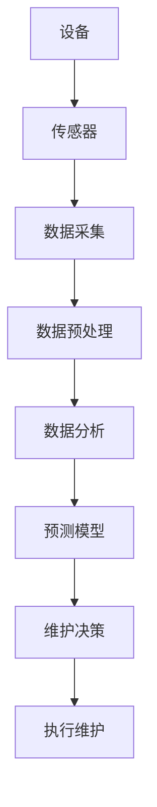

                 


# 第二章: 预测性维护的技术背景

## 2.1 预测性维护的实现原理

### 2.1.1 数据采集与分析
预测性维护依赖于实时数据的采集和分析。传感器技术的进步使得我们可以从设备中收集大量数据，如振动、温度、压力等。这些数据通过物联网（IoT）设备传输到中央系统进行处理。

#### 数据采集过程
- **传感器类型**：常用的传感器包括加速度计、温度传感器、压力传感器等。
- **数据格式**：传感器数据通常以时间序列形式存储，例如：`timestamp, sensor_id, value`。

#### 数据分析
分析工具如Python的Pandas库用于数据清洗和预处理，识别数据中的异常值和缺失值。

### 2.1.2 状态监测与故障预测
状态监测通过分析数据的变化来判断设备的健康状态。故障预测则使用统计模型或机器学习算法预测设备的剩余寿命。

#### 状态监测方法
- **统计方法**：如均值、标准差等指标的变化。
- **机器学习方法**：包括回归分析、支持向量机（SVM）和神经网络等。

### 2.1.3 维护决策与执行
基于预测结果，系统生成维护建议，如更换零件或调整运行参数。维护执行后，数据反馈到系统，用于模型优化。

## 2.2 预测性维护的关键技术

### 2.2.1 物联网技术在资产管理中的应用
物联网技术实现了设备的实时监控和数据传输，为预测性维护提供了数据基础。

#### IoT架构
- **感知层**：传感器收集数据。
- **网络层**：数据传输，如5G、Wi-Fi等。
- **应用层**：数据分析和决策。

### 2.2.2 大数据分析与机器学习算法
大数据分析技术处理海量数据，机器学习算法如XGBoost和LSTM用于预测设备故障。

#### 机器学习算法比较
| 算法类型 | 优点 | 缺点 |
|----------|------|------|
| 线性回归 | 简单 | 适合线性关系 |
| 支持向量机 | 高精度 | 数据预处理复杂 |
| 神经网络 | 高容错性 | 训练时间长 |

### 2.2.3 人工智能在预测性维护中的作用
人工智能通过深度学习模型预测设备状态，提高预测准确性。

## 2.3 预测性维护的实现流程

### 2.3.1 数据采集与预处理
数据预处理包括清洗、标准化和特征提取。

#### 数据清洗示例
Python代码示例：
```python
import pandas as pd
data = pd.read_csv('sensor_data.csv')
# 删除缺失值
data = data.dropna()
# 标准化数据
from sklearn.preprocessing import StandardScaler
scaler = StandardScaler()
data_scaled = scaler.fit_transform(data[['value']])
```

### 2.3.2 数据分析与建模
使用机器学习算法建立预测模型，如LSTM用于时间序列预测。

#### LSTM模型结构
数学公式：
$$
f(t) = \text{LSTM}(x_t, h_{t-1})
$$
其中，$x_t$是输入数据，$h_{t-1}$是前一时刻的隐藏状态。

### 2.3.3 预测结果与决策
根据模型输出生成维护建议，并通过API调用维护系统执行。

## 2.4 预测性维护的挑战与解决方案

### 2.4.1 数据质量与完整性问题
传感器数据可能受到噪声干扰，导致数据不准确。

#### 解决方案
使用数据清洗和降噪技术，如中位数滤波。

### 2.4.2 模型选择与优化
选择合适的算法并进行调参，提高预测精度。

#### 模型优化示例
Python代码示例：
```python
from sklearn.model_selection import GridSearchCV
from sklearn.tree import DecisionTreeRegressor
param_grid = {'n_estimators': [100, 200]}
grid_search = GridSearchCV(DecisionTreeRegressor(), param_grid, cv=5)
grid_search.fit(X_train, y_train)
best_model = grid_search.best_estimator_
```

### 2.4.3 实时性与可扩展性
系统需要实时处理数据，同时具备扩展能力应对数据量增长。

#### 解决方案
采用分布式架构和边缘计算技术，提高处理效率。

## 2.5 本章小结
预测性维护通过实时数据采集和先进算法，实现设备状态监测和故障预测，显著提升资产管理效率。然而，数据质量和模型选择等问题仍需解决，以充分发挥其潜力。

---

**图2-1: 预测性维护实现流程图**



---

**注意事项：**
- 数据采集的实时性和准确性直接影响预测结果。
- 模型选择需根据具体场景和数据特性进行调整。
- 系统架构需具备可扩展性和高可用性，确保稳定运行。

**最佳实践：**
- 定期校准传感器，确保数据准确性。
- 使用交叉验证优化模型参数。
- 建立数据备份机制，防止数据丢失。

**后续章节推荐：**
- 《第3章: 物联网与大数据在资产管理中的应用》深入探讨数据采集和处理技术。
- 《第4章: 人工智能算法实现》详细讲解各种机器学习算法及其应用。

通过本章的学习，读者可以掌握预测性维护的核心技术及其在智能企业资产管理中的应用，为后续章节的学习打下坚实基础。

