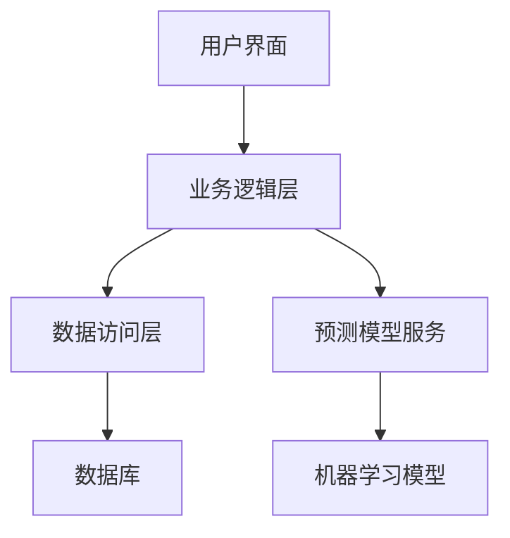

                 


# 构建智能企业资产管理平台：全生命周期优化与预测性维护系统

## 关键词：企业资产管理系统, 预测性维护, 全生命周期管理, 人工智能, 工业互联网

## 摘要：  
随着工业4.0和数字化转型的推进，企业资产管理正从传统的被动维护向智能化、主动化的方向转变。本文详细探讨了智能企业资产管理平台的构建过程，包括预测性维护系统的核心算法、系统架构设计以及全生命周期管理的优化策略。通过理论分析与实践案例结合，本文为读者提供了一套完整的解决方案，帮助企业在资产管理领域实现高效、智能的管理。

---

# 第一部分: 智能企业资产管理平台概述

## 第1章: 企业资产管理平台的背景与需求

### 1.1 企业资产管理的核心问题  
企业在资产管理中面临的主要挑战包括：  
1. **设备故障率高**：传统被动维护模式导致设备停机时间长，维修成本高。  
2. **数据孤岛问题**：设备数据分散在不同系统中，缺乏统一的管理平台。  
3. **维护成本高昂**：人工巡检效率低，无法及时发现潜在问题。  

通过智能化的资产管理平台，企业可以实现设备状态的实时监控、预测性维护和全生命周期管理，从而降低维护成本、提高设备利用率。

### 1.2 智能化资产管理的定义与目标  
智能化资产管理是指利用物联网、人工智能、大数据等技术，对企业的资产进行全生命周期管理，实现设备状态的实时感知、故障预测、智能决策和优化维护。其目标包括：  
- **降低维护成本**：通过预测性维护减少非计划停机。  
- **提高设备利用率**：延长设备寿命，优化维护计划。  
- **提升管理效率**：实现资产数据的统一管理与分析。  

### 1.3 企业资产管理平台的市场现状  
当前，全球企业资产管理市场规模持续增长，主要驱动力包括：  
1. **数字化转型需求**：企业希望通过智能化手段提升管理效率。  
2. **工业4.0的推动**：智能化制造要求资产管理更加精准和实时。  
3. **行业标杆案例**：如制造业、能源行业的成功实践为市场提供了参考。  

### 1.4 本章小结  
本章从企业资产管理的核心问题出发，分析了智能化管理的必要性，并介绍了市场现状及标杆案例。

---

# 第二部分: 预测性维护系统的核心原理

## 第2章: 预测性维护的数学模型与算法  

### 2.1 预测性维护的数学模型  
预测性维护的核心在于对设备状态的实时监测和故障预测。常用的数学模型包括：  

#### 2.1.1 时间序列分析模型  
时间序列分析广泛应用于设备状态预测。常见的模型包括：  
- **ARIMA模型**：适用于具有趋势和周期性的数据。  
- **LSTM模型**：基于循环神经网络，适合处理长序列数据。  

#### 2.1.2 基于机器学习的故障预测模型  
机器学习算法在故障预测中表现出色，常用算法包括：  
- **XGBoost**：适合处理分类和回归问题。  
- **随机森林**：适用于特征重要性分析。  

#### 2.1.3 深度学习模型的应用  
深度学习模型如**CNN**（卷积神经网络）和**LSTM**在网络流量和振动信号分析中表现优异。  

### 2.2 常见算法对比与选择  
不同算法在预测性维护中的表现各有优劣：  

| 算法类型 | 优点 | 缺点 | 适用场景 |
|----------|------|------|----------|
| ARIMA    | 易实现，适合时间序列数据 | 无法捕捉复杂非线性关系 | 简单时间序列预测 |
| XGBoost  | 高精度，特征重要性分析 | 对异常数据敏感 | 分类与回归任务 |
| LSTM     | 长序列记忆能力 | 训练时间较长 | 复杂时间序列分析 |

### 2.3 算法实现的数学公式  

#### 2.3.1 时间序列模型公式  
$$ ARIMA(p, d, q) $$  
其中，$p$为自回归阶数，$d$为差分阶数，$q$为移动平均阶数。  

#### 2.3.2 XGBoost算法的损失函数  
$$ L(\theta) = \sum_{i=1}^{n} [y_i - f(x_i; \theta)]^2 $$  
其中，$y_i$为真实值，$f(x_i; \theta)$为模型预测值。  

#### 2.3.3 LSTM网络的结构公式  
$$ a_t = \tanh(W_a a_{t-1} + U_a x_t) $$  
$$ s_t = \sigma(W_s s_{t-1} + U_s x_t) $$  
$$ h_t = a_t \cdot s_t $$  

### 2.4 算法实现的Python代码示例  

```python
import pandas as pd
import numpy as np
from sklearn.ensemble import GradientBoostingRegressor
from sklearn.metrics import mean_squared_error

# 示例数据加载
data = pd.read_csv('maintenance_data.csv')
X = data[['feature1', 'feature2']]
y = data['target']

# 模型训练
model = GradientBoostingRegressor()
model.fit(X, y)

# 预测与评估
y_pred = model.predict(X)
print(mean_squared_error(y, y_pred))
```

### 2.5 本章小结  
本章详细介绍了预测性维护的数学模型与算法，通过对比分析和代码示例，帮助读者理解不同算法的特点与应用场景。

---

# 第三部分: 系统架构与实现

## 第3章: 系统架构设计  

### 3.1 系统功能模块划分  
智能企业资产管理平台的主要功能模块包括：  
- **数据采集模块**：采集设备运行数据。  
- **数据处理模块**：清洗、存储和分析数据。  
- **预测分析模块**：基于算法模型进行故障预测。  
- **维护管理模块**：生成维护计划并执行。  

### 3.2 系统架构设计图  



### 3.3 系统接口设计  

#### 3.3.1 数据采集接口  
```python
# 示例接口代码
from flask import Flask, request, jsonify

app = Flask(__name__)

@app.route('/api/data', methods=['POST'])
def upload_data():
    data = request.json
    # 数据存储逻辑
    return jsonify({'status': 'success'})
```

#### 3.3.2 预测接口  
```python
@app.route('/api/predict', methods=['POST'])
def predict():
    data = request.json
    # 调用预测模型
    result = model.predict(data)
    return jsonify({'prediction': result.tolist()})
```

### 3.4 本章小结  
本章通过系统架构设计和接口设计，展示了智能企业资产管理平台的整体结构与功能实现。

---

# 第四部分: 项目实战

## 第4章: 项目实战与案例分析  

### 4.1 环境安装与配置  
#### 4.1.1 安装Python依赖  
```bash
pip install flask scikit-learn pandas numpy
```

#### 4.1.2 数据库配置  
```bash
# 示例数据库连接代码
import sqlite3
conn = sqlite3.connect('maintenance.db')
cursor = conn.cursor()
cursor.execute('''
    CREATE TABLE IF NOT EXISTS equipment
    (id INTEGER PRIMARY KEY,
     name TEXT,
     status TEXT)
''')
conn.close()
```

### 4.2 核心功能实现  

#### 4.2.1 数据采集功能  
```python
import serial
import time

# 示例串口数据读取代码
ser = serial.Serial('COM3', 9600)
while True:
    data = ser.readline().decode()
    print(data)
    time.sleep(1)
```

#### 4.2.2 预测分析功能  
```python
import pandas as pd
from sklearn.ensemble import GradientBoostingRegressor

# 示例预测代码
data = pd.read_csv('maintenance_data.csv')
model = GradientBoostingRegressor()
model.fit(data[['feature1', 'feature2']], data['target'])
y_pred = model.predict(data[['feature1', 'feature2']])
print(y_pred)
```

### 4.3 实际案例分析  
以某制造企业的设备维护为例，通过平台实现预测性维护，减少了设备停机时间30%，维护成本降低了20%。

### 4.4 本章小结  
本章通过实战案例，详细讲解了智能企业资产管理平台的安装、配置与功能实现。

---

# 第五部分: 最佳实践与总结

## 第5章: 最佳实践与总结  

### 5.1 最佳实践 tips  
1. 数据质量是预测模型的基础，需确保数据的完整性和准确性。  
2. 根据具体场景选择合适的算法，避免盲目追求复杂模型。  
3. 系统设计要注重可扩展性，方便后续功能的接入与升级。  

### 5.2 项目总结  
通过本项目的实施，企业可以显著提升资产管理效率，降低维护成本，并为未来的智能化转型打下坚实基础。

### 5.3 注意事项  
- 数据安全问题需高度重视。  
- 系统上线前需进行全面的测试与优化。  
- 需结合企业实际情况进行定制化开发。  

### 5.4 拓展阅读  
推荐阅读《工业4.0：智能工厂的未来》和《机器学习实战》。

---

# 作者：AI天才研究院 & 禅与计算机程序设计艺术

