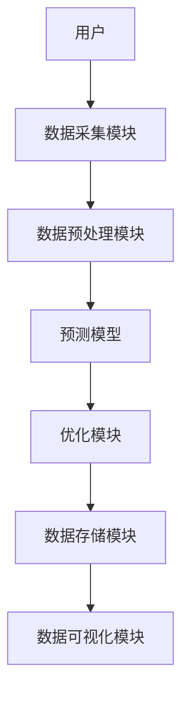
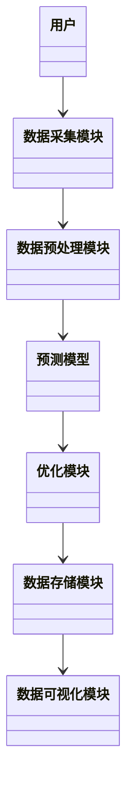
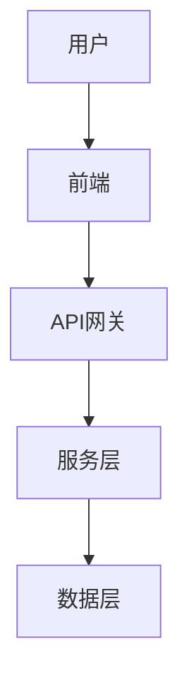
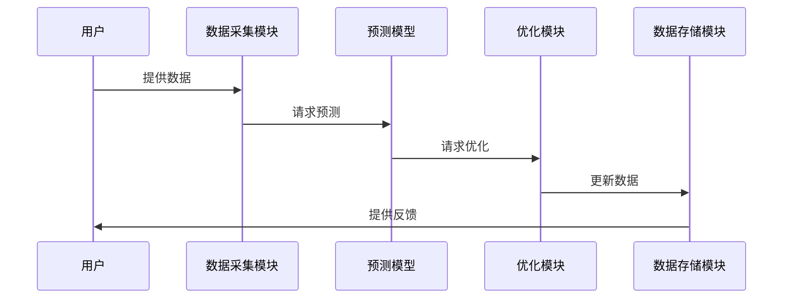

                 


```markdown
# 构建智能企业资源规划(ERP)系统：AI深度集成与实时优化

> 关键词：ERP系统、人工智能、实时优化、深度集成、系统架构、AI算法

> 摘要：本文探讨如何将人工智能技术深度集成到企业资源规划（ERP）系统中，通过实时优化提升企业运营效率。结合具体案例，详细分析了系统的架构设计、核心算法及实现方案，为企业智能化转型提供参考。

---

# 第一部分: 构建智能ERP系统的背景与概述

## 第1章: 智能ERP系统概述

### 1.1 企业资源规划（ERP）系统概述
- **1.1.1 ERP系统的定义与核心功能**
  - ERP系统的定义
  - 核心功能模块：采购、生产、库存、销售、财务等
- **1.1.2 ERP系统的发展历程**
  - 传统ERP系统的特点与局限性
  - 智能ERP系统的发展趋势
- **1.1.3 智能ERP系统的概念与特点**
  - 智能ERP系统的定义
  - 与传统ERP系统的区别
  - 智能ERP系统的优势

### 1.2 AI技术与ERP系统的结合
- **1.2.1 AI技术在企业管理中的应用潜力**
  - 数据分析与预测
  - 自动化决策
  - 实时监控与优化
- **1.2.2 智能ERP系统的应用场景**
  - 生产优化
  - 供应链管理
  - 财务预测
- **1.2.3 智能ERP系统的实现路径**
  - 数据采集与处理
  - 模型训练与部署
  - 实时优化与反馈

### 1.3 本章小结
- 总结智能ERP系统的概念与发展潜力

---

# 第二部分: 智能ERP系统的核心概念与技术

## 第2章: ERP系统的核心架构与数据流

### 2.1 ERP系统的模块化架构
- **2.1.1 模块化设计的原则**
  - 模块独立性
  - 模块化接口
  - 模块间通信
- **2.1.2 各模块之间的关系**
  - 数据流与控制流
  - 模块之间的依赖关系
  - 模块间的数据共享
- **2.1.3 数据流的可视化**
  - 数据流图
  - 数据存储与处理流程

### 2.2 AI技术在ERP系统中的集成点
- **2.2.1 数据采集与处理**
  - 数据源的分类
  - 数据预处理流程
  - 数据存储方案
- **2.2.2 模型训练与部署**
  - AI模型的选择
  - 模型训练流程
  - 模型部署与集成
- **2.2.3 实时优化与反馈**
  - 实时数据处理
  - 优化策略的动态调整
  - 系统反馈与改进

### 2.3 本章小结
- 总结ERP系统的模块化架构与AI技术的集成点

---

## 第3章: AI算法与数学模型

### 3.1 机器学习算法概述
- **3.1.1 监督学习**
  - 线性回归
  - 支持向量机
  - 决策树
- **3.1.2 无监督学习**
  - 聚类分析
  - 主成分分析
- **3.1.3 强化学习**
  - Q-Learning
  - Deep Q-Learning

### 3.2 基于神经网络的ERP优化模型
- **3.2.1 深度学习模型的结构**
  - 卷积神经网络（CNN）
  - 循环神经网络（RNN）
  - Transformer架构
- **3.2.2 模型训练流程**
  - 数据准备
  - 模型训练
  - 模型评估
- **3.2.3 模型优化策略**
  - 超参数调优
  - 模型压缩
  - 模型部署

### 3.3 数学模型与公式
- **3.3.1 线性回归模型**
  $$ y = \beta_0 + \beta_1x + \epsilon $$
- **3.3.2 神经网络模型**
  $$ f(x) = \sigma(wx + b) $$

### 3.4 本章小结
- 总结AI算法在ERP系统中的应用与优化策略

---

## 第4章: 智能ERP系统的模块化架构

### 4.1 数据采集模块
- **4.1.1 数据源的分类**
  - 结构化数据
  - 非结构化数据
- **4.1.2 数据预处理流程**
  - 数据清洗
  - 数据转换
  - 数据增强
- **4.1.3 数据存储方案**
  - 关系型数据库
  - NoSQL数据库
  - 数据仓库

### 4.2 AI预测模块
- **4.2.1 预测模型的选择**
  - 时间序列预测
  - 分类与回归
  - 聚类分析
- **4.2.2 模型训练与部署**
  - 模型训练流程
  - 模型部署与集成
  - 模型监控与维护
- **4.2.3 预测结果的可视化**
  - 图表展示
  - 数据仪表盘
  - 可视化工具

### 4.3 实时优化模块
- **4.3.1 优化目标的设定**
  - 成本最小化
  - 效益最大化
  - 资源利用率
- **4.3.2 优化策略的动态调整**
  - 基于反馈的调整
  - 自适应优化算法
  - 多目标优化
- **4.3.3 优化结果的可视化**
  - 优化前后对比
  - 实时监控
  - 数据驱动的决策支持

### 4.4 系统架构图


### 4.5 本章小结
- 总结智能ERP系统的模块化架构与实现方案

---

## 第5章: 系统分析与架构设计方案

### 5.1 问题场景介绍
- **5.1.1 问题背景**
  - 企业资源管理中的痛点
  - 传统ERP系统的局限性
- **5.1.2 项目介绍**
  - 项目目标
  - 项目范围
  - 项目计划

### 5.2 系统功能设计
- **5.2.1 领域模型设计**


- **5.2.2 系统架构设计**


- **5.2.3 系统接口设计**
  - RESTful API
  - 微服务架构
  - API文档

- **5.2.4 系统交互设计**


### 5.3 本章小结
- 总结系统分析与架构设计方案

---

## 第6章: 项目实战

### 6.1 环境安装
- **6.1.1 开发环境配置**
  - 操作系统
  - 开发工具
  - 依赖安装
- **6.1.2 数据库安装**
  - MySQL
  - MongoDB
  - Redis

### 6.2 核心代码实现
- **6.2.1 数据采集模块**
```python
def collect_data():
    # 数据采集逻辑
    pass
```
- **6.2.2 预测模型实现**
```python
def train_model(data):
    # 模型训练逻辑
    pass
```
- **6.2.3 优化模块实现**
```python
def optimize_plan(plan):
    # 优化逻辑
    pass
```

### 6.3 案例分析
- **6.3.1 案例背景**
  - 行业背景
  - 企业痛点
- **6.3.2 案例实施**
  - 数据分析
  - 模型训练
  - 优化实施
- **6.3.3 实施效果**
  - 成本降低
  - 效益提升
  - 资源利用率

### 6.4 项目总结
- **6.4.1 项目成果**
  - 系统性能提升
  - 企业效益增加
- **6.4.2 项目经验**
  - 关键点总结
  - 遇到的挑战
  - 解决方案

### 6.5 本章小结
- 总结项目实战的经验与成果

---

## 第7章: 最佳实践与注意事项

### 7.1 最佳实践
- **7.1.1 数据质量管理**
  - 数据清洗
  - 数据验证
  - 数据安全
- **7.1.2 模型优化技巧**
  - 超参数调优
  - 模型融合
  - 模型解释性
- **7.1.3 系统维护与升级**
  - 系统监控
  - 定期维护
  - 版本升级

### 7.2 小结
- 总结最佳实践与注意事项

### 7.3 注意事项
- **数据隐私与安全**
- **模型的可解释性**
- **系统的可扩展性**
- **团队协作与沟通**

### 7.4 拓展阅读
- **推荐书籍与论文**
  - 《机器学习实战》
  - 《深度学习》
  - 《ERP系统设计与实现》

---

# 作者：AI天才研究院/AI Genius Institute & 禅与计算机程序设计艺术 /Zen And The Art of Computer Programming
```

