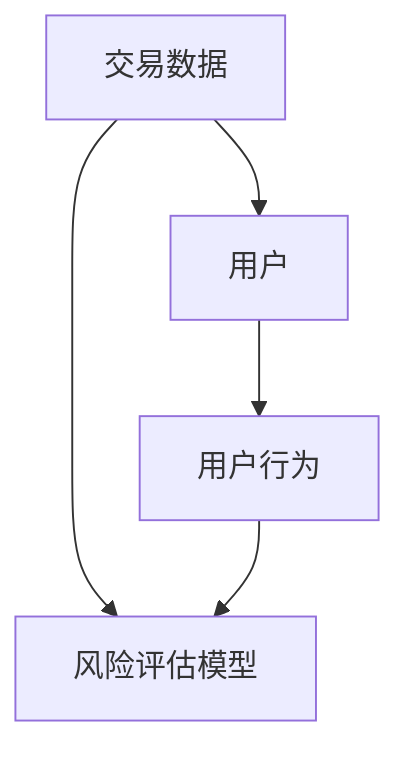
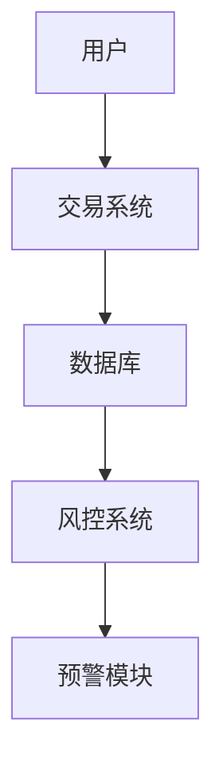
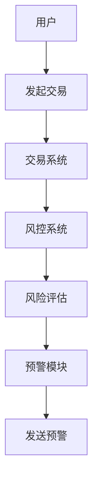

                 


# 构建智能企业风控系统：实时交易监控与欺诈模式识别

> 关键词：企业风控系统、实时交易监控、欺诈模式识别、人工智能、大数据分析

> 摘要：本文深入探讨了构建智能企业风控系统的各个方面，重点介绍了实时交易监控和欺诈模式识别的核心技术与实现方法。通过系统设计、算法原理、项目实战等多角度分析，全面解析了企业风控系统的关键要素和实际应用。

---

## 第一部分：智能企业风控系统概述

### 第1章：企业风控系统概述

#### 1.1 企业风控的定义与核心目标

企业风控系统是指通过技术手段对企业内部和外部的交易行为进行监控、分析和预警，以识别和防范潜在风险的系统。其核心目标包括：

- **保障企业资产安全**：防止因欺诈、误操作或外部攻击导致的财务损失。
- **合规性与透明度**：确保企业交易符合相关法律法规，提升内部流程的透明度。
- **优化业务流程**：通过实时监控和分析，发现潜在问题，优化业务流程，提升效率。

#### 1.2 欺诈交易的定义与分类

**欺诈交易**是指通过欺骗手段进行的非法交易行为。常见的欺诈类型包括：

- **信用卡欺诈**：利用被盗信用卡进行消费。
- **虚假交易**：虚构交易，骗取企业资金。
- **内部欺诈**：员工利用职务之便进行的欺诈行为。
- **洗钱**：通过多次交易掩盖资金来源。

#### 1.3 实时交易监控的重要性

实时交易监控能够快速识别异常交易行为，及时发出预警，防止损失扩大。其重要性体现在：

- **及时性**：实时监控能够在第一时间发现异常，减少损失。
- **准确性**：通过算法分析，提高欺诈检测的准确性。
- **高效性**：自动化监控系统能够处理海量交易数据，提高效率。

#### 1.4 系统设计的关键点

设计企业风控系统时，需要重点关注以下几点：

- **数据采集**：确保实时采集交易数据，包括时间戳、交易金额、交易地点等。
- **数据存储**：选择合适的数据存储方案，支持快速查询和分析。
- **算法选择**：根据业务需求选择合适的欺诈检测算法，如聚类、分类等。
- **系统架构**：设计高效的系统架构，确保系统的扩展性和稳定性。

---

### 第2章：核心概念与联系

#### 2.1 核心概念原理

企业风控系统的核心概念包括：

- **交易数据**：交易的详细信息，包括时间、金额、参与方等。
- **用户行为**：用户在系统中的操作行为，用于分析用户的异常行为。
- **风险评估模型**：通过数学模型评估交易风险，识别潜在欺诈行为。

#### 2.2 核心概念属性对比表

以下是核心概念的属性对比表：

| 实体       | 属性                     | 描述                                                                 |
|------------|--------------------------|----------------------------------------------------------------------|
| 交易数据   | 时间戳                   | 交易发生的时间点                                                 |
|            | 交易金额                 | 交易的金额大小                                                   |
|            | 参与方                   | 交易的发起方和接收方                                             |
| 用户行为    | 操作频率                 | 用户在系统中的操作频率                                           |
|            | 登录地点                 | 用户登录时的地理位置                                             |
|            | 行为模式                 | 用户的操作习惯和模式                                             |
| 风险评估模型| 风险评分                 | 交易的综合风险评分                                               |
|            | 模型类型                 | 基于规则的模型、机器学习模型等                                   |

#### 2.3 ER实体关系图

以下是企业风控系统的ER实体关系图：



---

## 第二部分：算法原理

### 第3章：欺诈检测算法原理

#### 3.1 聚类算法

聚类算法通过将交易数据分成不同的群组，识别异常群组。常用算法包括K-Means和DBSCAN。

##### 3.1.1 K-Means算法

K-Means算法是一种无监督学习算法，适用于将交易数据分成K个簇。

- **步骤**：
  1. 初始化K个质心。
  2. 计算每个数据点到质心的距离，将其分配到最近的簇。
  3. 重新计算每个簇的质心。
  4. 重复步骤2和3，直到质心不再变化。

- **公式**：
  $$ c_i = argmin_{k} \sum_{j=1}^{n} (x_i - c_k)^2 $$

##### 3.1.2 DBSCAN算法

DBSCAN是一种基于密度的聚类算法，适用于处理噪声数据。

- **步骤**：
  1. 计算每个数据点的密度。
  2. 扩展密度较高的区域。
  3. 将孤立的数据点标记为噪声。

#### 3.2 分类算法

分类算法通过历史数据训练模型，预测交易是否为欺诈交易。常用算法包括决策树和随机森林。

##### 3.2.1 决策树算法

决策树是一种基于树状结构的分类算法。

- **步骤**：
  1. 选择具有最大信息增益的特征作为根节点。
  2. 根据特征值划分数据集，生成子节点。
  3. 重复步骤1和2，直到叶节点。

- **公式**：
  $$ \text{信息增益} = H(D) - H(D|A) $$

##### 3.2.2 随机森林算法

随机森林是一种集成学习算法，通过多棵决策树的投票结果进行分类。

- **步骤**：
  1. 从训练数据中随机抽取部分数据训练决策树。
  2. 对所有决策树进行投票，确定最终结果。

#### 3.3 深度学习算法

深度学习算法通过神经网络模型学习交易数据的特征，识别欺诈行为。常用模型包括卷积神经网络（CNN）和循环神经网络（RNN）。

##### 3.3.1 卷积神经网络（CNN）

CNN适用于处理图像数据，但在交易数据中也可以用于特征提取。

- **结构**：
  - **卷积层**：提取局部特征。
  - **池化层**：降低维度，提取全局特征。
  - **全连接层**：分类。

##### 3.3.2 循环神经网络（RNN）

RNN适用于处理序列数据，如时间序列交易数据。

- **结构**：
  - **循环层**：处理序列数据，记忆历史信息。
  - **输出层**：分类。

---

### 第4章：算法实现与优化

#### 4.1 算法实现

以下是基于随机森林算法的欺诈检测代码示例：

```python
import pandas as pd
from sklearn.ensemble import RandomForestClassifier
from sklearn.metrics import accuracy_score

# 加载数据
data = pd.read_csv('transactions.csv')

# 特征与标签分离
X = data.drop('is_fraud', axis=1)
y = data['is_fraud']

# 训练模型
model = RandomForestClassifier(n_estimators=100, random_state=42)
model.fit(X, y)

# 预测
y_pred = model.predict(X)

# 评估
print('准确率:', accuracy_score(y, y_pred))
```

#### 4.2 算法优化

优化算法性能可以从以下几个方面入手：

- **特征选择**：去除无关特征，提高模型性能。
- **超参数调优**：使用网格搜索优化模型参数。
- **模型集成**：结合多种算法，提升预测准确率。

---

## 第三部分：系统分析与架构设计

### 第5章：系统分析与架构设计

#### 5.1 项目介绍

企业风控系统的项目目标是通过实时监控和分析交易数据，识别欺诈交易，保障企业资产安全。

#### 5.2 系统功能设计

系统功能包括：

- **数据采集**：实时采集交易数据。
- **数据存储**：存储交易数据和用户行为数据。
- **风险评估**：使用机器学习模型评估交易风险。
- **预警系统**：实时预警欺诈交易。

#### 5.3 系统架构设计

以下是系统的架构图：



#### 5.4 系统接口设计

系统接口包括：

- **交易接口**：接收交易数据。
- **风控接口**：提供风险评估服务。
- **预警接口**：发送预警通知。

#### 5.5 系统交互设计

以下是系统的交互流程图：



---

## 第四部分：项目实战

### 第6章：项目实战

#### 6.1 环境安装

安装必要的依赖：

```bash
pip install pandas scikit-learn mermaid4j
```

#### 6.2 核心代码实现

以下是风控系统的核心代码：

```python
import pandas as pd
from sklearn.ensemble import RandomForestClassifier
from sklearn.metrics import accuracy_score

# 加载数据
data = pd.read_csv('transactions.csv')

# 特征与标签分离
X = data.drop('is_fraud', axis=1)
y = data['is_fraud']

# 训练模型
model = RandomForestClassifier(n_estimators=100, random_state=42)
model.fit(X, y)

# 预测
y_pred = model.predict(X)

# 评估
print('准确率:', accuracy_score(y, y_pred))
```

#### 6.3 案例分析

分析一个欺诈交易案例：

- **交易数据**：用户在短时间内多次进行小额交易。
- **用户行为**：用户IP地址异常，交易地点频繁变化。
- **风险评估**：模型预测为高风险交易。
- **预警处理**：系统发出预警，冻结账户。

#### 6.4 项目小结

通过项目实战，验证了企业风控系统的有效性和实用性。在实际应用中，需要根据业务需求不断优化系统性能。

---

## 第五部分：总结与展望

### 第7章：总结与展望

#### 7.1 总结

本文详细介绍了构建智能企业风控系统的各个方面，包括实时交易监控和欺诈模式识别的核心技术与实现方法。通过系统设计、算法原理、项目实战等多角度分析，全面解析了企业风控系统的关键要素和实际应用。

#### 7.2 展望

未来，随着人工智能和大数据技术的不断发展，企业风控系统将更加智能化和高效化。建议企业在实际应用中注重数据安全，合理选择算法模型，不断提升系统的风险识别能力。

---

作者：AI天才研究院/AI Genius Institute & 禅与计算机程序设计艺术 /Zen And The Art of Computer Programming

