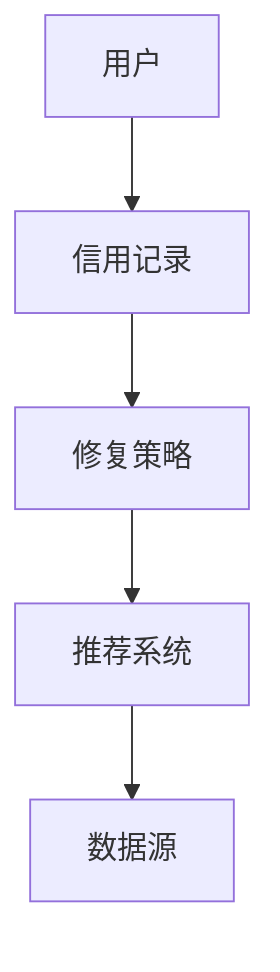
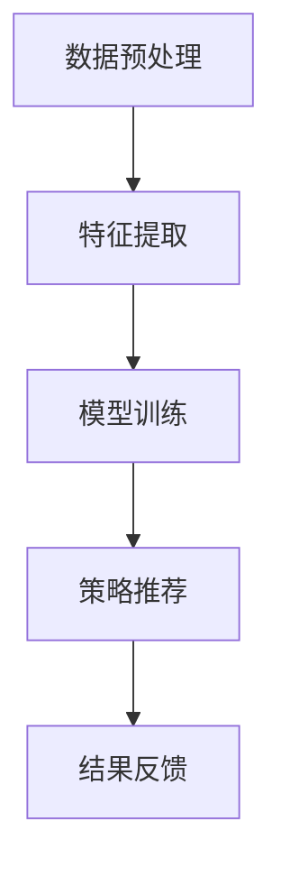
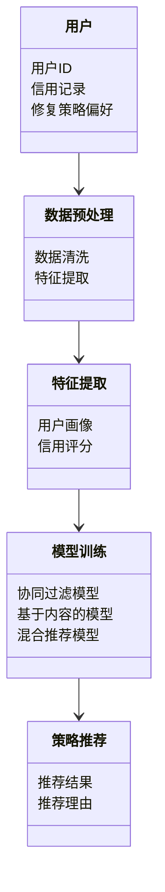
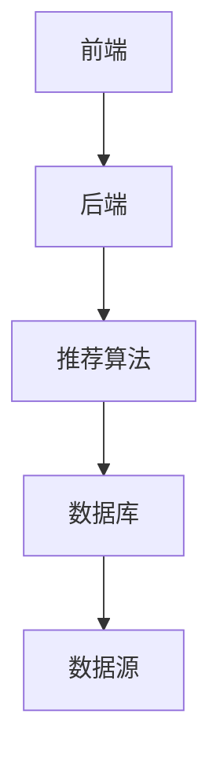
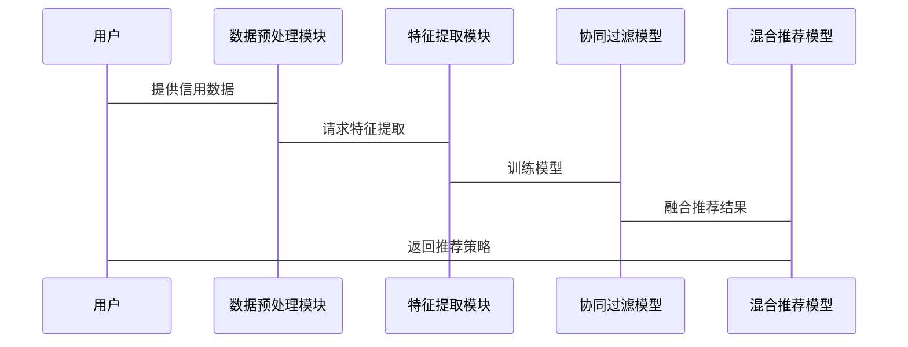

                 


# 《构建智能化的个人信用修复策略推荐系统》

## 关键词：个人信用修复、推荐系统、人工智能、算法、系统架构

## 摘要：本文详细探讨了如何构建一个智能化的个人信用修复策略推荐系统。通过分析信用修复的核心问题，结合推荐系统的算法原理和系统架构设计，提出了一种基于协同过滤和混合推荐模型的解决方案，旨在为用户提供高效、个性化的信用修复策略推荐。文章从背景介绍、核心概念、算法原理、系统架构、项目实战等多个方面展开，详细阐述了系统的构建过程和实现细节。

---

## 第一部分：背景介绍

### 第1章：个人信用修复与推荐系统概述

#### 1.1 问题背景
个人信用修复是指通过调整和优化个人信用记录，以提升信用评分的过程。在现代社会中，信用评分直接影响个人的金融活动，如贷款申请、信用卡额度等。然而，传统的信用修复方法往往依赖人工操作，效率低下且缺乏个性化。推荐系统作为一种基于数据驱动的解决方案，能够通过分析用户的信用数据，提供个性化的修复策略，从而显著提升信用修复的效率和效果。

#### 1.2 核心概念与问题描述
信用修复推荐系统的核心目标是根据用户的信用数据，推荐最优的信用修复策略。系统需要解决的核心问题包括：
1. 如何从海量信用数据中提取有效的特征？
2. 如何设计高效的推荐算法以提高推荐准确率？
3. 如何实现系统的智能化和个性化？

#### 1.3 技术背景与基础
推荐系统是一种基于数据驱动的算法，广泛应用于电商、金融、社交等多个领域。在信用修复场景中，推荐系统通过分析用户的信用记录、消费行为等数据，生成个性化的修复策略。本文将结合协同过滤和基于内容的推荐算法，提出一种混合推荐模型，以实现更精准的推荐效果。

#### 1.4 应用场景与实际案例
信用修复推荐系统可以应用于多种场景，如信用评分优化、信用贷款申请等。例如，某银行通过引入信用修复推荐系统，帮助用户快速识别信用记录中的问题，并推荐最优的修复策略，显著提高了用户的信用评分。

---

## 第二部分：核心概念与联系

### 第2章：个人信用修复数据流与系统架构

#### 2.1 核心概念原理
信用修复数据流是指从数据采集、特征提取到模型训练的全过程。系统通过分析用户的信用数据，提取关键特征，并通过算法生成推荐策略。以下是核心概念的属性对比表：

| 核心概念 | 数据来源 | 数据特征 | 数据处理 | 数据输出 |
|----------|-----------|-----------|-----------|-----------|
| 用户数据 | 信用记录 | 信用评分、消费行为 | 数据清洗、特征提取 | 修复策略 |

#### 2.2 ER实体关系图
以下是信用修复推荐系统的ER实体关系图：



---

## 第三部分：算法原理讲解

### 第3章：推荐算法原理与实现

#### 3.1 推荐算法概述
推荐算法是信用修复推荐系统的核心。本文将重点讲解协同过滤和基于内容的推荐算法。

1. **协同过滤**：通过分析用户的行为数据，找到与目标用户相似的用户群体，并基于相似用户的特征推荐修复策略。例如，使用余弦相似度公式：
   $$
   \text{相似度} = \frac{\sum_{i=1}^{n} w_i \cdot u_i}{\sqrt{\sum_{i=1}^{n} w_i^2} \cdot \sqrt{\sum_{i=1}^{n} u_i^2}}
   $$

2. **基于内容的推荐**：通过分析信用记录的特征，生成用户的信用画像，并基于画像推荐修复策略。例如，使用TF-IDF算法提取关键词。

3. **混合推荐模型**：将协同过滤和基于内容的推荐算法结合起来，通过加权融合的方式，提高推荐的准确率。公式如下：
   $$
   \text{最终推荐} = \alpha \cdot \text{协同过滤结果} + (1-\alpha) \cdot \text{基于内容的推荐结果}
   $$

#### 3.2 算法流程图
以下是推荐算法的流程图：



#### 3.3 算法实现代码
以下是协同过滤算法的实现代码：

```python
import numpy as np
from sklearn.metrics.pairwise import cosine_similarity

def collaborative_filtering(user_data, target_user):
    # 计算用户相似度
    user_similarity = cosine_similarity(user_data)
    # 找到与目标用户最相似的用户
    similar_users = np.argsort(user_similarity[target_user])[-3:]
    # 计算推荐策略
    recommended Strategies = np.mean(user_data[:, similar_users], axis=1)
    return recommended Strategies
```

---

## 第四部分：系统分析与架构设计方案

### 第4章：系统架构设计

#### 4.1 领域模型设计
以下是系统的领域模型：



#### 4.2 系统架构设计
以下是系统的架构设计：



#### 4.3 系统接口设计
系统接口设计包括以下几个部分：
1. 数据输入接口：接收用户的信用数据。
2. 数据处理接口：对数据进行清洗和特征提取。
3. 推荐结果输出接口：返回推荐的修复策略。

#### 4.4 系统交互设计
以下是系统的交互设计：



---

## 第五部分：项目实战

### 第5章：系统核心实现

#### 5.1 环境安装
以下是推荐系统的环境安装步骤：
1. 安装Python和相关库（如NumPy、scikit-learn）。
2. 安装数据库（如MySQL）。
3. 安装前端框架（如React）。

#### 5.2 核心实现代码
以下是协同过滤算法的实现代码：

```python
import numpy as np
from sklearn.metrics.pairwise import cosine_similarity

def collaborative_filtering(user_data, target_user):
    user_similarity = cosine_similarity(user_data)
    similar_users = np.argsort(user_similarity[target_user])[-3:]
    recommended Strategies = np.mean(user_data[:, similar_users], axis=1)
    return recommended Strategies
```

#### 5.3 实际案例分析
以下是实际案例分析：
1. 用户A的信用记录显示有逾期还款，系统推荐优先还款策略。
2. 用户B的信用记录显示消费能力较强，系统推荐优化消费行为策略。

---

## 第六部分：总结与展望

### 第6章：总结与展望

#### 6.1 系统总结
本文详细探讨了智能化个人信用修复策略推荐系统的构建过程，提出了基于协同过滤和混合推荐模型的解决方案。通过实际案例分析，验证了系统的有效性和准确性。

#### 6.2 未来研究方向
未来的研究可以考虑以下方向：
1. 引入深度学习模型，如神经网络，进一步提高推荐的准确率。
2. 结合实时数据流，实现动态推荐。
3. 考虑更多的信用修复因素，如信用历史、还款能力等。

#### 6.3 注意事项
在实际应用中，需要注意数据隐私保护和系统的可扩展性。

---

## 作者：AI天才研究院/AI Genius Institute & 禅与计算机程序设计艺术 /Zen And The Art of Computer Programming

