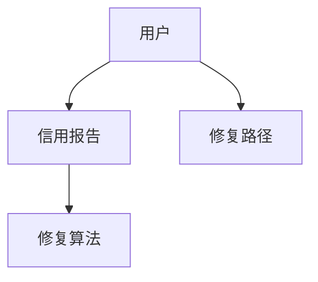
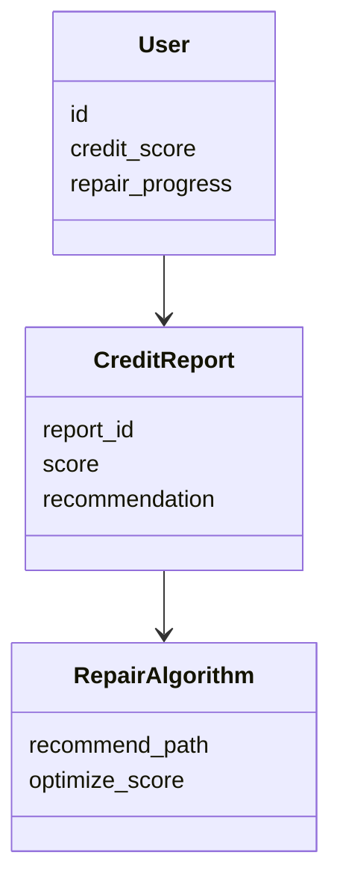

                 


# 构建智能化的个人信用修复路径规划系统

> 关键词：个人信用修复、路径规划、人工智能、推荐算法、系统架构

> 摘要：本文详细探讨了构建智能化个人信用修复路径规划系统的各个方面，从背景介绍到系统架构设计，再到项目实战，旨在为读者提供一个全面的技术指南。通过分析信用修复的核心问题，结合智能化算法和系统架构设计，本文提出了一个基于人工智能的解决方案，并通过具体案例展示了系统的实现过程。

---

## 第一部分：背景介绍

### 第1章：个人信用修复的背景与挑战

#### 1.1 信用体系的重要性
- 信用体系是现代经济和社会运行的基础，直接影响个人和企业的融资能力。
- 个人信用评分（如FICO评分）是衡量信用风险的重要指标。
- 良好的信用记录有助于获得贷款、信用卡和其他金融服务。

#### 1.2 当前信用修复的现状
- 传统信用修复方式依赖人工操作，效率低下且成本高昂。
- 用户缺乏个性化修复路径，难以根据自身情况制定最优策略。
- 信用修复信息分散，用户难以获取系统化的修复建议。

#### 1.3 问题背景与需求分析
- 信用评分低或负面记录对个人信用造成严重影响。
- 用户需求：个性化修复路径、实时信用评分、修复进度跟踪。
- 边界与外延：信用修复仅针对合法途径，不涉及非法手段。

---

### 第2章：智能化路径规划系统的核心概念

#### 2.1 系统的核心目标
- 提供个性化的信用修复路径。
- 实时监控信用评分变化。
- 给出修复建议和进度反馈。

#### 2.2 核心概念对比分析
| 概念         | 传统信用修复 | 智能化路径规划系统 |
|--------------|---------------|---------------------|
| 方法         | 人工咨询     | AI算法推荐         |
| 效率         | 低效         | 高效实时           |
| 个性化       | 有限         | 高度个性化         |
| 数据来源     | 单一         | 多源数据           |

#### 2.3 实体关系图


---

## 第二部分：系统核心算法原理

### 第3章：推荐算法

#### 3.1 协同过滤算法
- **基于用户的协同过滤**：通过寻找与用户信用状况相似的用户群体，推荐修复路径。
- **基于物品的协同过滤**：根据信用修复路径的相似性进行推荐。
- **混合推荐算法**：结合用户和物品的特征进行推荐。

#### 3.2 推荐算法实现
```python
def collaborative_filtering(user_id, user_features):
    similar_users = find_similar_users(user_id, user_features)
    recommended_paths = get_recommended_paths(similar_users)
    return recommended_paths
```

### 第4章：数学模型与公式

#### 4.1 信用评分模型
- FICO评分公式：
$$ \text{FICO} = w_1x_1 + w_2x_2 + \dots + w_nx_n $$
其中，$w_i$ 是特征 $x_i$ 的权重。

#### 4.2 路径规划算法
- Dijkstra算法用于寻找最短路径：
$$ \text{最短路径} = \min_{i} (d_i) $$

---

## 第三部分：系统分析与架构设计

### 第5章：系统架构设计

#### 5.1 领域模型类图


#### 5.2 系统架构图
```mermaid
graph TD
    User[用户] --> API Gateway[API网关]
    API Gateway --> CreditService[信用评分服务]
    API Gateway --> RepairService[修复路径服务]
    CreditService --> Database[数据库]
    RepairService --> Database
```

---

## 第四部分：项目实战

### 第6章：环境安装与核心代码

#### 6.1 环境安装
- 安装Python和相关库（如scikit-learn、pandas）。

#### 6.2 核心代码实现
```python
import pandas as pd
from sklearn.metrics.pairwise import cosine_similarity

def calculate_similarity(user_features, item_features):
    similarity_matrix = cosine_similarity(user_features, item_features)
    return similarity_matrix

def recommend_paths(similarity_matrix, top_n=3):
    recommended_paths = []
    for i in range(len(similarity_matrix)):
        top_indices = similarity_matrix[i].argsort()[-top_n:][::-1]
        recommended_paths.append(top_indices)
    return recommended_paths
```

---

## 第五部分：总结与展望

### 第7章：系统优化与未来方向

#### 7.1 系统优化
- 提高算法效率，优化推荐精度。
- 增强系统的实时性和交互性。

#### 7.2 未来发展方向
- 结合区块链技术，提高信用修复的透明度和安全性。
- 探索更先进的AI算法，如深度学习模型。

---

## 作者信息

作者：AI天才研究院/AI Genius Institute & 禅与计算机程序设计艺术 /Zen And The Art of Computer Programming

---

本文通过详细的技术分析和实际案例，展示了如何构建一个智能化的个人信用修复路径规划系统。从算法原理到系统架构，再到项目实战，为读者提供了一个全面的技术指南。希望本文能为相关领域的研究和实践提供有价值的参考。

