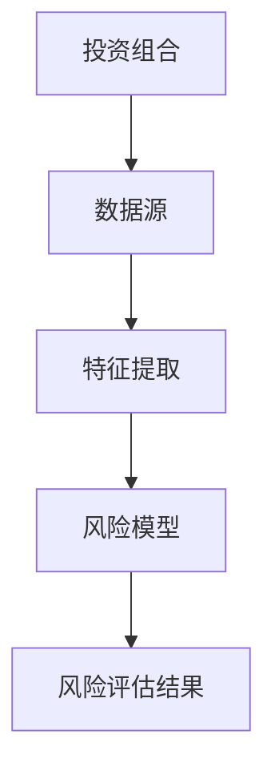
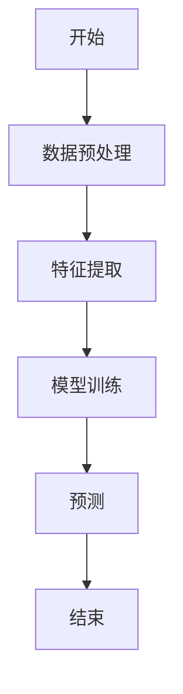
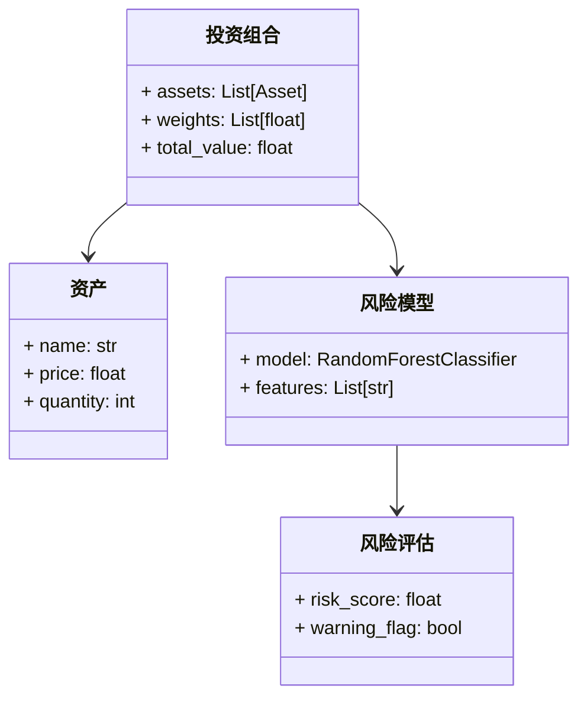
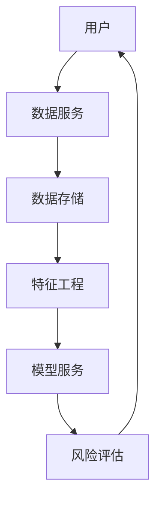
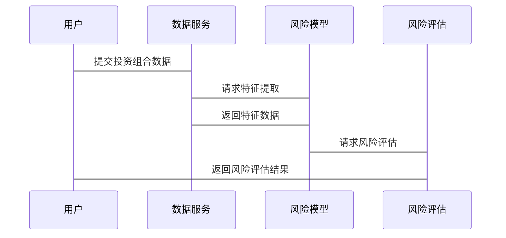

                 


# 构建智能化的个人投资组合尾部风险评估系统

> 关键词：投资组合，尾部风险，风险管理，机器学习，金融数据分析

> 摘要：本文详细探讨了如何利用机器学习和金融数据分析技术，构建一个智能化的个人投资组合尾部风险评估系统。通过分析尾部风险的特征和影响，结合实际案例，介绍了系统的构建过程和实现方法，旨在为投资者提供更科学的风险管理工具。

---

# 第一部分: 个人投资组合与尾部风险概述

## 第1章: 个人投资组合的基本概念

### 1.1 投资组合的定义与组成

投资组合是指将多种金融资产（如股票、债券、基金等）按照一定比例组合在一起，以达到分散风险、优化收益的目的。一个典型的投资组合通常包括以下几个部分：

- **资产配置**：决定每种资产在组合中的权重。
- **风险管理**：通过分散投资降低风险。
- **收益目标**：设定投资组合的预期收益。

### 1.2 尾部风险的定义与特征

尾部风险是指投资组合中那些低概率、高影响的极端事件带来的风险。这些事件虽然发生的概率较低，但一旦发生，可能导致投资组合的重大损失。尾部风险的特征包括：

- **低概率**：事件发生的概率较小。
- **高影响**：一旦发生，可能导致重大损失。
- **不确定性**：难以准确预测。

### 1.3 尾部风险对投资组合的影响

尾部风险可能导致投资组合的损失超出预期的范围，甚至引发流动性危机或信用危机。传统的风险管理方法往往忽略了尾部风险的潜在影响，因此需要通过智能化的方法来识别和评估这些风险。

---

## 第2章: 智能化尾部风险评估系统的目标与意义

### 2.1 系统的目标

- **实时监控**：实时跟踪投资组合的尾部风险。
- **风险预警**：提前发现潜在的极端事件。
- **优化配置**：根据风险评估结果优化资产配置。

### 2.2 系统的意义

- **提高投资决策的科学性**：通过智能化的评估系统，投资者可以更科学地做出投资决策。
- **降低投资组合的潜在损失**：及时发现和应对尾部风险，减少损失。
- **推动金融领域的技术进步**：智能化的尾部风险评估系统是金融技术进步的重要体现。

---

# 第二部分: 尾部风险评估的核心概念与联系

## 第3章: 核心概念原理

### 3.1 数据源与特征提取

- **数据源**：包括历史价格数据、市场情绪数据、宏观经济指标等。
- **特征提取**：通过统计学方法提取特征，如波动率、相关性等。

### 3.2 风险评估模型的构建

- **模型选择**：选择适合的机器学习模型，如随机森林、XGBoost等。
- **模型训练**：使用历史数据训练模型，评估其预测能力。

### 3.3 系统的输入输出关系

- **输入**：投资者的投资组合数据和市场数据。
- **输出**：尾部风险的评估结果和风险预警信号。

### 3.4 ER实体关系图



---

## 第4章: 尾部风险评估系统的算法原理

### 4.1 算法选择与原理

- **算法选择**：选择随机森林作为分类模型，用于尾部风险的分类。
- **算法原理**：随机森林通过构建多个决策树，提高模型的准确性和稳定性。

### 4.2 算法流程图



### 4.3 算法实现

```python
import pandas as pd
from sklearn.ensemble import RandomForestClassifier
from sklearn.metrics import accuracy_score

# 数据加载与预处理
data = pd.read_csv('investment_data.csv')
X = data.drop('label', axis=1)
y = data['label']

# 特征工程
# 假设我们已经进行了特征选择和归一化处理

# 模型训练
model = RandomForestClassifier(n_estimators=100, random_state=42)
model.fit(X_train, y_train)

# 预测与评估
y_pred = model.predict(X_test)
print("准确率:", accuracy_score(y_test, y_pred))
```

### 4.4 数学模型

随机森林的数学模型可以表示为：

$$
y = \text{sign}\left(\sum_{i=1}^{n} \text{weight}_i \cdot \text{feature}_i\right)
$$

其中，$$\text{weight}_i$$ 是每个特征的权重，$$\text{feature}_i$$ 是输入特征。

---

# 第三部分: 系统分析与架构设计方案

## 第5章: 系统功能设计

### 5.1 领域模型设计



### 5.2 系统架构设计



### 5.3 系统接口设计

- **输入接口**：接受投资组合数据和市场数据。
- **输出接口**：输出尾部风险评估结果和预警信号。

### 5.4 系统交互流程



---

# 第四部分: 项目实战

## 第6章: 项目实现与案例分析

### 6.1 环境安装

```bash
pip install pandas scikit-learn matplotlib
```

### 6.2 核心代码实现

```python
import pandas as pd
from sklearn.ensemble import RandomForestClassifier
from sklearn.model_selection import train_test_split

# 加载数据
data = pd.read_csv('investment_data.csv')
X = data.drop(columns=['label', 'id'])
y = data['label']

# 数据分割
X_train, X_test, y_train, y_test = train_test_split(X, y, test_size=0.2, random_state=42)

# 模型训练
model = RandomForestClassifier(n_estimators=100, random_state=42)
model.fit(X_train, y_train)

# 预测与评估
y_pred = model.predict(X_test)
print(f"准确率: {model.score(X_test, y_test)}")

# 特征重要性分析
feature_importance = pd.DataFrame({
    'feature': X.columns,
    'importance': model.feature_importances_
})
feature_importance = feature_importance.sort_values(by='importance', ascending=False)
print(feature_importance)
```

### 6.3 案例分析

假设我们有一个包含5只股票的投资组合，我们可以通过上述代码计算每只股票的尾部风险评分。根据评分结果，我们可以调整投资组合的权重，以降低整体的尾部风险。

### 6.4 项目总结

通过上述实现，我们可以看到，智能化的尾部风险评估系统能够有效地识别投资组合中的潜在风险，并为投资者提供科学的决策支持。

---

# 第五部分: 最佳实践与注意事项

## 第7章: 最佳实践 tips

### 7.1 数据预处理的重要性

在构建尾部风险评估系统时，数据预处理是非常关键的一步。需要对数据进行清洗、归一化和特征工程处理，以提高模型的准确性和稳定性。

### 7.2 模型调优与优化

通过调整模型的超参数（如随机森林的树的数量、深度等），可以进一步提高模型的性能。

### 7.3 系统的实时监控与维护

为了确保系统的有效性，需要定期监控系统的性能，并根据市场变化及时更新模型和数据。

---

# 作者：AI天才研究院 & 禅与计算机程序设计艺术

