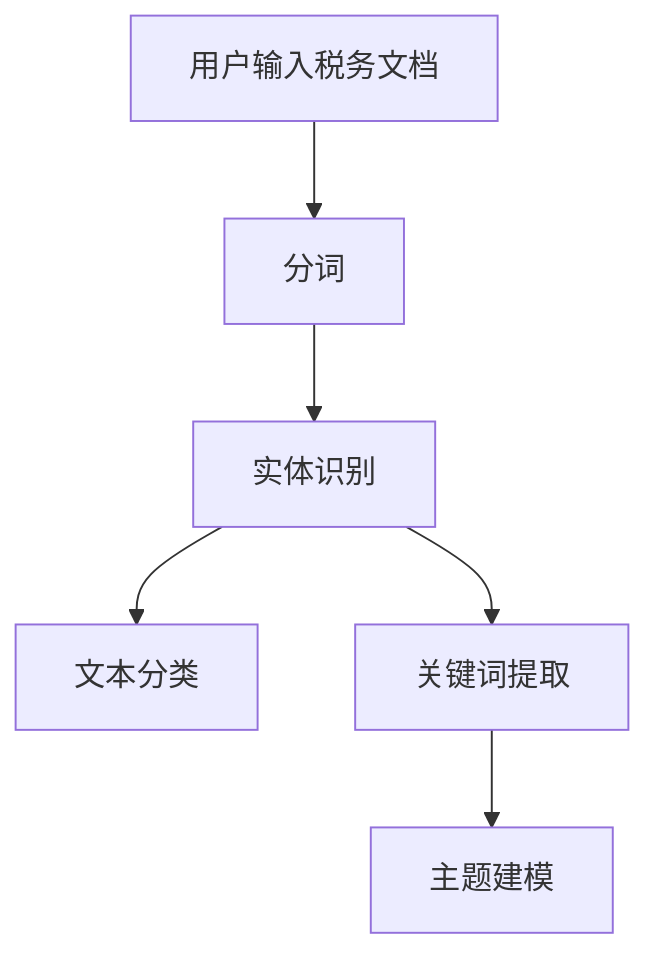
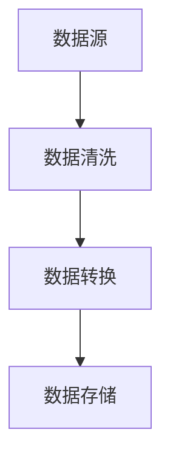
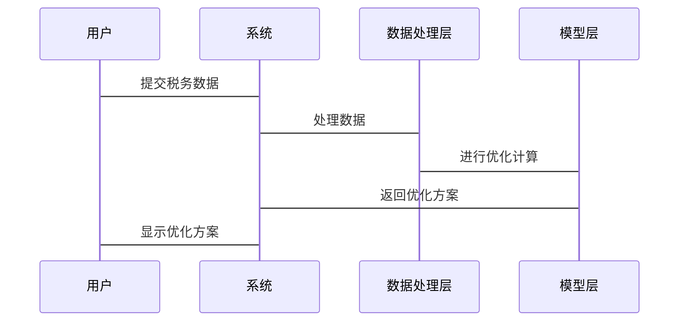

                 


# 构建智能化的个人税务筹划优化助手

> 关键词：智能化税务、人工智能、个人税务优化、自然语言处理、机器学习

> 摘要：随着人工智能技术的快速发展，个人税务筹划的复杂性不断提高，传统的税务筹划方法已经难以满足现代人的需求。本文将从背景介绍、核心概念、算法原理、系统架构设计、项目实战等角度，详细探讨如何利用人工智能技术构建智能化的个人税务筹划优化助手，帮助用户实现高效、合规的税务管理。

---

# 第1章: 个人税务筹划的背景与挑战

## 1.1 税务筹划的基本概念

### 1.1.1 税务筹划的定义与目标

税务筹划是指通过合法的手段，合理规划个人的收入、支出和资产配置，以最小化税务负担的过程。其目标是最大化个人或家庭的可支配收入，同时确保合规性。

### 1.1.2 个人税务筹划的常见场景

- **收入优化**：通过合理分配工资、奖金、投资收益等，降低税率。
- **支出优化**：通过合法的支出抵扣（如教育支出、医疗支出等）减少 taxable income。
- **资产配置**：通过优化资产分配（如房地产、股票等）降低资本利得税。

### 1.1.3 税务筹划的合法性与风险

税务筹划必须在法律允许的范围内进行，否则可能面临法律风险。合规性是税务筹划的核心原则。

---

## 1.2 传统税务筹划的痛点

### 1.2.1 信息不对称的问题

个人很难完全掌握复杂的税务政策和法规，容易因为信息不全或误解而做出错误的税务规划。

### 1.2.2 税务政策的复杂性

税务政策复杂多变，涉及多个税种（如所得税、增值税、消费税等），个人难以全面理解和应用。

### 1.2.3 个性化需求与效率的矛盾

每个人的收入结构、家庭状况和资产配置不同，税务筹划需要高度个性化，但传统方法效率低下。

---

## 1.3 智能化税务筹划的必要性

### 1.3.1 AI技术在税务领域的应用潜力

人工智能技术可以快速处理大量税务数据，分析复杂的税务政策，并提供个性化的优化建议。

### 1.3.2 智能化税务助手的优势

- **高效性**：快速分析数据，提供实时优化建议。
- **准确性**：基于大数据和机器学习模型，确保建议的合规性。
- **个性化**：根据用户的具体情况，提供定制化的税务筹划方案。

### 1.3.3 未来税务筹划的趋势

随着AI技术的普及，智能化税务筹划将成为主流，税务助手将更加智能化和个性化。

---

## 1.4 本章小结

本章介绍了税务筹划的基本概念、传统方法的痛点以及智能化税务筹划的必要性。通过分析，我们看到人工智能技术在税务领域的应用潜力巨大，能够有效解决传统方法的效率和准确性问题。

---

# 第2章: 智能化税务筹划的核心概念与技术基础

## 2.1 AI技术在税务筹划中的应用

### 2.1.1 自然语言处理(NLP)在税务文档分析中的应用

自然语言处理技术可以用于分析税务政策文件、财务报表等非结构化数据。



### 2.1.2 机器学习在税务预测与优化中的应用

机器学习可以用于预测税务负担、优化资产配置等。

```python
# 示例代码：使用线性回归模型预测所得税
import numpy as np
from sklearn.linear_model import LinearRegression

# 数据准备
X = np.array([[20000], [30000], [40000]])
y = np.array([5000, 7500, 10000])

# 训练模型
model = LinearRegression()
model.fit(X, y)

# 预测
print(model.predict([[50000]]))  # 输出：[15000.0]
```

### 2.1.3 数据挖掘在税务数据中的应用

数据挖掘技术可以发现税务数据中的模式和规律，帮助优化税务策略。

---

## 2.2 税务筹划优化助手的核心功能

### 2.2.1 税务数据采集与处理

- **数据采集**：从财务报表、银行流水等来源获取数据。
- **数据清洗**：去除重复、错误或无效数据。



### 2.2.2 税务政策解析与合规性检查

- **政策解析**：自动解析最新的税务政策文件。
- **合规性检查**：检查用户的税务行为是否符合法规。

### 2.2.3 税务优化方案生成与推荐

- **方案生成**：基于机器学习模型生成优化方案。
- **方案推荐**：根据用户需求推荐最优方案。

---

## 2.3 相关技术对比与选型

### 2.3.1 NLP与传统文本处理方法的对比

| 技术 | 优点 | 缺点 |
|------|------|------|
| NLP  | 高度自动化，支持复杂文本分析 | 需要大量训练数据和计算资源 |
| 传统方法 | 易于实现，适合简单文本处理 | 难以处理复杂场景 |

### 2.3.2 机器学习与规则引擎的对比

| 技术 | 优点 | 缺点 |
|------|------|------|
| 机器学习 | 高度智能化，可处理复杂问题 | 需要大量数据和计算资源 |
| 规则引擎 | 易于实现，适合简单场景 | 难以处理复杂场景 |

---

## 2.4 本章小结

本章详细介绍了AI技术在税务筹划中的应用，包括NLP、机器学习和数据挖掘等技术，并对比了不同技术的优缺点，为后续的系统设计奠定了基础。

---

# 第3章: 税务筹划优化助手的算法原理

## 3.1 税务数据预处理与特征提取

### 3.1.1 数据清洗与标准化

- 数据清洗：去除异常值、重复值等。
- 数据标准化：将数据转换到同一尺度。

### 3.1.2 特征工程与选择

- 特征提取：从原始数据中提取有用的特征。
- 特征选择：选择对模型影响最大的特征。

---

## 3.2 基于机器学习的税务预测模型

### 3.2.1 线性回归模型

线性回归模型用于预测连续型变量，例如所得税预测。

```latex
$$
y = \beta_0 + \beta_1x + \epsilon
$$
```

### 3.2.2 支持向量机(SVM)模型

SVM适用于分类问题，例如税务合规性检查。

### 3.2.3 随机森林与梯度提升树(GBT)模型

随机森林和GBT适用于分类和回归问题，适合复杂的税务优化场景。

---

## 3.3 模型优化与调参

### 3.3.1 超参数调优

- 使用网格搜索或随机搜索方法调优模型参数。

### 3.3.2 模型评估与验证

- 使用交叉验证评估模型性能。

---

## 3.4 基于NLP的税务文档分析

### 3.4.1 文本分词与实体识别

- 使用分词工具（如jieba）对税务文档进行分词。
- 使用实体识别模型（如spaCy）识别关键词。

### 3.4.2 文本分类与主题建模

- 文本分类：分类税务文档的主题。
- 主题建模：发现文档中的主题分布。

### 3.4.3 基于BERT的税务文档理解

BERT模型可以用于更深层次的语义理解。

---

## 3.5 本章小结

本章详细介绍了税务筹划优化助手的算法原理，包括数据预处理、模型选择和优化方法，并给出了具体的Python代码示例。

---

# 第4章: 税务筹划优化助手的系统架构设计

## 4.1 系统功能设计

### 4.1.1 领域模型设计


### 4.1.2 系统架构设计


---

## 4.2 系统接口设计

### 4.2.1 API设计

- **输入接口**：接收用户的收入、支出和资产数据。
- **输出接口**：返回优化方案和合规性检查结果。

---

## 4.3 系统交互设计

### 4.3.1 用户与系统交互流程



---

## 4.4 本章小结

本章详细介绍了税务筹划优化助手的系统架构设计，包括功能设计、架构设计和交互设计。

---

# 第5章: 项目实战

## 5.1 环境安装

### 5.1.1 安装Python环境

```bash
python --version
pip install numpy scikit-learn jieba
```

## 5.2 核心代码实现

### 5.2.1 税务数据预处理

```python
import pandas as pd

# 读取数据
data = pd.read_csv('tax_data.csv')

# 数据清洗
data.drop_duplicates(inplace=True)
data.fillna(0, inplace=True)
```

### 5.2.2 税务优化模型训练

```python
from sklearn.model_selection import train_test_split
from sklearn.linear_model import LinearRegression

# 分割数据
X_train, X_test, y_train, y_test = train_test_split(X, y, test_size=0.2)

# 训练模型
model = LinearRegression()
model.fit(X_train, y_train)

# 验证模型
print(model.score(X_test, y_test))
```

## 5.3 案例分析

### 5.3.1 案例背景

假设用户年收入为30万元，已婚，有一个孩子，居住在北京市。

### 5.3.2 优化方案

- 合理分配收入到工资和奖金，降低税率。
- 利用子女教育支出抵扣部分收入。

---

## 5.4 项目小结

本章通过实际案例展示了如何利用Python代码实现税务优化模型，并给出了具体的优化建议。

---

# 第6章: 总结与展望

## 6.1 小结

本文详细介绍了如何利用人工智能技术构建智能化的个人税务筹划优化助手，包括背景分析、核心概念、算法原理和系统设计等内容。

## 6.2 注意事项

- 税务政策具有地域性和时效性，需要定期更新模型。
- 使用AI技术进行税务筹划时，必须确保合规性。

## 6.3 最佳实践 tips

- 定期备份数据，确保数据安全。
- 及时更新模型，适应新的税务政策。

## 6.4 拓展阅读

- 《机器学习实战》
- 《自然语言处理入门》
- 《税务筹划实务》

---

# 作者

作者：AI天才研究院/AI Genius Institute & 禅与计算机程序设计艺术 /Zen And The Art of Computer Programming

---

**感谢您的阅读！**

