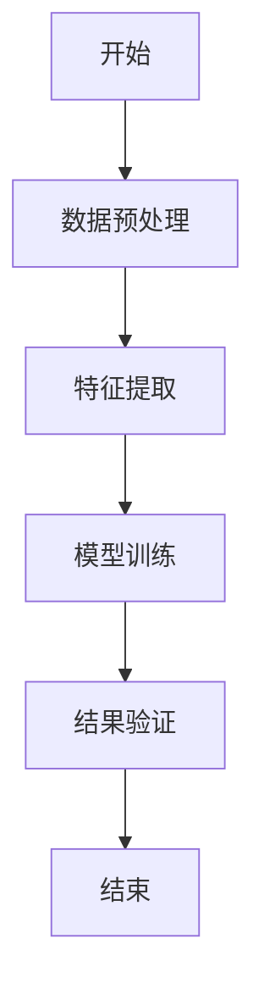
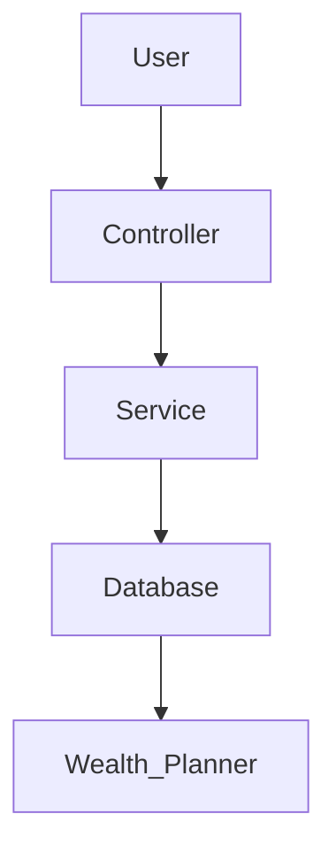
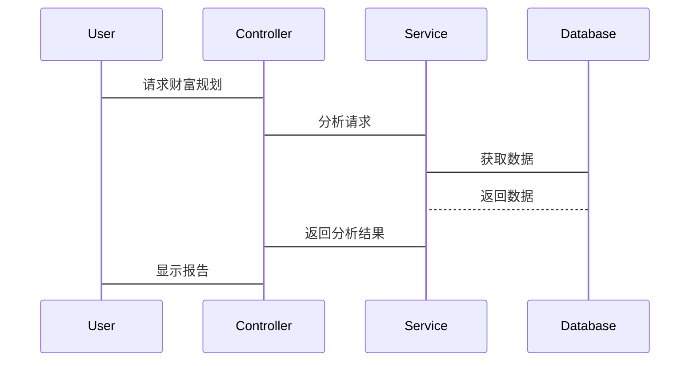

                 


# 构建智能化的个人财富传承规划助手

> 关键词：人工智能，财富传承，规划助手，数据分析，系统架构

> 摘要：本文探讨如何利用人工智能技术构建智能化的个人财富传承规划助手，通过数据分析和个性化建议，优化财富传承过程，实现智能化、高效化的财富管理。

---

# 第1章 背景介绍

## 1.1 问题背景

### 1.1.1 财富传承的定义与重要性
财富传承是指个人或家族将其财产和财富合法传递给下一代或其他受益人。在现代社会，随着财富的积累和复杂性增加，传统的财富传承方式面临诸多挑战，如法律风险、税务优化、资产保值等问题。

### 1.1.2 传统财富传承规划的局限性
传统的财富传承规划主要依赖人工咨询和经验判断，存在以下问题：
- **信息不对称**：缺乏全面的市场数据和个性化分析。
- **效率低下**：人工操作耗时长，难以快速响应需求。
- **主观性**：依赖个人经验，可能导致决策偏差。

### 1.1.3 智能化规划的需求与趋势
随着人工智能技术的发展，智能化的财富传承规划助手能够通过大数据分析和机器学习算法，提供个性化的建议和高效的解决方案，成为现代财富管理的重要工具。

## 1.2 问题描述

### 1.2.1 个人财富传承的主要挑战
- 复杂的法律环境：不同地区的继承法和税法差异大。
- 资产多样化：包括金融资产、房地产、企业股权等。
- 家庭结构变化：离婚、再婚、子女继承等问题复杂。

### 1.2.2 数据驱动规划的必要性
通过收集和分析客户的财务数据、家庭关系、投资偏好等信息，构建个性化的财富传承方案。

### 1.2.3 智能化助手的核心目标
智能化助手的目标是通过AI技术，帮助用户制定最优的财富传承计划，确保财富安全、税务优化和资产保值。

## 1.3 问题解决

### 1.3.1 AI技术在财富传承中的应用
AI技术可以用于风险评估、资产配置、税务优化等领域。

### 1.3.2 数据分析与个性化建议
通过数据分析，助手可以提供个性化建议，如遗产分配、税务规划等。

### 1.3.3 智能化规划助手的功能实现
功能包括：资产评估、风险分析、税务优化、方案模拟等。

## 1.4 边界与外延

### 1.4.1 财富传承规划的边界
明确服务范围，如不涉及犯罪或非法行为。

### 1.4.2 智能化助手的功能边界
包括规划建议，但不包括实际操作。

### 1.4.3 相关领域的外延
涉及法律、税务、投资等领域。

## 1.5 概念结构与核心要素

### 1.5.1 核心概念的层次结构
从下至上分为：数据层、算法层、应用层。

### 1.5.2 核心要素的定义与关系
数据、算法、用户需求三者相互关联，共同构建智能化助手。

### 1.5.3 概念结构的可视化
通过图表展示层次结构和关系。

---

# 第2章 核心概念与联系

## 2.1 核心概念原理

### 2.1.1 人工智能在财富传承中的应用
AI用于数据分析、模式识别和预测。

### 2.1.2 数据分析与个性化建议
通过数据分析，提供定制化建议。

### 2.1.3 智能化规划助手的功能实现
利用AI技术实现自动化和智能化服务。

## 2.2 核心概念属性特征对比

| 技术 | 数据分析 | 个性化建议 | 智能化服务 |
|------|-----------|-------------|------------|
| 输入 | 结构化数据 | 用户需求 | 系统反馈 |
| 输出 | 分析结果 | 建议 | 功能实现 |
| 优势 | 准确性高 | 定制化 | 高效 |

## 2.3 ER实体关系图

```mermaid
erDiagram
    user {
        id
        name
        age
        assets
        liabilities
        goals
    }
    assets {
        id
        name
        value
        type
    }
    liabilities {
        id
        name
        value
        type
    }
    goals {
        id
        name
        description
        deadline
    }
    user *-- assets : owns
    user *-- liabilities : owes
    user *-- goals : aims_for
```

---

# 第3章 算法原理

## 3.1 算法原理概述

### 3.1.1 机器学习模型
使用监督学习进行分类和预测。

### 3.1.2 算法流程
数据预处理、特征提取、模型训练、结果验证。

## 3.2 算法流程图



## 3.3 Python代码实现

```python
import pandas as pd
from sklearn.model_selection import train_test_split
from sklearn.ensemble import RandomForestClassifier

# 数据预处理
data = pd.read_csv('wealth.csv')
X = data.drop('target', axis=1)
y = data['target']

# 划分训练集和测试集
X_train, X_test, y_train, y_test = train_test_split(X, y, test_size=0.2)

# 模型训练
model = RandomForestClassifier()
model.fit(X_train, y_train)

# 验证结果
score = model.score(X_test, y_test)
print(f'模型准确率：{score}')
```

## 3.4 数学模型

### 3.4.1 优化模型
$$ \text{目标函数} = \max \sum w_i x_i $$
$$ \text{约束条件} = \sum w_i x_i \leq 1 $$

### 3.4.2 概率模型
$$ P(A|B) = \frac{P(B|A)P(A)}{P(B)} $$

---

# 第4章 数学模型

## 4.1 优化模型

### 4.1.1 模型推导
$$ \text{最大化} \sum w_i x_i $$
$$ \text{约束} \sum w_i x_i \leq 1 $$

## 4.2 概率模型

### 4.2.1 应用实例
$$ P(继承人选择|财富分配) = \frac{P(财富分配|继承人选择)P(继承人选择)}{P(财富分配)} $$

---

# 第5章 系统分析与架构设计

## 5.1 问题场景

### 5.1.1 用户需求
用户希望得到个性化的财富传承建议。

### 5.1.2 系统功能设计
功能包括：用户登录、资产评估、方案模拟、报告生成。

## 5.2 系统架构图



## 5.3 接口设计

### 5.3.1 REST API
- GET /wealth/planner
- POST /wealth/analyze

## 5.4 交互序列图



---

# 第6章 项目实战

## 6.1 环境安装

### 6.1.1 Python安装
安装Python 3.8及以上版本。

### 6.1.2 库的安装
```bash
pip install pandas scikit-learn
```

## 6.2 核心代码实现

```python
import pandas as pd
from sklearn.ensemble import RandomForestClassifier

# 数据加载
data = pd.read_csv('wealth.csv')

# 特征选择
features = data.drop('target', axis=1)
target = data['target']

# 划分数据集
X_train, X_test, y_train, y_test = train_test_split(features, target, test_size=0.2)

# 模型训练
model = RandomForestClassifier()
model.fit(X_train, y_train)

# 预测与评估
predictions = model.predict(X_test)
print(classification_report(y_test, predictions))
```

## 6.3 案例分析

### 6.3.1 数据准备
加载示例数据并预处理。

### 6.3.2 模型训练
训练随机森林模型。

### 6.3.3 模型评估
评估模型的准确率和召回率。

---

# 第7章 最佳实践

## 7.1 小结
智能化助手通过AI技术优化财富传承规划，提供高效、个性化的服务。

## 7.2 注意事项
- 数据隐私保护
- 模型持续优化
- 用户教育与沟通

## 7.3 拓展阅读
- 推荐书籍：《财富自由之路》
- 在线课程：AI与财富管理

---

# 作者：AI天才研究院/AI Genius Institute & 禅与计算机程序设计艺术/Zen And The Art of Computer Programming

