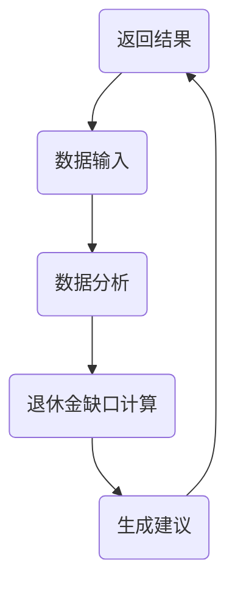
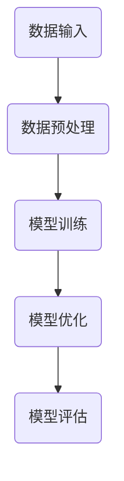

                 


# 构建智能化的个人退休金缺口分析助手

> 关键词：退休金缺口分析，人工智能，机器学习，系统架构设计，Python编程

> 摘要：本文将详细介绍如何构建一个智能化的个人退休金缺口分析助手，通过背景介绍、核心概念、算法原理、系统架构设计、项目实战等多方面内容，帮助读者掌握构建此类系统的思路和方法。

---

# 第一部分：背景与核心概念

## 第1章：退休金缺口分析的背景与问题

### 1.1 退休金缺口分析的背景
#### 1.1.1 人口老龄化与退休金需求
随着人口老龄化的加剧，退休金缺口问题日益严重。许多人对退休后的财务状况缺乏清晰的认识，导致退休后生活质量下降。传统的退休金分析方法基于简单的线性计算，难以应对复杂的现实情况。

#### 1.1.2 退休金缺口问题的严重性
退休金缺口是指退休前收入与退休后支出之间的差距。这一问题可能导致许多人无法维持退休后的基本生活需求。通过智能化的分析工具，可以更准确地预测和规划退休金缺口。

#### 1.1.3 传统退休金缺口分析方法的局限性
传统的分析方法通常基于固定的公式和假设，忽视了个人收入、支出、寿命 expectancy 等变量的动态变化。这使得传统方法难以提供个性化的建议。

### 1.2 智能化助手的必要性
#### 1.2.1 数据驱动的退休金分析趋势
随着大数据技术的发展，退休金分析可以基于更多的数据源，如个人收入、支出、资产、健康状况等，进行更精准的预测。

#### 1.2.2 AI技术在退休金分析中的应用潜力
人工智能技术可以通过机器学习算法，分析大量数据，发现传统方法难以察觉的模式和趋势，从而提供更智能的建议。

#### 1.2.3 个人退休规划的智能化需求
现代社会对个性化服务的需求增加，退休金缺口分析也需要个性化的解决方案。智能化助手可以满足这一需求。

### 1.3 问题背景与目标
#### 1.3.1 退休金缺口的核心问题
退休金缺口的核心问题在于如何在有限的资源下，确保退休后的财务安全。这需要考虑多种因素的动态变化。

#### 1.3.2 问题解决的目标与边界
目标是通过智能化分析，帮助个人准确评估退休金缺口，并提供优化建议。边界包括不考虑非法收入、不考虑通货膨胀等因素。

#### 1.3.3 核心概念的结构与要素
退休金缺口分析需要考虑的因素包括：当前收入、支出、储蓄、投资回报、寿命 expectancy、通胀率、税收政策等。

### 1.4 本章小结
本章介绍了退休金缺口分析的背景、智能化助手的必要性，以及核心概念的结构和要素。

---

## 第2章：智能化退休金缺口分析助手的核心概念

### 2.1 核心概念的定义与属性
#### 2.1.1 退休金缺口分析的定义
退休金缺口分析是通过分析个人的财务状况，预测退休后可能存在的收入与支出之间的差距，并提供优化建议。

#### 2.1.2 智能化助手的功能属性
智能化助手具备数据采集、分析、预测、建议生成等功能，能够为用户提供个性化的退休金缺口分析服务。

#### 2.1.3 核心概念的特征对比表
| 特征 | 传统方法 | 智能化助手 |
|------|-----------|------------|
| 数据来源 | 单一数据源 | 多数据源 |
| 分析方法 | 线性模型 | 机器学习模型 |
| 输出结果 | 简单预测 | 个性化建议 |

### 2.2 实体关系分析
#### 2.2.1 ER实体关系图
```mermaid
erDiagram
    user {
        string 姓名
        integer 年龄
        string 收入来源
        decimal 储蓄金额
        decimal 投资金额
        integer 预期寿命
    }
    retirement_gap {
        decimal 缺口金额
        date 开始时间
        date 结束时间
        string 建议措施
    }
    user -> retirement_gap : "评估退休金缺口"
```

#### 2.2.2 关系的属性与约束
用户通过输入个人信息，系统评估退休金缺口，并生成相应的建议措施。

#### 2.2.3 实体关系的流程图


### 2.3 核心概念的联系
#### 2.3.1 数据流的关联
用户输入个人信息，系统分析数据，计算退休金缺口，并生成建议。

#### 2.3.2 功能模块的交互
功能模块包括数据采集、数据分析、缺口计算、建议生成等，各模块之间相互协作。

#### 2.3.3 系统整体架构


### 2.4 本章小结
本章详细介绍了智能化退休金缺口分析助手的核心概念，包括定义、功能属性、实体关系等。

---

## 第3章：智能化退休金缺口分析的算法原理

### 3.1 数据预处理与特征工程
#### 3.1.1 数据清洗流程
1. 去除重复数据
2. 处理缺失值
3. 标准化数据
4. 删除异常值

#### 3.1.2 特征选择方法
1. 相关性分析
2. 逐步回归法
3. 主成分分析

#### 3.1.3 数据标准化与归一化
使用标准化或归一化方法处理数据，确保模型的训练效果。

### 3.2 模型训练与优化
#### 3.2.1 线性回归模型
线性回归模型用于预测退休金缺口，公式如下：
$$ y = \beta_0 + \beta_1x_1 + \beta_2x_2 + \ldots + \beta_nx_n + \epsilon $$

#### 3.2.2 随机森林模型
随机森林模型是一种基于决策树的集成学习方法，具有较强的抗过拟合能力。

#### 3.2.3 模型调优与评估
通过交叉验证等方法优化模型参数，评估模型的准确率、召回率等性能指标。

### 3.3 算法流程图


### 3.4 本章小结
本章详细介绍了退休金缺口分析的算法原理，包括数据预处理、特征工程、模型训练与优化等内容。

---

## 第4章：系统分析与架构设计方案

### 4.1 问题场景介绍
退休金缺口分析需要考虑多种因素，包括用户的收入、支出、储蓄、投资回报等。

### 4.2 系统功能设计
#### 4.2.1 领域模型


#### 4.2.2 系统架构设计


#### 4.2.3 接口设计
API接口设计包括数据输入、模型调用、结果返回等步骤。

### 4.3 本章小结
本章详细介绍了系统架构设计方案，包括功能模块设计、系统架构图、接口设计等内容。

---

## 第5章：项目实战

### 5.1 环境安装与配置
需要安装Python、机器学习库（如scikit-learn）、数据分析库（如Pandas）等。

### 5.2 系统核心实现
#### 5.2.1 数据采集与处理
编写代码采集用户数据，并进行预处理。

#### 5.2.2 模型实现
实现线性回归或随机森林模型，进行退休金缺口预测。

### 5.3 案例分析与解读
通过具体案例分析，展示如何使用系统进行退休金缺口分析。

### 5.4 本章小结
本章通过实战项目，详细介绍了如何实现智能化退休金缺口分析助手。

---

## 第6章：总结与展望

### 6.1 本章总结
总结本文的主要内容，包括背景介绍、核心概念、算法原理、系统设计、项目实战等。

### 6.2 注意事项
在实际应用中，需要注意数据隐私、模型的泛化能力等问题。

### 6.3 拓展阅读
建议读者进一步学习机器学习、系统架构设计等相关知识。

---

# 作者：AI天才研究院 & 禅与计算机程序设计艺术

---

本文通过详细的背景介绍、核心概念、算法原理、系统设计和项目实战，全面解析了如何构建智能化的个人退休金缺口分析助手。希望对读者有所帮助！

