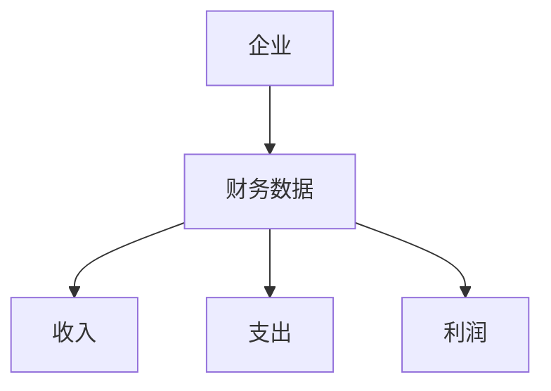
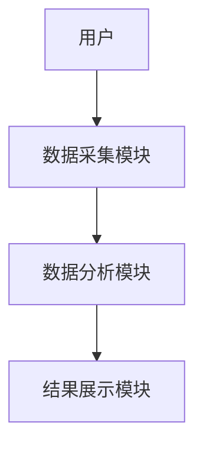

                 


# 《构建智能化的企业财务报表分析系统》

> 关键词：企业财务报表分析，智能化系统，人工智能，大数据分析，机器学习，财务预测

> 摘要：本文详细探讨了构建智能化企业财务报表分析系统的各个方面，从背景介绍到系统架构设计，再到项目实战和最佳实践，系统地阐述了如何利用人工智能和大数据技术提升财务分析的效率和准确性。文章结合实际案例，通过清晰的逻辑和详细的步骤，帮助读者理解并掌握构建此类系统的技能。

---

## 第一部分：背景介绍

### 第1章：智能化企业财务报表分析系统概述

#### 1.1 问题背景

随着企业规模的不断扩大，财务数据的复杂性和多样性也在不断增加。传统的财务报表分析主要依赖人工操作，效率低下且容易出错。企业需要一种更高效、更准确的方法来处理和分析财务数据，以便做出更快捷、更精准的决策。

#### 1.2 问题描述

传统财务报表分析存在以下问题：
- 数据量大，人工处理效率低。
- 分析结果依赖主观判断，缺乏客观性。
- 数据更新频繁，难以实时分析。

智能化财务报表分析系统可以通过引入人工智能和大数据技术，自动处理财务数据，提供精准的分析结果，从而提高企业的决策效率。

#### 1.3 问题解决

智能化财务报表分析系统通过以下方式解决问题：
- 利用机器学习算法自动识别和分类财务数据。
- 使用自然语言处理技术分析财务报告中的文本信息。
- 提供实时数据分析，帮助企业及时调整财务策略。

#### 1.4 边界与外延

- 系统边界：仅处理企业内部的财务数据，不涉及外部市场数据。
- 相关领域：包括数据挖掘、机器学习、自然语言处理等技术。
- 应用场景：适用于企业内部的财务分析，如利润预测、成本控制等。

#### 1.5 概念结构与核心要素

- 系统核心组成：数据采集模块、数据分析模块、结果展示模块。
- 核心要素：财务数据、分析算法、用户交互界面。

---

## 第二部分：核心概念与联系

### 第2章：智能化财务报表分析系统的核心概念

#### 2.1 核心概念原理

- 数据采集与处理：从企业财务系统中提取结构化和非结构化数据。
- 智能分析算法：使用机器学习模型对数据进行分类和预测。
- 结果展示与决策支持：将分析结果以可视化方式呈现，辅助决策。

#### 2.2 概念属性特征对比

| 概念 | 属性 | 特征 |
|------|-------|------|
| 数据采集 | 数据来源 | 财务系统、Excel文件 |
| 数据分析 | 方法 | 机器学习、自然语言处理 |
| 结果展示 | 形式 | 图表、报告 |

#### 2.3 ER实体关系图



---

## 第三部分：算法原理讲解

### 第3章：算法原理

#### 3.1 分类算法

- **决策树分类**：
  ```mermaid
  graph TD
      A[数据输入] --> B[特征选择]
      B --> C[决策节点]
      C --> D[叶子节点]
  ```

  Python代码示例：
  ```python
  from sklearn.tree import DecisionTreeClassifier
  clf = DecisionTreeClassifier()
  clf.fit(X_train, y_train)
  ```

- **逻辑回归**：
  $$ P(y=1|x) = \frac{e^{\beta x}}{1 + e^{\beta x}} $$

  用于预测财务数据中的分类问题，如预测财务风险。

#### 3.2 回归算法

- **线性回归**：
  $$ y = \beta_0 + \beta_1x + \epsilon $$

  用于预测连续型变量，如预测未来的收入。

- **支持向量回归（SVR）**：
  使用支持向量机进行回归分析，适用于小数据集。

#### 3.3 文本挖掘技术

- **关键词提取**：
  使用TF-IDF方法提取财务报告中的关键词。

  $$ TF-IDF = \frac{TF \times IDF}{\text{总文档数}} $$

- **情感分析**：
  分析财务报告中的情感倾向，判断市场信心。

---

## 第四部分：数学模型与公式

### 第4章：数学模型与公式

#### 4.1 线性回归模型

$$ y = \beta_0 + \beta_1x_1 + \beta_2x_2 + ... + \beta_nx_n + \epsilon $$

- $$ y $$：预测目标（如利润）
- $$ x_i $$：自变量（如收入、支出）
- $$ \beta_i $$：回归系数

#### 4.2 决策树模型

使用信息熵公式选择最优特征：

$$ \text{信息熵} = -\sum p_i \log p_i $$

其中，$$ p_i $$ 是各个特征的概率分布。

---

## 第五部分：系统分析与架构设计方案

### 第5章：系统分析与架构设计

#### 5.1 问题场景

企业需要实时分析财务数据，以便快速做出财务决策。

#### 5.2 项目介绍

开发一个基于机器学习的财务报表分析系统，实现对财务数据的智能分析和预测。

#### 5.3 系统功能设计

- **数据采集模块**：从财务系统中提取数据。
- **数据分析模块**：使用机器学习算法进行分析。
- **结果展示模块**：以图表形式展示分析结果。

#### 5.4 系统架构图



---

## 第六部分：项目实战

### 第6章：项目实战

#### 6.1 环境安装

安装Python和相关库：
```bash
pip install numpy pandas scikit-learn
```

#### 6.2 核心代码实现

- 数据预处理：
  ```python
  import pandas as pd
  df = pd.read_csv('financial_data.csv')
  ```

- 模型训练：
  ```python
  from sklearn.model_selection import train_test_split
  X_train, X_test, y_train, y_test = train_test_split(df.drop('target', axis=1), df['target'])
  ```

#### 6.3 案例分析

分析企业的利润预测，使用线性回归模型进行预测。

#### 6.4 项目总结

通过该项目，掌握了如何使用机器学习算法进行财务数据分析和预测。

---

## 第七部分：最佳实践

### 第7章：最佳实践

#### 7.1 小结

智能化财务报表分析系统能够显著提高企业的财务分析效率和准确性。

#### 7.2 注意事项

- 数据预处理是关键，需要确保数据的准确性和完整性。
- 选择合适的算法，避免过拟合。

#### 7.3 拓展阅读

推荐阅读《机器学习实战》和《Python数据分析 cookbook》。

---

## 作者信息

作者：AI天才研究院 & 禅与计算机程序设计艺术

---

以上是《构建智能化的企业财务报表分析系统》的完整目录大纲和部分内容。如需进一步扩展或调整，请随时告知。

