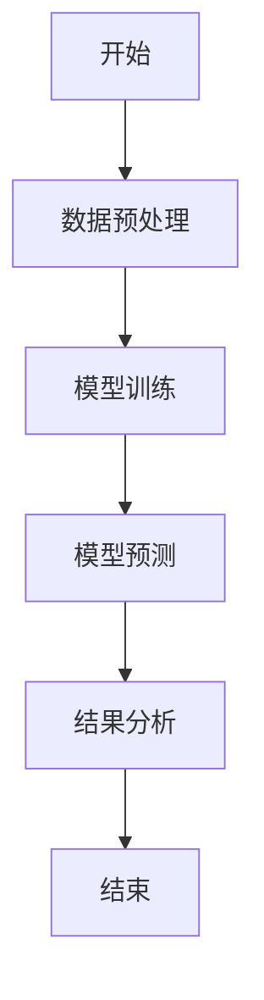

                 


# 构建智能化的企业资金池管理优化平台

## 关键词：资金池管理、智能化优化、算法原理、系统架构设计、项目实战

## 摘要：本文将详细探讨构建智能化企业资金池管理优化平台的关键技术与实现方法。从问题背景到核心概念，从算法原理到系统架构设计，再到项目实战，系统性地分析如何通过智能化技术优化企业资金池管理，提升资金配置效率与风险控制能力。

---

# 第一部分：企业资金池管理优化平台的背景与核心概念

## 第1章：企业资金池管理优化平台的背景介绍

### 1.1 问题背景与描述

#### 1.1.1 传统资金池管理的痛点
传统企业资金池管理面临以下痛点：
- **资金分配效率低**：资金分配依赖人工决策，难以快速响应市场变化。
- **风险控制能力弱**：缺乏实时监控和预测，难以应对突发事件。
- **数据孤岛问题**：不同部门的数据分散，难以形成统一的决策支持系统。
- **缺乏智能化支持**：无法利用大数据和人工智能技术进行精准预测和优化。

#### 1.1.2 数字化与智能化转型的需求
随着企业数字化转型的推进，资金池管理也需要智能化升级：
- **数据驱动决策**：利用大数据分析优化资金分配。
- **实时监控与预测**：通过实时数据分析，提前识别潜在风险。
- **自动化操作**：减少人工干预，提高资金分配效率。
- **智能化决策支持**：基于机器学习算法，提供最优资金分配方案。

#### 1.1.3 资金池管理优化的必要性
资金池管理优化的必要性体现在以下几个方面：
- **提升资金使用效率**：通过优化配置，最大化资金的收益。
- **降低经营风险**：通过实时监控和预测，降低资金链断裂风险。
- **支持业务扩展**：智能化管理能够快速响应业务需求，支持企业扩展。

### 1.2 问题解决与边界定义

#### 1.2.1 资金池优化的核心目标
资金池优化的核心目标包括：
- **最大化收益**：通过科学分配，实现资金收益的最大化。
- **最小化风险**：通过实时监控和预测，降低资金使用风险。
- **提高效率**：通过自动化和智能化，提高资金管理效率。

#### 1.2.2 解决方案的边界与外延
解决方案的边界包括：
- **数据范围**：仅涉及资金池相关的财务数据。
- **功能范围**：仅包括资金分配、监控和优化功能。
- **用户范围**：仅限于企业内部的财务管理人员和决策者。

解决方案的外延包括：
- **扩展到其他业务领域**：如供应链金融、投资管理等。
- **延伸到外部合作伙伴**：如银行、供应商等。

#### 1.2.3 核心要素与组成结构
资金池管理优化的核心要素包括：
- **资金分配模块**：负责资金的分配和调度。
- **风险监控模块**：实时监控资金风险。
- **决策支持模块**：提供优化建议和决策支持。

---

### 1.3 本章小结
本章介绍了企业资金池管理优化平台的背景，分析了传统资金池管理的痛点和数字化转型的需求，明确了资金池优化的核心目标和边界定义。

---

## 第2章：资金池管理优化的核心概念与联系

### 2.1 核心概念原理

#### 2.1.1 资金池管理的定义
资金池管理是指对企业内部资金进行集中管理、优化配置和风险控制的过程。

#### 2.1.2 智能化优化的实现原理
智能化优化的核心原理是通过大数据和人工智能技术，对资金池中的资金流动和使用情况进行实时分析，从而实现自动化的资金分配和风险控制。

#### 2.1.3 核心技术的综述
- **大数据分析**：利用海量数据进行深度分析。
- **机器学习**：通过算法模型进行预测和优化。
- **实时计算**：对资金流动进行实时监控和处理。

### 2.2 核心概念属性对比

#### 2.2.1 资金池与传统账户管理的对比
| 对比维度 | 资金池管理 | 传统账户管理 |
|----------|------------|--------------|
| 管理目标 | 最大化收益、降低风险 | 记录交易、核算成本 |
| 管理方式 | 智能化、自动化 | 人工操作、事后核算 |
| 数据依赖 | 高 | 低 |

#### 2.2.2 智能化与传统优化方法的差异
| 对比维度 | 智能化优化 | 传统优化 |
|----------|------------|------------|
| 数据来源 | 大数据、实时数据 | 有限数据、历史数据 |
| 优化速度 | 实时优化 | 事后优化 |
| 决策方式 | 数据驱动、自动化 | 人工决策、经验驱动 |

#### 2.2.3 核心要素的属性特征分析
核心要素包括：
- **资金池规模**：池内资金的总量。
- **资金分配策略**：资金分配的规则和标准。
- **风险指标**：衡量资金风险的指标，如波动率、杠杆率等。

### 2.3 ER实体关系图

```mermaid
er
  entity 资金池 {
    key 账户ID
    属性 账户名称, 账户类型, 资金余额
  }
  entity 交易记录 {
    key 交易ID
    属性 交易时间, 交易金额, 交易类型
  }
  entity 风险评估 {
    key 风险ID
    属性 风险等级, 风险类型, 评估时间
  }
  资金池 -[1..n]-> 交易记录
  资金池 -[1..n]-> 风险评估
```

### 2.4 本章小结
本章详细阐述了资金池管理优化的核心概念，对比了资金池管理与传统账户管理的差异，通过ER实体关系图展示了系统的核心要素及其关系。

---

## 第3章：资金池管理优化的算法原理

### 3.1 算法原理概述

#### 3.1.1 线性规划模型在资金池优化中的应用
线性规划模型用于解决资金分配的最优化问题，目标函数和约束条件如下：

目标函数：
$$
\text{最大化收益} = \sum_{i=1}^{n} c_i x_i
$$

约束条件：
$$
\sum_{i=1}^{n} a_i x_i \leq b
$$
$$
x_i \geq 0
$$

其中，$c_i$ 是投资项目的收益系数，$a_i$ 是资源消耗系数，$b$ 是资源总量，$x_i$ 是投资金额。

#### 3.1.2 机器学习算法的引入与作用
机器学习算法用于预测资金风险和市场趋势，常用算法包括：
- **线性回归**：用于预测市场趋势。
- **随机森林**：用于分类和回归分析。
- **神经网络**：用于复杂非线性关系的建模。

#### 3.1.3 深度学习在风险预测中的应用
深度学习模型（如LSTM）用于时间序列分析，预测资金风险。

### 3.2 算法流程图



### 3.3 算法实现代码示例

```python
import numpy as np
from sklearn.linear_model import LinearRegression

# 示例数据
X = np.array([[1], [2], [3], [4], [5]])
y = np.array([2, 4, 5, 4, 6])

# 训练模型
model = LinearRegression()
model.fit(X, y)

# 预测
print(model.predict([[6]]))
```

---

## 本章小结
本章详细讲解了资金池优化的算法原理，包括线性规划模型和机器学习算法的应用，并通过流程图和代码示例展示了算法的实现过程。

---

## 下一部分：算法原理与实现

### 3.4 数学公式与模型解析

#### 3.4.1 线性规划模型的数学表达
目标函数：
$$
\text{最大化收益} = \sum_{i=1}^{n} c_i x_i
$$

约束条件：
$$
\sum_{i=1}^{n} a_i x_i \leq b
$$
$$
x_i \geq 0
$$

#### 3.4.2 机器学习模型的训练与预测
目标函数：
$$
\text{损失函数} = \sum_{i=1}^{n} (y_i - \hat{y}_i)^2
$$

优化目标：
$$
\text{最小化损失函数} = \sum_{i=1}^{n} (y_i - \hat{y}_i)^2
$$

---

通过以上内容，我们详细讲解了资金池管理优化的核心概念和算法原理。接下来，我们将从系统架构设计、项目实战等方面进一步深入探讨。

---

**作者：AI天才研究院 & 禅与计算机程序设计艺术**

---

本文通过系统性地分析企业资金池管理优化平台的背景、核心概念和算法原理，为企业智能化资金管理提供了理论和实践指导。后续章节将详细讲解系统架构设计、项目实战和最佳实践，帮助读者全面掌握智能化资金池管理平台的构建方法。

