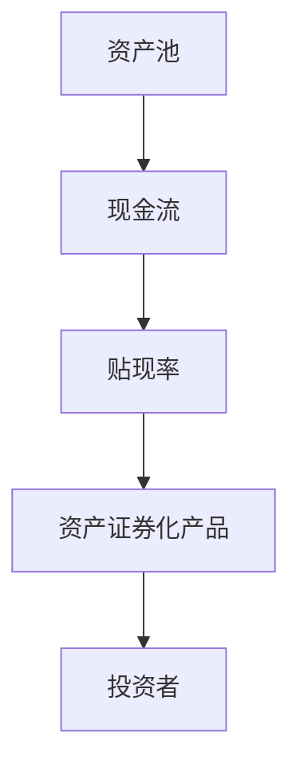
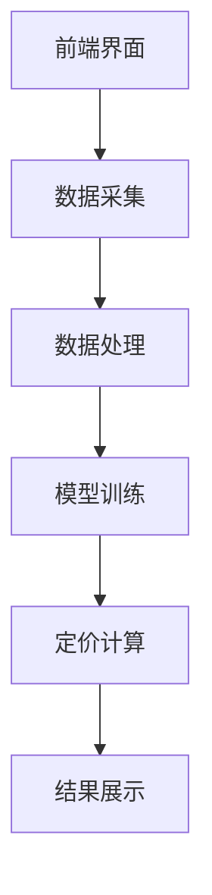
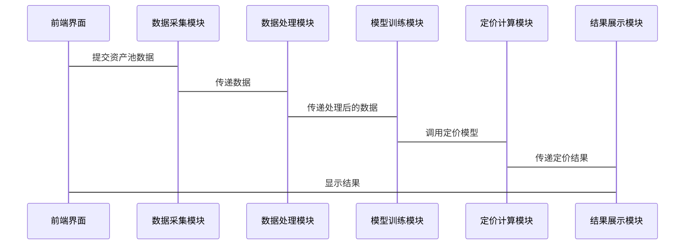

                 


# 构建智能化的资产证券化定价模型

> 关键词：资产证券化，定价模型，机器学习，现金流贴现，风险评估

> 摘要：本文详细探讨了如何构建智能化的资产证券化定价模型，从背景介绍到系统架构设计，再到项目实战，全面分析了资产证券化定价模型的核心概念、算法原理、系统架构和实际应用。通过本文的学习，读者将能够理解资产证券化定价模型的构建过程，并掌握其实现的关键技术。

---

# 第一部分: 资产证券化定价模型的背景与基础

## 第1章: 资产证券化定价模型概述

### 1.1 资产证券化的概念与背景

#### 1.1.1 资产证券化的定义
资产证券化是一种将缺乏流动性的资产转化为可以在市场上交易的证券的过程。其核心在于将资产池的现金流转化为可交易的金融产品。

#### 1.1.2 资产证券化的起源与发展
资产证券化起源于20世纪70年代的美国，最初用于解决房地产贷款的流动性问题。随着金融创新的推进，资产证券化逐渐扩展到更广泛的资产类型，如应收账款、消费信贷等。

#### 1.1.3 资产证券化在金融领域的应用
资产证券化广泛应用于银行、保险、证券等金融领域，帮助机构优化资产负债表、提高资产流动性，并为投资者提供多样化的投资选择。

---

### 1.2 资产证券化定价模型的重要性

#### 1.2.1 资产证券化定价的基本问题
资产证券化定价的核心问题是如何准确评估资产池的未来现金流，并将其转化为证券的市场价值。

#### 1.2.2 定价模型在金融决策中的作用
定价模型是资产证券化过程中最关键的技术，它直接关系到证券的发行价格和投资者的收益。

#### 1.2.3 智能化定价模型的优势
传统的定价模型依赖于人工经验和静态假设，而智能化定价模型能够通过机器学习和大数据分析，动态优化定价策略，提高定价的准确性和效率。

---

### 1.3 资产证券化定价模型的核心要素

#### 1.3.1 资产池的定义与特征
资产池是资产证券化的基础，其特征包括资产的种类、规模、信用质量等。

#### 1.3.2 资产池的风险评估
资产池的风险评估包括信用风险、市场风险和操作风险等。

#### 1.3.3 资产池的现金流分析
现金流分析是资产证券化定价的核心，包括预测现金流的大小和时间分布。

---

### 1.4 本章小结

---

# 第二部分: 资产证券化定价模型的核心概念与联系

## 第2章: 资产证券化定价模型的核心概念

### 2.1 资产池的现金流贴现模型

#### 2.1.1 现金流贴现的基本原理
现金流贴现是一种将未来现金流按一定贴现率折现到现值的技术。

#### 2.1.2 资产池现金流的预测方法
资产池现金流的预测方法包括历史数据分析、市场趋势分析和机器学习预测等。

#### 2.1.3 现金流贴现的数学模型
$$\text{资产价值} = \sum_{t=1}^{n} \frac{\text{现金流}_t}{(1 + r)^t}$$

---

### 2.2 资产池的风险评估与定价

#### 2.2.1 资产池的信用风险
信用风险是资产池的主要风险，取决于资产池中资产的信用质量和相关性。

#### 2.2.2 资产池的市场风险
市场风险是指由于市场波动导致资产池价值下降的风险。

#### 2.2.3 风险评估的量化方法
$$\text{风险值} = \sum_{i=1}^{m} w_i \cdot \text{风险因子}_i$$
其中，$w_i$ 是风险因子的权重。

---

### 2.3 资产证券化定价模型的属性特征对比

#### 2.3.1 不同定价模型的特征对比
| 模型类型 | 简单性 | 精准性 | 可解释性 | 适用场景 |
|---------|--------|--------|----------|----------|
| 线性模型 | 高      | 低      | 高        | 简单场景 |
| 非线性模型 | 低      | 高      | 低        | 复杂场景 |

#### 2.3.2 模型的适用场景分析
- 线性模型适用于简单场景，非线性模型适用于复杂场景。

#### 2.3.3 模型的优缺点分析
- 线性模型优点：简单、易解释；缺点：精准性低。
- 非线性模型优点：精准性高；缺点：复杂、难解释。

---

### 2.4 资产证券化定价模型的ER实体关系图



---

### 2.5 本章小结

---

# 第三部分: 资产证券化定价模型的算法原理

## 第3章: 资产证券化定价模型的算法原理

### 3.1 现金流贴现算法

#### 3.1.1 现金流贴现的基本流程
1. 预测未来现金流。
2. 确定适当的贴现率。
3. 将未来现金流折现到现值。

#### 3.1.2 现金流贴现的数学公式
$$\text{现值} = \sum_{t=1}^{n} \frac{\text{现金流}_t}{(1 + r)^t}$$

---

### 3.2 资产池风险评估算法

#### 3.2.1 风险评估的指标体系
- 信用评分
- 偿付能力
- 资产相关性

#### 3.2.2 风险评估的数学模型
$$\text{风险值} = \sum_{i=1}^{m} w_i \cdot \text{风险因子}_i$$

---

### 3.3 资产证券化定价模型的机器学习实现

#### 3.3.1 机器学习在资产定价中的应用
- 预测现金流
- 评估资产风险
- 优化定价策略

#### 3.3.2 常见的机器学习算法
- XGBoost
- 随机森林
- 支持向量机

#### 3.3.3 机器学习模型的训练与优化
1. 数据预处理。
2. 模型训练。
3. 模型调优。

---

### 3.4 本章小结

---

# 第四部分: 资产证券化定价模型的系统分析与架构设计

## 第4章: 资产证券化定价模型的系统架构

### 4.1 系统功能设计

#### 4.1.1 系统功能模块划分
- 数据采集模块
- 数据处理模块
- 模型训练模块
- 定价计算模块
- 结果展示模块

#### 4.1.2 每个模块的功能描述
- 数据采集模块：采集资产池的现金流数据。
- 数据处理模块：清洗和预处理数据。
- 模型训练模块：训练定价模型。
- 定价计算模块：根据模型计算资产证券化产品的定价。
- 结果展示模块：展示定价结果和相关分析。

#### 4.1.3 系统功能的领域模型


---

### 4.2 系统架构设计

#### 4.2.1 系统架构图



---

### 4.3 系统接口设计

#### 4.3.1 数据接口
- 数据输入接口：接收资产池数据。
- 数据输出接口：输出定价结果。

#### 4.3.2 模型接口
- 模型调用接口：调用定价模型进行计算。

---

### 4.4 系统交互流程



---

### 4.5 本章小结

---

# 第五部分: 资产证券化定价模型的项目实战

## 第5章: 资产证券化定价模型的项目实战

### 5.1 环境安装与配置

#### 5.1.1 Python环境配置
- 安装Python 3.8及以上版本。
- 安装必要的库：pandas、numpy、xgboost、scikit-learn。

#### 5.1.2 数据集准备
- 下载资产池数据。
- 数据格式：CSV或Excel格式。

---

### 5.2 系统核心实现源代码

#### 5.2.1 数据处理代码

```python
import pandas as pd
import numpy as np

# 数据加载
data = pd.read_csv('asset_pool.csv')

# 数据清洗
data.dropna(inplace=True)

# 数据预处理
data['时间'] = pd.to_datetime(data['时间'])
data.set_index('时间', inplace=True)
```

#### 5.2.2 模型训练代码

```python
import xgboost as xgb
from sklearn.model_selection import train_test_split

# 特征选择
features = data.columns[:-1]
target = data.columns[-1]

# 数据分割
X_train, X_test, y_train, y_test = train_test_split(data[features], data[target], test_size=0.2, random_state=42)

# 模型训练
model = xgb.XGBRegressor(n_estimators=100, learning_rate=0.1, max_depth=6)
model.fit(X_train, y_train)

# 模型预测
y_pred = model.predict(X_test)
```

#### 5.2.3 定价计算代码

```python
# 计算现值
def calculate_present_value(cash_flows, discount_rate):
    return sum(cash_flow / (1 + discount_rate) ** t for t, cash_flow in enumerate(cash_flows))

# 应用模型进行定价
discount_rate = 0.05
cash_flows = [100, 200, 300]
print(calculate_present_value(cash_flows, discount_rate))
```

---

### 5.3 实际案例分析与详细解读

#### 5.3.1 案例背景
假设我们有一个资产池，包含100个贷款资产，每个资产的期限为3年，年利率为5%。

#### 5.3.2 数据分析
- 计算每笔贷款的现金流。
- 确定资产池的总现金流。

#### 5.3.3 模型训练
- 使用XGBoost模型训练定价模型。
- 验证模型的准确性。

#### 5.3.4 定价结果
- 计算资产证券化产品的现值。
- 输出定价结果。

---

### 5.4 本章小结

---

# 第六部分: 资产证券化定价模型的最佳实践

## 第6章: 资产证券化定价模型的最佳实践

### 6.1 定价模型的优化建议

#### 6.1.1 数据质量的提升
- 确保数据的完整性和准确性。
- 处理异常值和缺失值。

#### 6.1.2 模型选择的优化
- 根据数据特点选择合适的模型。
- 通过交叉验证优化模型参数。

#### 6.1.3 模型部署的优化
- 使用容器化技术部署模型。
- 通过API接口提供定价服务。

---

### 6.2 定价模型的风险管理

#### 6.2.1 风险监控
- 实时监控模型的预测误差。
- 定期更新模型参数。

#### 6.2.2 风险提示
- 设置风险预警机制。
- 提供风险报告。

---

### 6.3 定价模型的扩展应用

#### 6.3.1 多资产池定价
- 同时处理多个资产池的定价。
- 支持不同资产池的定价需求。

#### 6.3.2 多市场应用
- 在不同市场中应用定价模型。
- 支持全球化资产池的定价。

---

### 6.4 本章小结

---

# 作者：AI天才研究院/AI Genius Institute & 禅与计算机程序设计艺术 /Zen And The Art of Computer Programming

---

通过本文的学习，读者可以系统地理解资产证券化定价模型的构建过程，并掌握其实现的关键技术。从背景介绍到系统架构设计，再到项目实战，本文为读者提供了全面的指导，帮助读者在实际应用中构建智能化的资产证券化定价模型。

