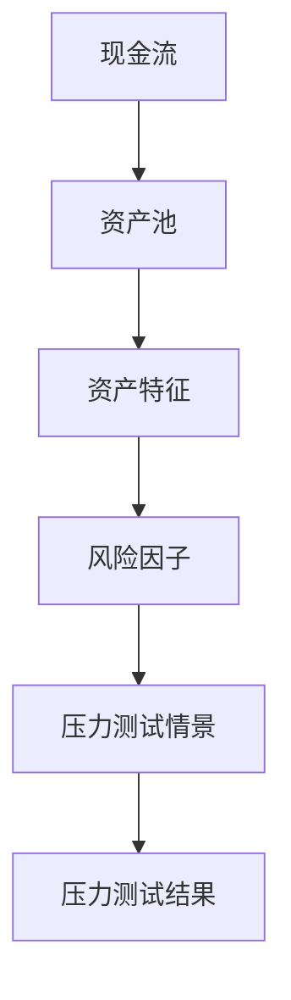
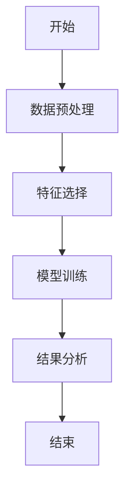
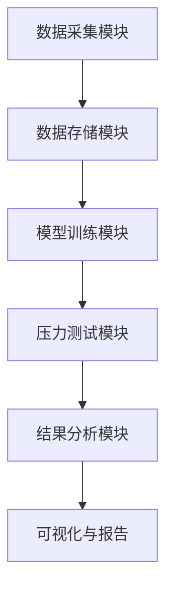

                 


# 构建智能化的资产证券化现金流压力测试模型

---

## 关键词  
- 资产证券化  
- 现金流压力测试  
- 机器学习  
- 智能化建模  
- 风险评估  

---

## 摘要  
本文旨在探讨如何利用智能化的方法构建资产证券化现金流压力测试模型。通过结合金融理论、数据科学和机器学习技术，我们提出了一套系统化的建模方法，以准确评估资产证券化产品在不同压力情景下的现金流表现。文章从背景介绍、核心概念、算法原理、数学模型、系统架构到项目实战，逐步展开分析，最终为读者提供一套完整的解决方案。

---

## 目录大纲  

### 第一章 背景介绍  
#### 1.1 问题背景  
- 资产证券化的定义与基本流程  
- 现金流预测在资产证券化中的重要性  
- 压力测试的定义与目的  

#### 1.2 核心概念  
- 现金流压力测试模型的定义  
- 资产证券化中的风险因素分析  
- 压力测试的主要方法  

#### 1.3 边界与外延  
- 模型的适用范围  
- 模型的局限性与改进方向  

### 第二章 核心概念与联系  
#### 2.1 现金流预测的基本原理  
- 现金流预测的驱动因素分析  
- 时间序列分析方法  

#### 2.2 风险因素分析  
- 利率风险、信用风险、流动性风险的量化方法  
- 风险因子的筛选与特征提取  

#### 2.3 压力测试方法  
- 灵敏度分析、情景分析、蒙特卡洛模拟的对比与选择  

#### 2.4 核心概念的属性对比表  
| 概念 | 定义 | 输入 | 输出 | 方法 |
|------|------|------|------|------|
| 现金流预测 | 预测未来现金流 | 历史数据、市场参数 | 未来现金流 | 时间序列模型 |
| 风险因子分析 | 识别影响现金流的关键因素 | 数据特征 | 风险因子排序 | 统计分析、机器学习 |
| 压力测试 | 在极端情景下评估现金流表现 | 风险因子、情景假设 | 现金流压力结果 | 蒙特卡洛模拟、情景分析 |

#### 2.5 实体关系图（ER图）  


### 第三章 算法原理讲解  
#### 3.1 算法流程  


#### 3.2 数据预处理  
- 数据清洗：处理缺失值、异常值  
- 数据标准化：归一化、正则化  
- 数据分组：按资产类别、信用等级分组  

#### 3.3 特征选择  
- 基于统计的特征选择：卡方检验、相关系数  
- 基于机器学习的特征选择：Lasso回归、随机森林特征重要性  

#### 3.4 模型训练  
- 时间序列模型：ARIMA、Prophet  
- 机器学习模型：随机森林、XGBoost、神经网络  

#### 3.5 结果分析  
- 模型评估指标：均方误差（MSE）、平均绝对误差（MAE）、R²值  
- 模型调优：超参数优化、特征工程  

#### 3.6 代码示例  
```python
# 示例：使用Prophet进行现金流预测
from prophet import Prophet

# 数据准备
data = pd.DataFrame({
    'ds': dates,
    'y': cash_flows
})

# 模型训练
model = Prophet()
model.fit(data)

# 预测未来现金流
future_dates = pd.date_range(start=last_date + 1, periods=30)
future = pd.DataFrame({'ds': future_dates})
forecast = model.predict(future)
```

### 第四章 数学模型与公式推导  
#### 4.1 现金流预测模型  
- 时间序列模型：ARIMA的数学公式  
$$ ARIMA(p, d, q) = \phi(B)(1-B)^d X_t + \theta(B) Z_t $$  
- Prophet模型的核心公式：  
$$ g(t) = a + b t + c \sin(d t) + e \cos(d t) $$  

#### 4.2 压力测试模型  
- 蒙特卡洛模拟的核心公式：  
$$ P(X \leq k) = \frac{\sum_{i=1}^n I(X_i \leq k)}{n} $$  
- 情景分析的数学表示：  
$$ F(t) = f_1(t) \cdot f_2(t) \cdot \ldots \cdot f_n(t) $$  

### 第五章 系统分析与架构设计  
#### 5.1 系统应用场景  
- 资产证券化产品的风险评估  
- 投资者决策支持  

#### 5.2 系统功能设计  
- 数据采集模块：数据清洗、特征提取  
- 模型训练模块：时间序列模型、机器学习模型  
- 压力测试模块：情景分析、蒙特卡洛模拟  
- 结果分析模块：可视化、报告生成  

#### 5.3 系统架构设计  


#### 5.4 接口设计  
- REST API接口：数据输入、模型调用、结果输出  

### 第六章 项目实战  
#### 6.1 环境安装  
- 安装依赖：Python、Pandas、Scikit-learn、Prophet、TensorFlow  

#### 6.2 核心实现代码  
```python
# 示例：使用XGBoost进行现金流预测
import xgboost as xgb

# 数据准备
train_data = xgb.DMatrix(X_train, label=y_train)
test_data = xgb.DMatrix(X_test, label=y_test)

# 模型训练
params = {
    'n_estimators': 100,
    'learning_rate': 0.05,
    'max_depth': 6,
    'min_child_weight': 1,
    'gamma': 0,
    'subsample': 0.8,
    'colsample_bytree': 0.8
}
model = xgb.XGBRegressor(**params)
model.fit(X_train, y_train)

# 模型预测
y_pred = model.predict(X_test)
```

#### 6.3 案例分析  
- 选择一个具体的资产证券化产品作为案例，详细分析建模过程和结果  

### 第七章 总结与最佳实践  
#### 7.1 最佳实践  
- 数据质量的重要性  
- 模型选择的灵活性  
- 结果解释的直观性  

#### 7.2 小结  
- 梳理全文内容，总结关键点  

#### 7.3 注意事项  
- 模型的泛化能力与过拟合问题  
- 数据隐私与合规性  

#### 7.4 拓展阅读  
- 推荐相关书籍和论文  

---

## 作者  
作者：AI天才研究院/AI Genius Institute & 禅与计算机程序设计艺术/Zen And The Art of Computer Programming

