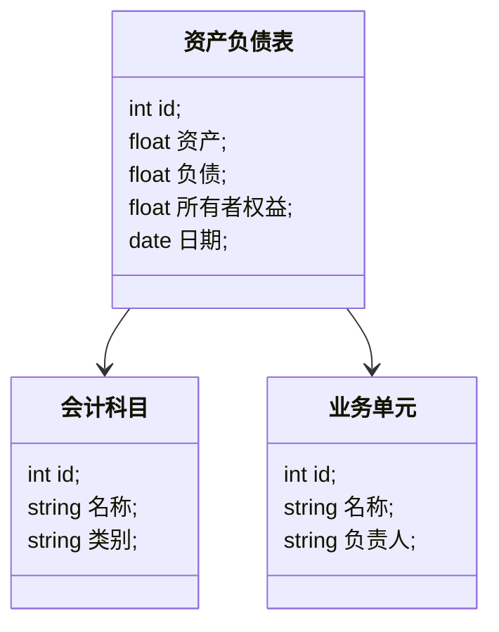
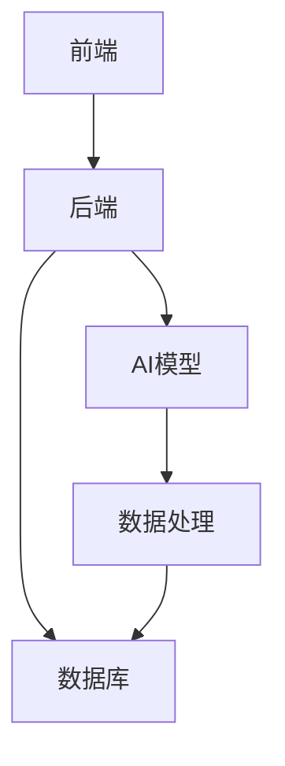
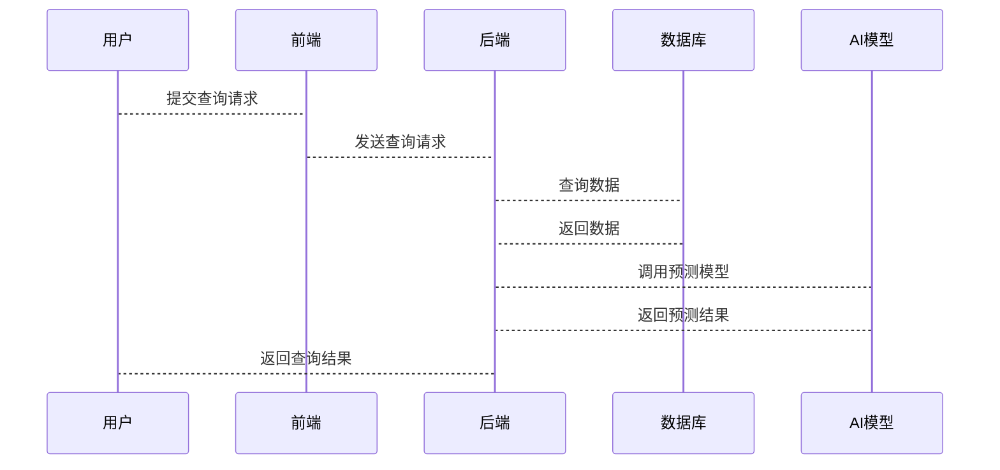

                 


# 构建智能化的资产负债管理系统

> 关键词：智能化、资产负债管理、机器学习、系统架构、风险管理、数据分析

> 摘要：随着金融市场的复杂化和信息化，传统的资产负债管理方式已经难以应对日益增长的风险和挑战。本书旨在介绍如何利用人工智能和大数据技术构建智能化的资产负债管理系统，通过系统化的分析和设计，提供一套完整的解决方案，帮助读者理解并实现智能化的资产负债管理。

---

# 第一部分: 背景介绍与核心概念

---

## 第1章: 资产负债管理的智能化转型

### 1.1 资产负债管理的基本概念
#### 1.1.1 资产负债管理的定义
资产负债管理（Asset-Liability Management, ALM）是指通过对资产和负债的全面分析和管理，以实现企业财务目标的过程。它涉及资产的流动性、收益性和安全性，以及负债的偿还能力和成本控制。

#### 1.1.2 资产负债管理的核心要素
- 资产：包括现金、应收账款、存货、固定资产等。
- 负债：包括应付账款、短期借款、长期借款、债券等。
- 所有者权益：包括股本、资本公积、盈余公积等。

#### 1.1.3 资产负债管理的边界与外延
资产负债管理不仅关注企业的财务状况，还涉及企业的经营策略、市场环境和风险管理。其外延包括财务报表分析、资本预算、融资决策等。

---

### 1.2 智能化资产负债管理的背景与意义
#### 1.2.1 传统资产负债管理的局限性
- 依赖人工经验，主观性较强。
- 数据处理能力有限，难以应对海量数据。
- 风险预测能力不足，难以及时发现潜在风险。

#### 1.2.2 智能化资产负债管理的必要性
- 提高管理效率，降低人为错误。
- 实现数据驱动的决策，提高准确性。
- 提前预测和规避风险，提升企业抗风险能力。

#### 1.2.3 智能化资产负债管理带来的价值
- 提高企业财务透明度和决策效率。
- 优化资源配置，降低财务成本。
- 增强企业的市场竞争力和抗风险能力。

---

### 1.3 本书的核心目标与内容框架
#### 1.3.1 本书的核心目标
通过系统化的分析和设计，介绍如何利用人工智能和大数据技术构建智能化的资产负债管理系统，为企业提供一套完整的解决方案。

#### 1.3.2 本书的主要内容框架
- 第一部分：背景介绍与核心概念（本章）。
- 第二部分：智能化资产负债管理的核心概念。
- 第三部分：智能化资产负债管理的算法原理。
- 第四部分：智能化资产负债管理的系统架构设计。
- 第五部分：智能化资产负债管理的项目实战。
- 第六部分：智能化资产负债管理的最佳实践。

#### 1.3.3 本书的适用读者
本书适用于企业财务人员、信息技术人员、金融领域的研究人员以及对智能化资产负债管理感兴趣的学生和自学者。

---

## 第2章: 智能化资产负债管理的核心概念

### 2.1 智能化资产负债管理的定义与特点
#### 2.1.1 智能化资产负债管理的定义
智能化资产负债管理是通过人工智能、大数据和机器学习等技术，对资产负债数据进行实时分析、预测和优化，以实现企业财务目标的过程。

#### 2.1.2 智能化资产负债管理的核心特点
- 数据驱动：基于海量数据进行分析和决策。
- 实时性：能够实时监控和调整资产负债状况。
- 自动化：通过自动化流程减少人工干预，提高效率。

#### 2.1.3 智能化资产负债管理与传统资产负债管理的对比
| 特性         | 传统资产负债管理                | 智能化资产负债管理               |
|--------------|-------------------------------|--------------------------------|
| 数据处理     | 依赖人工经验，数据有限          | 数据驱动，海量数据处理           |
| 决策方式     | 主观判断，周期性报告            | 自动化决策，实时反馈             |
| 风险管理     | 事后分析，被动应对风险          | 事前预测，主动规避风险           |

---

### 2.2 核心概念的属性特征对比
#### 2.2.1 数据驱动 vs. 传统经验驱动
- 数据驱动：基于大量历史数据和实时数据，通过算法进行分析和预测。
- 传统经验驱动：依赖管理人员的经验和直觉，可能存在主观性和片面性。

#### 2.2.2 实时分析 vs. 定期报告
- 实时分析：能够实时监控资产负债状况，及时发现和解决问题。
- 定期报告：通常在固定周期内生成报告，难以应对突发事件。

#### 2.2.3 自动化决策 vs. 人工决策
- 自动化决策：系统自动根据数据和模型生成决策建议。
- 人工决策：需要人工分析和判断，效率较低。

---

### 2.3 ER实体关系图架构
```mermaid
erd
  资产负债表
    id: string
    资产: float
    负债: float
    所有者权益: float
    日期: date
  属于
    资产负债表 --> 会计科目
    资产负债表 --> 业务单元
  会计科目
    id: string
    名称: string
    类别: string
  业务单元
    id: string
    名称: string
    负责人: string
```

---

## 第3章: 智能化资产负债管理的算法原理

### 3.1 机器学习在风险评估中的应用
#### 3.1.1 机器学习的基本原理
机器学习是一种人工智能技术，通过训练数据模型，使其能够从数据中学习并做出预测或分类。

#### 3.1.2 机器学习在风险评估中的作用
- 用于预测资产的信用风险、市场风险和流动性风险。
- 通过历史数据训练模型，预测未来的风险情况。

#### 3.1.3 常见的机器学习算法介绍
- 线性回归：用于预测连续型变量。
- 随机森林：用于分类和回归。
- 支持向量机（SVM）：用于分类和回归。

---

### 3.2 风险评估的数学模型
#### 3.2.1 线性回归模型
$$ y = \beta_0 + \beta_1x + \epsilon $$
其中，$y$ 是目标变量，$x$ 是自变量，$\beta_0$ 和 $\beta_1$ 是回归系数，$\epsilon$ 是误差项。

#### 3.2.2 随机森林模型
随机森林是一种基于决策树的集成学习算法，通过构建多个决策树并进行投票或平均，提高模型的准确性和稳定性。

#### 3.2.3 支持向量机模型
支持向量机通过寻找一个超平面，将数据分成两类，适用于线性可分的数据。

---

### 3.3 算法实现与代码示例
#### 3.3.1 数据预处理
```python
import pandas as pd
from sklearn.ensemble import RandomForestClassifier

# 数据加载
data = pd.read_csv('balance_sheet.csv')

# 数据清洗
data = data.dropna()

# 数据分割
X = data.drop(columns=['负债'])
y = data['负债']

# 模型训练
model = RandomForestClassifier()
model.fit(X, y)

# 预测
predictions = model.predict(X)
```

#### 3.3.2 模型训练与评估
```python
from sklearn.metrics import accuracy_score

# 模型评估
accuracy = accuracy_score(y, predictions)
print(f'模型准确率：{accuracy}')
```

---

## 第4章: 智能化资产负债管理的系统架构设计

### 4.1 问题场景介绍
以某银行为例，其资产负债管理系统需要实时监控和管理资产和负债，优化资本配置，降低风险。

---

## 4.2 系统功能设计
### 4.2.1 领域模型设计


---

### 4.2.2 系统架构设计


---

### 4.2.3 系统接口设计
- 前端接口：用户登录、数据输入、查询功能。
- 后端接口：API接口，接收前端请求并调用AI模型进行处理。
- 数据接口：与数据库交互，获取和存储数据。

---

### 4.2.4 系统交互设计


---

## 第5章: 智能化资产负债管理的项目实战

### 5.1 环境安装与配置
- 安装Python和相关库（Pandas、Scikit-learn、Flask）。
- 安装数据库（MySQL、PostgreSQL）。
- 安装开发工具（PyCharm、VS Code）。

---

### 5.2 系统核心实现
#### 5.2.1 数据预处理
```python
import pandas as pd

# 数据加载
data = pd.read_csv('balance_sheet.csv')

# 数据清洗
data = data.dropna()

# 数据标准化
from sklearn.preprocessing import StandardScaler
scaler = StandardScaler()
scaled_data = scaler.fit_transform(data)
```

#### 5.2.2 模型训练与部署
```python
from sklearn.ensemble import RandomForestClassifier

# 模型训练
model = RandomForestClassifier()
model.fit(X_train, y_train)

# 模型部署
from flask import Flask, request, jsonify

app = Flask(__name__)

@app.route('/predict', methods=['POST'])
def predict():
    data = request.json
    prediction = model.predict([data['input']])
    return jsonify({'result': int(prediction[0])})

if __name__ == '__main__':
    app.run(debug=True)
```

---

### 5.3 实际案例分析
以某银行为例，利用随机森林模型预测资产的信用风险，通过系统实现数据输入、模型预测和结果展示。

---

## 第6章: 智能化资产负债管理的最佳实践

### 6.1 关键点总结
- 数据质量：确保数据的准确性和完整性。
- 模型选择：根据业务需求选择合适的算法。
- 系统维护：定期更新数据和模型，确保系统的稳定性和高效性。

---

### 6.2 小结
智能化资产负债管理通过人工智能和大数据技术，显著提高了企业的财务管理和风险控制能力，为企业提供了更加高效和准确的决策支持。

---

### 6.3 注意事项
- 数据隐私和安全：在处理财务数据时，需注意数据的安全性和隐私性。
- 模型解释性：复杂的模型可能难以解释，需注重模型的可解释性。
- 系统性能：确保系统的运行效率，避免因数据量过大导致性能瓶颈。

---

### 6.4 拓展阅读
- 《机器学习实战》：深入理解机器学习算法的实现和应用。
- 《数据驱动的决策》：探讨数据在企业决策中的应用。
- 《金融风险管理》：了解金融领域的风险管理理论和实践。

---

## 第7章: 项目总结与未来展望

### 7.1 项目总结
通过本项目的实施，我们成功构建了一个智能化的资产负债管理系统，实现了数据驱动的决策、实时监控和风险预测，显著提高了企业的财务管理和抗风险能力。

---

### 7.2 未来展望
未来，随着人工智能和大数据技术的不断发展，智能化资产负债管理系统将更加智能化和自动化。我们可以通过引入更先进的算法和技术，进一步优化系统的功能和性能，为企业提供更加全面和精准的财务管理支持。

---

## 作者：AI天才研究院/AI Genius Institute & 禅与计算机程序设计艺术 /Zen And The Art of Computer Programming

---

以上是《构建智能化的资产负债管理系统》的技术博客文章的大纲和部分详细内容。如需进一步扩展或详细讲解某一部分，请随时告诉我！

