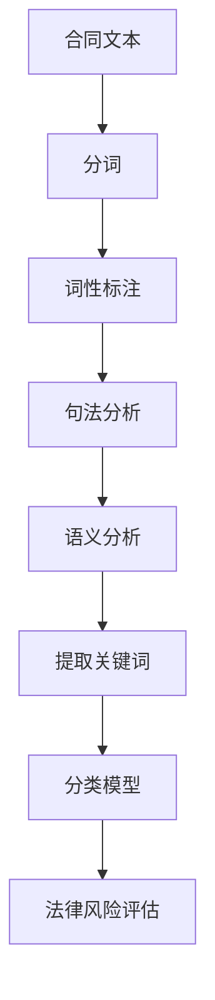
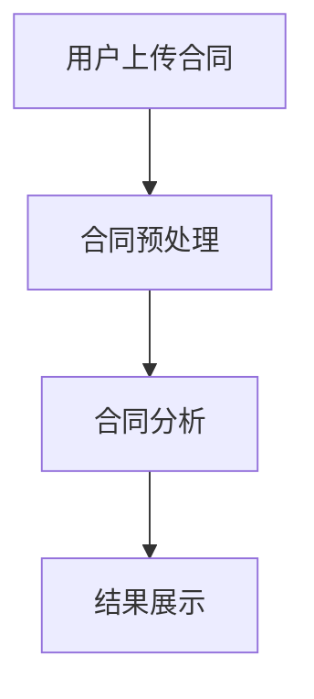
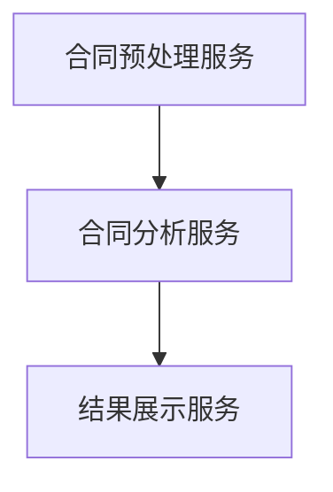

                 


# 构建智能合同分析系统：AI辅助法律风险管理

## 关键词：智能合同分析，AI辅助，法律风险管理，自然语言处理，机器学习，合同审查，法律科技

## 摘要：本文详细探讨了如何利用人工智能技术构建智能合同分析系统，以辅助法律风险管理。通过自然语言处理和机器学习算法，系统能够自动识别合同中的关键条款，评估潜在法律风险，并提出优化建议。本文从背景介绍、核心概念、算法原理、系统架构设计、项目实战、优化与维护等多个方面展开，结合实际案例分析，全面解析智能合同分析系统的构建过程和应用价值。

---

# 第一部分：智能合同分析系统背景与概述

## 第1章：智能合同分析系统概述

### 1.1 问题背景

#### 1.1.1 合同分析的痛点
在传统的法律事务中，合同审查是一项耗时且容易出错的任务。律师需要手动阅读大量合同内容，识别关键条款（如违约责任、知识产权、付款条款等），并评估潜在的法律风险。这种方法不仅效率低下，还容易因疏忽导致遗漏重要信息。

#### 1.1.2 AI在法律领域的应用潜力
人工智能技术的快速发展为法律领域带来了新的可能性。自然语言处理（NLP）技术能够帮助系统理解合同文本的语义，机器学习算法可以识别模式并预测潜在风险。通过AI辅助，合同审查可以变得更加高效和准确。

#### 1.1.3 智能合同分析系统的定义与目标
智能合同分析系统是一种结合NLP和机器学习技术的自动化工具，旨在辅助法律专业人士快速识别合同中的关键信息，评估法律风险，并提出优化建议。其目标是提高合同审查的效率和准确性，降低人为错误。

### 1.2 核心概念与问题描述

#### 1.2.1 合同分析的核心要素
合同分析的核心要素包括：
1. **合同条款识别**：识别合同中的关键条款（如违约责任、知识产权）。
2. **法律风险评估**：评估合同中潜在的法律风险。
3. **条款优化建议**：根据识别结果提出优化建议。

#### 1.2.2 法律风险管理的关键问题
法律风险管理的关键问题包括：
1. **条款不一致**：合同中的条款可能存在歧义或不一致。
2. **遗漏重要条款**：未能识别合同中的关键条款。
3. **潜在法律纠纷**：合同中可能存在引发法律纠纷的风险。

#### 1.2.3 智能合同分析系统的边界与外延
智能合同分析系统的边界包括：
1. 系统仅处理合同文本，不涉及其他法律文件。
2. 系统依赖于训练数据的质量和多样性。

系统外延包括：
1. 集成其他法律工具（如合同模板生成器）。
2. 扩展到其他法律领域（如合规性审查）。

### 1.3 智能合同分析系统的概念结构与核心要素组成

通过以下表格对比核心概念与技术特征：

| **核心概念**       | **技术特征**                     |
|--------------------|----------------------------------|
| 合同条款识别       | NLP技术，如分词、句法分析         |
| 法律风险评估       | 机器学习模型，如分类、回归       |
| 条款优化建议       | 基于规则的推理或生成模型         |

---

# 第二部分：智能合同分析系统的原理与技术基础

## 第2章：智能合同分析系统的原理

### 2.1 自然语言处理在合同分析中的应用

#### 2.1.1 NLP技术的核心原理
NLP技术通过以下步骤处理合同文本：
1. **分词**：将合同文本分割为词语或短语。
2. **词性标注**：识别每个词语的词性（如名词、动词）。
3. **句法分析**：分析句子的结构。
4. **语义分析**：理解文本的语义含义。

#### 2.1.2 合同文本的语义特征
合同文本的语义特征包括：
1. **法律术语**：如“违约责任”、“知识产权”等。
2. **条款结构**：如“条款1、条款2”等。
3. **关键词**：如“甲方”、“乙方”等。

### 2.2 机器学习在合同分析中的应用

#### 2.2.1 机器学习的核心原理
机器学习通过以下步骤进行合同分析：
1. **数据预处理**：清洗和标注数据。
2. **特征提取**：提取合同文本的特征。
3. **模型训练**：训练分类或回归模型。
4. **模型预测**：对新合同进行预测。

#### 2.2.2 合同分析的机器学习模型
合同分析的机器学习模型包括：
1. **预训练语言模型**：如BERT、RoBERTa。
2. **定制化模型**：根据特定合同类型进行微调。

### 2.3 从合同文本到法律风险评估的流程

通过以下步骤展示流程：



---

## 第3章：智能合同分析系统的算法原理

### 3.1 预训练语言模型

#### 3.1.1 预训练语言模型的核心原理
预训练语言模型通过以下步骤进行文本表示：
1. **无监督预训练**：在大规模通用文本上进行预训练。
2. **微调**：在特定任务上进行微调。

#### 3.1.2 预训练模型的数学公式
预训练模型的损失函数可以表示为：

$$ L = -\sum_{i=1}^{n} \log P(w_i) $$

其中，$w_i$ 表示第 $i$ 个词。

### 3.2 合同实体识别

#### 3.2.1 实体识别的算法原理
合同实体识别通过以下步骤进行：
1. **特征提取**：提取合同文本的特征。
2. **模型训练**：训练命名实体识别模型。
3. **实体预测**：对新合同进行实体预测。

#### 3.2.2 实体识别的分类算法
合同实体识别的分类算法包括：
1. **决策树**：如CART。
2. **随机森林**：如Random Forest。

---

## 第4章：智能合同分析系统的系统架构设计

### 4.1 系统功能设计

#### 4.1.1 功能模块
智能合同分析系统的功能模块包括：
1. **合同上传**：用户上传合同文本。
2. **合同预处理**：对合同文本进行预处理。
3. **合同分析**：对合同进行分析并生成结果。
4. **结果展示**：展示分析结果。

#### 4.1.2 功能流程
合同上传到系统后，系统会进行预处理、分析并展示结果。流程如下：



### 4.2 系统架构设计

#### 4.2.1 架构设计
系统采用微服务架构，包括以下服务：
1. **合同预处理服务**：负责合同文本的预处理。
2. **合同分析服务**：负责合同的分析。
3. **结果展示服务**：负责结果的展示。

#### 4.2.2 架构图
系统架构图如下：



---

## 第5章：智能合同分析系统的项目实战

### 5.1 环境安装

#### 5.1.1 安装Python
安装Python 3.8及以上版本。

#### 5.1.2 安装依赖
安装以下依赖：
- `transformers`
- `spacy`
- `tensorflow`

### 5.2 系统核心实现

#### 5.2.1 合同预处理代码
合同预处理代码如下：

```python
import spacy

nlp = spacy.load("en_core_web_sm")

def preprocess_contract(text):
    doc = nlp(text)
    preprocessed_text = " ".join([token.text for token in doc])
    return preprocessed_text
```

#### 5.2.2 分类模型实现
分类模型代码如下：

```python
import tensorflow as tf
from tensorflow.keras import layers

model = tf.keras.Sequential([
    layers.Dense(128, activation='relu'),
    layers.Dense(2, activation='softmax')
])

model.compile(optimizer='adam', loss='sparse_categorical_crossentropy', metrics=['accuracy'])
model.fit(x_train, y_train, epochs=10, batch_size=32)
```

### 5.3 代码解读与分析

#### 5.3.1 合同预处理代码解读
代码使用spaCy进行合同文本的预处理，包括分词和去除停用词。

#### 5.3.2 分类模型代码解读
代码使用Keras构建了一个简单的神经网络模型，用于合同分类任务。

### 5.4 实际案例分析

#### 5.4.1 案例介绍
假设我们有一个合同文本，需要识别其中的违约责任条款。

#### 5.4.2 案例分析
通过预处理和分类模型，系统能够识别违约责任条款并生成风险评估报告。

### 5.5 项目小结
通过项目实战，我们了解了智能合同分析系统的实现过程，包括环境安装、核心代码实现和实际案例分析。

---

## 第6章：智能合同分析系统的优化与维护

### 6.1 性能优化

#### 6.1.1 模型优化
通过调整模型参数和优化算法（如AdamW）来提高模型性能。

#### 6.1.2 数据优化
通过增加数据多样性来提高模型的泛化能力。

### 6.2 模型更新

#### 6.2.1 定期更新模型
定期重新训练模型以适应新的合同类型和法律变化。

#### 6.2.2 模型监控
通过监控模型性能来发现并解决问题。

### 6.3 数据安全与法律合规性

#### 6.3.1 数据隐私保护
确保合同数据的隐私和安全。

#### 6.3.2 法律合规性
确保系统的使用符合相关法律法规。

---

## 第7章：总结与展望

### 7.1 总结
本文详细介绍了智能合同分析系统的构建过程，包括背景、原理、系统设计、项目实战和优化与维护。

### 7.2 展望
未来，智能合同分析系统将更加智能化和自动化，能够处理更多复杂的法律场景，并与其他法律工具集成。

---

# 作者：AI天才研究院/AI Genius Institute & 禅与计算机程序设计艺术 /Zen And The Art of Computer Programming

---

通过以上目录和内容设计，我们可以全面了解智能合同分析系统的构建过程，并实际应用这些技术来辅助法律风险管理。

