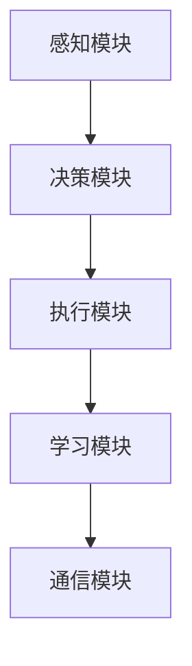
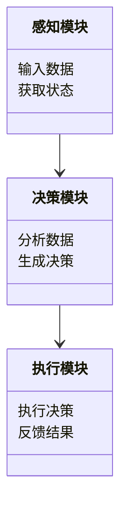
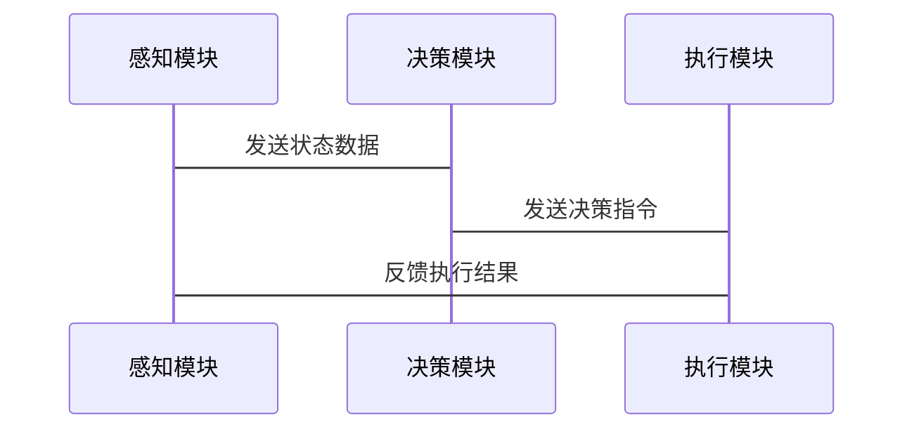

                 


# 构建智能城市管理AI Agent系统

## 关键词：智能城市，AI Agent，城市管理，系统架构，算法原理，项目实战

## 摘要：本文详细探讨了构建智能城市管理AI Agent系统的各个方面，包括背景介绍、核心概念、算法原理、系统架构、项目实战以及最佳实践。通过理论与实践相结合的方式，分析了AI Agent在城市管理中的应用，详细讲解了系统的构建过程，并提供了实际案例和代码实现。

---

# 第一部分: 背景介绍与核心概念

## 第1章: 智能城市与AI Agent系统概述

### 1.1 问题背景与问题描述

#### 1.1.1 智慧城市建设的背景
随着城市化进程的加快，城市规模不断扩大，城市管理面临的挑战日益增加。传统的人工管理模式效率低下，难以应对复杂的城市问题。AI Agent（人工智能代理）作为一种智能化的解决方案，能够通过自动化和智能化的方式优化城市管理，提升效率和决策能力。

#### 1.1.2 城市管理中的痛点与挑战
- 城市交通拥堵问题
- 城市资源分配不均
- 城市应急管理效率低下
- 城市环境污染问题
- 城市居民生活质量有待提升

#### 1.1.3 AI Agent在城市管理中的作用
AI Agent可以通过实时数据采集、分析和决策，帮助城市管理者优化资源配置、提高管理效率、降低运营成本，并提升城市居民的生活质量。

### 1.2 AI Agent系统的核心概念

#### 1.2.1 AI Agent的定义与特点
AI Agent是一种能够感知环境、自主决策并执行任务的智能体。其特点包括：
- **自主性**：能够自主决策和行动
- **反应性**：能够实时感知环境并做出反应
- **目标导向**：以实现特定目标为导向
- **学习能力**：能够通过学习提升性能

#### 1.2.2 城市管理中的AI Agent应用场景
- **交通管理**：优化交通信号灯控制，减少拥堵
- **资源分配**：智能分配城市资源，如电力、水资源等
- **应急管理**：在突发事件中快速响应，协调资源
- **环境监测**：实时监测空气质量、噪音污染等

#### 1.2.3 AI Agent系统的边界与外延
- **边界**：AI Agent系统的边界在于其能够感知和影响的范围，通常与外部系统（如数据库、传感器）交互。
- **外延**：AI Agent系统可以与其他智能系统协作，形成更复杂的智能化城市管理网络。

### 1.3 问题解决与概念结构

#### 1.3.1 AI Agent如何解决城市管理问题
通过实时数据采集、分析和决策，AI Agent能够快速响应城市中的各种问题，优化资源配置，提高管理效率。

#### 1.3.2 概念结构与核心要素组成
以下是AI Agent系统的核心要素组成：

| 要素 | 描述 |
|------|------|
| **感知模块** | 采集环境数据，如传感器数据、用户输入 |
| **决策模块** | 基于感知数据进行分析和决策 |
| **执行模块** | 执行决策指令，影响环境 |
| **学习模块** | 通过学习提升系统的性能和决策能力 |
| **通信模块** | 与其他系统或AI Agent进行通信与协作 |

#### 1.3.3 AI Agent系统的整体架构
以下是AI Agent系统的整体架构：



---

## 第2章: AI Agent的核心原理

### 2.1 AI Agent的原理与机制

#### 2.1.1 状态空间与动作空间
- **状态空间**：系统所有可能的状态集合。
- **动作空间**：系统所有可能的行动集合。

#### 2.1.2 AI Agent的感知与决策过程
1. 感知环境，获取状态信息。
2. 分析状态信息，生成可能的动作。
3. 选择最优动作，执行决策。

#### 2.1.3 多智能体协作机制
通过多智能体协作，AI Agent系统可以在复杂环境中实现更高效的决策和行动。

### 2.2 城市管理中的AI Agent系统架构

#### 2.2.1 分层架构设计
AI Agent系统通常采用分层架构，包括感知层、决策层和执行层。

#### 2.2.2 模块化设计
通过模块化设计，系统可以更灵活地进行扩展和优化。

#### 2.2.3 系统间的交互与协作
系统之间的交互与协作是AI Agent系统实现复杂任务的关键。

### 2.3 AI Agent的算法与数学模型

#### 2.3.1 基于强化学习的AI Agent算法
强化学习是一种通过试错学习的算法，适用于动态环境中的决策问题。

#### 2.3.2 基于监督学习的AI Agent算法
监督学习是一种基于样本数据的算法，适用于有标签数据的任务。

#### 2.3.3 混合学习模型的应用
通过结合强化学习和监督学习，可以实现更强大的AI Agent系统。

---

## 第3章: AI Agent算法原理

### 3.1 强化学习算法

#### 3.1.1 Q-learning算法
Q-learning是一种经典的强化学习算法，通过状态-动作价值函数进行学习。

#### 3.1.2 Deep Q-Networks (DQN)算法
DQN算法通过深度神经网络近似Q值函数，适用于高维状态空间。

#### 3.1.3 策略梯度算法
策略梯度算法通过优化策略直接进行学习。

### 3.2 监督学习算法

#### 3.2.1 线性回归模型
线性回归是一种简单的监督学习算法，适用于线性关系的回归问题。

#### 3.2.2 支持向量机(SVM)
SVM是一种强大的监督学习算法，适用于分类和回归任务。

#### 3.2.3 神经网络模型
神经网络模型是一种复杂的监督学习算法，适用于各种任务。

### 3.3 混合学习算法

#### 3.3.1 强化学习与监督学习的结合
通过结合强化学习和监督学习，可以实现更强大的AI Agent系统。

#### 3.3.2 混合学习模型的优势
混合学习模型可以在不同任务之间共享知识，提高整体性能。

#### 3.3.3 混合学习模型的实现
通过集成学习和迁移学习等技术，可以实现混合学习模型。

---

## 第4章: AI Agent系统架构设计

### 4.1 问题场景介绍

#### 4.1.1 城市交通管理场景
通过AI Agent系统优化交通信号灯控制，减少拥堵。

#### 4.1.2 城市应急管理场景
在突发事件中快速响应，协调资源。

#### 4.1.3 城市资源分配场景
智能分配城市资源，如电力、水资源等。

### 4.2 系统功能设计

#### 4.2.1 领域模型设计（Mermaid类图）
以下是领域模型设计：



#### 4.2.2 系统架构设计（Mermaid架构图）
以下是系统架构设计：


#### 4.2.3 系统接口设计
系统接口设计需要考虑模块之间的通信与协作。

### 4.3 系统交互设计

#### 4.3.1 序列图设计（Mermaid交互图）
以下是系统交互设计的序列图：



---

## 第5章: 项目实战

### 5.1 环境安装与配置

#### 5.1.1 开发环境搭建
需要安装Python、深度学习框架（如TensorFlow、Keras）以及相关的库。

#### 5.1.2 依赖库安装
安装必要的依赖库，如numpy、pandas、scikit-learn等。

#### 5.1.3 环境配置与测试
配置开发环境并进行初步测试。

### 5.2 系统核心实现

#### 5.2.1 AI Agent核心算法实现
以下是AI Agent核心算法实现的Python代码示例：

```python
import numpy as np

# 定义强化学习算法
class AIAgent:
    def __init__(self, state_space, action_space):
        self.state_space = state_space
        self.action_space = action_space
        # 初始化Q值表
        self.Q = np.zeros((state_space, action_space))

    def感知环境(self, state):
        # 获取当前状态
        return state

    def 决策(self, state):
        # 选择动作
        if np.random.random() < 0.1:
            action = np.random.randint(self.action_space)
        else:
            action = np.argmax(self.Q[state])
        return action

    def 学习(self, state, action, reward):
        # 更新Q值表
        self.Q[state, action] = self.Q[state, action] + reward

# 定义城市管理场景
class 城市管理场景:
    def __init__(self):
        self.state_space = 5  # 状态空间大小
        self.action_space = 3  # 动作空间大小

# 初始化AI Agent
agent = AIAgent(state_space=5, action_space=3)

# 训练过程
for episode in range(100):
    state = 城市管理场景().感知环境()
    action = agent.决策(state)
    reward = 城市管理场景().获得奖励(action)
    agent.学习(state, action, reward)
```

#### 5.2.2 系统模块化实现
将系统划分为感知模块、决策模块、执行模块等，并进行模块化实现。

#### 5.2.3 系统接口实现
定义系统接口，确保模块之间的通信与协作。

### 5.3 代码应用解读与分析

#### 5.3.1 核心代码分析
分析上述代码实现，理解AI Agent的核心算法和系统架构。

#### 5.3.2 代码实现细节
详细说明代码实现的细节，如状态空间、动作空间的定义，算法的选择与实现等。

#### 5.3.3 代码优化建议
根据实际需求，提出代码优化建议，如改进算法、优化数据结构等。

### 5.4 实际案例分析

#### 5.4.1 案例背景介绍
选择一个具体的城市管理场景，如交通信号灯控制。

#### 5.4.2 案例实现过程
详细描述案例的实现过程，包括数据采集、算法选择、系统设计与实现等。

#### 5.4.3 案例分析与总结
分析案例的实现效果，总结经验与教训。

---

## 第6章: 最佳实践与总结

### 6.1 最佳实践

#### 6.1.1 系统性能优化
通过算法优化、数据结构优化等方式提升系统性能。

#### 6.1.2 数据隐私保护
在实际应用中，需要重视数据隐私保护，避免数据泄露。

#### 6.1.3 系统可扩展性设计
设计系统时，需要考虑系统的可扩展性，便于未来功能的扩展与升级。

### 6.2 小结
通过本文的详细讲解，读者可以全面了解构建智能城市管理AI Agent系统的各个方面，包括理论基础、算法原理、系统设计与实现等。

### 6.3 注意事项
在实际应用中，需要注意系统的可靠性和稳定性，确保系统的正常运行。

### 6.4 拓展阅读
推荐读者阅读相关领域的书籍和论文，进一步深入学习。

---

## 附录: 参考文献与工具

### 附录A: 参考文献
1. Russell, S., & Norvig, P. (2010). Artificial Intelligence: A Modern Approach.
2. 维基百科：人工智能代理
3. TensorFlow官方文档

### 附录B: 工具与资源
1. Python编程语言
2. TensorFlow/Keras深度学习框架
3. Mermaid图表工具
4. VSCode或Jupyter Notebook开发环境

---

## 作者：AI天才研究院/AI Genius Institute & 禅与计算机程序设计艺术 /Zen And The Art of Computer Programming

---

通过以上详细的目录和内容安排，读者可以系统地了解构建智能城市管理AI Agent系统的各个方面，从理论到实践，逐步掌握系统的构建方法和实现技巧。

