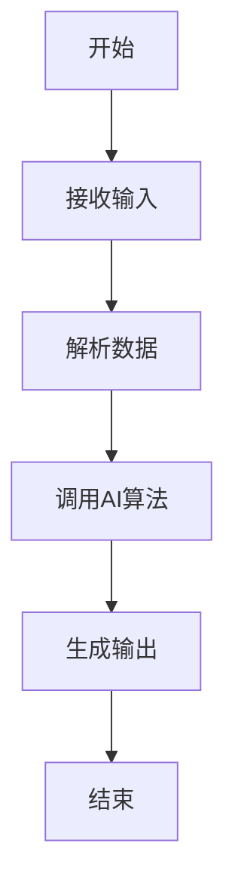
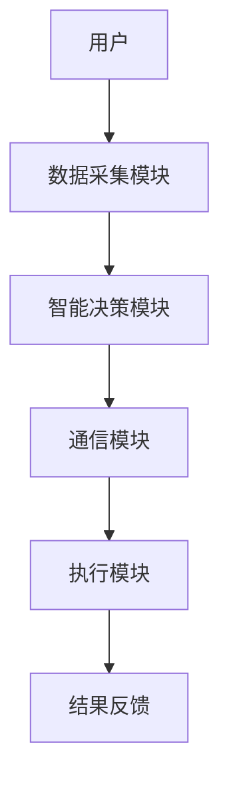
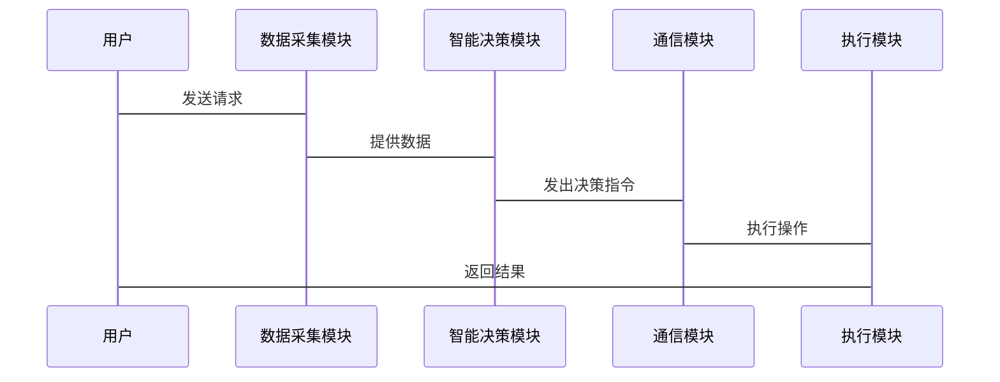

                 


# 构建跨平台AI Agent的技术挑战

> 关键词：跨平台、AI Agent、技术挑战、系统架构、算法原理

> 摘要：本文深入探讨了构建跨平台AI Agent的技术挑战，从核心概念到算法原理，再到系统架构设计和项目实战，全面分析了构建跨平台AI Agent的各个方面，帮助读者理解并掌握相关技术。

---

# 第一部分: 跨平台AI Agent的背景与挑战

## 第1章: 跨平台AI Agent的背景介绍

### 1.1 跨平台AI Agent的定义与概念

#### 1.1.1 什么是AI Agent
AI Agent（人工智能代理）是一种能够感知环境、自主决策并执行任务的智能实体。它通过与环境交互，利用传感器获取信息，并通过执行器采取行动，以实现特定目标。

#### 1.1.2 跨平台AI Agent的定义
跨平台AI Agent是指能够在多种不同的计算平台上运行的AI代理。这些平台可能包括不同的操作系统、硬件架构或网络环境。跨平台性要求AI Agent能够适应不同的运行环境，并在这些环境中无缝运行。

#### 1.1.3 跨平台AI Agent的核心要素
- **跨平台兼容性**：能够在多种平台上运行。
- **智能性**：具备自主决策和问题解决能力。
- **通信能力**：能够与其他系统或平台进行交互。

### 1.2 跨平台AI Agent的技术背景

#### 1.2.1 AI Agent的发展历程
AI Agent的概念起源于人工智能领域的研究，随着技术的发展，AI Agent逐渐从理论研究走向实际应用。现代AI Agent技术结合了机器学习、自然语言处理和分布式系统等多领域的知识。

#### 1.2.2 跨平台技术的演进
随着移动互联网和多平台应用的兴起，跨平台技术的需求日益增加。跨平台技术的发展使得AI Agent能够运行在不同的设备和平台上，从而扩展了其应用场景。

#### 1.2.3 当前AI Agent的应用场景
- 智能助手（如Siri、Alexa）。
- 智能客服系统。
- 自动化机器人控制。
- 多平台监控与管理。

### 1.3 跨平台AI Agent的技术挑战

#### 1.3.1 跨平台通信的难点
跨平台通信需要处理不同平台之间的协议差异、数据格式不统一等问题。如何实现高效的跨平台通信是构建跨平台AI Agent的核心挑战之一。

#### 1.3.2 多平台兼容性问题
不同平台可能有不同的硬件架构、操作系统和API接口。AI Agent需要在这些异构平台上运行，这增加了开发和维护的复杂性。

#### 1.3.3 AI Agent的性能优化
在跨平台环境下，AI Agent需要在不同的平台上保持一致的性能表现，这对算法优化和资源管理提出了更高的要求。

---

## 第2章: 跨平台AI Agent的核心概念与联系

### 2.1 跨平台AI Agent的核心原理

#### 2.1.1 跨平台通信机制
跨平台通信机制是AI Agent能够在不同平台上运行的关键。通过使用通用的通信协议和接口，AI Agent可以在不同的平台上实现数据的交换和交互。

#### 2.1.2 AI Agent的智能决策过程
AI Agent通过感知环境、分析信息并做出决策。这种决策过程通常涉及机器学习算法和规则引擎。

#### 2.1.3 跨平台数据交换协议
为了实现跨平台的数据交换，需要定义统一的数据格式和通信协议。常用的数据交换协议包括JSON、XML和Protobuf等。

### 2.2 跨平台AI Agent的属性特征对比

| 属性         | 跨平台AI Agent | 单平台AI Agent |
|--------------|----------------|----------------|
| 平台支持     | 多平台         | 单一平台       |
| 通信能力     | 支持跨平台通信 | 仅限本地通信   |
| 智能性       | 高度智能       | 智能性有限     |
| 可扩展性     | 高             | 低             |
| 维护复杂度   | 较高           | 较低           |

### 2.3 跨平台AI Agent的ER实体关系图

```mermaid
er
    entity(AI Agent) {
        id
        platform
        communication protocol
        intelligence level
    }
    entity(Platform) {
        id
        name
        OS version
    }
    entity(Communication Protocol) {
        id
        name
        version
    }
    entity(Intelligence Level) {
        id
        model
        performance metrics
    }
    AI Agent -- many-to-many --> Platform
    AI Agent -- many-to-many --> Communication Protocol
    AI Agent -- many-to-many --> Intelligence Level
```

---

## 第3章: 跨平台AI Agent的算法原理

### 3.1 跨平台AI Agent的算法流程



### 3.2 算法实现的数学模型

AI Agent的核心算法通常基于概率论和优化理论。例如，强化学习中的Q-learning算法：

状态值更新公式：
$$ Q(s, a) = Q(s, a) + \alpha \left[r + \gamma \max Q(s', a') - Q(s, a)\right] $$

其中：
- \( Q(s, a) \)：状态 \( s \) 下采取动作 \( a \) 的价值。
- \( \alpha \)：学习率。
- \( \gamma \)：折扣因子。
- \( r \)：奖励值。
- \( s' \)：下一个状态。

### 3.3 算法实现的Python代码示例

```python
def q_learning():
    import numpy as np
    import random

    # 初始化参数
    states = 10
    actions = 4
    Q = np.zeros((states, actions))
    alpha = 0.1
    gamma = 0.9

    # 训练过程
    for episode in range(1000):
        state = random.randint(0, states-1)
        action = np.argmax(Q[state])
        reward = random.random()
        next_state = random.randint(0, states-1)
        Q[state][action] += alpha * (reward + gamma * np.max(Q[next_state]) - Q[state][action])

    return Q

# 调用函数
result = q_learning()
print(result)
```

---

## 第4章: 跨平台AI Agent的系统架构设计

### 4.1 系统功能设计

- **数据采集模块**：负责从不同平台采集数据。
- **智能决策模块**：基于机器学习模型做出决策。
- **通信模块**：实现跨平台的数据传输和交互。
- **执行模块**：根据决策结果执行相应的操作。

### 4.2 系统架构设计



### 4.3 系统接口设计

- **输入接口**：接收来自不同平台的输入数据。
- **输出接口**：将决策结果发送到目标平台。
- **通信接口**：实现与其他系统的数据交互。

### 4.4 系统交互流程



---

## 第5章: 跨平台AI Agent的项目实战

### 5.1 环境安装

- 安装Python和必要的库（如numpy、scikit-learn）。
- 安装跨平台通信库（如ZeroMQ或grpc）。

### 5.2 系统核心实现源代码

```python
import zmq

# 服务器端
context = zmq.Context()
socket = context.socket(zmq.REP)
socket.bind("tcp://*:5555")

while True:
    message = socket.recv()
    # 处理消息
    response = "Processed: " + message.decode()
    socket.send(response.encode())

# 客户端
context = zmq.Context()
socket = context.socket(zmq.REQ)
socket.connect("tcp://localhost:5555")

message = "Hello, Server!"
socket.send(message.encode())
response = socket.recv().decode()
print(response)
```

### 5.3 实际案例分析

例如，构建一个跨平台的智能客服系统：

- **问题场景**：用户在不同平台上发送请求。
- **解决方案**：AI Agent通过跨平台通信模块接收请求，并通过智能决策模块生成回复。
- **实现步骤**：
  1. 安装并配置跨平台通信库。
  2. 实现智能决策算法。
  3. 集成用户界面和后端逻辑。

### 5.4 项目小结

通过项目实战，我们可以看到跨平台AI Agent的实现需要综合运用通信技术、算法设计和系统架构的知识。

---

## 第6章: 最佳实践与小结

### 6.1 最佳实践

- **模块化设计**：将系统划分为独立的模块，便于维护和扩展。
- **异构平台适配**：针对不同平台进行适配，确保兼容性。
- **性能优化**：在算法和系统架构上进行优化，提升运行效率。

### 6.2 小结

构建跨平台AI Agent是一项复杂但具有挑战性的任务。通过本文的分析，读者可以掌握跨平台AI Agent的核心概念、算法原理和系统架构设计方法，为实际项目提供理论支持。

### 6.3 注意事项

- 在实际开发中，需注意跨平台通信的延迟和带宽问题。
- 确保系统的安全性和可靠性，避免数据泄露和系统崩溃。

### 6.4 拓展阅读

- 《分布式系统：概念与设计》
- 《机器学习实战》
- 《跨平台开发的艺术》

---

# 结语

构建跨平台AI Agent需要多方面的知识和技能，但通过系统的分析和实践，我们可以克服技术挑战，实现高效、可靠的跨平台AI系统。

---

作者：AI天才研究院/AI Genius Institute & 禅与计算机程序设计艺术 /Zen And The Art of Computer Programming

