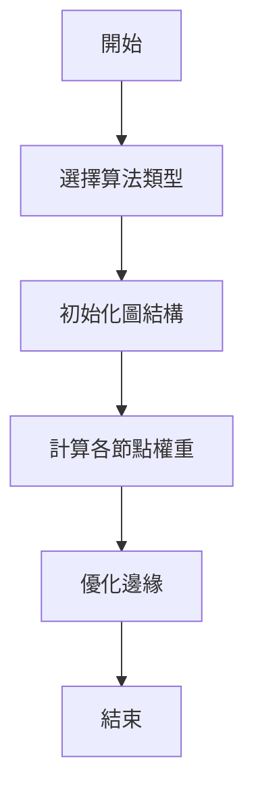
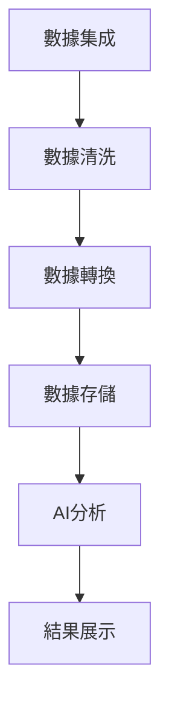
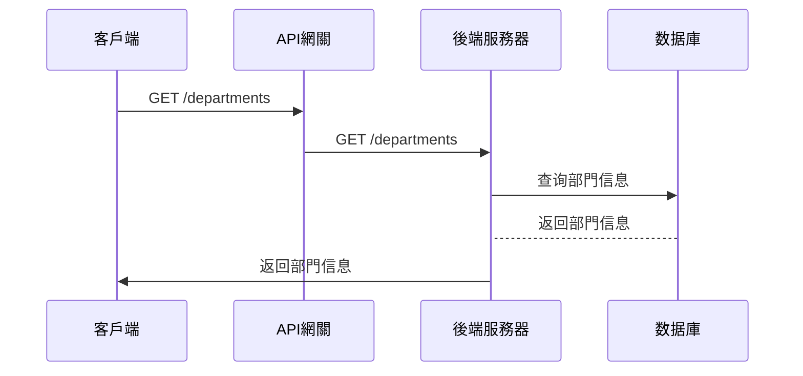

                 


# 构建跨部门AI协作平台：打破信息孤岛

**关键词**：跨部门协作、信息孤岛、人工智能、协作平台、系统架构

**摘要**：  
在现代企业中，信息孤岛问题日益严重，阻碍了部门间的高效协作。本文旨在探讨如何通过构建跨部门AI协作平台来打破信息孤岛，提升企业整体协作效率和决策能力。文章从背景介绍、核心概念、算法原理、系统设计、项目实战到最佳实践，全面分析了构建跨部门AI协作平台的关键步骤和实施策略。通过详细的技术分析和实际案例，本文为读者提供了构建高效协作平台的理论支持和实践指导。

---

# 第1章 背景介绍

## 1.1 信息孤岛的现状与挑战
### 1.1.1 信息孤岛的定义
信息孤岛是指由于技术、组织或流程上的障碍，导致信息在部门间无法有效共享和利用的状态。

### 1.1.2 信息孤岛的成因
- **技术原因**：不同部门使用不同的系统和格式，难以集成。
- **组织原因**：部门间职责分割，缺乏统一的协作机制。
- **文化原因**：部门间缺乏信任，不愿意共享信息。

### 1.1.3 信息孤岛的影响
- **效率低下**：重复工作，资源浪费。
- **决策延迟**：信息不共享，决策缺乏数据支持。
- **创新受阻**：信息孤岛限制了跨部门的创新合作。

## 1.2 跨部門協作的必要性
### 1.2.1 跨部門協作的定义
跨部門協作是指不同部门之间通过共享信息、资源和知识，共同完成任务的过程。

### 1.2.2 跨部門協作的挑战
- **沟通障碍**：部门间的语言、流程差异。
- **技术障碍**：系统的互操作性问题。
- **组织障碍**：缺乏统一的协作平台和机制。

### 1.2.3 跨部門協作的价值
- **提升效率**：通过共享资源和知识，减少重复工作。
- **增强创新能力**：跨部门协作促进创新思维的碰撞。
- **优化决策**：基于全局数据的决策更科学。

## 1.3 AI在协作平台中的作用
### 1.3.1 AI在协作中的应用场景
- **数据整合**：AI自动提取和整合各部门数据。
- **智能推荐**：AI根据历史数据推荐协作方案。
- **实时监控**：AI实时监控协作进度，预测潜在问题。

### 1.3.2 AI如何提升协作效率
- **自动化处理**：AI自动完成数据清洗、格式转换等任务。
- **智能匹配**：AI根据任务需求智能匹配合适的团队成员。
- **预测分析**：AI预测协作中的潜在风险，并提出解决方案。

### 1.3.3 AI在打破信息孤岛中的角色
- **数据连通性**：AI帮助建立各部门之间的数据连通性。
- **知识共享**：AI推动知识的自动共享和传播。
- **决策支持**：AI提供基于数据的决策支持，打破信息壁垒。

## 1.4 本章小结
本章介绍了信息孤岛的现状及其对企业的负面影响，探讨了跨部門協作的必要性，并分析了AI在协作平台中的重要作用。通过构建跨部门AI协作平台，可以有效打破信息孤岛，提升企业协作效率和决策能力。

---

# 第2章 核心概念与原理

## 2.1 信息孤岛与AI协作平台
### 2.1.1 信息孤岛的特征对比表
| 特征         | 信息孤岛                  | AI协作平台                |
|--------------|--------------------------|--------------------------|
| 数据来源     | 单一部门或系统            | 多部门、多系统            |
| 数据共享     | 低效或无法共享            | 高效共享                 |
| 协作效率     | 低下                     | 高效                     |
| 创新能力     | 受限                     | 强大                     |

### 2.1.2 AI协作平台的核心要素
- **数据集成模块**：整合各部门数据，消除数据孤岛。
- **协作工具模块**：提供实时沟通、任务分配等功能。
- **AI分析模块**：利用AI技术进行数据挖掘、预测分析。

## 2.2 跨部門協作的實體關系圖
### 2.2.1 ER圖展示
```mermaid
erd
    分部(FDepartment) {
        部门ID(DepartmentID, pk)
        部门名称(DepartmentName)
    }
    員工(Employee) {
        員工ID(EmployeeID, pk)
        員工名稱(EmployeeName)
        部门ID(DepartmentID, fk)
    }
    信息(Information) {
        信息ID(InformationID, pk)
        信息內容(InformationContent)
        創建員工(EmployeeID, fk)
        修改員工(EmployeeID, fk)
    }
    項目(Project) {
        項目ID(ProjectID, pk)
        項目名稱(ProjectName)
        項目負責人(EmployeeID, fk)
    }
    操作(Operation) {
        操作ID(OperationID, pk)
        操作時間(OperationTime)
        操作員工(EmployeeID, fk)
        項目(ProjectID, fk)
    }
```

## 2.3 本章小结
本章通过对比信息孤岛和AI协作平台的特征，明确了AI协作平台的核心要素，并通过ER圖展示了各部门和信息之间的关系，为后续的设计和实现奠定了基础。

---

# 第3章 算法原理与实现

## 3.1 基於圖論的協作流程優化算法
### 3.1.1 算法流程圖


### 3.2 算法實現
#### 3.2.1 Python核心代碼
```python
def collaboration_graph_optimization(nodes, edges):
    node_weights = {node: 0 for node in nodes}
    for edge in edges:
        node_weights[edge[0]] += 1
        node_weights[edge[1]] += 1
    return node_weights
```

### 3.3 數學模型與公式
#### 3.3.1 节點權重公式
$$ 权重 = \sum_{i}^{n} \text{邊數}(i) $$

#### 3.3.2 边優先級公式
$$ 優先級 = \frac{\text{邊權重}}{\text{邊長}} $$

### 3.4 算法優化與案例分析
#### 3.4.1 算法優化策略
- **並行計算**：利用多線程或分布式計算加速算法。
- **動態權重更新**：根據最新數據動態更新節點權重。

#### 3.4.2 案例分析
假設企業有三個部門：市場、銷售和產品。部門之間的邊如下：
- 市場 -> 銷售
- 市場 -> 產品
- 銷售 -> 產品

調用算法：
```python
nodes = ['市場', '銷售', '產品']
edges = [('市場', '銷售'), ('市場', '產品'), ('銷售', '產品')]
print(collaboration_graph_optimization(nodes, edges))
# 輸出：{'市場': 2, '銷售': 2, '產品': 2}
```

---

# 第4章 系統分析與架構設計

## 4.1 項目背景與目標
### 4.1.1 項目背景介紹
企業希望通過AI協作平台打破信息孤島，提升部門間的協作效率。

### 4.1.2 項目目標與範疇
- **目標**：构建跨部門AI协作平台。
- **範疇**：包括數據集成、協作工具、AI分析等功能。

## 4.2 系統功能設計
### 4.2.1 功能模塊劃分
- **數據集成模塊**：數據導入、數據清洗、數據轉換。
- **協作工具模塊**：實時聊天、任務分配、進度跟蹤。
- **AI分析模塊**：數據挖掘、預測分析、智能推薦。

### 4.2.2 功能實現路線圖


## 4.3 系統架構設計
### 4.3.1 分層架構圖


## 4.4 系統接口設計
### 4.4.1 接口定義
- **RESTful API**：
  - GET /departments：獲取所有部門信息。
  - POST /projects：提交新項目。
  - PUT /employees：更新員工信息。

### 4.4.2 接口交互流程圖


---

# 第5章 項目實戰

## 5.1 環境搭建
### 5.1.1 安裝必要的庫
```bash
pip install Flask requests numpy pandas
```

## 5.2 系統核心實現
### 5.2.1 核心代碼
```python
from flask import Flask, request, jsonify
import pandas as pd

app = Flask(__name__)

@app.route('/departments', methods=['GET'])
def get_departments():
    # 简單實現，返回部門信息
    departments = [{'id': 1, 'name': '市場'}, {'id': 2, 'name': '銷售'}]
    return jsonify(departments)

if __name__ == '__main__':
    app.run(debug=True)
```

### 5.2.2 代碼應用解析
- **數據集成**：使用Pandas進行數據清洗和轉換。
- **AI分析**：使用Scikit-learn進行數據挖掘和分析。

## 5.3 案例分析
### 5.3.1 具體案例
假設企業有三個部門：市場、銷售和產品。平台實現后，市場部門可以將市場數據同步到銷售和產品部門，銷售部門可以將銷售數據同步到產品部門，實現數據共享。

### 5.3.2 案例分析與總結
通過案例分析，我們可以看到AI協作平台在打破信息孤島方面的巨大潛力。平台实现了部門間的数据共享和协作，顯著提升了企業的效率和決策能力。

---

# 第6章 最佳實踐與總結

## 6.1 最佳實踐
### 6.1.1 小結
本章總結了構建跨部門AI協作平台的關鍵點，包括數據集成、算法優化、系統架構設計等。

### 6.1.2 注意事項
- **數據安全**：必須確保數據的隱私和安全。
- **用戶體驗**：平臺應該易于使用，界面友好。
- **持續優化**：根據反饋不斷優化平臺功能。

### 6.1.3 拓展閱讀
- 推荐閱讀《軟體架構師的修煉之路》。
- 推荐學習Mermaid工具的使用。

---

# 作者
作者：AI天才研究院/AI Genius Institute & 禪與计算机程序设计艺术 /Zen And The Art of Computer Programming

---

**总结**：本文詳細探討了如何構建跨部門AI協作平台以打破信息孤島，涵蓋了從背景介紹、核心概念、算法原理到系統設計和項目實戰的全流程。通過具體案例和最佳實踐，為讀者提供了理論支持和實踐指導，幫助企業有效提升協作效率和決策能力。

