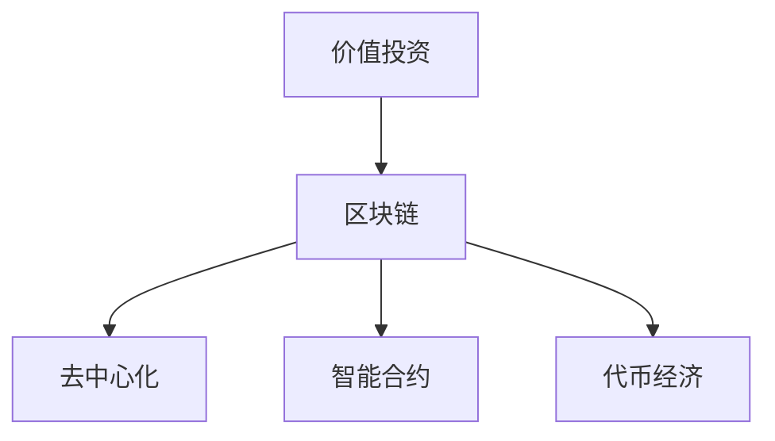

                 


# 格雷厄姆价值投资理念在区块链时代的新解读

## 关键词：价值投资、区块链、格雷厄姆、内在价值、加密货币、智能合约

## 摘要：  
本文从技术与金融的双重视角，系统性地探讨格雷厄姆价值投资理念在区块链时代的新应用。通过分析区块链技术对传统金融的颠覆性影响，结合价值投资的核心原理，提出一套适用于区块链项目的评估体系。本文还将深入解析区块链项目的经济模型、代币设计以及智能合约等关键要素，为投资者提供基于技术与价值的双重决策依据。通过数学模型、系统架构设计以及实际案例分析，本文为区块链时代的投资决策提供创新性的思路。

---

## 目录大纲：

1. [价值投资理念的背景与基础](#value-investing-concepts-background-and-foundations)
2. [价值投资理念的核心概念与联系](#core-concepts-and-connections-of-value-investing)
3. [价值投资理念的算法原理与数学模型](#algorithmic-principles-and-mathematical-models-of-value-investing)
4. [价值投资理念的系统分析与架构设计](#system-analysis-and-architectural-design-of-value-investing)
5. [价值投资理念的项目实战](#project-practice-of-value-investing)
6. [价值投资理念的最佳实践与总结](#best-practices-and-conclusions-of-value-investing)

---

## 第一部分：价值投资理念的背景与基础

### 1. 价值投资理念的起源与发展

#### 1.1 格雷厄姆的价值投资理论  
- 格雷厄姆是价值投资的鼻祖，其核心理念是“以合理的价格买入优秀的公司”。  
- 他提出的“安全边际”概念强调在买入资产时，价格应显著低于其内在价值。  

#### 1.2 区块链技术的基本概念  
- 区块链是一种分布式账本技术，具有去中心化、不可篡改和可追溯的特点。  
- 智能合约的自动执行能力是区块链的核心创新，它将信任嵌入代码。  

#### 1.3 价值投资与区块链的结合点  
- 区块链的透明性和可追溯性为价值评估提供了新的维度。  
- 智能合约的应用使得投资协议更加安全和可执行。  

---

## 第二部分：价值投资理念的核心概念与联系

### 2. 格雷厄姆价值投资的原理  

#### 2.1 内在价值的计算方法  
- 内在价值是资产在未来现金流的现值，公式为：  
  $$ V = \sum_{t=1}^{n} \frac{CF_t}{(1 + r)^t} $$  
  其中，$CF_t$ 是第 $t$ 年的现金流，$r$ 是折现率。  

#### 2.2 区块链项目的评估标准  
- 项目团队的背景与经验。  
- 项目的技术实现与应用场景。  
- 项目的经济模型与代币设计。  

#### 2.3 价值投资与区块链的实体关系图  

（Mermaid流程图示例：  


）

---

## 第三部分：价值投资理念的算法原理与数学模型

### 3. 内在价值的数学模型  

#### 3.1 现金流折现模型  
- 以一家区块链公司为例，假设未来三年的现金流分别为100万、150万和200万，折现率为10%。  
  计算如下：  
  $$ PV = \frac{100}{1.1} + \frac{150}{(1.1)^2} + \frac{200}{(1.1)^3} \approx 247.59 \text{万} $$  

#### 3.2 智能合约的自动评估机制  
- 智能合约可以自动执行投资协议，确保投资条款的可执行性和透明性。  
- 例如，当项目达到特定的里程碑时，智能合约自动释放相应的代币奖励。  

---

## 第四部分：价值投资理念的系统分析与架构设计

### 4. 区块链价值评估系统的架构设计  

#### 4.1 系统功能设计  
- 数据采集模块：收集项目的基本信息和财务数据。  
- 评估模型模块：基于现金流折现模型计算内在价值。  
- 智能合约模块：自动执行投资协议。  

#### 4.2 系统架构设计  

（Mermaid架构图示例：  


）

---

## 第五部分：价值投资理念的项目实战

### 5. 区块链项目的价值评估与实现  

#### 5.1 环境安装与配置  
- 安装Python和区块链开发框架（如Solidity）。  

#### 5.2 核心功能实现  
- 实现现金流折现模型的计算函数。  
- 部署智能合约到区块链网络。  

#### 5.3 代码示例  
```python
def calculate_intrinsic_value(cash_flows, discount_rate):
    present_value = 0
    for t in range(len(cash_flows)):
        present_value += cash_flows[t] / (1 + discount_rate) ** (t + 1)
    return present_value

# 示例数据
cash_flows = [100, 150, 200]
discount_rate = 0.10
iv = calculate_intrinsic_value(cash_flows, discount_rate)
print(f"内在价值为：{iv}万")
```

---

## 第六部分：价值投资理念的最佳实践与总结

### 6. 最佳实践与总结  

#### 6.1 小结  
- 区块链技术为价值投资提供了新的工具和方法。  
- 投资者需要结合技术与金融的双重视角进行决策。  

#### 6.2 注意事项  
- 选择项目时要关注团队背景和经济模型。  
- 智能合约的编写和部署需要高度的专业性。  

#### 6.3 拓展阅读  
- 推荐阅读《价值投资入门》和《区块链技术与应用》。  

---

## 作者：AI天才研究院/AI Genius Institute & 禅与计算机程序设计艺术/Zen And The Art of Computer Programming

